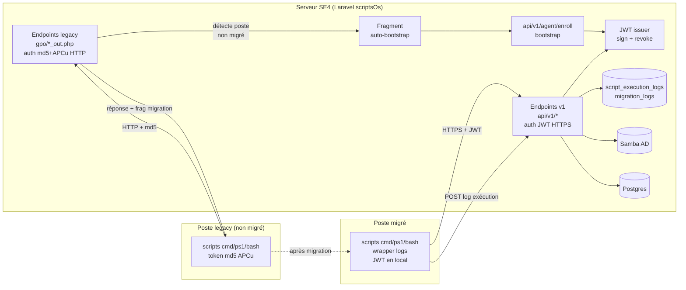

# Tech Spec — Epic 16+17 Phase 2 (Exécution native GPO & scripts)

> **TL;DR** — La Phase 1 d'Epic 16 a porté les endpoints GPO/WPKG critiques en Laravel natif (7 stories implémentées + reviewées, 0 testée). La Phase 2 traite ce qui reste : exécuter et stabiliser les tests, sécuriser les communications poste↔serveur (HTTPS + JWT), permettre l'**auto-migration** des postes existants vers le nouveau mode sans intervention admin, centraliser les logs d'exécution scripts en base de données, et clôturer Epic 17 (scripts Windows/Linux : éditeur, association, logs). À l'issue, les shims GPO restants peuvent être supprimés définitivement.

## 1. Contexte et raison d'être

### 1.1 État actuel (rappel)

| Volet | État |
|---|---|
| **Epic 16 Phase 1** | 7 stories implémentées + reviewées (16.1, 16.2, 16.3a/b/c, 16.5, 16.6, 16.7-backlog). 76 tests Pest écrits, **aucun exécuté**. Tous les endpoints GPO/WPKG `*_out.php` du legacy sont portés nativement en Laravel (`App\Gpo\…`, `App\Wpkg\…`). UI admin Livewire complète sous `/app/gpo` (6 pages). |
| **Epic 17** | Story 17.1 (fondations + audit `audit-windows-scripts-legacy.md`) en cours. Modèles `WindowsScript` + `WindowsScriptVersion` posés. Stories 17.2 → 17.4 jamais écrites en détail. |
| **Auth poste↔serveur** | Token md5 32 hex stocké en APCu (TTL 1800 s), posé par `/gpo/applications.php` puis transmis en query string aux endpoints `*_out.php`. IP allowlist pour les POST WPKG. **Tout en HTTP en clair**. |
| **Migration des postes en parc** | Les postes Windows/Linux installés à partir du legacy SE4 continuent à appeler les anciens endpoints `*_out.php`. La cohabitation est assurée car Laravel répond sur les mêmes routes — mais **aucun mécanisme de migration vers un mode sécurisé** n'est en place. |
| **Logs d'exécution** | WPKG : centralisés en DB (`WorkstationApplicationStatus`, `InstallationLog`). **Scripts GPO (logon/startup/shutdown/logoff)** : aucune ingestion structurée — au mieux dans le `daily` channel applicatif. |
| **Shims** | Le shim WPKG (1bis.11) a été retiré ; le shim **GPO 1bis.18** est encore actif en transition pour les pages legacy non couvertes par Epic 16. |

### 1.2 Pourquoi une Phase 2 ?

Le brief initial d'Epic 16 (`epics.md:3296-3306`) visait la **réécriture native** du module GPO. C'est fait. Mais en chemin, plusieurs constats ont émergé qui n'étaient pas dans le scope d'origine :

1. **La sécurité des comms poste↔serveur** est restée à la parité legacy (md5/APCu/HTTP clair). Pour les établissements scolaires en LAN, c'était toléré historiquement, mais le doc d'archi (section 10.2) classifie ce point en 🔴 critique : un attaquant sur le LAN intercepte tout, peut injecter des packages.
2. **Les postes déjà déployés** continuent à parler en mode legacy. Si on durcit l'auth côté serveur sans plan de migration, on casse le parc.
3. **Les logs d'exécution scripts** sont des angles morts : impossible de savoir si un script logon a échoué sur un poste sans aller voir l'event viewer manuellement.
4. **Epic 17 n'a jamais été écrit en détail** — la couche scripts NETLOGON/GPO mérite son propre plan.

La Phase 2 traite ces 4 sujets en un bloc cohérent, parce qu'ils sont entrelacés (les logs supposent l'auth, la migration suppose la nouvelle auth, etc.).

### 1.3 Fusion logique Epic 16 / Epic 17

Décision Henri 2026-05-15 : les Epics 16 et 17 sont traités **comme un bloc** dans cette spec. La frontière historique (16 = policies GPO ; 17 = scripts exécutables) reste valide pour la traçabilité, et les stories restent numérotées dans leur Epic respectif. Mais l'architecture, les décisions de sécurité et les logs sont communs.

## 2. Objectifs Phase 2

| # | Objectif | Resultat attendu |
|---|---|---|
| **O1** | Stabilisation Phase 1 | 76 tests verts. Parité fonctionnelle iso-legacy validée. Aucune régression sur les postes en parc. |
| **O2** | UI admin GPO dans `/admin/settings` | Les 6 pages Livewire restent accessibles, exposées depuis le panneau de paramètres administrateur, anciens chemins redirigés. |
| **O3** | Sécurisation comms HTTPS + JWT | Tous les endpoints poste↔serveur passent en HTTPS. L'auth md5/APCu est remplacée par un JWT signé attribué à l'enregistrement, avec renouvellement et révocation. |
| **O4** | Auto-bootstrap migration postes | Les postes legacy basculent automatiquement vers le nouveau mode (HTTPS + JWT) **sans action admin**, via un script de migration idempotent renvoyé par les endpoints legacy. |
| **O5** | Logs exécution centralisés DB + UI de consultation | Toutes les exécutions de scripts GPO et de scripts Windows/Linux remontent leur statut (succès / échec / stdout / stderr / durée) dans une table `script_execution_logs`. UI Livewire de consultation accessible aux admins depuis `/admin/settings` : filtres (poste / script / action / statut / plage de date), tableau paginé, page détail avec stdout/stderr complets, indicateurs de tête (taux d'échec 24h, postes/scripts en alerte). |
| **O6** | Epic 17 livré (stories 17.2-17.4) | Éditeur Livewire de scripts Windows/Linux avec versioning, association script↔cible, logs d'exécution. |
| **O7** | Suppression définitive des shims | Shim GPO 1bis.18 retiré. Code legacy `sambaedu/gpo/` archivé. Aucun appel résiduel vers le PHP legacy depuis le code Laravel ou les postes. |
| **O8** | API "agent-ready" pour préparer un futur agent unifié Go (post-prod) | Les endpoints v1 (`/api/v1/*`), le contrat JWT, le schéma des logs d'exécution et le format de résolution des scripts/manifests sont conçus pour être consommables par un agent statique post-prod, sans renégociation d'architecture. Le déploiement de l'agent lui-même reste hors-scope Phase 2. |

## 3. Hors-scope explicites

Ces points sont **délibérément écartés** de la Phase 2 (à reconsidérer plus tard si besoin) :

| Hors-scope                                                             | Pourquoi                                                                                                                                                                                                                                                                                                                                                                                                |
| ---------------------------------------------------------------------- | ------------------------------------------------------------------------------------------------------------------------------------------------------------------------------------------------------------------------------------------------------------------------------------------------------------------------------------------------------------------------------------------------------- |
| ❌ **Images immuables OS** (WIM custom, OSTree, NixOS, A/B rollback)    | Demandé par Henri 2026-05-15 : risque trop élevé sur les postes en place. On garde le modèle pull-au-boot du legacy : `unattend.xml`, `preseed.cfg`, `customisation_pc`, `autorun` restent **inchangés**.                                                                                                                                                                                               |
| ❌ **Déploiement d'un agent unifié binaire Go/Rust**                    | Pas en Phase 2. Les scripts/clients existants (`wpkg-se4.js`, scripts cmd/ps1/bash) restent les exécuteurs. La Phase 2 leur ajoute une couche d'auth + de reporting, pas un remplacement. **Note importante** : un agent unifié Go est anticipé comme **amélioration post-prod** (Phase 3+). L'architecture v1 doit donc être conçue pour l'accueillir naturellement (cf. §5.6 Future-readiness et O8). |
| ❌ **mTLS / certificats clients / TPM**                                 | Trop ambitieux. On vise un quick win : HTTPS + JWT signé. mTLS pourra venir dans une Phase 3 si besoin.                                                                                                                                                                                                                                                                                                 |
| ❌ **Refonte iPXE / chaîne d'installation**                             | Pas dans Epic 16/17. La chaîne iPXE → Windows/Linux installer continue à fonctionner telle quelle.                                                                                                                                                                                                                                                                                                      |
| ❌ **Format manifeste YAML signé (cf. doc d'archi section 11.2)**       | Reste un mélange de XML WPKG / scripts bash/cmd / policies AD. Pas de refonte du format.                                                                                                                                                                                                                                                                                                                |
| ❌ **Observabilité Prometheus/Loki/osquery (doc d'archi section 11.6)** | Pas dans Phase 2. Les logs Laravel (`channel gpo`, `channel winscripts`) et les logs DB suffisent.                                                                                                                                                                                                                                                                                                      |
| ❌ **Refonte UI admin GPO**                                             | Les 6 pages Livewire livrées en Phase 1 restent comme elles sont. Seule l'exposition dans `/admin/settings` est revue (O2).                                                                                                                                                                                                                                                                             |

## 4. Décisions de cadrage validées (2026-05-15)

| ID | Décision | Rationale |
|---|---|---|
| **D1** | Fusion logique Epic 16 + Epic 17 dans un bloc Phase 2, numérotation conservée par Epic | Les sujets sont entrelacés (auth/migration/logs). Mais on garde la séparation symbolique (policies vs scripts) pour la traçabilité historique. |
| **D2** | UI admin GPO conservée et exposée via `/admin/settings/gpo/*` | Henri 2026-05-15 : initialement on parlait de retirer l'UI au profit d'une admin SSH only ; puisqu'elle est déjà livrée et reviewée, on la garde. Admin SSH reste possible (samba-tool natif). |
| **D3** | Auth poste↔serveur : **HTTPS + JWT** (signature serveur, refresh token, révocation DB) | Quick win équilibré : élimine HTTP clair + md5 trivialement spoofable. Pas de complexité PKI/TPM. |
| **D4** | Migration postes existants : **auto-bootstrap idempotent** via fragment renvoyé par endpoints legacy | Critère "pas d'intervention admin" du brief. Les endpoints `*_out.php` legacy détectent un poste non encore migré et lui injectent un fragment de bascule. |
| **D5** | Logs d'exécution scripts : table `script_execution_logs` (modèle parallèle à `workstation_application_status`) + endpoint `POST /api/v1/script-execution-logs` auth JWT | Centralisation DB demandée. Pattern iso-WPKG (qui est déjà en DB). |
| **D6** | Pas d'image immuable, pas de refonte chaîne d'installation OS | Risque sur les postes en place. Le legacy `unattend.xml`/`preseed`/`customisation_pc`/`autorun` reste inchangé. |
| **D7** | Le **shim 1bis.18 (GPO)** est retiré dès **Story 16.13bis**, sans attendre de critères de stabilité prod | Sprint Change Proposal 2026-05-19 : le modèle de bascule passe à fragment+reboot via `MigrationController` dédié, qui n'exige plus la coexistence dual-mode prolongée. Le pattern iso Story 15.7 (cleanup post-stabilisation cluster unique) ne s'applique pas — le déploiement de sambaedu-reload (SE5) se fait par collège, en package complet, pas en versions progressives intra-cluster. |
| **D8** | Backward-compat postes : les 8 endpoints legacy `/gpo/*_out.php` sont **transformés** en routes du module migration (fragment+reboot only) dès 16.13bis | Sprint Change Proposal 2026-05-19. Le poste non-migré reçoit un fragment de bootstrap au lieu de la réponse legacy ; il enrôle, met à jour son registre pour pointer vers `/api/v1/*`, puis reboot. Au boot suivant, le poste utilise nativement `/api/v1/*`. Modèle compatible avec déploiement-par-collège : la bascule s'opère poste-par-poste au premier appel post-déploiement, sans coupure de service ni critères de stabilité globaux. |

## 5. Architecture cible

### 5.0 Topologie réseau Sambaedu (cadre préalable)

> **Investigation 2026-05-15** sur la VM `lab1` et le code legacy : voir le rapport complet dans la mémoire du PM. Synthèse retenue :

L'architecture Sambaedu est **multi-établissements** :
- Un **serveur central** (`lab1.sambaedu.org`, ex. 172.19.254.4) qui sert l'UI admin web multi-étabs et fait du **reverse-proxy** vers les serveurs locaux pour les routes `/<UAI>/*`.
- N **serveurs locaux**, un par établissement (`se4fs-<UAI>.<domaine>`, ex. `se4fs-0991229y` à 172.19.1.4), chacun avec son Samba AD, son MariaDB, son partage SMB `install`, etc.
- Les **postes** Windows/Linux sont sur le LAN scolaire de leur établissement, donc routables vers le local mais **pas vers le central** (sauf VPN admin).

**Comportement réseau confirmé** :

| Trafic | Émetteur | Destinataire | Schéma |
|---|---|---|---|
| UI admin (Livewire `/admin/settings`, `/app/gpo`, …) | Navigateur admin | **Central** (LE Let's Encrypt, reverse-proxy → local) | HTTPS |
| Scripts GPO (`/gpo/applications.php`, `/gpo/*_out.php`) | Poste LAN | **Local direct** (`se4fs-<UAI>`) | HTTP en Phase 1 |
| XML WPKG (`/wpkg/hosts.xml`, etc.) | Poste LAN | **Local direct** | HTTP en Phase 1 |
| iPXE (`/ipxe/preboot.php`, `/ipxe/Win10/action.php`) | Poste en boot PXE | **Local direct** | HTTP en Phase 1 |
| SMB `\\SE4FS\install` (rapports WPKG, packages) | Poste LAN | **Local direct** (SMB) | SMB (chiffré ou pas selon config) |

**Mécanisme de substitution** : le placeholder `###_SE4FS_NAME_###` est remplacé côté **serveur local** par `$config['se4fs_name']` (= `se4fs-<UAI>`) dans tous les scripts/GPO/`unattend.xml`/`preseed.cfg` envoyés aux postes. Côté Windows, la variable d'env `%SE4FS%` est positionnée à `se4fs-<UAI>` par `wpkg.cmd`. **Les postes ne tapent jamais le central.**

**Implications majeures pour la Phase 2** :

| Décision (révisée) | Avant | Après findings topologie |
|---|---|---|
| **D3 : cert HTTPS** | "AC interne SE4FS par défaut, Let's Encrypt en option" | **AC interne obligatoire**, **un cert par serveur local** (`se4fs-<UAI>.<domaine>`). Let's Encrypt n'est pas applicable au trafic poste↔local (DNS internes non publics). Le cert LE du central reste pour l'UI admin uniquement. |
| **D3 : URL cible après migration** | "endpoints v1 sous `/api/v1/*`" | **Même hostname que legacy** : `https://se4fs-<UAI>/api/v1/*`. Garder `###_SE4FS_NAME_###` comme placeholder, basculer juste `http://` → `https://`. **Ne pas** router via `lab1.sambaedu.org/<UAI>/api/v1/*` (le central n'a pas ces endpoints et n'a pas vocation à les router). |
| **D4 : bootstrap** | "Télécharge CA cert + s'enrôle" | Le CA cert téléchargé est l'AC **du local de l'établissement**, pas celui du central. Un poste ne peut s'enrôler qu'auprès de son propre serveur local. |
| **D9 : stratégie CA** (validée 2026-05-15) | — | **Un CA root indépendant par établissement**. Chaque local génère son propre CA root à l'installation Phase 2 (via `step ca init` ou script openssl). Autonomie totale, pas de PKI partagée. Le bootstrap embarque le CA du local de l'établissement. Révocation limitée à un étab si compromission. |

**Risque identifié** : il existe encore des **GPO ou scripts non-substitués** (provenant du legacy ou de versions antérieures) qui appellent `http://SE4FS/...` (nom DNS générique sans suffixe). Sur le LAN scolaire, ce nom **résout vers le central** (172.19.254.4) qui répond `200 OK` sur `/gpo/applications.php` — comportement legacy historique où le central faisait office de serveur unique. **Action** : audit dans 16.8 / 16.9 pour vérifier qu'aucun GPO/script en production ne pointe encore sur `SE4FS` nu. Sinon, la migration HTTPS+JWT casserait ces appels (le central ne supporte pas l'auth v1).

### 5.1 Vue d'ensemble



### 5.2 Authentification HTTPS + JWT

**HTTPS** (révisé après findings §5.0) :
- Chaque **serveur local** (`se4fs-<UAI>`) doit présenter son propre certificat HTTPS. Le cert Let's Encrypt du central (`lab1.sambaedu.org`) **n'est pas applicable** au trafic poste↔local : les postes du LAN ciblent `se4fs-<UAI>` (DNS interne), pas `lab1.sambaedu.org`.
- Stratégie retenue (D9, validée 2026-05-15) : **un CA root indépendant par établissement**. Chaque serveur local génère son propre CA root à l'installation Phase 2 (via `step-ca` smallstep ou scripts `openssl` selon outil retenu en 16.10), émet ses propres certs `se4fs-<UAI>.<domaine>`. Le CA root est embarqué dans le script de bootstrap (cf. 5.3) pour que les postes l'ajoutent à leur trust store machine au moment de la migration. Idempotent.
- Pas de PKI partagée à maintenir, autonomie totale par établissement, révocation limitée à un seul étab si compromission. Trade-off accepté : un poste itinérant qui voudrait reconnaître deux locaux d'établissements différents devrait recevoir deux CA roots — cas marginal pour Sambaedu.
- Le **central** garde sa Let's Encrypt actuelle pour l'UI admin — pas de changement de ce côté.
- Tous les endpoints poste↔serveur (legacy ET v1) acceptent HTTPS sur le local. Le HTTP reste accepté en parallèle pour les premiers appels des postes pas encore migrés (avant qu'ils aient reçu le CA root via le fragment de migration de 16.13bis). Une fois migré, le poste utilise exclusivement HTTPS via `/api/v1/*`.

**JWT** :
- Format **JWS** signé RS256 (clé privée serveur dans le coffre Laravel, jamais exposée).
- Claims : `sub = workstation_uuid`, `iat`, `exp` (24h), `jti` (pour révocation), `tier` (= "workstation"), `kid` (rotation clé).
- Refresh token séparé (TTL 30j), stocké hashé en DB (`workstation_refresh_tokens`).
- Révocation : table `workstation_jwt_revocations` (jti, revoked_at, reason). Middleware Laravel vérifie en cache + DB.
- Stockage côté poste :
  - **Windows** : registre `HKLM\Software\SambaEdu\Auth` (clé `access_token`, `refresh_token`), chiffré DPAPI machine.
  - **Linux** : fichier `/etc/sambaedu/auth.json` (perms 0600 root).

**Flot d'enrôlement** :
```
POST /api/v1/agent/enroll
Headers: X-Bootstrap-Token: <token md5 APCu existant>
Body:    { uuid, mac, hostname, os }
=>
200 OK
Body:    { access_token, refresh_token, ca_cert_pem, server_base_url }
```
Le `X-Bootstrap-Token` md5 sert de **proof-of-possession transitoire** : seul un poste qui a déjà un md5 valide (donc qui parle au serveur en LAN) peut s'enrôler. C'est faible mais c'est la baseline legacy — la Phase 2 ne fait pas pire que l'existant pour cette première bascule. Une Phase 3 pourra durcir (preuve d'identité AD/Kerberos).

**Middleware Laravel** :
- `EnsureWorkstationJwt` : valide signature, exp, jti non révoqué. Attaché aux routes `/api/v1/*`.
- `EnsureLocalRequest` (existant) reste sur les endpoints `*_out.php` legacy pendant la transition.

### 5.3 Auto-bootstrap migration postes existants

**Principe** : un poste qui appelle un endpoint legacy `/gpo/*_out.php` reçoit, **en plus du script habituel**, un fragment de migration en tête de la réponse — **seulement si** le poste n'a pas encore migré (détecté par absence d'un cookie ou d'un en-tête custom `X-SambaEdu-Migrated`).

**Côté serveur** :
- Middleware `InjectBootstrapFragment` sur les routes legacy `*_out.php`.
- Détecte : si le User-Agent ou les query params indiquent un poste qui n'a pas envoyé le marqueur `X-SambaEdu-Migrated: 1`, et qu'aucune entrée `workstations_migration_status` n'existe pour son UUID, alors le middleware **préfixe** le script renvoyé d'un fragment de bootstrap.
- **Side effect** : insertion d'une ligne en `workstation_migration_attempts` (uuid, started_at, status, error).

**Le fragment renvoyé** (exemple Windows, équivalent bash pour Linux) :
```cmd
REM === SambaEdu auto-bootstrap (idempotent) ===
if not exist "%ProgramData%\SambaEdu\auth.json" (
  REM Télécharger CA cert + s'enrôler
  curl.exe -fsS http://SE4FS/api/v1/agent/bootstrap.cmd | cmd /c
)
REM === Fin auto-bootstrap ===

REM ... script utile habituel ...
```

Le `bootstrap.cmd` (côté serveur) :
1. Télécharge le CA cert SE4FS dans le trust store machine
2. Récupère l'UUID/MAC/hostname/os locaux
3. POST à `/api/v1/agent/enroll` avec le `X-Bootstrap-Token` md5 actuel (vivant en APCu)
4. Stocke `access_token` / `refresh_token` localement (registre Win / fichier Linux 0600)
5. Configure un job planifié de renouvellement (Task Scheduler Win / systemd timer Linux)
6. Marque le poste comme migré côté serveur (`workstations_migration_status` upsert)
7. À la prochaine exécution, le fragment voit l'auth.json présent et **no-op**.

**Idempotence garantie** par :
- Vérification de `auth.json` côté poste (sortie immédiate si présent)
- Vérification serveur via UUID dans `workstations_migration_status` (no-inject si déjà migré)

**Cas d'erreur** : si l'enrôlement échoue (réseau, token expiré, etc.), le poste retombe sur le flot legacy md5/APCu — pas de blocage. La table `workstation_migration_attempts` permet de tracer les échecs et alerter (story 16.x dédiée à un dashboard de migration).

### 5.4 Logs d'exécution centralisés + UI de consultation

**Modèle de données** :

```
script_execution_logs
- id (uuid)
- workstation_id (FK → workstations)
- script_id (FK nullable → windows_scripts ou linux_scripts)
- script_source (enum: 'managed_script', 'gpo_applications', 'wpkg_post', 'manual')
- action (enum: 'startup', 'logon', 'shutdown', 'logoff', 'oneshot')
- os (enum: 'windows', 'linux')
- status (enum: 'success', 'failure', 'skipped', 'timeout')
- exit_code (int nullable)
- stdout_excerpt (text, max 8KB)
- stderr_excerpt (text, max 8KB)
- started_at (timestamp)
- duration_ms (int)
- reported_at (timestamp)
- correlation_id (uuid nullable, pour grouper des étapes liées)

(index: workstation_id+started_at, script_id, status+started_at)
```

**Endpoint d'ingestion** :
```
POST /api/v1/script-execution-logs
Auth: JWT (EnsureWorkstationJwt)
Body: { script_source, action, os, status, exit_code, stdout, stderr, started_at, duration_ms, correlation_id }
=> 201 Created (no body) ou 400 (validation)
```

**Côté poste — wrapper d'exécution** :
- Chaque script géré par scriptsOs (logon/startup/shutdown/logoff) est emballé côté serveur dans un **wrapper** au moment du rendu.
- Wrapper Windows (cmd) : `start /wait <script> > %TEMP%\out.log 2> %TEMP%\err.log` puis `curl.exe -X POST .../script-execution-logs -H "Authorization: Bearer <JWT>" -d @body.json`.
- Wrapper Linux (bash) : pareil avec `curl` et fichiers temporaires.
- Le wrapper est **généré côté serveur** au moment du rendu de l'endpoint v1 — pas de code à déployer.
- Taille des logs : `stdout_excerpt`/`stderr_excerpt` tronqués à 8 KB côté wrapper (head + tail).

**Job d'archivage** (cron Laravel) :
- Tâche planifiée quotidienne qui exporte les logs > 90 jours vers un fichier compressé `storage/archives/script-execution-logs-YYYY-MM.jsonl.gz` puis purge la table.
- Configurable via `config/scriptsos.php` (`retention_days`).

**UI Livewire de consultation** (sous `/admin/settings/scripts-logs`) :

- **Page index** : tableau paginé des exécutions récentes.
  - Colonnes : poste (lien fiche), script (lien fiche si managed), action, OS, statut (badge), exit_code, durée, started_at.
  - Filtres en tête : poste (autocomplete), script (autocomplete), action (multi-select), OS, statut, plage de dates (default : 7 derniers jours).
  - Tri possible sur chaque colonne ; pagination 50/page.
- **Page détail d'une exécution** (clic ligne) : drawer ou route dédiée.
  - Métadonnées complètes (correlation_id, started_at, reported_at, durée, source).
  - `stdout_excerpt` + `stderr_excerpt` rendus en bloc `<pre>` monospace, avec bouton de copie.
  - Si le log a été archivé (>90j), affichage d'un message "log archivé dans `storage/archives/...`" avec lien admin pour téléchargement.
- **Bandeau d'indicateurs** en tête de la page index :
  - Taux d'échec sur 24h glissantes (jauge colorée).
  - Top 5 des postes en échec récent (cliquable → filtre poste).
  - Top 5 des scripts en échec récent (cliquable → filtre script).
  - Bouton "Voir uniquement les échecs" (raccourci de filtre).
- **Permissions** : admin only (middleware `sambaedu.auth` + check rôle administrateur). Pas d'accès aux non-admins.
- **Performance** : index DB sur `(workstation_id, started_at)` + `(status, started_at)` (déjà prévus §5.4 schéma). Query optimisée pour les filtres communs. Si volumétrie > 100k logs par mois, envisager une vue matérialisée Postgres pour le bandeau d'indicateurs.
- **Réutilisation** : composants Livewire SFC qui suivent les patterns existants (table partageable avec `/app/wpkg/deployments` qui présente déjà des tableaux d'exécution similaires).

### 5.5 Scripts Windows et Linux (Epic 17)

**Modèle de données** :
- Story 17.1 a posé `windows_scripts` + `windows_script_versions`.
- Phase 2 ajoute `linux_scripts` + `linux_script_versions` (modèles parallèles).
- Schéma identique : `id`, `name`, `slug`, `type` (logon/startup/…), `current_version_id`, `created_at`, `updated_at`.
- Versioning : chaque sauvegarde crée un nouveau `*_script_versions` avec content + diff.

**Stockage du code source** :
- Le contenu du script est stocké en DB (champ `content` text) — pas sur disque (légèreté, versioning facile).
- Le rendu côté endpoint produit le script à la volée + ajoute le wrapper (5.4).

**Association script ↔ cible** :
- Table polymorphique `script_assignments` : `script_type` (windows/linux), `script_id`, `target_type` (workstation/workstation_group/ad_ou/user), `target_id`, `priority`, `created_at`.
- Au moment où un poste appelle `/api/v1/scripts?action=startup&os=windows`, le serveur résout : tous les `script_assignments` matchant l'OU AD du poste + son WorkstationGroup + son UUID, déduplique par priorité, et renvoie la liste ordonnée.

**Endpoints scripts v1** :
```
GET  /api/v1/scripts?action=startup&os=windows   (resolved list pour le poste authentifié)
GET  /api/v1/scripts/{id}/content                (contenu d'un script versionné)
POST /api/v1/script-execution-logs               (cf. 5.4)
```

**Intégration GPO 16.6** :
- La story 16.6 existante (hook GPO `se4_applications` → invocation `wpkg.js`) continue à fonctionner.
- Nouveauté Phase 2 : la GPO `se4_applications` peut **aussi** appeler `/api/v1/scripts?action=startup` (poste migré) — pas de changement côté `Registry.pol`, juste le `.cmd` startup pointé sur l'API v1.

### 5.6 Future-readiness — agent Go post-prod + controlHub long terme

> **Anticipations Henri 2026-05-15** :
> 1. Un **agent unifié Go** pourra remplacer post-prod l'ensemble des exécuteurs hétérogènes côté postes (`wpkg-se4.js`, scripts cmd/ps1/bash, wrappers de logs Phase 2).
> 2. **Objectif long terme** : **supprimer le serveur central** actuel et le remplacer par **controlHub**, qui pilotera chaque serveur local via API REST (`Bearer {se4fs_api_token}`, cf. `scriptsOs/docs/controlhub-api-plan.md`). L'infra réseau (DHCP/DNS) reste à clarifier ultérieurement.
>
> Pour éviter une renégociation d'architecture, la Phase 2 pose **dès maintenant** des contrats consommables à la fois par les scripts cmd/bash actuels, un futur agent Go, et controlHub.

**Contraintes de design "agent-ready"** appliquées à l'API v1 :

| Contrainte | Pourquoi un agent Go en a besoin |
|---|---|
| **Format JSON partout** sur `/api/v1/*` (jamais XML, jamais texte ad-hoc) | Un agent Go aura un parser JSON natif. XML et texte ad-hoc obligeraient à dupliquer du code de parsing. |
| **Endpoints REST orientés ressource** (`GET /api/v1/scripts`, `POST /api/v1/script-execution-logs`) et non orientés rendu (`GET /api/v1/applications-startup.cmd`) | Un agent ne télécharge pas un script-déjà-rendu-en-cmd ; il télécharge la **définition** du script et choisit lui-même comment l'exécuter (ou pas). |
| **Stateless** : chaque requête v1 porte son JWT, le serveur ne tient pas de session per-poste en RAM | Un agent peut redémarrer / reconnecter sans dépendre d'un état serveur volatile (élimine le problème APCu legacy). |
| **Versioning explicite** (`/api/v1/...`) + champ `apiVersion` dans les payloads | Permet d'introduire `v2` (pour l'agent Go futur, ou pour une refonte de contrat) sans casser les scripts cmd/bash Phase 2. |
| **Manifest agrégé optionnel** : un endpoint `GET /api/v1/agent/manifest` (à concevoir, **pas implémenté en Phase 2**) qui agrège tout ce dont un agent aurait besoin pour réconcilier (scripts à exécuter, packages désirés, files à écrire, état de polices) en un seul JSON signé | Un agent Go fait une requête par cycle de réconciliation, pas N requêtes par section. Le contrat doit être pensé maintenant pour ne pas avoir à le rétro-fitter. |
| **Logs structurés JSON** dans `script_execution_logs` (cf. 5.4) — pas de free-text qui obligerait à du parsing | Un agent Go produira des logs structurés nativement (Zap, slog) ; le schéma DB doit déjà s'y prêter. |
| **JWT réutilisable** : le même claim `sub = workstation_uuid` + `tier = workstation` fonctionne que le client soit un script wrapper ou un agent statique | Pas de PKI séparée à mettre en place pour l'agent. |
| **Idempotence des endpoints** (`POST /api/v1/script-execution-logs` accepte `correlation_id` pour dédupliquer) | Un agent peut retransmettre en cas de coupure réseau sans créer de doublons. |

**Ce qui reste hors Phase 2** :
- ❌ L'agent Go lui-même (binaire) — pas de code agent
- ❌ L'endpoint `GET /api/v1/agent/manifest` agrégé — **conçu** (schéma + contrat) mais **pas implémenté** ; il sera la première fonctionnalité de la Phase 3 agent
- ❌ Les concepts "état désiré déclaratif" / réconciliation périodique (cf. doc d'archi 11.2)
- ❌ mTLS / TPM pour l'agent (Phase 3+)
- ❌ Migration central → controlHub : les endpoints v1 de controlHub (`/api/v1/snapshot`, `/api/v1/workstation-groups`, etc.) sont une initiative distincte ; la Phase 2 doit s'aligner sur le **namespace partagé `/api/v1/*`** et les **claims d'audience JWT** (`tier=workstation` vs `tier=controlhub`) pour ne pas créer de collisions, sans implémenter elle-même quoi que ce soit côté controlHub.

**Cohabitation avec controlHub déjà existant** :
- Le namespace `/api/v1/snapshot`, `/api/v1/workstation-groups`, `/api/v1/snapshot-async` est **déjà réservé** par controlHub (`scriptsOs/docs/controlhub-api-plan.md`).
- Les endpoints postes Phase 2 utilisent un préfixe distinct : `/api/v1/agent/*` (enrôlement), `/api/v1/scripts/*` (résolution + contenu), `/api/v1/script-execution-logs` (ingestion).
- L'auth distingue les clients par `tier` dans le JWT/Bearer : `tier=workstation` pour les postes, `tier=controlhub` pour controlHub. Les middlewares Laravel valident le tier attendu par route.

**Effort additionnel pour respecter ces contraintes en Phase 2** : marginal (~0.5j sur 16.10 + ~0.5j sur 16.12). Le coût d'oubli est bien plus élevé que le coût d'anticipation.

### 5.7 Améliorations UX de l'UI admin GPO (Phase 1 → Phase 2)

> **Audit produit 2026-05-15** : l'UI Livewire des 6 pages GPO livrées en Phase 1 (index, détail, links, wine, wpkg-deployment, deep links 16.3a) est **fonctionnelle et cohérente** mais présente plusieurs trous **discoverabilité / onboarding / impact-analysis** qui justifient une story dédiée. Verdict global : 🟡 améliorations ciblées (pas de refonte structurelle).

**5 améliorations identifiées**, classées par valeur/effort :

#### A. Onboarding & landing contextualisée (1j) — priorité haute

- L'index `/app/gpo` n'a aucun parcours guidé : un nouvel admin ne sait pas où commencer (créer GPO → lier OU → voir impact → éditer sections).
- Le bouton "Créer une GPO (ancienne UI)" ouvre un onglet legacy sans retour vers la nouvelle UI (friction).
- **Action** : card hero en haut de l'index avec les 3 parcours principaux (consulter, créer, lier), micro-tutoriel inline pour la première visite, suppression/encadrement du bouton legacy.

#### B. Filtres avancés + exports sur l'index (2-3j) — priorité haute

- L'index actuel : recherche par nom, filtre statut actif/inactif, pagination. C'est tout.
- Manque : filtre par **type** (Machine / User / Script logon), par **OU liée** (dropdown auto-complete), par **version range**, par **statut santé** (orpheline, en conflit, obsolète).
- Pas d'export CSV / JSON des résultats filtrés.
- **Action** : panneau de filtres compact replié par défaut + export CSV/JSON du listing courant.

#### C. Vue d'impact inverse OU → GPOs (2-3j) — priorité haute

- Le modèle actuel : "1 GPO → ses OUs liées" (page détail). Mais l'inverse manque : "1 OU → quelles GPOs s'y appliquent et dans quel ordre ?".
- Critique pour la planification : avant de modifier une GPO, l'admin veut savoir ce qui se cumule sur une OU donnée.
- **Action** : nouvelle page `/admin/settings/gpo/by-ou` (ou onglet sur la page de l'OU si elle existe) qui montre par OU la liste ordonnée des GPOs appliquées (avec héritage), comptage postes affectés, lien vers le détail de chaque GPO.

#### D. Découvrabilité des sections natives (1j) — priorité moyenne

- Les pages Firefox / Wallpaper / Shortcuts / Roaming (story 16.3a) sont accessibles uniquement via une heuristique sur le displayName de la GPO. Si la heuristique ne match pas, **invisible**.
- **Action** : section dédiée "Sections gérables nativement" sur l'index GPO ou dans `/admin/settings/gpo/sections` avec card par section (Firefox, Wallpaper, Shortcuts, Veyon, Network, Wine, Associations…) et compteur d'entités gérées par section.

#### E. Visibilité des background jobs (2-3j) — priorité moyenne

- Wine image generation et WPKG republish sont des Jobs asynchrones. L'admin lance → reçoit un toast "en queue" → puis plus rien. Pas de feedback sur succès / échec / durée.
- **Action** : mini-dashboard "Jobs récents" dans `/admin/settings/system/jobs` (ou widget sidebar) avec liste paginée des Jobs GPO récents + leur statut + lien retry / cancel pour les échecs.

#### F. (Optionnel) Audit trail UI (5-7j) — priorité basse, à arbitrer

- Aujourd'hui les modifications GPO loggent dans le channel `gpo` (fichier) mais **rien en UI**. Aucun "qui a changé quoi quand".
- **Action** : modèle `gpo_audit_logs` + page de consultation par GPO avec diff entre versions.
- **Note** : ce point chevauche partiellement avec l'UI logs d'exécution (5.4). À traiter séparément car porte sur l'admin (modifications de config), pas sur les postes (exécution).
- **Décision Phase 2** : reporté à une Phase 3 si Henri ne le veut pas en P2 (charge non-négligeable, valeur surtout en environnement multi-admins).

**Scope retenu pour la story 16.14** : A + B + C + D + E (charge 7-9j). F reporté sauf décision contraire d'Henri.

## 6. Plan de stories Phase 2

### 6.1 Epic 16 — Stories supplémentaires (Phase 2)

| ID | Titre | Charge estimée | Dépendances |
|---|---|---|---|
| **16.8** | Stabilisation Phase 1 — exécution des 76 tests + correction régressions + audit iso-legacy | 3-5j | aucune (préalable au reste) |
| **16.9** | Exposition UI admin GPO sous `/admin/settings/gpo/*` | 1-2j | 16.8 |
| **16.10** | Sécurisation comms — HTTPS + JWT (endpoints v1, middleware, modèles tokens) | 4-6j | 16.8 |
| **16.11** | Auto-bootstrap migration postes existants | 3-5j | 16.10 |
| **16.12** | Logs exécution centralisés (modèle DB + endpoint d'ingestion + wrapper côté poste + UI Livewire de consultation sous `/admin/settings`) | 5-7j | 16.10 |
| **16.13** | Exposition endpoints natifs `/api/v1/*` (re-scopée 2026-05-19) | 2-3j | 4.7, 4.8, 16.3a/b/c, 16.7, 16.10 |
| **16.13bis** | Module migration simplifié (fragment+reboot) + cleanup shim 1bis.18 + UI tracking (créée 2026-05-19) | 4-5j | 16.13 |
| **16.14** | Améliorations UX UI admin GPO (onboarding, filtres/exports, vue inverse OU→GPOs, découvrabilité sections natives, dashboard jobs) | 7-9j | 16.8 + 16.9 |

**Total Epic 16 Phase 2 : ~29-39j de dev** (post Sprint Change Proposal 2026-05-19 : +4-6j d'absorption refactor architectural 16.13/16.13bis vs cadrage initial).

### 6.2 Epic 17 — Stories

| ID | Titre | Charge estimée | Dépendances |
|---|---|---|---|
| **17.2** | Éditeur de scripts Windows + Linux + templates (Livewire + versioning) | 4-6j | 17.1 ✅ + 16.9 (UI admin) |
| **17.3** | Association script ↔ cible (polymorphique + résolution serveur) | 3-4j | 17.2 + 16.5 ✅ |
| **17.4** | Logs d'exécution scripts (jonction 16.12) | 2-3j | 16.12 + 17.3 |

**Total Epic 17 Phase 2 : ~9-13j de dev.**

### 6.3 Vue d'ensemble du séquencement

```
16.8 ───┬─── 16.9 ────┬── 17.2 ─── 17.3 ─── 17.4 ──────┐
        │             │                                │
        │             └── 16.14 (UX UI admin)          │
        │                                              │
        └─── 16.10 ──┬─── 16.11                        │
                    │                                  │
                    └─── 16.12 (incl. UI logs) ────────┤
                                                       │
                                                       ├─── 16.13 ─── 16.13bis
                                                       │   (api/v1)   (migration
                                                       │              + cleanup)
```

**Estimation totale Phase 2 (Epic 16 + Epic 17) : ~38-52 jours-dev** (post Sprint Change Proposal 2026-05-19 : ajout 16.13bis pour refactor architectural migration SE4 → SE5). Parallélisable sur 2 développeurs si besoin. Story 16.14 (UX) peut être déprogrammée si charge dépassée — pas de dépendance bloquante en aval.

## 7. Risques & mitigations

| Risque | Sévérité | Mitigation |
|---|---|---|
| Tests Phase 1 (76) cassés massivement, blocage prolongé | 🟠 Élevée | Story 16.8 a une time-box stricte (5j max). Si échec, on instaure une revue de chaque test pour décider : fix / skip / delete. Pas de blocage des autres stories. |
| Migration auto-bootstrap échoue silencieusement sur certains postes (réseau, AV bloque curl, etc.) | 🟠 Élevée | Table `workstation_migration_attempts` + dashboard simple + alerte si taux d'échec > 5%. Fallback explicite : poste reste en mode legacy md5, ne casse pas. Possibilité de pousser le bootstrap manuellement via WPKG si besoin. |
| HTTPS + cert AC interne : navigateurs admins se plaignent (cert non trust par défaut) | 🟡 Moyenne | Procédure documentée d'import du cert AC dans le trust admin. Pour ACME-DNS / Let's Encrypt, c'est transparent. Choix laissé à l'établissement. |
| JWT révocation pas immédiate (cache TTL) | 🟡 Moyenne | TTL cache révocation = 60s. Endpoint admin SSH pour `php artisan workstation:revoke {uuid}` qui invalide tout de suite (broadcast cache). |
| **GPO/scripts non substitués pointent encore sur `SE4FS` nu** (= central historique) — migration HTTPS casserait ces appels | 🟠 Élevée | **Audit dans 16.8/16.9** : grep dans le code Laravel + dans la base de GPO actuelle pour repérer toute occurrence de `SE4FS` sans suffixe. Pour les occurrences trouvées : forcer une re-publication GPO via `WpkgGpoSynchronizer` pour re-substituer. Tester sur un poste pilote avant bascule du parc. |
| **PKI à standup** (un CA root + N certs pour `se4fs-<UAI>`) | 🟡 Moyenne | Outil léger : smallstep `step-ca` ou `openssl` scripts. Pas besoin de HashiCorp Vault. À cadrer en 16.10. La décision globale CA indépendant par étab vs CA global (Annexe B Q5) doit être prise avant 16.10. |
| **Trafic admin via central** : si le central tombe, l'UI admin tombe — mais le local et les postes continuent à fonctionner | 🟢 Mineure | Comportement actuel inchangé (le central est déjà SPOF pour l'admin web en Phase 1). Phase 2 ne dégrade rien sur ce point. |
| Scripts existants côté postes legacy ne supportent pas les wrappers de logs | 🟡 Moyenne | Le wrapper de logs n'est ajouté que pour les postes **migrés** (qui appellent `/api/v1/scripts`). Les postes legacy continuent à exécuter les scripts sans wrapper — pas de log d'exécution scripts pour eux jusqu'à leur migration. |
| Charge dev dépassant l'estimation | 🟢 Mineure | Stories indépendantes : 16.8 et 16.9 peuvent être livrées sans 16.10-16.13. Possible de releaser par sous-jalon. |

## 8. Plan de migration et de transition

### 8.1 Séquence de bascule

1. **Sprint 1** (1-2 semaines)
   - 16.8 — Stabilisation (tests + audit iso-legacy)
   - 16.9 — Exposition UI admin sous `/admin/settings`
   - **Livraison** : Phase 1 stable + UI admin propre. Aucun changement côté postes.

2. **Sprint 2** (2-3 semaines)
   - 16.10 — HTTPS + JWT (endpoints v1 actifs, mais pas encore d'auto-bootstrap)
   - 17.2 — Éditeur scripts
   - **Livraison** : endpoints v1 disponibles, admin peut éditer des scripts. Postes legacy continuent en md5/APCu.

3. **Sprint 3** (2-3 semaines)
   - 16.11 — Auto-bootstrap migration (déclenche la bascule du parc)
   - 16.12 — Logs exécution DB
   - 17.3 — Association script ↔ cible
   - **Livraison** : migration progressive du parc. Dashboard pour monitorer.

4. **Sprint 4** (2-3 semaines)
   - 17.4 — Logs exécution scripts (UI minimal de consultation, optionnel)
   - 16.13 — Exposition endpoints natifs `/api/v1/*` (2-3j)
   - 16.13bis — Module migration simplifié (fragment+reboot) + cleanup shim 1bis.18 + UI tracking (4-5j)
   - **Livraison** : Phase 2 close. Endpoints natifs `/api/v1/*` exposés. Module migration SE4 → SE5 livré, shim 1bis.18 supprimé. Aucune attente de critères de stabilité prod — le refactor est livré dans la séquence Phase 2 normale.

### 8.2 Évolution du modèle de bascule (Sprint Change Proposal 2026-05-19)

Le modèle initial (rollout progressif intra-cluster + bascule "dual-mode → v1-only" après ≥95% migré + 14j sans erreur) a été abandonné suite au Sprint Change Proposal 2026-05-19. Motif : le déploiement réel de sambaedu-reload (SE5) se fait **par collège**, en package complet, sans versions progressives intra-collège. Les métriques per-deployment (95%, 14j) ne sont pas pertinentes dans ce modèle.

Le nouveau modèle (livré par 16.13 + 16.13bis) :
- **16.13** expose les endpoints natifs `/api/v1/*` accessibles aux postes migrés
- **16.13bis** transforme les endpoints `*_out.php` en `MigrationController` qui renvoie un fragment de bootstrap + reboot
- La bascule s'opère **poste-par-poste, automatiquement**, dès le premier appel post-déploiement collège
- Le module migration porte un commentaire d'auto-obsolescence : *"Ce code pourra être supprimé lorsqu'il n'existera plus de nécessité de migrer un déploiement SE4 vers SE5"*

Aucun critère de bascule global à instrumenter. Aucune coordination de timing nécessaire avec les bascules collège. Le suivi par collège se fait via `Workstation::notMigrated()->count()` exposé en UI admin minimaliste (16.13bis).

## 9. Critères de succès Phase 2

| Critère | Mesure |
|---|---|
| ✅ 76 tests Phase 1 verts + tests Phase 2 verts | Suite Pest passe en CI |
| ✅ Aucune régression remontée par l'équipe support sur 14 jours | Pas de ticket P0/P1 |
| ✅ Suivi des postes migrés vers HTTPS + JWT exposé en UI admin | Colonne+filtre Migration sur index workstations (16.13bis) + scope `Workstation::notMigrated()` |
| ✅ Tous les endpoints poste↔serveur exposés en HTTPS sous `/api/v1/*` | Audit grep + 8 routes natives livrées par 16.13 |
| ✅ Endpoints legacy `*_out.php` transformés en MigrationController (fragment+reboot only) | Curl sur la VM : appel à `/sambaedu/gpo/*_out.php` retourne uniquement un script de migration |
| ✅ Code legacy `sambaedu/gpo/` archivé, shim 1bis.18 supprimé | Archive `legacy/archived/gpo-YYYY-MM-DD/` + aucune référence active au shim |
| ✅ Logs d'exécution scripts en DB pour les postes migrés | Compteur table `script_execution_logs` |
| ✅ UI Livewire de consultation des logs opérationnelle sous `/admin/settings` | Test fonctionnel manuel (filtres, détail, bandeau indicateurs) |
| ✅ Éditeur scripts Windows + Linux opérationnel en UI admin | Test fonctionnel manuel |
| ✅ Documentation à jour | `epics.md` mis à jour, `audit-gpo-legacy.md` complété, `architecture-gpo-wpkg-scripts.md` (obsidian) annoté avec "Phase 2 implémentée" |

---

## Annexe A — Mapping legacy ↔ Phase 2

| Composant legacy | Statut Phase 1 | Statut Phase 2 |
|---|---|---|
| `gpo/applications.php` | ✅ Porté (16.7 backlog) | + wrapper logs (16.12), + endpoint v1 (16.10), proof-of-possession md5 à trancher en SM 16.13bis (préserver vs LAN-only+UUID) |
| `gpo/*_out.php` (firefox, wallpaper, network, veyon, associations, shortcuts) | ✅ Porté | Transformés en routes module migration (fragment+reboot) en 16.13bis. Endpoints natifs équivalents exposés sous `/api/v1/*` en 16.13 |
| `wpkg/{hosts,packages,profiles}_xml_out.php` | ✅ Porté (Epic 15) | Endpoints v1 ajoutés (16.10), pas de cleanup ici (hors Epic 16) |
| Auth md5/APCu | ✅ Implémenté (parité legacy) | Décision proof-of-possession à trancher en SM 16.13bis (préservation md5 vs LAN-only+UUID self-declared) |
| Rapports SMB `\\SE4FS\install\wpkg\rapports\*.txt` | ✅ Ingestion DB (cron `wpkg_rapport.php` → Laravel job) | Pas de changement Phase 2 (hors scope Epic 17) |
| Shim GPO 1bis.18 | 🟠 Encore actif | Retiré en 16.13bis sans attendre critères stab prod |
| Scripts Windows (.bat/.vbs/.ps1) éparpillés | ❌ Pas géré (audit 17.1) | Modèle DB + éditeur (17.2) + association (17.3) + logs (17.4) |
| Scripts Linux (`gpo/applications.php?os=linux`, `autorun.php`) | ✅ Endpoint porté (Phase 1) | Modèle DB Linux ajouté (17.2), logs (17.4) |
| `ipxe/` (Windows + Linux installer) | ❌ Pas modifié | **Hors scope** (D6) |
| `customisation_pc` (post-install Linux) | ❌ Pas modifié | **Hors scope** (D6) |

## Annexe B — Décisions à arbitrer (questions ouvertes restantes)

> Ces points ne sont pas bloquants pour démarrer mais devront être tranchés au plus tard à l'écriture détaillée des stories correspondantes.

1. **Format certificat AC interne** : auto-généré par Laravel à l'installation, ou injecté manuellement par l'admin ? (impact 16.10)
2. **Périmètre wrapper de logs** : on enveloppe **tous** les scripts (logon/startup/shutdown/logoff/wpkg-post) ou seulement ceux gérés par scriptsOs (pas les scripts admin ad-hoc) ? (impact 16.12)
3. **Modèle unifié `OsScript` vs séparé `WindowsScript`/`LinuxScript`** : la story 17.1 a posé `WindowsScript`. On ajoute `LinuxScript` en parallèle ou on rétro-refactore en `OsScript` polymorphique ? (impact 17.2)
4. **Mécanisme de rotation des clés JWT** : on rotate manuellement (commande artisan) ou automatiquement (cron + grace period) ? (impact 16.10)
5. **Outil concret de PKI** : `step-ca` (smallstep) ou scripts `openssl` ? `step-ca` est plus fluide pour le renouvellement automatique (ACME interne), `openssl` plus minimaliste. À trancher en 16.10. (D9 a fixé la stratégie : CA root indépendant par étab — reste à choisir l'outil.)
6. **Zones grises topologiques** restantes (cf. §5.0) à investiguer pendant 16.8 : (i) résolution NetBIOS de `\\SE4FS\install`, (ii) audit complet des GPO/scripts qui pointeraient encore sur `SE4FS` nu (= central historique). La zone grise HAproxy vs Apache central est en cours de levée (acc SSH central 2026-05-15).
7. **Infra réseau post-central** : quand controlHub remplacera le central, qui assurera la résolution DNS de `se4fs-<UAI>` côté postes ? Quel DHCP poussera les options ? **Pas tranché en Phase 2**, à clarifier dans une initiative distincte. La Phase 2 fonctionne sous l'infra réseau actuelle (DNS+DHCP du central). À soulever quand controlHub commencera à prendre en charge ces fonctions central-only.

---

*Document de cadrage Phase 2 — v1 brouillon. À valider par Henri avant mise à jour de `epics.md` et lancement de [CE] Create Epics and Stories.*
