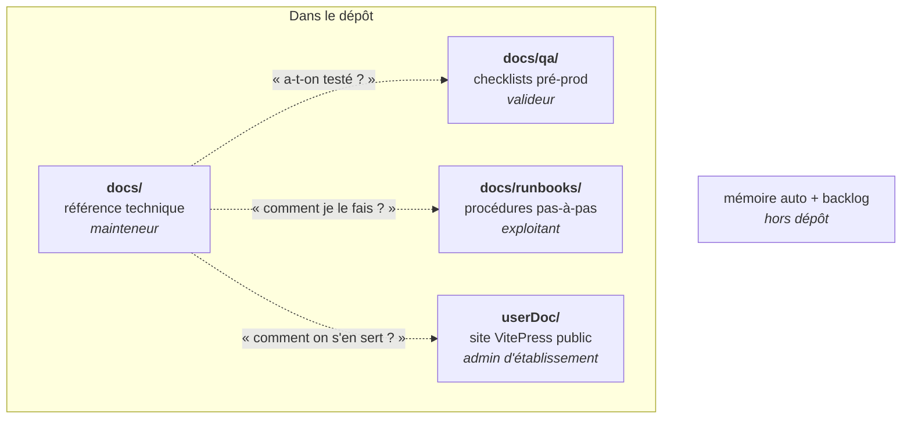

# Documentation SE5 — carte du corpus

> **Porte d'entrée.** Ce fichier ne documente aucun sujet : il dit **où vit quoi**,
> **dans quel état**, et **par où entrer** selon qui tu es. Chaque fiche reste la
> source de vérité de son sujet ; cette carte oriente, elle ne duplique pas.
>
> Si tu reprends le projet sans contexte, **commence ici**.

---

## 1. En une phrase

SE5 remplace SE4 — l'application PHP historique dont l'Active Directory et les GPO
portaient à la fois la donnée et le comportement des postes — par une application
**Laravel** où **PostgreSQL** porte la vérité, et un **agent Go** qui applique sur
chaque poste un **état désiré** compilé côté serveur. L'AD reste l'annuaire
d'authentification et la cible de projection ; il n'est plus la source.

La documentation suit cette découpe : un corpus par audience, un dossier par
domaine fonctionnel.

## 2. Les corpus

| Corpus | Rôle | Public |
| --- | --- | --- |
| `docs/<domaine>/` et `docs/domains/` | **Référence technique** : le pourquoi (décisions) et le comment (mécanismes), ancrés sur le code | Mainteneur |
| `docs/qa/domains/` | **Checklists de pré-production** par domaine, à dérouler avant mise en production | Valideur |
| `docs/runbooks/` | **Procédures d'exploitation** pas-à-pas : gestes, commandes, vérifications | Exploitant |
| `userDoc/` | **Site public VitePress** (`/doc`), deux parcours : administrateur et poste | Admin d'établissement |
| `docs/archive/` | Notes d'amorçage, plans exécutés, analyses du legacy. **Conservé, non maintenu** | Personne — mémoire de projet |

> **`docs/` porte le code.** Une quarantaine de renvois `docs/…` vivent dans
> `config/`, `resources/views/`, `scripts/` et `tests/` : une fiche référencée
> depuis le code est un contrat, pas un commentaire. Ne jamais la déplacer ni la
> renommer sans corriger les renvois.

## 3. Parcours de lecture

**Tu reprends le code après une absence.** Lis dans cet ordre :
`identite/README.md` (qui sont les objets et d'où ils viennent) → `agent/README.md`
(comment l'état atteint les postes — c'est le corpus le plus mûr, il sert d'étalon
de rédaction) → `features-se4-SE5.md` (ce qui est porté, ce qui ne l'est pas) →
le domaine qui t'intéresse dans la carte ci-dessous.

**Tu vas modifier un domaine.** Sa fiche de référence, puis son entrée dans
`qa/domains/` (elle dit ce que la modification devra ne pas casser).

**Tu exploites une instance.** `runbooks/`, et `audit-dependances-systeme.md` pour
ce que SE5 attend du système hôte.

**Tu accompagnes un utilisateur.** `userDoc/`.

## 4. Carte des domaines

État de la référence technique : **✅** gabarit complet (index + décisions +
fiches) · **🟡** fiche unique · **🔴** aucune fiche de référence · **⛔** fiche
existante mais **périmée** — elle décrit un état qui n'a plus cours.

> **⛔ prime sur 🔴.** Une fiche absente coûte une recherche ; une fiche fausse
> coûte une décision. Traiter les ⛔ avant les 🔴.

| Domaine | Code | Référence | QA | État |
| --- | --- | --- | --- | --- |
| **Agent & état désiré** | `agent/` (Go), `app/Services/Agent/` | [`agent/`](agent/README.md) — 12 fiches | [qa](qa/domains/agent.md) | ✅ |
| **Identité & AD** | `app/Services/AdSync/`, `app/LdapModels/`, `app/Models/User*` | [`identite/`](identite/README.md) | [qa](qa/domains/ad-sync.md), [qa](qa/domains/users.md) | ✅ |
| **Flux GPEI** | import académique | [`domains/gpei.md`](domains/gpei.md) | — | ✅ |
| **Parc & postes** | `app/Services/Parc/`, `app/Models/Workstation*` | [`domains/parc.md`](domains/parc.md) | [qa](qa/domains/parc.md) | 🟡 |
| **Droits & délégations** | `app/Policies/`, `app/Services/Permissions/` | [`domains/rights-management.md`](domains/rights-management.md) — *avril, périmée* | [qa](qa/domains/rights-management.md) | ⛔ |
| **Groupes, rôles & droits (modèle générique)** | `app/Models/Group*`, `app/Enums/RoleResolutionStrategy.php` | — | [qa](qa/domains/rights-management.md) | 🔴 |
| **Configuration des postes** | `app/Services/AppCustomization/`, `Overlay/`, `Wallpaper/` | [`domains/app-customizations.md`](domains/app-customizations.md) | — | 🟡 |
| **Impression** | `app/Services/Print/` | [`domains/printers.md`](domains/printers.md) | [qa](qa/domains/printers.md) | 🟡 |
| **Plan de fichiers, droits & quotas** | `app/Services/Filesystem/`, `app/Services/Nextcloud/`, `app/Services/OpenCloud/` | [`domains/filesystem.md`](domains/filesystem.md) — où vivent les deux espaces, le cloud unique, ce que le poste reçoit, le contrat d'écriture des droits, plafond et corbeille ; [`audit-arborescence-acls.md`](audit-arborescence-acls.md) | [qa](qa/domains/filesystem.md) | 🟡 |
| **Déploiement applicatif** | `app/Wpkg/`, `app/Services/AppStore/`, `AppProfile/` | [`wpkg-deploy/architecture.md`](wpkg-deploy/architecture.md) | [qa](qa/domains/wpkg-deploy.md) | 🟡 |
| **Lien amont controlHub** | `app/Services/ControlHub/` | [`api-controlhub-workstation-groups.md`](api-controlhub-workstation-groups.md) | [qa](qa/domains/controlhub-contract.md) | 🟡 |
| **GPO & SYSVOL** | `app/Gpo/`, `app/Services/Gpo/` | *dette :* [`tech-debt-gpo.md`](tech-debt-gpo.md) | [qa](qa/domains/gpo.md) | 🔴 |
| **Authentification & SSO** | `app/Auth/` (V1, OIDC, fédéré), `app/OidcWitness/` | [`auth/`](auth/README.md) — 5 fiches | [qa](qa/domains/auth.md), [qa](qa/domains/federated-login.md) | ✅ |
| **Installation de postes (iPXE)** | `app/Ipxe/` | [`ipxe/`](ipxe/README.md) — 6 fiches | [qa](qa/domains/ipxe.md) | ✅ |
| **Extensions** | `app/Services/Extensions/`, `extensions/` | — | [qa](qa/domains/extensions.md) | 🔴 |
| **Réseau (DHCP/DNS)** | `app/Services/Network/`, `scripts/system/` | — | [qa](qa/domains/network.md) | 🔴 |
| **Scripts de session** | `app/ScriptsOs/` | — | — | 🔴 |
| **Diagnostic d'instance** | `app/Doctor/` | — | — | 🔴 |
| **Exploitation & tâches** | `app/Console/Commands/`, `app/Jobs/` | [`domains/exploitation.md`](domains/exploitation.md) + `php artisan help` | — | 🟡 |

**Documents transverses** — [`features-se4-SE5.md`](features-se4-SE5.md) (état du
portage SE4 → SE5) · [`audit-dependances-systeme.md`](audit-dependances-systeme.md)
(ce que SE5 attend du système hôte) · [`testingPlan.md`](testingPlan.md) (méthode de
comparaison legacy ↔ SE5).

## 5. Invariants du corpus

- **La doc suit le code, jamais l'inverse.** On documente le **livré et stable** ;
  jamais l'intention, jamais le spéculatif.
- **Une fiche référencée depuis le code est un contrat.** Renommage et déplacement
  imposent de corriger les renvois.
- **Le corpus distille, il ne duplique pas.** Ce que le code, les tests ou le
  backlog disent déjà n'est pas recopié : il est relié.
- **Cadrage legacy → aujourd'hui.** Un gain s'énonce par rapport à SE4, jamais par
  rapport à un état antérieur de SE5. Les notions nées d'un état SE5 disparu n'ont
  pas leur place ici.
- **Pas de jargon de pilotage interne** (numéros de lot, codes d'exigence) dans la
  référence technique : la règle s'énonce en clair.

## 6. Manques connus

**D'abord ce qui est faux** (⛔) :

1. **Droits & délégations** — la fiche date d'avril et annonce 18 permissions
   atomiques ; il y en a 25. Elle ignore aussi que la vérité des rôles a basculé
   en base. Un bandeau en tête dit ce qui a changé : le piège est désamorcé, la
   refonte reste à faire.

**Ensuite ce qui manque** (🔴), par volume de code non couvert :

2. **GPO & SYSVOL** — 24 fichiers, documentés seulement par un registre de dette.
3. **Diagnostic d'instance** — 22 fichiers, aucune trace, pas même une checklist.
4. **Groupes, rôles et types de groupe** — le modèle n'a **aucune fiche de
   référence**. Ce qu'il en reste d'écrit est réparti sans index : les décisions
   vivantes sont dans le code (rôle porté par l'arête user↔groupe, type de groupe
   fermé par la déclaration d'un rôle, recette d'arborescence accrochée à un
   type, fabrique de groupes dérivés) ; la part d'archéologie et les orientations
   **non exécutées** sont dans
   [`archive/group-model-multivertical-orientation.md`](archive/group-model-multivertical-orientation.md)
   et son entrée d'[`archive/README.md`](archive/README.md). Le domaine est à
   ouvrir au gabarit.
5. **Extensions** (14 fichiers), **réseau** (10) et **scripts de session** (11) —
   checklist de pré-production au mieux.

**Enfin l'entretien :**

7. **Documentation d'API (Swagger)** — périmée : le canal de communication amont a
   beaucoup évolué depuis sa dernière génération, et un seul contrôleur du dépôt
   porte encore des annotations. À **refaire**, pas à rapiécer.
8. `qa/README.md` — l'entrée `controlhub-contract` y est **dupliquée dix fois** par
   accrétion successive ; l'index est à reconstruire.
9. Les domaines en 🟡 tiennent dans un fichier unique et ne séparent pas les
   décisions des mécanismes : ils sont à passer au gabarit quand on les rouvre.

> **Comment une fiche devient fausse sans qu'on le voie.** Rien ne relie une
> fiche au code qu'elle décrit : elle ne casse pas quand il change. Les fiches
> périmées se repèrent en comparant leur date de dernier commit à celle du code
> de leur domaine — c'est le seul signal disponible aujourd'hui, et il est
> manuel.

## 7. Écrire une fiche

Le gabarit et les règles de rédaction sont outillés : `.claude/skills/doc-domaine/`.
En résumé — un domaine riche prend un dossier `docs/<domaine>/` avec un `README.md`
(la porte d'entrée), un `metier.md` (les décisions, une par section : contexte →
décision → conséquences) et une fiche technique par sujet ; un petit domaine tient
dans `docs/domains/<domaine>.md`. Toute procédure d'exploitation va dans
`docs/runbooks/`, jamais dans la fiche de référence.

`docs/agent/` est l'**implémentation de référence** du gabarit : le lire avant
d'écrire.
