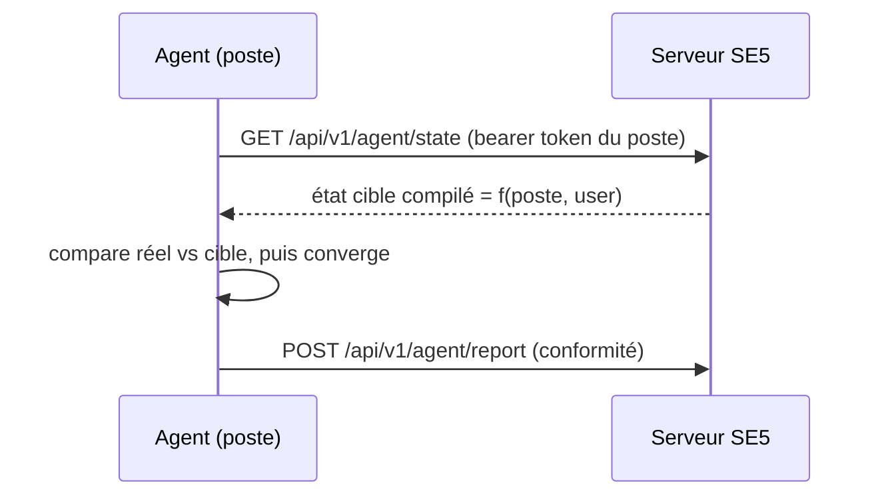

# Domaine — Agent *desired-state* (successeur des GPO)

> **Porte d'entrée du domaine.** Ce fichier indexe la documentation de l'agent :
> il ne décrit aucun mécanisme lui-même, il **oriente** vers la fiche qui le
> décrit, selon qui tu es et ce que tu cherches. Chaque fiche reste la source de
> vérité de son sujet ; ce README ne duplique pas, il cartographie.
>
> Si tu reprends ce projet sans contexte, **commence ici.**

---

## 1. En une phrase

L'**agent desired-state** est un service Windows (Go) qui, sur chaque poste, tire
du serveur SE5 son **état cible**, le compare à l'état réel, **converge**, puis
**rapporte** sa conformité. Il remplace les GPO : la configuration des postes ne
passe plus par SYSVOL / Active Directory mais par un canal HTTP/JSON authentifié,
sans dépendance AD.

## 2. Le *pourquoi* (métier — l'essentiel)

> Résumé. Le détail (une décision = un ADR : contexte → décision → conséquences)
> est dans [`metier.md`](metier.md).

- **Pourquoi un agent et pas « de meilleures GPO »** — les GPO imposent Active
  Directory, SYSVOL, un cycle de rafraîchissement opaque, et Windows seulement.
  L'agent porte la config en **pull HTTP authentifié** : lisible, testable au
  `curl`, et **sans dépendance AD**. Cette indépendance vis-à-vis d'AD est le
  critère qui conditionne la stratégie long terme (sortie vers Keycloak).
- **La GPO subsiste comme simple amorce.** Une unique GPO générique
  (`SE_agent_bootstrap`) sert *uniquement* à installer et démarrer l'agent ; elle
  ne porte aucune configuration métier. L'agent prend ensuite tout le relais.
  Voir `enrollment.md` et `../runbooks/gpo-se4-agent-bootstrap.md`.
- **Convergence inconditionnelle.** L'agent ramène toujours le poste à son état
  cible : ce que le serveur décrit fait foi, sans exception tolérée.
- **L'agent provisionne aussi les ressources de support partagées.** Au-delà des
  9 types desired-state, il dépose sur le poste les **outils partagés** que les
  recettes invoquent (archiveur, raccourcis…) via un module générique
  *déclaratif serveur / impératif agent*, idempotent par hash et extensible à
  d'autres OS. Voir [`shared-tools-provisioning.md`](shared-tools-provisioning.md).
- **Une seule source de configuration.** Le canal de configuration legacy (SE4)
  est éteint en bloc : chaque route client encore appelée reçoit une réponse native
  **terminale, typée et inerte** (tombstones, story 38.2) — le kill-switch
  `LEGACY_CONFIG_CHANNEL_ENABLED` a été RETIRÉ, remplacé par ces tombstones. Agent et
  legacy ne cohabitent jamais comme deux sources de vérité concurrentes.
- **Le token EST l'identité.** Un poste = un bearer token opaque, de portée
  minimale (lire *son* état, écrire *ses* rapports). Les endpoints n'acceptent
  **jamais** d'identifiant de poste en entrée. Supprimer le poste le révoque par
  construction.
- **Publier au parc = tester.** Tant qu'aucun parc en production ne consomme le
  canal, publier une release stable au parc **est** le geste de validation, pas
  une étape qui le suit.
- **Runtime Go, par contrainte.** Cible Windows alignée sur le legacy et
  mainteneurs non-développeurs ⇒ un binaire unique, sans toolchain lourde.

## 3. Parcours de lecture par audience

### 🧑‍💻 Mainteneur / dev qui reprend le code
1. Ce README → `contract-v1.md` (le contrat figé, point d'ancrage de tout).
2. **Transport** : `token-lifecycle.md` + `enrollment.md` (comment un poste
   obtient et fait vivre son identité).
3. **Côté serveur** : `state-providers.md` (comment l'état cible est *compilé*
   depuis les tables métier) → `state-endpoint.md` (comment il est *servi*).
4. **Retour** : `report-endpoint.md` (conformité) + `session-companion.md`
   (contexte user de session).
5. **Effets concrets** : `handlers-wallpaper-overlay.md` (ce que l'agent
   *applique* réellement sur le poste).
6. **Cycle de vie binaire** : `release-distribution.md` (publier/cibler/promouvoir).

### 🛠️ Exploitant (déployer / publier / dépanner)
- Amorcer un poste : `enrollment.md` + `../runbooks/gpo-se4-agent-bootstrap.md`.
- Publier / faire monter une version : runbook pas-à-pas
  [`../runbooks/agent-build-publish-update.md`](../runbooks/agent-build-publish-update.md)
  (référence : `release-distribution.md`).
- Diagnostiquer un poste : tirer son état au `curl` (voir `state-endpoint.md`),
  lire ses rapports (`report-endpoint.md`).

### 🧠 Toi / mémoire projet
- Les principes sont condensés en §2 ; [`metier.md`](metier.md) les développe en
  ADR durables (contexte → décision → conséquences).

## 4. Carte des fiches (source de vérité par sujet)

| Fiche | Axe | Sujet |
|---|---|---|
| [`metier.md`](metier.md) | métier | **Le *pourquoi*** — 9 ADRs (agent vs GPO, indépendance AD, convergence, token=identité…) |
| [`contract-v1.md`](contract-v1.md) | technique | **Contrat wire `se5.desired-state/v1`** — enveloppe JSON, items, hash. **FIGÉ.** Le socle. |
| [`token-lifecycle.md`](token-lifecycle.md) | technique | Couche transport : auth bearer, rotation, révocation, anti-clonage |
| [`enrollment.md`](enrollment.md) | technique + proc | Naissance du token : amorçage LAN-only d'un poste neuf |
| [`state-providers.md`](state-providers.md) | technique | **Compilation serveur** : projection des tables métier → état cible |
| [`state-endpoint.md`](state-endpoint.md) | technique | `GET /agent/state` — transport HTTP de l'état |
| [`report-endpoint.md`](report-endpoint.md) | technique | `POST /agent/report` — remontée de conformité |
| [`session-companion.md`](session-companion.md) | technique | Contexte user de session (`?user=`) + companion |
| [`handlers-wallpaper-overlay.md`](handlers-wallpaper-overlay.md) | technique | Handlers `wallpaper` + `overlay` (⚠️ 2 types sur 9 — voir note) |
| [`release-distribution.md`](release-distribution.md) | technique + proc | Publication/ciblage canari des binaires (`agent_releases`, rings) |
| [`shared-tools-provisioning.md`](shared-tools-provisioning.md) | technique | **Module `provision`** — staging générique des ressources partagées (outils WPKG) ; `manifest.json` déclaratif + `Reconcile` par hash. Orthogonal aux handlers |
| [`agent-skeleton.md`](agent-skeleton.md) | technique | Squelette du runtime Go (structure des packages) |

> ⚠️ **Couverture handlers incomplète.** Le contrat publie **9 types** de
> ressources (`wallpaper`, `overlay`, `shortcuts`, `printers`, `drives`,
> `associations`, `registry` HKLM+HKCU, `app_config`, `applications`/WPKG).
> Seuls `wallpaper` et `overlay` ont une fiche dédiée. Les 7 autres se lisent
> aujourd'hui dans le code (§7) et dans `state-providers.md` côté serveur —
> ils sont à documenter (cf. §6).

## 5. Invariants à ne jamais casser

Règles d'enforcement : une PR qui les viole se rejette.

- Le nom de schéma vient de `App\Services\Agent\StateContract::SCHEMA` —
  **jamais** d'une variable d'environnement.
- Un endpoint agent ne prend **jamais** de `workstation_id`/`uuid` en paramètre :
  l'identité, c'est le token.
- Le canal agent n'écrit **que** dans les tables `agent_*` (et colonnes `agent_*`
  de `workstations`) ; il *lit* les `WorkstationGroups`, n'y écrit jamais.
- **Zéro** appel LDAP / Kerberos / samba-tool dans tout le flux agent — c'est
  l'indépendance vis-à-vis d'AD qui conditionne la sortie vers Keycloak.
- Le wire format `v1` est figé : toute évolution incompatible exige un **bump de
  version majeure**, pas une modification en place.

## 6. Manques connus de cette doc (backlog documentaire)

> Couverture honnête : ce qui n'est PAS encore documenté ici.

- [ ] **Fiches handlers manquantes** : `registry`, `app_config`,
      `applications`/WPKG, `printers`, `drives`, `associations`, `shortcuts`
      (7 des 9 types n'ont pas de fiche dédiée — cf. §4).

## 7. Carte du code (ancrage `fichier:ligne`)

> Points d'entrée réels pour plonger dans le code. Version agent courante :
> **`2.2.19`** (`agent/shared/version.go`).

### Agent (Go — module `sambaedu/agent`)

| Rôle | Chemin |
|---|---|
| Point d'entrée + sous-commandes (`install`/`run`/`session-fetch`/`companion`) | `agent/windows/main_windows.go` (`func main`) |
| Boucle desired-state (le cycle) | `agent/shared/loop.go` (`RunCycle`) |
| Version (source unique, injectée au build) | `agent/shared/version.go` |
| Lecture du token (à chaque cycle) | `agent/shared/files.go` (`Store.ReadToken`) |
| Moteur générique + interface `Handler` (`Test`/`Apply`) | `agent/shared/engine.go` |
| Handlers (1 fichier par type) | `agent/shared/handler_*.go` (+ `agent/windows/handler_*_windows.go`) |
| Provisioning de ressources partagées (générique, hors moteur) | `agent/provision/provision.go` (+ `provision_windows.go`) — cf. [`shared-tools-provisioning.md`](shared-tools-provisioning.md) |
| Reporting : collecte / purge / fusion par type | `agent/shared/dropcollect.go` |
| Self-update (download, vérif hash + Authenticode, swap) | `agent/shared/update.go`, `agent/shared/swap.go` |
| Build + signature + publication | `scripts/build-agent.sh` |

### Serveur (Laravel)

| Rôle | Chemin |
|---|---|
| Routes du canal agent | `routes/api.php` (bloc agent, ~l.240-374) |
| Auth bearer per-poste + rotation + anti-clonage | `app/Http/Middleware/AuthenticateAgentToken.php` |
| Contrat figé (`SCHEMA = se5.desired-state/v1`) | `app/Services/Agent/StateContract.php` |
| Compilation de l'état cible (précédence par maille) | `app/Services/Agent/StateCompiler.php` |
| Hash canonicalisé (ETag, comparaison) | `app/Services/Agent/StateHasher.php` |
| Providers (1 par type de ressource) | `app/Services/Agent/Providers/*StateProvider.php` |
| Endpoints | `app/Http/Controllers/Api/V1/Agent/{State,Report,Release,Asset,Tool,Bootstrap,Enroll}Controller.php` |
| Releases (manifest / création) | `app/Services/Agent/Releases/Release{Manifest,Creation}Service.php` |
| Enrôlement / rotation token | `app/Services/Agent/Enrollment/{Enrollment,TokenRotation}Service.php` |
| Commandes | `php artisan agent:release:{create,promote,target}` |
| Tests (PHP) | `tests/Feature/Agent/`, `tests/Unit/Services/Agent/` |
| Golden files normatifs du contrat | `tests/Fixtures/Agent/*.v1.json` |

---

*Convention : chaque fiche déclare en tête son sujet et son orthogonalité aux
voisines. On documente le livré et stable, jamais le spéculatif. Ce README est le
gabarit d'index des autres domaines (`docs/domains/`, `docs/<domaine>/`).*
