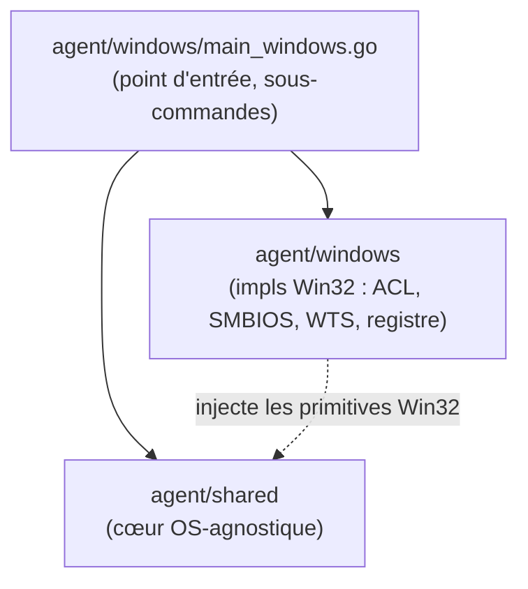

# Squelette du runtime Go de l'agent

> **Structure du binaire** de l'agent desired-state : module Go, découpage des
> packages, point d'entrée et sous-commandes, boucle de check-in et interface
> des handlers. Orthogonal à l'index [`README.md`](README.md) (qui cartographie
> le domaine) : cette fiche décrit la **forme du code** de l'agent. Le wire
> format échangé est figé par [`contract-v1.md`](contract-v1.md) ; le transport
> (auth, rotation, quarantaine) par [`token-lifecycle.md`](token-lifecycle.md) ;
> la naissance du token par [`enrollment.md`](enrollment.md).

## 1. Module et packages

Le code de l'agent vit dans `agent/` (top-level, hors Laravel), module Go
`sambaedu/agent`, découpé en deux packages :

| Package | Rôle | Testé |
|---|---|---|
| `agent/shared` | **Cœur OS-agnostique** : canonicalisation + `StateHasher` (miroir bit-à-bit de `app/Services/Agent/StateHasher.php`, validé contre les golden files), parsing du contrat v1, construction du rapport, client HTTP (rotation, fenêtre de grâce, quarantaine, backoff), cache local atomique, moteur de convergence, compagnon, collecte des drops. | `go test ./...` sur l'hôte Linux |
| `agent/windows` | **Spécifique Win32** : protocole SCM (`x/sys/windows/svc`), ACL `icacls`, UUID SMBIOS, énumération des sessions WTS, registre HKCU + `SystemParametersInfoW` (FFI sans cgo), tâches planifiées. | Windows |

Le binaire statique signé Authenticode est produit par `scripts/build-agent.sh`.



`agent/windows/main_windows.go` (`func newAgent`) assemble la boucle `shared`
avec les implémentations Windows : ACL `icacls`, UUID SMBIOS, hostname court,
énumération WTS des sessions, primitives d'auto-update. En test/Linux, ces
primitives sont `nil` (comportement inerte).

## 2. Point d'entrée et sous-commandes

`func main` (`agent/windows/main_windows.go`) détecte d'abord s'il tourne en
service (`svc.IsWindowsService()`) ; sinon il dispatche sur la sous-commande :

| Sous-commande | Rôle |
|---|---|
| `agent.exe install -server-url http://<se5> [-interval 3600]` | Pose `config.json` (`server_url` + `interval_seconds`), installe et démarre le service SYSTEM. |
| `agent.exe uninstall [-purge]` | Désinstalle le service (`-purge` efface aussi les données, token compris). |
| `agent.exe run` | Mode console (debug) : même boucle que le service, log recopié sur stderr. |
| `agent.exe session-fetch` | Tâche at-logon (SYSTEM) : un fetch des sessions + sync des assets, puis sortie. Jamais d'erreur visible au logon. |
| `agent.exe companion` | Tâche at-logon (BUILTIN\Users) : processus **résident** aux droits de la session — ni réseau, ni token. |
| `agent.exe version` | Imprime `shared.Version`. |

Le **service SYSTEM** est l'acteur du canal réseau (portée machine + broker des
sessions). Le **compagnon** converge la portée session aux droits de
l'utilisateur, sans accès au token (canal réseau 100 % SYSTEM). Voir
[`session-companion.md`](session-companion.md).

## 3. La boucle de check-in (`RunCycle`)

Le cycle vit dans `agent/shared/loop.go` (`func (a *Agent) RunCycle`). À chaque
itération :

```
lire token (C:\ProgramData\SambaEdu\Agent\token — relu à CHAQUE cycle)
   │
   ▼
GET /api/v1/agent/state          Authorization: Bearer <token>
                                 If-None-Match: <ETag du cache, verbatim>
   │ 200 → persister cache\state.json + cache\etag.txt (ETag verbatim)
   │ 304 → cache local valide (rien à persister)
   ▼
converger (moteur §5) puis POST /api/v1/agent/report
   │ 200 {success: true, counts: {compliant, drift, error}}
   ▼
attendre l'intervalle puis recommencer
```

Points fermes :

- **Le rapport part aussi sur 304** : état inchangé en cache = on rapporte quand
  même (la fraîcheur `agent_last_checkin_at` + le rapport sont le signal de vie
  du poste).
- **Pas de `?user=`** sur le canal service : la portée est machine. Le contexte
  de session est apporté par `session-fetch` (`GET /state?user=<login>`) et le
  compagnon.
- **ETag opaque verbatim** : stocké et renvoyé avec les guillemets RFC 7232 ;
  l'agent ne le déquote jamais.
- **Cadence pilotée serveur** : l'intervalle de poll est gouverné par le
  `ttl_seconds` de l'enveloppe `/state`, clampé `[60 s, 24 h]`, amorcé depuis le
  cache au démarrage ; `interval_seconds` (config locale) n'est que le repli
  avant la première enveloppe vue.

L'identité qui fait foi est **le token** : le bloc `workstation` du rapport
(`hostname` court + `uuid` SMBIOS) est déclaratif (debug), jamais utilisé pour
résoudre le poste. Le serveur compare `hostname` à `workstations.name` (nom
court) et émet un warning d'identité en cas de divergence, sans rejeter le
rapport.

### Codes HTTP gérés

| Code | Réaction |
|---|---|
| 200 | `GET /state` : persister cache + ETag ; `POST /report` : boucle fermée. |
| 304 | Réutiliser le cache, **poursuivre vers le rapport**. |
| 401 | Arrêt + log local (jamais de re-enrôlement automatique). Réessai unique avec l'ancien token si une rotation vient d'avoir lieu (fenêtre de grâce). |
| 403 (`AGENT_QUARANTINED`) | **Check-ins légers** : `GET /state` à cadence normale, plus aucun `POST /report` ni traitement d'état. |
| 429 | Backoff. |
| 5xx / timeout / réseau | L'agent vit sur son **dernier cache** ; retries en backoff exponentiel **30 s → 60 s → 120 s → … plafonné à 3600 s**. |

La rotation du token (header `X-Agent-New-Token` sur toute réponse) est traitée
par le client `shared` : écriture atomique du nouveau token avant de l'utiliser
au cycle suivant. Détail dans [`token-lifecycle.md`](token-lifecycle.md).

## 4. Le moteur et l'interface Handler

La convergence vit dans `agent/shared/engine.go`. Un type de ressource = un
**handler** typé :

```go
type Handler interface {
    Test(items []StateItem) (bool, error) // le réel correspond-il à la cible ?
    Apply(items []StateItem) error        // converge (IDEMPOTENT)
}
```

`Engine.RunPass` groupe les items par type (en préservant l'ordre serveur),
appelle `Test` puis, en cas de divergence, `Apply`. Un échec (`error` ou panic)
est capturé **par type** et devient `{status: error, detail}`. La convergence est
**inconditionnelle** : `réel = cible → compliant` ; `réel ≠ cible → Apply →
drift`. La cible décrite par le serveur fait toujours loi.

Le service SYSTEM porte le `MachineEngine` (handlers de portée machine :
`registry` HKLM, `app_config`, `applications`/WPKG) ; le compagnon porte les
handlers de portée session (HKCU…). Un même handler générique est partagé entre
les deux ruches lorsque c'est pertinent (ex. `registry`).

## 5. Fichiers locaux du poste

| Fichier | Rôle |
|---|---|
| `C:\ProgramData\SambaEdu\Agent\token` | Token bearer (chemin figé — voir `enrollment.md`). Illisible du compagnon. |
| `C:\ProgramData\SambaEdu\Agent\config.json` | `server_url` + `interval_seconds` — posé par `agent.exe install`. |
| `C:\ProgramData\SambaEdu\Agent\cache\state.json` | Dernière enveloppe d'état (brute). |
| `C:\ProgramData\SambaEdu\Agent\cache\etag.txt` | Dernier ETag, verbatim. |
| `C:\ProgramData\SambaEdu\Agent\applied-state.json` | Dernier-appliqué par item (empreinte de traçabilité). |
| `C:\ProgramData\SambaEdu\Agent\logs\agent.log` | Log local `[ISO 8601] [LEVEL] message`, rotation quotidienne, 7 j. |

Le token et le canal réseau sont sous ACL `SYSTEM` + `Administrators` uniquement.

## 6. Version

`agent/shared/version.go` est la **source unique** de la version (`var Version`,
injectable au build via `-ldflags "-X sambaedu/agent/shared.Version=…"`),
déclarée dans chaque rapport (`agent_version`) et reprise par le nommage de
l'artefact. Version courante : **`2.2.17`**.

## 7. Renvois

- [`README.md`](README.md) — index du domaine (carte du code, invariants).
- [`contract-v1.md`](contract-v1.md) — wire format `se5.desired-state/v1` figé.
- [`token-lifecycle.md`](token-lifecycle.md) — transport (auth, rotation, anti-clonage).
- [`session-companion.md`](session-companion.md) — contexte de session + compagnon.
