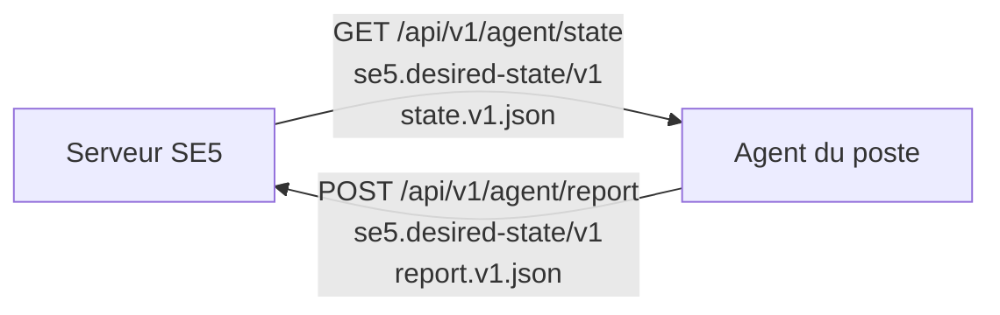

# Contrat agent `se5.desired-state/v1`

> **Statut : figé (v1).** Ce document décrit le contrat HTTP/JSON entre le
> serveur SambaEdu (SE5) et l'agent *desired-state* des postes, successeur des
> GPO. Il définit le **contenu** échangé dans les deux sens ; le **transport**
> (token, rotation, auth) est orthogonal et vit dans
> [token-lifecycle.md](token-lifecycle.md), les endpoints dans
> [state-endpoint.md](state-endpoint.md) et [report-endpoint.md](report-endpoint.md),
> la fabrication des items dans [state-providers.md](state-providers.md).
>
> Un agent déployé **fige le wire format** : la forme de l'enveloppe et
> l'algorithme de hash sont **irréversibles** sans bump de version majeure. Les
> golden files normatifs sont `tests/Fixtures/Agent/state.v1.json` (état cible)
> et `tests/Fixtures/Agent/report.v1.json` (rapport de conformité).

## 1. Vue d'ensemble



| Sens | Endpoint | Schéma | Golden file |
|---|---|---|---|
| Serveur → agent | `GET /api/v1/agent/state` | `se5.desired-state/v1` | `state.v1.json` |
| Agent → serveur | `POST /api/v1/agent/report` | `se5.desired-state/v1` | `report.v1.json` |

La source unique du nom de schéma est `App\Services\Agent\StateContract::SCHEMA`
(constante figée, **jamais** une variable d'environnement).

Conventions communes : clés `snake_case`, structure plate, tableaux d'objets,
timestamps UTC ISO 8601 (`Carbon::now('UTC')->toIso8601String()`).

## 2. Enveloppe de l'état cible

```json
{
  "schema": "se5.desired-state/v1",
  "generated_at": "2026-06-11T08:00:00+00:00",
  "ttl_seconds": 3600,
  "debug": false,
  "machine":      [ /* items portée machine */ ],
  "session":      [ /* items portée session */ ],
  "machine_user": [ /* items portée machine × user */ ]
}
```

| Champ | Type | Sens |
|---|---|---|
| `schema` | string | Version du contrat. L'agent **refuse un major inconnu**. |
| `generated_at` | string (ISO 8601 **avec timezone**) | Instant de compilation. **Champ volatil exclu du hash.** |
| `ttl_seconds` | int | Cadence de poll/rafraîchissement conseillée. |
| `debug` | bool | Mode debug du poste (`workstations.debug`). En debug, le compagnon de session garde sa console ouverte (toutes sessions) et y recopie ses logs. **Champ opérationnel inclus dans le hash** : un toggle change l'ETag et franchit le cache 304. L'agent ignore ce champ s'il ne le connaît pas (forward-compat). |
| `machine` / `session` / `machine_user` | list\<item\> | Les trois **portées** d'application. |

### Portées (`App\Enums\StateScope`)

- `machine` — s'applique au poste, indépendamment de la session ouverte.
- `session` — s'applique à la session de l'utilisateur courant.
- `machine_user` — s'applique au couple poste × utilisateur (persistant par
  poste pour un utilisateur donné).

Les valeurs sont **aussi** les clés de l'enveloppe.

## 3. Item

Chaque item porte **exactement** ces quatre clés (ni plus, ni moins) :

```json
{
  "type": "wallpaper",
  "semantics": "exclusive",
  "payload": { "asset": "fonds/ecole-2026.jpg", "style": "fill" },
  "hash": "66fbf6ff…03ed4d9"
}
```

| Clé | Type | Sens |
|---|---|---|
| `type` | string snake_case | Identifiant de type de ressource **figé** (cf. §7). |
| `semantics` | `aggregate` \| `exclusive` | Règle de combinaison (cf. §3.1). |
| `payload` | object | Données spécifiques au type (cf. §3.2). |
| `hash` | string (sha256 hex) | Hash opaque du contenu définissant de l'item (cf. §4). |

### 3.1 Sémantique `aggregate` vs `exclusive` (`App\Enums\ResourceSemantics`)

- `exclusive` — **un seul** item fait foi pour la ressource (ex. `wallpaper` :
  il n'y a qu'un fond d'écran). L'agent applique l'unique / le dernier, jamais
  une union.
- `aggregate` — plusieurs items du même type **s'additionnent** (ex. `overlay`,
  plusieurs `shortcuts`). L'agent applique l'**union**.

### 3.2 `payload` : frontière de responsabilité

Ce qui est figé par le contrat = le *wrapper* (`type/semantics/payload/hash`) et
l'enveloppe. La **sous-structure interne de `payload`** par type est définie avec
le provider correspondant (cf. [state-providers.md](state-providers.md)). Les
payloads présents dans `state.v1.json` sont **illustratifs** et n'engagent pas le
détail final de chaque provider.

## 4. Hash — `App\Services\Agent\StateHasher`

Algorithme **unique et déterministe**. C'est la **source unique** du hash dans le
canal agent : il sert l'ETag de `GET /state` **et** la comparaison des rapports.
**Jamais** de `md5` / `hash('sha256', …)` ad hoc ailleurs.

**Canonicalisation :**

1. Tri **récursif** des clés des **tableaux associatifs** — **lexicographique
   octet-par-octet** (`ksort(…, SORT_STRING)`, pas de collation locale ni de
   comparaison numérique : `"10"` < `"9"`).
2. Les **listes** ne sont **pas** triées : l'ordre des items est significatif et
   fixé par le serveur.
3. Encodage `json_encode(…, JSON_UNESCAPED_SLASHES | JSON_UNESCAPED_UNICODE |
   JSON_THROW_ON_ERROR)` — UTF-8, sans échappement superflu, **sans espaces**
   (pas de `JSON_PRETTY_PRINT`).
4. `hash('sha256', $canonical)` → hex.

> ⚠️ `json_encode` de PHP **ne trie pas** les clés : le tri récursif est
> implémenté à la main (`ksort` sur les sous-tableaux associatifs uniquement).

**Deux portes d'entrée :**

- `hashState(array $state)` — exclut le champ volatil `generated_at` **avant**
  canonicalisation. Deux compilations du même état à des instants différents →
  **hash identique**. (Tout futur champ volatil s'exclut au même endroit —
  single point of truth.)
- `hashItem(array $item)` — exclut la clé `hash` de l'item (sinon dépendance
  circulaire). Le hash dérive du seul contenu *définissant*.

Le hash est **opaque** : l'agent **compare des chaînes**, il ne le recalcule
jamais. La canonicalisation n'existe donc que **côté serveur** — mais elle doit
rester déterministe à vie (un upgrade PHP ne doit pas changer les hashes), d'où
les contraintes ci-dessous.

### 4.1 Contraintes sur les valeurs des payloads (stabilité du hash)

- **Pas de flottants.** Types autorisés dans un payload : chaînes, entiers,
  booléens, `null`, objets, listes. La sérialisation JSON des floats dépend de
  la version/configuration PHP (`serialize_precision` ; `1.0` s'encode `1`) —
  un float rendrait le hash instable d'un upgrade serveur à l'autre. Une
  quantité décimale se porte en chaîne (`"opacity": "0.8"`) ou en entier
  (`"opacity_pct": 80`).
- **Objet vide `{}` ≢ liste vide `[]` : distinction non fiable.** Après
  décodage PHP, les deux sont canonicalisés en `[]`. Aucun payload ne doit
  faire porter du sens à cette différence (un « aucune valeur » explicite se
  porte par un champ dédié, ex. `asset: null`, cf. §8).
- **Unicode : le serveur émet en NFC**, et le hash compare octet à octet (pas
  de normalisation). Côté agent, la comparaison *réel vs cible* faite par les
  handlers doit **normaliser en NFC** avant comparaison — Windows peut produire
  du NFD (`é` = `e` + accent combinant) pour des chemins/noms visuellement
  identiques, ce qui créerait de faux écarts.

## 5. Convergence

La cible fait loi, **sans exception** : tout écart entre l'état réel du poste et
la cible est réappliqué, inconditionnellement.

```
réel ≠ cible  →  l'agent RÉAPPLIQUE la cible  →  rapporte `drift`
réel = cible  →  rien à faire                 →  rapporte `compliant`
```

Le verdict ne dépend que de l'égalité réel/cible (`ResolveItemStatus(isCompliant)`).

**Persistance du dernier-appliqué.** L'agent persiste, par type, le dernier état
qu'il a appliqué (horodatage). Cette mémoire ne sert qu'à la **trace** : elle n'a
**aucune incidence sur le verdict**.

**Premier passage** : aucune mémoire ⇒ même comportement que tout autre passage —
`réel = cible → compliant` (+ persiste), `réel ≠ cible → APPLIQUE → drift`
(+ persiste).

## 6. Rapport de conformité (`POST /report`)

```json
{
  "schema": "se5.desired-state/v1",
  "generated_at": "2026-06-11T08:05:00+00:00",
  "agent_version": "1.0.0",
  "workstation": { "hostname": "salle101-pc03", "uuid": "f1d2c3b4-…" },
  "items": [
    { "type": "wallpaper", "status": "compliant",       "hash": "f65db3c8…" },
    { "type": "overlay",   "status": "drift",            "hash": "fe63c684…" },
    { "type": "printers",  "status": "error",            "hash": "9f2c4e7a…",
      "detail": "service Spooler indisponible (RPC 0x6ba)" }
  ]
}
```

| Champ | Sens |
|---|---|
| `schema` | Même version que l'état (`se5.desired-state/v1`). |
| `generated_at` | Instant du rapport (UTC ISO 8601). |
| `agent_version` | Version de l'agent émetteur. |
| `workstation` | Identité du poste (`hostname`, `uuid`). |
| `items[].type` | Identifiant de type figé. |
| `items[].status` | `compliant` \| `drift` \| `error` (`App\Enums\AgentResourceStatus`). |
| `items[].hash` | Hash **opaque** de la cible que l'agent a traitée (renvoyé tel quel, jamais recalculé). |
| `items[].detail` | **Obligatoire et non vide** quand `status = error` ; optionnel sinon. |

Statuts (`App\Enums\AgentResourceStatus`) :

- `compliant` — réel = cible, rien à faire.
- `drift` — dérive détectée **et réappliquée** (la cible fait toujours loi).
- `error` — l'application a échoué ; `detail` documente la cause.

**Champ additif `inventory`.** L'item `applications` du **rapport** peut porter un
champ optionnel `inventory` : un **résultat par application**
`[{app_id, status, detail?}]` (statut ∈ `compliant|drift|error`). C'est une
**donnée additive** sous la ligne d'état par type — **jamais** un verdict per-app :
le `status`/`hash` de l'item RESTENT le verdict **PAR TYPE** (pire statut des
apps). Le serveur stocke l'inventaire dans `agent_application_inventory` (clé
`(workstation_id, app_id)`, level-triggered) — **fondation des licences à pool**,
sans UI. Un serveur antérieur ignore ce champ (reste `v1`).

```json
{
  "type": "applications",
  "status": "drift",
  "hash": "1a2b3c4d…",
  "inventory": [
    { "app_id": "firefox", "status": "compliant" },
    { "app_id": "vlc", "status": "error", "detail": "installeur en échec (code 1603)" }
  ]
}
```

## 7. Identifiants de type de ressource (figés)

Clé de voûte du contrat, **partagés** serveur / agent / JSON / DB / UI. Ils sont
`snake_case` et **figés une fois publiés** : un identifiant publié ne se
**renomme JAMAIS**. En cas d'erreur de nommage → **déprécier + ajouter** un
nouvel identifiant, jamais renommer en place.

Identifiants prévus :

`wallpaper`, `lockscreen`, `overlay`, `shortcuts`, `printers`, `drives`,
`associations`, `registry`, `app_config`, `applications`, `registry_list`
(Story 35.2, cf. §7.6), `fs_acl` (Story 36.1, cf. §7.7), `firewall`
(Story 36.2, cf. §7.8).

### 7.1 Payload `registry`

Type `registry` — sémantique **`exclusive` PAR IDENTITÉ DE CLÉ** (une clé de
registre = une valeur ; la maille la plus spécifique gagne POUR CETTE clé, les
clés distinctes s'accumulent). Le payload porte un item de registre **CONCRET** :

```json
{
  "type": "registry",
  "semantics": "exclusive",
  "payload": {
    "hive": "HKCU",
    "path": "Software\\Microsoft\\Windows\\CurrentVersion\\Explorer\\Advanced",
    "name": "HideFileExt",
    "type": "REG_DWORD",
    "value": 0
  },
  "hash": "92730f99…af686b5"
}
```

| Clé | Type JSON | Sens |
|---|---|---|
| `hive` | string | `HKLM` (portée machine, service SYSTEM) \| `HKCU` (portée session, compagnon) \| `HKU` (Story 35.3 — portée **machine**, service SYSTEM). **Sémantique `HKU`** : l'item désigne UNE cible logique que le service applique à **toutes les ruches utilisateur du poste + `.DEFAULT`** (le « profil » lu par l'écran de logon) — fan-out **interne au handler** : `HKU\.DEFAULT\<path>` + `HKU\<SID>\<path>` pour chaque ruche chargée (`S-1-5-21-*`, hors jumelles `_Classes` ; les SID de service `S-1-5-18/19/20` ne matchent pas le préfixe), énumérées à **chaque cycle** (une session ouverte après coup est couverte au cycle suivant). Le `path` du payload ne porte **JAMAIS** le préfixe `.DEFAULT\` (c'est le handler qui préfixe). Drift **AGRÉGÉ** : une seule ruche divergente ⇒ l'item (donc le type) rapporte `drift` ; `ensure: "absent"` supprime la valeur dans TOUTES les ruches. **Pas de ciblage par utilisateur** sur cette ruche — structurel : le service fetch son state en contexte machine (sans `?user`), les overrides UserGroup/User n'atteignent jamais ces items ; le ciblage fin reste au Session/HKCU. **Discipline d'authoring** : une capacité portant une clé HKU ne se cible pas par utilisateur/groupe d'utilisateurs, et ses maps HKU/HKCU jumelles (même `{path\|name}`, ex. numlock) doivent être **valeur-consistantes** — sinon compagnon et SYSTEM se réécriraient mutuellement à chaque cycle. |
| `path` | string | Chemin de clé sous la ruche (backslashes échappés en JSON). |
| `name` | string | Nom de la valeur de registre. **`""` (chaîne vide) est un nom LÉGITIME** : la valeur **par défaut** de la clé (`(Default)` dans regedit) — Story 35.2 (besoin 35.5, ex. `HKCU\Software\Classes\Applications\photoviewer.dll\shell\open\command`). La clé `name` doit toujours être **présente** dans le payload (absence = enveloppe invalide) ; c'est le comportement documenté des API registre (`RegQueryValueEx`/`RegSetValueEx`/`RegDeleteValue` avec un nom vide ciblent la valeur par défaut, relayé tel quel par `golang.org/x/sys/windows/registry`). |
| `type` | string | `REG_SZ` \| `REG_DWORD` \| `REG_EXPAND_SZ` \| `REG_MULTI_SZ` \| `REG_QWORD`. |
| `value` | int \| string \| list&lt;string&gt; | Valeur cible TYPÉE : `REG_DWORD`/`REG_QWORD` → **entier** (zéro float, §4.1) ; `REG_SZ`/`REG_EXPAND_SZ` → **string** ; `REG_MULTI_SZ` → **liste de strings** (jamais `{}` — §4.1). Absent sur un item `ensure: "absent"`. |
| `ensure` | string (**optionnel**) | `present` \| `absent`. **Absence du champ = `present`** (rétro-compatible §9). `absent` = l'agent **supprime la valeur nommée** si elle existe (jamais la clé-conteneur). Le serveur n'émet **JAMAIS** `ensure: "present"` explicitement — un item d'écriture reste EXACTEMENT 5 clés (byte-identité des payloads existants). |

Item de **suppression** (`ensure: "absent"`) — EXACTEMENT 4 clés, ni `type` ni
`value` :

```json
{
  "type": "registry",
  "semantics": "exclusive",
  "payload": {
    "hive": "HKLM",
    "path": "SOFTWARE\\Policies\\Microsoft\\Windows NT\\DNSClient",
    "name": "EnableMulticast",
    "ensure": "absent"
  },
  "hash": "8e81903a…b050314d"
}
```

> **Trois régimes coexistent** (Story 35.1) :
>
> 1. **Écrire** — item 5 clés `{hive, path, name, type, value}` (sans `ensure`,
>    qui vaut implicitement `present`) : l'agent (ré)impose la valeur cible.
> 2. **Supprimer** — item 4 clés `{hive, path, name, ensure: "absent"}` : l'agent
>    supprime la **valeur nommée** (`compliant` si déjà absente, `drift` +
>    suppression si elle existe/réapparaît — policy STRICT). Windows reprend son
>    défaut. Jamais la clé-conteneur (des valeurs voisines non gérées y vivent —
>    la réconciliation de clé entière est le type `registry_list`).
> 3. **Ne pas gérer** — la clé n'apparaît PAS dans la cible : l'agent n'y touche
>    plus (§8, la valeur en place reste celle qu'elle avait).
>
> Un item `absent` et un item d'écriture sur la MÊME identité `{hive|path|name}`
> s'arbitrent par la précédence de compilation EXISTANTE (exclusive par clé) —
> ex. un défaut Broadcast « supprimer » battu par un override de parc « écrire ».
>
> **Agents antérieurs à 2.3.0** : un item `absent` (sans `value`) échoue leur
> parse → `{status: error}` isolé sur le type `registry` (comportement D1
> assumé, motivant le bump de version et la publication de release).

> **🔴 Invariant central.** Le payload `registry` ne porte **JAMAIS** un
> `setting_id` / `setting_key` de catalogue serveur. Le catalogue
> (`registry_settings`) est un détail SERVEUR qui se **compile** en cet item
> concret dans le provider. C'est ce qui garde l'option « éditeur de clés brutes »
> gratuite : une 2ᵉ source d'autoring produira les **mêmes** items concrets →
> zéro changement d'agent/contrat/provider.

> **`value` = override de parc, sinon défaut catalogue.** La STRUCTURE du payload
> est identique dans les deux cas (5 clés). Côté serveur, le `value` émis est
> l'**override de parc**
> (`registry_setting_assignables.value`) si présent, sinon la **valeur par défaut
> du catalogue** (`registry_settings.value`) — cette dernière étant **diffusée à
> TOUTES les machines** (maille Broadcast). L'agent et le golden ne changent pas :
> une valeur concrète reste une valeur concrète. « Retirer un override » =
> supprimer la ligne de pivot → le poste **re-converge vers le défaut** au cycle
> suivant (PAS « cesser de gérer »).

> **Portée → acteur.** UN seul handler Go `registry`, instancié deux fois : le
> **service SYSTEM** applique les items HKLM **et HKU** (portée `machine` —
> seul SYSTEM peut écrire les ruches des autres utilisateurs et `.DEFAULT`),
> le **compagnon** applique les items HKCU (portée `session`). Comme les deux
> portées émettent le type `registry`, l'agent **fusionne par type** avant le
> rapport (pire statut gagne) pour respecter l'unicité des types §6.
>
> **Agents antérieurs à 2.5.0 face à un item `HKU`** : le parse réussit (les
> valeurs de `hive` ne sont pas validées au parse) puis `rootKey()` refuse la
> ruche à la première lecture → `Test` retourne une **erreur** → `{status:
> error}` pour le type `registry` machine **ENTIER**, sans Apply : toutes les
> clés HKLM du poste **cessent de converger** tant que l'item HKU est au state.
> La release 2.5.0 DOIT être **publiée AVANT** d'armer une clé HKU (update.sh
> ne publie jamais seul).

### 7.2 Payload `associations`

Type `associations` — sémantique **`exclusive` PAR IDENTIFIANT** (une
extension/un protocole = UN programme par défaut ; la maille la plus spécifique
gagne POUR CET identifiant, les identifiants distincts s'accumulent). Portée
**`session`** (UserChoice HKCU, appliqué par le compagnon au logon). Le payload
porte une association **CONCRÈTE** :

```json
{
  "type": "associations",
  "semantics": "exclusive",
  "payload": {
    "identifier": ".html",
    "progid": "FirefoxHTML",
    "type": "file"
  },
  "hash": "5d4bb788…358468b"
}
```

| Clé | Type JSON | Sens |
|---|---|---|
| `identifier` | string | Extension (`.pdf`, `.html`) ou protocole (`http`, `https`). |
| `progid` | string | ProgId Windows cible inscrit sous UserChoice (ex. `Acrobat.Document.DC`, `FirefoxURL`). Peut être un ProgId **générique** `Applications\<exe>` (cf. note ci-dessous). |
| `type` | string | `file` (→ `FileExts\<ext>\UserChoice`) \| `protocol` (→ `UrlAssociations\<proto>\UserChoice`). |

> **`progid` peut être `Applications\<exe>`.** Quand l'admin compose une
> association *(extension, app)* sans ProgId riche déclaré pour cette extension,
> le serveur fabrique le ProgId **générique** `Applications\<exe>` (« Ouvrir
> avec », ce que Windows crée nativement) — ex. `Applications\vlc.exe`. Le
> **payload ne change PAS** (`{identifier, progid, type}`) et le **hash** est
> calculé sur la chaîne ProgId VERBATIM (le `\` n'est pas un cas particulier —
> confirmé empiriquement 2026-06-18). Le **chemin complet** de l'exe n'est JAMAIS
> dans le payload : le compagnon le résout sur le poste (App Paths/PATH) et
> auto-enregistre per-user
> `HKCU\Software\Classes\Applications\<exe>\shell\open\command` AVANT d'imposer
> UserChoice. Golden/contrat INCHANGÉS.

> **🔴 Le hash UserChoice n'est JAMAIS au payload.** Windows protège
> l'association par défaut par un hash anti-tamper dérivé de
> `extension + SID + ProgId + timestamp + experienceGUID`. Ses entrées ne sont
> connues que **sur le poste** (SID de session, FileTime courant, GUID
> `{D18B6DD5-…}` de `shell32.dll`) → le hash est calculé **100 % côté agent**.
> Le contrat ne porte que la cible logique `{identifier, progid, type}`.

> **🔴 Invariant central.** Le payload ne porte **JAMAIS** un `key`/`id` de
> catalogue (`file_associations`). Le catalogue se **compile** en cet item
> concret dans le provider — option « clés brutes » gratuite.

> **`source`/`wpkg_package` sont SERVEUR-only.** Le catalogue tague chaque
> association `native` (built-in Windows, toujours applicable) ou `wpkg` (ProgId
> fourni par un paquet WPKG, `wpkg_package` = le `<package id>` =
> `Application::app_id`). Ces colonnes alimentent la **validation prédictive de
> l'UI** (« paquet non déployé sur ce parc → cette association échouera ici »,
> AVANT déploiement) mais **NE fuient JAMAIS au payload** : il reste
> `{identifier, progid, type}` INCHANGÉ. **L'agent ne connaît pas la notion
> native/wpkg** — il reste le dernier rempart via `ProgIDRegistered` (poste
> divergent). Le croisement WPKG vit dans l'UI/assignation (Livewire), jamais dans
> `AssociationsStateProvider` (PG-pur), qui **émet toujours**.

> **ProgId absent → choix préservé.** Si le ProgId cible n'est pas enregistré sur
> le poste, l'agent **ne supprime pas et ne réécrit pas** la clé UserChoice
> existante (pas de clobber), et `Apply` ne rejoue PAS ce défaut inapplicable.
> `detail` = « ProgId X non enregistré, choix utilisateur conservé ».
>
> **⚠️ Granularité du statut = PAR TYPE, pas par item (grain §5 figé).** Le
> dispatch agent est par **type** : si AU MOINS un item `associations` échoue
> (ProgId absent, clé verrouillée), le type ENTIER est reporté `error` et **n'est
> pas persisté** (pas de cache 304 → re-convergence au cycle suivant). Les autres
> associations du même type sont quand même APPLIQUÉES en interne (`Apply`
> best-effort), mais le rapport masque le type en `error` tant qu'un item résiste.
> « error non fatal » signifie donc « n'avorte pas la passe / ne tue pas les autres
> TYPES » — **pas** « n'affecte pas les autres associations du même type ». Avec la
> non-intersection WPKG, un défaut ciblant une app non installée maintient
> `associations` en `error` à chaque cycle : c'est **attendu**, pas un bug.

> **« Désactiver = cesser de gérer ».** Une association retirée d'un parc
> DISPARAÎT → l'agent ne touche plus la clé (le choix courant reste, §8).

### 7.3 Payload `app_config`

Type `app_config` — sémantique **`aggregate` PAR `app_kind`** (un item par
application configurable : Firefox ET Thunderbird coexistent ; pour UNE app, un
seul jeu de policies effectif déjà fusionné côté serveur). Portée **`machine`**
(`policies.json` est **machine-wide**, posé sous `%ProgramFiles%\…\distribution\`
en contexte admin-write → écrit par le **service SYSTEM** ; résolution **PAR
PARC**, niveaux 1-4 : template → auto → défaut étab → WG, avec `$user = null`).
Le par-user de Firefox = le **profil** (Mécanisme B / roaming), PAS
`policies.json`. Le payload porte les policies **RÉSOLUES CONCRÈTES** (le contenu
exact que l'agent écrit dans `policies.json`) :

```json
{
  "type": "app_config",
  "semantics": "aggregate",
  "payload": {
    "app_kind": "firefox",
    "policies": {
      "policies": {
        "DisableTelemetry": true,
        "Homepage": { "URL": "https://etab.local/" }
      }
    }
  },
  "hash": "cb347596…636ef8c2"
}
```

| Clé | Type JSON | Sens |
|---|---|---|
| `app_kind` | string | `firefox` \| `thunderbird` (les apps configurables par `policies.json` — `AppKind::cases()`). Pas de Chrome/Edge. |
| `policies` | object | Les policies **résolues** (6 niveaux fusionnés serveur) à écrire telles quelles dans `policies.json`. Forme native de l'app (Firefox/Thunderbird = `{ "policies": { … } }`). Strings/ints/bools/null/objets/listes — **jamais de float** (§4.1 ; un float de policy est normalisé en string par le provider). |

**Mécanisme : UN SEUL — `policies.json` enterprise natif.** L'agent écrit un
`policies.json` au chemin natif d'install de l'app (Firefox
`…\Mozilla Firefox\distribution\policies.json`, Thunderbird au chemin
équivalent), en **écriture atomique**. PAS de mécanisme « registre policies »,
PAS de redirection de profil (sujet **roaming** serveur, renvoyé au domaine
roaming/`WorkstationEnvironment`). Une app posée par `policies.json` future = data
serveur (un `AppKind` + un adapter), **zéro release agent**.

> **🔴 Invariant central.** Le payload `app_config` ne porte **JAMAIS** un
> `customization_id` ni un scope de catalogue (`app_customizations`). La
> hiérarchie 6 niveaux est un détail SERVEUR qui se **compile** en ces policies
> concrètes dans le provider — option « 2ᵉ source d'authoring » gratuite.

> **Marqueur de périmètre + conflit hors-périmètre (`error`).** Seul un
> `policies.json` posé par l'agent (clé d'extension `_sambaedu_managed: true`,
> inerte côté app) est géré. Un `policies.json` posé hors SambaEdu (autre outil,
> admin) au chemin natif n'est **JAMAIS écrasé ni supprimé** (non-ingérence). Mais
> comme la policy agent n'est alors PAS active, l'item de cette app est rapporté
> **`error`** (détail : « policies.json hors-périmètre présent, policy agent non
> appliquée ») et non `compliant` (qui serait trompeur). Les autres apps/types
> convergent (isolation).

> **« Désactiver = cesser de gérer ».** Une app retirée des règles voit son
> `policies.json` GÉRÉ **retiré** au passage suivant (level-triggered) ; jamais un
> fichier hors périmètre.

> **App butée = limite connue.** Une app qui écrirait un réglage **sans aucun
> mécanisme enterprise natif** (pas de `policies.json` exploitable) n'est **PAS
> bricolée** par l'agent (pas de patch de config user, pas de hook) : le réglage
> est documenté comme non géré. Invariant : un handler n'écrit que via un
> mécanisme enterprise documenté de l'app.

> **Couplage installation (limite connue).** Pour que la policy ait un effet,
> l'app doit être installée (Firefox/Thunderbird présents — cf. type
> `applications` §7.4). Le service SYSTEM écrit sous Program Files ; si le dossier
> d'install est absent (app non installée), l'écriture échoue → `{status: error}`
> pour le seul type `app_config`, les autres types convergent.

### 7.4 Payload `applications`

Type `applications` — sémantique **`aggregate`** (un item par application
affectée au poste ; l'union poste + groupes + dépendances transitives), portée
**`machine`** (WPKG installe **machine-wide** → le **service SYSTEM** déclenche ;
portée de livraison = machine, jamais session). Le payload porte un identifiant
de paquet WPKG **CONCRET** :

```json
{
  "type": "applications",
  "semantics": "aggregate",
  "payload": {
    "app_id": "firefox",
    "name": "Mozilla Firefox"
  },
  "hash": "145bf532…0237a2d"
}
```

| Clé | Type JSON | Sens |
|---|---|---|
| `app_id` | string | Identifiant de paquet WPKG ( = `package-id` de `profiles.xml` = `Application::app_id`). Clé de déclenchement ET d'inventaire. |
| `name` | string | Libellé d'affichage de l'application (`Application::name`). Informe l'inventaire/les logs. Strings only (§4.1). |

**« Un tuyau, deux outils ».** L'agent unifie le **transport** (le déclencheur),
PAS le moteur de paquets. WPKG reste le **moteur déclaratif** (résolution de
dépendances, `<check>/<install>/<upgrade>`, versions) — il **n'est PAS absorbé**.
Le handler `applications` **déclenche** le moteur WPKG local
(`wpkg-client.vbs /NOTempo`) à la place de la GPO `se4_wpkg`, **donne l'URL** du
bundle (Apache statique) au bootstrap + **dépose** localement le profil par-hôte
(`profiles.xml`/`hosts.xml`), puis **lit `wpkg.xml`** pour l'état par paquet. Il
ne réimplémente **JAMAIS** l'installation, la détection de présence ou la
résolution de dépendances.

> **🔴 Invariant central.** Le payload `applications` ne porte **JAMAIS** un id de
> catalogue/pivot/scope ni une recette d'installation (pas de version, pas de
> `<check>`, pas de `<install>` — propriété de `packages.xml`). Juste l'`app_id`
> concret + son libellé. L'ensemble cible est projeté en lecture seule de la
> résolution WPKG existante (`WorkstationPackagesResolver::computePackages`,
> méthode **NON CACHÉE**) : single source of truth, jamais une réimplémentation de
> l'union/BFS de dépendances.

> **« Désactiver = cesser de gérer ».** Une app retirée des affectations disparaît
> de l'ensemble cible → l'agent ne l'exige plus installée (l'inventaire la
> libère) ; il ne la **désinstalle pas** de lui-même (c'est WPKG qui le ferait via
> `<remove>` dans son profil — le handler ne touche jamais au poste hors du
> déclenchement WPKG).

> **Convergence level-triggered.** `Test` = « l'ensemble cible est-il déjà
> entièrement installé ? » (désiré ⊆ installé, lu dans `wpkg.xml`) → `compliant`
> sans re-déclenchement. Ensemble modifié / installation incomplète → `Apply`
> (déclenche WPKG, idempotent). Échec d'install après run = `error` + `detail`
> (jamais un faux `compliant`). Le déclencheur n'est pas l'événement GPO ponctuel
> au boot (qui pouvait laisser un poste joint sans rien installer) mais le **cycle
> agent répété** (boot/login/timer/forcer).

> **Livraison native.** SE5 **génère** le bundle pré-substitué
> (`php artisan wpkg:bundle` : scripts versionnés `resources/wpkg/*` + catalogue
> `packages.xml`, `SE4FS_NAME` résolu) dans un sous-dossier servi en **statique
> par Apache** (`config('agent.wpkg_bundle_path')`, pas via Laravel). Le profil
> par-hôte est **déposé par l'agent**. Les installeurs restent sur SMB. La GPO
> `se4_wpkg` n'est **plus publiée** par SE5 : l'agent est le seul déclencheur.

### 7.5 Payload `lockscreen`

Type `lockscreen` — fond de l'écran de **verrouillage**, sémantique
**`exclusive`** (un seul fond), portée **`machine`**. Pendant **pré-login** du
type `wallpaper` (fond de **bureau**, portée `session`/compagnon/HKCU) : l'écran
de verrouillage s'affiche AVANT toute session (LogonUI tourne en SYSTEM), il se
pose **machine-wide** — c'est donc le **service SYSTEM** qui l'applique. Le
payload est **identique** à `wallpaper` :

```json
{
  "type": "lockscreen",
  "semantics": "exclusive",
  "payload": { "asset": "a1b2…f9.jpg", "checksum": "a1b2…f9" }
}
```

| Clé | Type JSON | Sens |
|---|---|---|
| `asset` | string \| null | Filename content-addressed de la bibliothèque (`<sha256>.<ext>`), ou `null` = « pas de fond de verrouillage imposé » (§8). |
| `checksum` | string \| null | SHA-256 du fichier, vérifié à l'arrivée du download (côté SYSTEM). `null` ssi `asset` `null`. |

L'asset est **servi par la même route** que `wallpaper`
(`agent.v1.assets.wallpaper` / Alias statique `/assets/wallpaper/`, agnostique
au type — un lockscreen est un asset de la même biblio) et **pré-téléchargé par
SYSTEM** dans le même cache. Côté Windows, le handler impose l'image via
`HKLM\SOFTWARE\Microsoft\Windows\CurrentVersion\PersonalizationCSP`
(`LockScreenImageStatus=1`, `LockScreenImagePath`/`LockScreenImageUrl` = chemin
local de l'asset). Idempotent ; `asset: null` = no-op compliant.

> **Owners restreints (pré-login).** Côté serveur, le `LockscreenStateProvider`
> ne remonte que le **défaut d'établissement** (Broadcast) et les
> **WorkstationGroup** (salle/parc) — **jamais** d'owner User/UserGroup : il n'y
> a pas d'utilisateur au verrouillage. C'est la restriction « niveaux 1-3 » que
> le résolveur legacy appliquait déjà au lockscreen.

### 7.6 Payload `registry_list`

Type `registry_list` (Story 35.2) — listes registre à **sous-valeurs indexées**
`\1..\N` (policies Windows type `ExtensionInstallForcelist`, `DisallowRun`).
Sémantique **`exclusive` PAR CLÉ-CONTENEUR** : une clé-conteneur = UNE liste ;
la maille la plus spécifique gagne la clé-conteneur **ENTIÈRE** (jamais
d'union/fusion de listes entre mailles), les conteneurs distincts s'accumulent.
Portées : `machine` (HKLM, service SYSTEM) et `session` (HKCU, compagnon) —
mêmes casiers que `registry`.

```json
{
  "type": "registry_list",
  "semantics": "exclusive",
  "payload": {
    "hive": "HKLM",
    "path": "SOFTWARE\\Policies\\Google\\Chrome\\ExtensionInstallForcelist",
    "entry_type": "REG_SZ",
    "values": ["pgpjajcmfbfdmcgjlbiengidaknopaok"]
  },
  "hash": "e0a9c51e…0e9b0759"
}
```

Le payload porte **EXACTEMENT 4 clés** — jamais de `name`, jamais d'id de
capacité, zéro float (§4.1) :

| Clé | Type JSON | Sens |
|---|---|---|
| `hive` | string | `HKLM` (portée machine) \| `HKCU` (portée session). **`HKU` n'est PAS admis en `registry_list`** (hors scope Story 35.3, refusé à l'authoring par le garde-fou) : le fan-out d'une réconciliation de clé-conteneur multiplierait la propriété de clé par N ruches sans consommateur connu — extension future si besoin réel. |
| `path` | string | Chemin de la **clé-conteneur** sous la ruche (la clé dont les sous-valeurs `1..N` sont la liste). |
| `entry_type` | string | Type des entrées : `REG_SZ` \| `REG_EXPAND_SZ` **uniquement** (les listes indexées Windows sont des chaînes — borné par le contrat). |
| `values` | list&lt;string&gt; | Liste **ORDONNÉE** de chaînes. L'ordre est **porteur de sens** : la canonicalisation du hash ne trie pas les listes (§4) — le même contenu dans un autre ordre est un autre hash. **`[]` (liste vide) est une vraie valeur** : « purger toutes les entrées numérotées » (le « off » honnête d'une liste). |

**Sémantique de réconciliation (D3 — l'agent POSSÈDE la clé-conteneur) :**

- L'agent possède, dans la clé-conteneur, les valeurs dont le **nom est
  composé uniquement de chiffres** (`^[0-9]+$`). Canon = `"1".."N"`
  (`strconv.Itoa`) : `"01"`, `"007"`, `"12"` hors canon sont **SUPPRIMÉS**
  (comparaison de chaînes STRICTE — `"01" ≠ "1"`).
- `Apply` écrit les valeurs nommées `"1".."N"` dans l'ordre de `values`
  (Kind = `entry_type`, création de la clé au besoin), puis supprime toute
  autre valeur **au nom numérique** de la clé.
- Les valeurs à nom **NON numérique** de la même clé ne sont **JAMAIS
  touchées** ; la clé-conteneur elle-même n'est **JAMAIS supprimée** (même à
  liste vide — des valeurs voisines non gérées peuvent y vivre).
- `values: []` ⇒ conforme ssi aucune valeur au nom numérique n'existe (clé
  absente = conforme) ; sinon purge des entrées numérotées.
- Une valeur numérotée existante d'un **type hors contrat** (REG_BINARY, … —
  sentinelle `REG_UNSUPPORTED` de `Read`) est **présente et divergente** :
  réécrite au `entry_type` cible si elle est dans le canon, supprimée sinon.
- Policy **STRICT** (§5) : entrée surnuméraire (ré)apparue ⇒ `drift` +
  suppression au cycle. Verdict **PAR TYPE** (grain 27.8) : un statut pour le
  type `registry_list`, dual-scope fusionné par type au rapport (pire statut).

> **`registry` scalaire vs `registry_list` : jamais la même clé-conteneur.**
> Les deux types ont des `exclusiveKey()` incomparables (`{hive|path|name}` vs
> `{hive|path}`) — le compilateur ne peut PAS arbitrer une collision. La
> validation d'authoring serveur REFUSE une clé-conteneur ciblée à la fois par
> un item `registry` scalaire et un `registry_list` (garde-fou 35.2). Un flag
> voisin dans la clé **PARENTE** (ex. `…\Policies\Explorer!DisallowRun` = flag,
> `…\Policies\Explorer\DisallowRun` = conteneur) n'est PAS une collision
> (paths distincts parent/enfant).

> **Agents antérieurs à 2.4.0** : un type inconnu est **ignoré EN SILENCE**
> (§8 — aucun statut au rapport, aucune erreur visible). Symptôme « réglage
> sans effet, zéro erreur » → la release 2.4.0 DOIT être publiée (update.sh ne
> publie jamais seul).

### 7.7 Payload `fs_acl`

Type `fs_acl` (Story 36.1) — **ACE NTFS gérées** sur le poste, PREMIER mécanisme
HORS-REGISTRE de la bibliothèque de capacités. La demande fondatrice « masquer
Program Files aux élèves sans casser le lancement des applications » se projette
sur UNE ACE `deny list_folder folder_only` : l'Explorateur ne peut plus
ÉNUMÉRER le dossier, mais le traverse/execute reste intact → les raccourcis vers
des exe sous Program Files se lancent toujours. Sémantique **`exclusive` PAR
ACE** : la maille la plus spécifique gagne CETTE ACE (identité
`{path, trustee, ace_type}`), les ACE distinctes s'accumulent. Portée **`machine`
UNIQUEMENT** (le service SYSTEM est le seul acteur des ACE NTFS ; le compagnon
n'a pas les droits, et le type n'existe pas côté session).

```json
{
  "type": "fs_acl",
  "semantics": "exclusive",
  "payload": {
    "path": "C:\\Program Files",
    "trustee": "Eleves",
    "ace_type": "deny",
    "rights": "list_folder",
    "applies_to": "folder_only",
    "ensure": "present"
  },
  "hash": "a8f1c92b…ab7df0e9"
}
```

Le payload porte **EXACTEMENT 6 clés** — enums fermés de **mots métier**, AUCUN
masque brut ni SDDL, jamais d'id de capacité, zéro float (§4.1) :

| Clé | Type JSON | Sens |
|---|---|---|
| `path` | string | Chemin Windows absolu (`<lettre>:\…`) du dossier ciblé. |
| `trustee` | string | **NOM** du principal (`Eleves`, `Domain Users`, `DOMAINE\Profs`). Le serveur n'émet QUE des noms ; la résolution en SID est **côté POSTE** (LSA `LookupAccountName`, D5) — zéro SID en SQL. Un jeton d'audience serveur (`@eleves`/`@profs`/`@personnels`) est déjà résolu en nom conventionnel côté serveur (jamais transporté brut). |
| `ace_type` | string | `allow` \| `deny`. |
| `rights` | string | `list_folder` \| `read` \| `write` \| `modify` (mots métier). |
| `applies_to` | string | `folder_only` \| `folder_subfolders_files` \| `subfolders_files_only`. |
| `ensure` | string | `present` \| `absent`. **TOUJOURS émis** (forme unique — contrairement à `registry` où `ensure` est optionnel). `absent` = l'agent RETIRE l'ACE gérée si présente (déjà absente = idempotent) ; l'item `absent` garde `rights`/`applies_to` (ils décrivent l'ACE exacte à retirer). |

**Table de traduction (indicative — la traduction vit dans le HANDLER, masques
SPÉCIFIQUES uniquement, jamais GENERIC_\* qui seraient remappés à l'écriture) :**

| `rights` | masque d'accès |
|---|---|
| `list_folder` | `FILE_LIST_DIRECTORY` (0x1) SEUL — c'est CE qui « masque sans casser » (traverse/execute/read intacts). |
| `read` | `FILE_GENERIC_READ` (0x120089). |
| `write` | `FILE_GENERIC_WRITE` (0x120116). |
| `modify` | `READ\|WRITE\|EXECUTE\|DELETE` (0x1301BF — le « Modification » de l'onglet Sécurité). |

| `applies_to` | flags d'héritage |
|---|---|
| `folder_only` | 0 |
| `folder_subfolders_files` | `CONTAINER_INHERIT \| OBJECT_INHERIT` (0x3) |
| `subfolders_files_only` | `… \| INHERIT_ONLY` (0xB) |

**Propriété CHIRURGICALE (D4).** Une ACE NTFS ne porte AUCUN marqueur de
propriété. L'agent possède SES ACE explicites IDENTIFIÉES PAR UN STORE « dernier
appliqué » (`C:\ProgramData\SambaEdu\Agent\fsacl-state.json`, écriture atomique)
— jamais la DACL, jamais l'owner/SACL, jamais les ACE héritées ou tierces.
`Apply` ajoute par MERGE (`SetEntriesInAcl` + `SetNamedSecurityInfo`
DACL-only, SANS `PROTECTED_DACL_SECURITY_INFORMATION`) et retire en
reconstruisant la DACL MOINS l'ACE exactement égale — la DACL n'est **JAMAIS
réécrite en bloc**.

**Fenêtres d'orphelin & retrait propre (piège #3).** Le type ABSENT du state ⇒
le handler n'est jamais invoqué (§8 : engine itère les types présents) : une ACE
gérée survivrait si l'item disparaissait. Le retrait PROPRE passe donc par un
`off` réel (items `ensure:absent`), **JAMAIS** par « cesser de gérer »
(sentinelle `unmanaged` côté serveur). Quand une valeur change (trustee A → B,
identités différentes), le store est la seule mémoire qui dit « l'ACE A est à
nous » : la réconciliation retire l'ancienne PUIS pose la nouvelle (zéro
orpheline).

**Refus agent = défense en profondeur (INDÉPENDANT du serveur).** Après
résolution LSA : un `deny` dont le SID est well-known système (`S-1-1-0`
Everyone, `S-1-5-11` Authenticated Users, `S-1-5-18/19/20`, préfixe `S-1-5-32-`
BUILTIN dont Administrators, préfixe `S-1-5-80-` comptes de service dont
TrustedInstaller) ⇒ **erreur d'item** ; chemin **INEXISTANT** ⇒ erreur d'item
(JAMAIS de création de dossier) ; trustee irrésoluble via LSA ⇒ erreur d'item.
Les AUTRES items convergent ; l'erreur remonte TOUJOURS (verdict `error` du type,
jamais d'application partielle silencieuse). Policy **STRICT** (§5) : ACE gérée
supprimée à la main ⇒ `drift` + re-pose au cycle.

**Pas de ciblage par utilisateur.** Portée machine ⇒ le service SYSTEM fetch sans
`?user` : un override UserGroup/User d'une capacité `fs_acl` est SANS EFFET.
« Quel utilisateur est bridé » = le `trustee` DANS le payload ; « quels postes »
= les assignations parc/salle/poste/broadcast.

> **Agents antérieurs à 2.6.0** : le type `fs_acl` est **ignoré EN SILENCE**
> (§8 — aucun statut, aucune erreur). Symptôme « réglage sans effet ». La release
> 2.6.0 DOIT être publiée manuellement (update.sh ne publie jamais seul).

### 7.8 Payload `firewall`

Type `firewall` (Story 36.2) — **règles pare-feu Windows POSSÉDÉES PAR GROUPE**,
DEUXIÈME mécanisme HORS-REGISTRE. La demande fondatrice « couper l'accès Internet
d'un parc de postes (salle d'examen) en gardant le réseau local » se projette sur
UNE règle `block out internet any` dans le conteneur `SambaEdu-Agent`. Sémantique
**`exclusive` PAR `rule_id`** : la maille la plus spécifique gagne CETTE règle,
les `rule_id` distincts s'accumulent dans le groupe. Portée **`machine`
UNIQUEMENT** (le service SYSTEM est le seul acteur ; le pare-feu par-utilisateur
n'existe pas — Q4).

```json
{
  "type": "firewall",
  "semantics": "exclusive",
  "payload": {
    "rule_id": "internet-block",
    "direction": "out",
    "action": "block",
    "remote_scope": "internet",
    "protocol": "any",
    "ensure": "present"
  },
  "hash": "4851bc92…cf19afdc"
}
```

Le payload porte **6 clés** (+ 2 conditionnelles) — enums fermés de **mots
métier**, AUCUNE syntaxe netsh/SDDL, jamais d'id de capacité, zéro float (§4.1) :

| Clé | Type JSON | Sens |
|---|---|---|
| `rule_id` | string | Slug d'identité `^[a-z0-9][a-z0-9_-]{0,63}$`. **Identité GLOBALE inter-capacités** : deux capacités émettant le même `rule_id` collisionnent au compilateur (la plus spécifique gagne LA règle). Le nom de règle Windows en est dérivé : `SambaEdu-Agent: <rule_id>`. |
| `direction` | string | `in` \| `out`. |
| `action` | string | `allow` \| `block`. |
| `remote_scope` | string | `internet` (plages figées côté handler, cf. ci-dessous) \| `explicit` (adresses fournies). |
| `protocol` | string | `any` \| `tcp` \| `udp`. |
| `ensure` | string | `present` \| `absent`. **TOUJOURS émis** (écart assumé vs epic — cf. ci-dessous). `absent` = l'agent RETIRE la règle du groupe si présente. |
| `remote_addresses` | list&lt;string&gt; | **Présent SSI `explicit`** (et non vide). Chaque entrée = IP littérale OU CIDR `addr/n` (IPv4 ou IPv6), jamais un mot-clé Windows (`LocalSubnet`) ni une plage `a-b`. |
| `ports` | list&lt;string&gt; | **Présent SSI `protocol ∈ tcp\|udp`** et des ports sont ciblés. Chaque entrée = `"N"` ou `"N-M"` (1-65535, N ≤ M). Sémantique : ports **DISTANTS** pour `out`, **LOCAUX** pour `in`. `protocol: any` ⇒ `ports` INTERDIT. |

**Traduction `internet` (indicative — FIGÉE dans le HANDLER, D6).** « Internet » =
le complément des plages non routables/privées. Le serveur n'émet JAMAIS ces
plages (il émet `remote_scope: "internet"`) ; le handler les matérialise :

| famille | `RemoteAddresses` |
|---|---|
| IPv4 (plages `a-b`, stables à l'écho Windows) | `1.0.0.0-9.255.255.255`, `11.0.0.0-126.255.255.255`, `128.0.0.0-169.253.255.255`, `169.255.0.0-172.15.255.255`, `172.32.0.0-192.167.255.255`, `192.169.0.0-223.255.255.255` |
| IPv6 | `2000::/3` (unicast global — `fe80::/10`, `fc00::/7`, `::1` restent joignables) |

**Propriété PAR CONTENEUR (D4).** Contrairement à `fs_acl` (store « dernier
appliqué »), une règle pare-feu PORTE son marqueur de propriété : son champ
`Grouping = SambaEdu-Agent`. L'agent possède le GROUPE **EN ENTIER** et le
réconcilie (iso `registry_list`) — **AUCUN store** n'est nécessaire. `Test`
énumère les règles du groupe SEULEMENT ; `Apply` supprime toute règle du groupe
hors état désiré (items `absent`, règles étrangères au state) et pose/recrée
(Remove + Add) les règles désirées non conformes. Une règle qu'un tiers aurait
étiquetée de notre groupe est ASSUMÉE nôtre (supprimée). Les règles **HORS
groupe**, la **politique par défaut**, les **profils** et le **service MpsSvc**
ne sont **JAMAIS** touchés (l'op agent ne les expose même pas — interdit
structurel). L'impl Windows est en **COM natif** (`INetFwPolicy2`) : `netsh` ne
sait pas poser `Grouping`.

**Anti drift-loop (byte-echo Windows).** Le service pare-feu NORMALISE certaines
formes à l'écriture (un CIDR IPv4 est relu `adresse/masque` pointé). La
comparaison de convergence passe par une **normalisation canonique** (parse des
deux côtés en intervalles fusionnés) — jamais un match de chaîne brute.

**Écart assumé `ensure`.** L'epic parlait d'un enum « sans verbe ensure » ; le
compilateur arbitre par IDENTITÉ (`rule_id`) entre items ÉMIS par maille : une
valeur qui n'émet RIEN ne peut JAMAIS battre une maille plus large qui émet
quelque chose. `on` émet donc le MÊME `rule_id` en `ensure:absent` (même
identité) → un override de parc `on` annule un broadcast `off`, et le groupe
finit VIDE (l'AC epic « on ⇒ groupe vide » à la lettre). `unmanaged` (défaut) est
la SENTINELLE : rien n'est émis.

**Fenêtres d'orphelin & retrait propre.** Le type ABSENT du state ⇒ le handler
n'est jamais invoqué (§8) : la règle `block` **SURVIVRAIT** — conséquence GRAVE
(la salle reste sans Internet). Le retrait PROPRE passe donc par `on`
(« Autorisé »), **JAMAIS** par `unmanaged` (« Non géré »). Remède manuel : les
règles du groupe `SambaEdu-Agent` sont VISIBLES dans `wf.msc` et supprimables.

**Refus agent = défense en profondeur (Q3, INDÉPENDANT du serveur).** Un
`action: block` dont la portée `explicit` **CHEVAUCHE une plage protégée**
(RFC1918 `10/8` `172.16/12` `192.168/16`, loopback `127/8` `::1`, link-local
`169.254/16` `fe80::/10`, ULA `fc00::/7`, ou tout `/0`) ⇒ **erreur d'item**
(jamais posée), dans `Test` ET `Apply`. Le chevauchement est une **INTERSECTION
mathématique d'intervalles** (jamais un match textuel : `192.160.0.0/12`,
`0.0.0.0/0`, `::/0` sont refusés sans qu'aucune plage privée ne soit écrite).
`remote_scope: internet` est SÛRE par construction. L'échappatoire = `explicit`
avec des adresses **publiques** uniquement (ex. couper un proxy par son adresse
publique). L'autorité finale est l'agent ; le serveur refuse en amont (garde-fou
d'authoring, mêmes plages).

**Pas de ciblage par utilisateur (Q4).** Portée machine ⇒ le service SYSTEM fetch
sans `?user` : un override UserGroup/User d'une capacité `firewall` est SANS
EFFET. « Couper Internet » se cible par parc/salle.

> **Agents antérieurs à 2.7.0** : le type `firewall` est **ignoré EN SILENCE**
> (§8 — aucun statut, aucune erreur). Symptôme « salle coupée sans effet ». La
> release 2.7.0 DOIT être publiée manuellement (update.sh ne publie jamais seul).
> La 2.6.0 (`fs_acl`) n'ayant pas encore été publiée, la 2.7.0 livre les DEUX
> mécanismes.

## 8. Tableau vide ≠ type absent (décision de contrat)

Les items d'une portée sont une **liste**, pas une map. La distinction
« rien à faire » vs « pas géré » se joue ainsi :

- **Type absent de la liste** = « le serveur n'a **aucune règle** pour ce type
  sur ce poste » → l'agent **ne touche pas** à cette ressource.
- **Portée = `[]` (liste vide)** = « aucune règle d'**aucun** type pour cette
  portée » → cas particulier du précédent (tous types absents). Illustré par la
  portée `machine` du golden `state.v1.json`.
- Vouloir explicitement « remettre la ressource à l'état neutre / aucune
  valeur » se porte **dans le `payload`** (ex. `wallpaper` avec `asset: null` =
  « pas de fond imposé »), **jamais** par omission.

Aucune ambiguïté « rien à faire » vs « pas géré » ne doit subsister : c'est une
décision de contrat consommée par chaque handler côté agent.

## 9. Règle d'évolution

- **Champ ajouté** → version **mineure**. L'agent **ignore l'inconnu**
  (forward-compat). Ex. Story 35.1 : champ optionnel `ensure` sur les items
  `registry` (§7.1) — absence = `present`, golden `state.v1.json` bumpé avec
  justification, agent bumpé 2.3.0. Cas limite assumé : un agent ANTÉRIEUR ne
  peut pas « ignorer » un item `absent` (pas de `value` à écrire) → parse en
  `{status: error}` isolé sur le type `registry`, d'où publication de release.
- **Type ajouté** → version **mineure** aussi (constante `RESOURCE_TYPES`
  additive, `ReportRequest` suit). Ex. Story 35.2 : type `registry_list`
  (§7.6), golden bumpé avec justification, agent bumpé 2.4.0. Ex. Story 36.1 :
  type `fs_acl` (§7.7, mécanisme HORS-REGISTRE — ACE NTFS gérées), golden bumpé
  avec justification, agent bumpé 2.6.0. Ex. Story 36.2 : type `firewall`
  (§7.8, mécanisme HORS-REGISTRE — règles pare-feu possédées par groupe), golden
  bumpé avec justification, agent bumpé 2.7.0 (publication qui livre AUSSI la
  2.6.0 fs_acl jamais publiée). ⚠️ Contrairement au champ ajouté, un agent
  ANTÉRIEUR **ignore un type inconnu EN SILENCE** (§8 : type sans handler =
  aucun statut émis) — « réglage sans effet, zéro erreur ». La publication de la
  release n'est pas optionnelle.
- **Valeur de domaine ajoutée à un champ existant** → version **mineure**, golden
  **INCHANGÉS** (rien à figer : ni champ ni type nouveau, la forme du wire ne
  change pas — la couverture vit dans les tests dédiés du handler). Ex. Story
  35.3 : `HKU` troisième valeur admise de `hive` (§7.1), agent bumpé 2.5.0.
  ⚠️ Cas limite le PLUS piégeux des trois : un agent ANTÉRIEUR **parse** l'item
  HKU sans broncher, puis `rootKey()` le refuse à l'op → `{status: error}` pour
  le type `registry` machine **ENTIER**, **sans Apply** — toutes les clés HKLM
  cessent de converger (dérives non corrigées) tant que l'item est au state.
  Publication de la release **AVANT** l'armement de la donnée, obligatoire.
- **Champ retiré / renommé** OU **sémantique changée** → version **MAJEURE**
  (`se5.desired-state/v2`). L'agent **refuse un major inconnu**.
- Toute évolution = **mise à jour des golden files + bump de version explicite**
  (ou justification écrite de golden inchangés quand seule une valeur de domaine
  s'ajoute).

Les golden files `tests/Fixtures/Agent/{state,report}.v1.json` sont **normatifs**
et **consommés par PHPUnit** (`tests/Unit/Services/Agent/ContractV1Test.php`) :
structure validée + **hash d'état figé** (garde-fou de régression sur la
canonicalisation). Ces mêmes golden files sont partagés serveur ⇄ agent pour des
tests croisés.

## 10. Aucune dépendance AD

Rien dans le code livré (`app/Enums/*`, `app/Services/Agent/*`, fixtures) n'appelle
l'AD / LdapRecord / Kerberos / `samba-tool`. Le canal agent est **neuf** et reste
indépendant de l'annuaire — condition de la sortie AD → Keycloak à terme.
