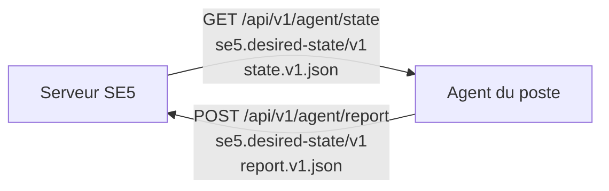

# Contrat agent `se5.desired-state/v1`

> **Statut : figé (v1).** Ce document décrit le contrat HTTP/JSON entre le
> serveur SambaEdu (SE5) et l'agent *desired-state* des postes, successeur des
> GPO. Il définit le **contenu** échangé dans les deux sens ; le **transport**
> (token, rotation, auth) est orthogonal et vit dans
> [token-lifecycle.md](token-lifecycle.md), les endpoints dans
> [state-endpoint.md](state-endpoint.md) et [report-endpoint.md](report-endpoint.md),
> la fabrication des items dans [state-providers.md](state-providers.md).
>
> Un agent déployé **fige le wire format** : la forme de l'enveloppe et
> l'algorithme de hash sont **irréversibles** sans bump de version majeure. Les
> golden files normatifs sont `tests/Fixtures/Agent/state.v1.json` (état cible)
> et `tests/Fixtures/Agent/report.v1.json` (rapport de conformité).

## 1. Vue d'ensemble



| Sens | Endpoint | Schéma | Golden file |
|---|---|---|---|
| Serveur → agent | `GET /api/v1/agent/state` | `se5.desired-state/v1` | `state.v1.json` |
| Agent → serveur | `POST /api/v1/agent/report` | `se5.desired-state/v1` | `report.v1.json` |

La source unique du nom de schéma est `App\Services\Agent\StateContract::SCHEMA`
(constante figée, **jamais** une variable d'environnement).

Conventions communes : clés `snake_case`, structure plate, tableaux d'objets,
timestamps UTC ISO 8601 (`Carbon::now('UTC')->toIso8601String()`).

## 2. Enveloppe de l'état cible

```json
{
  "schema": "se5.desired-state/v1",
  "generated_at": "2026-06-11T08:00:00+00:00",
  "ttl_seconds": 3600,
  "debug": false,
  "machine":      [ /* items portée machine */ ],
  "session":      [ /* items portée session */ ],
  "machine_user": [ /* items portée machine × user */ ]
}
```

| Champ | Type | Sens |
|---|---|---|
| `schema` | string | Version du contrat. L'agent **refuse un major inconnu**. |
| `generated_at` | string (ISO 8601 **avec timezone**) | Instant de compilation. **Champ volatil exclu du hash.** |
| `ttl_seconds` | int | Cadence de poll/rafraîchissement conseillée — calculée PAR CONTEXTE depuis la Story 43.3 (court si le contexte est en « bascule sensible », défaut global sinon ; voir `App\Services\Agent\AgentTtlResolver`). **Champ volatil exclu du hash** (Story 43.3, AC3) : un changement de TTL seul ne fait pas franchir le cache 304 (voir [state-endpoint.md](state-endpoint.md) § cadence). |
| `debug` | bool | Mode debug du poste (`workstations.debug`). En debug, le compagnon de session garde sa console ouverte (toutes sessions) et y recopie ses logs. **Champ opérationnel inclus dans le hash** : un toggle change l'ETag et franchit le cache 304. L'agent ignore ce champ s'il ne le connaît pas (forward-compat). |
| `machine` / `session` / `machine_user` | list\<item\> | Les trois **portées** d'application. |

### Portées (`App\Enums\StateScope`)

- `machine` — s'applique au poste, indépendamment de la session ouverte.
- `session` — s'applique à la session de l'utilisateur courant.
- `machine_user` — s'applique au couple poste × utilisateur (persistant par
  poste pour un utilisateur donné).

Les valeurs sont **aussi** les clés de l'enveloppe.

## 3. Item

Chaque item porte **exactement** ces quatre clés (ni plus, ni moins) :

```json
{
  "type": "wallpaper",
  "semantics": "exclusive",
  "payload": { "asset": "fonds/ecole-2026.jpg", "style": "fill" },
  "hash": "66fbf6ff…03ed4d9"
}
```

| Clé | Type | Sens |
|---|---|---|
| `type` | string snake_case | Identifiant de type de ressource **figé** (cf. §7). |
| `semantics` | `aggregate` \| `exclusive` | Règle de combinaison (cf. §3.1). |
| `payload` | object | Données spécifiques au type (cf. §3.2). |
| `hash` | string (sha256 hex) | Hash opaque du contenu définissant de l'item (cf. §4). |

### 3.1 Sémantique `aggregate` vs `exclusive` (`App\Enums\ResourceSemantics`)

- `exclusive` — **un seul** item fait foi pour la ressource (ex. `wallpaper` :
  il n'y a qu'un fond d'écran). L'agent applique l'unique / le dernier, jamais
  une union.
- `aggregate` — plusieurs items du même type **s'additionnent** (ex. `overlay`,
  plusieurs `shortcuts`). L'agent applique l'**union**.

### 3.2 `payload` : frontière de responsabilité

Ce qui est figé par le contrat = le *wrapper* (`type/semantics/payload/hash`) et
l'enveloppe. La **sous-structure interne de `payload`** par type est définie avec
le provider correspondant (cf. [state-providers.md](state-providers.md)). Les
payloads présents dans `state.v1.json` sont **illustratifs** et n'engagent pas le
détail final de chaque provider.

## 4. Hash — `App\Services\Agent\StateHasher`

Algorithme **unique et déterministe**. C'est la **source unique** du hash dans le
canal agent : il sert l'ETag de `GET /state` **et** la comparaison des rapports.
**Jamais** de `md5` / `hash('sha256', …)` ad hoc ailleurs.

**Canonicalisation :**

1. Tri **récursif** des clés des **tableaux associatifs** — **lexicographique
   octet-par-octet** (`ksort(…, SORT_STRING)`, pas de collation locale ni de
   comparaison numérique : `"10"` < `"9"`).
2. Les **listes** ne sont **pas** triées : l'ordre des items est significatif et
   fixé par le serveur.
3. Encodage `json_encode(…, JSON_UNESCAPED_SLASHES | JSON_UNESCAPED_UNICODE |
   JSON_THROW_ON_ERROR)` — UTF-8, sans échappement superflu, **sans espaces**
   (pas de `JSON_PRETTY_PRINT`).
4. `hash('sha256', $canonical)` → hex.

> ⚠️ `json_encode` de PHP **ne trie pas** les clés : le tri récursif est
> implémenté à la main (`ksort` sur les sous-tableaux associatifs uniquement).

**Deux portes d'entrée :**

- `hashState(array $state)` — exclut les champs volatils `generated_at` **et**
  `ttl_seconds` (Story 43.3, AC3) **avant** canonicalisation. Deux compilations
  du même état à des instants différents, ou avec un `ttl_seconds` différent
  (bascule sensible ou non), → **hash identique**. (Tout futur champ volatil
  s'exclut au même endroit — single point of truth,
  `StateHasher::VOLATILE_STATE_KEYS` / miroir Go `hasher.go::volatileStateKeys`.)
- `hashItem(array $item)` — exclut la clé `hash` de l'item (sinon dépendance
  circulaire). Le hash dérive du seul contenu *définissant*.

Le hash est **opaque** : l'agent **compare des chaînes**, il ne le recalcule
jamais. La canonicalisation n'existe donc que **côté serveur** — mais elle doit
rester déterministe à vie (un upgrade PHP ne doit pas changer les hashes), d'où
les contraintes ci-dessous.

### 4.1 Contraintes sur les valeurs des payloads (stabilité du hash)

- **Pas de flottants.** Types autorisés dans un payload : chaînes, entiers,
  booléens, `null`, objets, listes. La sérialisation JSON des floats dépend de
  la version/configuration PHP (`serialize_precision` ; `1.0` s'encode `1`) —
  un float rendrait le hash instable d'un upgrade serveur à l'autre. Une
  quantité décimale se porte en chaîne (`"opacity": "0.8"`) ou en entier
  (`"opacity_pct": 80`).
- **Objet vide `{}` ≢ liste vide `[]` : distinction non fiable.** Après
  décodage PHP, les deux sont canonicalisés en `[]`. Aucun payload ne doit
  faire porter du sens à cette différence (un « aucune valeur » explicite se
  porte par un champ dédié, ex. `asset: null`, cf. §8).
- **Unicode : le serveur émet en NFC**, et le hash compare octet à octet (pas
  de normalisation). Côté agent, la comparaison *réel vs cible* faite par les
  handlers doit **normaliser en NFC** avant comparaison — Windows peut produire
  du NFD (`é` = `e` + accent combinant) pour des chemins/noms visuellement
  identiques, ce qui créerait de faux écarts.

## 5. Convergence

La cible fait loi, **sans exception** : tout écart entre l'état réel du poste et
la cible est réappliqué, inconditionnellement.

```
réel ≠ cible  →  l'agent RÉAPPLIQUE la cible  →  rapporte `drift`
réel = cible  →  rien à faire                 →  rapporte `compliant`
```

Le verdict ne dépend que de l'égalité réel/cible (`ResolveItemStatus(isCompliant)`).

**Persistance du dernier-appliqué.** L'agent persiste, par type, le dernier état
qu'il a appliqué (horodatage). Cette mémoire ne sert qu'à la **trace** : elle n'a
**aucune incidence sur le verdict**.

**Premier passage** : aucune mémoire ⇒ même comportement que tout autre passage —
`réel = cible → compliant` (+ persiste), `réel ≠ cible → APPLIQUE → drift`
(+ persiste).

## 6. Rapport de conformité (`POST /report`)

```json
{
  "schema": "se5.desired-state/v1",
  "generated_at": "2026-06-11T08:05:00+00:00",
  "agent_version": "1.0.0",
  "workstation": { "hostname": "salle101-pc03", "uuid": "f1d2c3b4-…" },
  "items": [
    { "type": "wallpaper", "status": "compliant",       "hash": "f65db3c8…" },
    { "type": "overlay",   "status": "drift",            "hash": "fe63c684…" },
    { "type": "printers",  "status": "error",            "hash": "9f2c4e7a…",
      "detail": "service Spooler indisponible (RPC 0x6ba)" }
  ]
}
```

| Champ | Sens |
|---|---|
| `schema` | Même version que l'état (`se5.desired-state/v1`). |
| `generated_at` | Instant du rapport (UTC ISO 8601). |
| `agent_version` | Version de l'agent émetteur. |
| `workstation` | Identité du poste (`hostname`, `uuid`). |
| `items[].type` | Identifiant de type figé. |
| `items[].status` | `compliant` \| `drift` \| `error` (`App\Enums\AgentResourceStatus`). |
| `items[].hash` | Hash **opaque** de la cible que l'agent a traitée (renvoyé tel quel, jamais recalculé). |
| `items[].detail` | **Obligatoire et non vide** quand `status = error` ; optionnel sinon. |

Statuts (`App\Enums\AgentResourceStatus`) :

- `compliant` — réel = cible, rien à faire.
- `drift` — dérive détectée **et réappliquée** (la cible fait toujours loi).
- `error` — l'application a échoué ; `detail` documente la cause.

**Champ additif `inventory`.** L'item `applications` du **rapport** peut porter un
champ optionnel `inventory` : un **résultat par application**
`[{app_id, status, detail?}]` (statut ∈ `compliant|drift|error`). C'est une
**donnée additive** sous la ligne d'état par type — **jamais** un verdict per-app :
le `status`/`hash` de l'item RESTENT le verdict **PAR TYPE** (pire statut des
apps). Le serveur stocke l'inventaire dans `agent_application_inventory` (clé
`(workstation_id, app_id)`, level-triggered) — **fondation des licences à pool**,
sans UI. Un serveur antérieur ignore ce champ (reste `v1`).

```json
{
  "type": "applications",
  "status": "drift",
  "hash": "1a2b3c4d…",
  "inventory": [
    { "app_id": "firefox", "status": "compliant" },
    { "app_id": "vlc", "status": "error", "detail": "installeur en échec (code 1603)" }
  ]
}
```

## 7. Identifiants de type de ressource (figés)

Clé de voûte du contrat, **partagés** serveur / agent / JSON / DB / UI. Ils sont
`snake_case` et **figés une fois publiés** : un identifiant publié ne se
**renomme JAMAIS**. En cas d'erreur de nommage → **déprécier + ajouter** un
nouvel identifiant, jamais renommer en place.

Identifiants prévus :

`wallpaper`, `lockscreen`, `overlay`, `shortcuts`, `printers`, `drives`,
`associations`, `registry`, `app_config`, `applications`, `registry_list`
(Story 35.2, cf. §7.6), `fs_acl` (Story 36.1, cf. §7.7), `firewall`
(Story 36.2, cf. §7.8), `privilege` (Story 35.6, cf. §7.9), `legacy_cleanup`
(Story 38.3, cf. §7.10), `app_profile` (Story 36.5, cf. §7.11), `folders`
(Story 58.1, cf. §7.12).

### 7.1 Payload `registry`

Type `registry` — sémantique **`exclusive` PAR IDENTITÉ DE CLÉ** (une clé de
registre = une valeur ; la maille la plus spécifique gagne POUR CETTE clé, les
clés distinctes s'accumulent). Le payload porte un item de registre **CONCRET** :

```json
{
  "type": "registry",
  "semantics": "exclusive",
  "payload": {
    "hive": "HKCU",
    "path": "Software\\Microsoft\\Windows\\CurrentVersion\\Explorer\\Advanced",
    "name": "HideFileExt",
    "type": "REG_DWORD",
    "value": 0
  },
  "hash": "92730f99…af686b5"
}
```

| Clé | Type JSON | Sens |
|---|---|---|
| `hive` | string | `HKLM` (portée machine, service SYSTEM) \| `HKCU` (portée session, compagnon) \| `HKU` (Story 35.3 — portée **machine**, service SYSTEM). **Sémantique `HKU`** : l'item désigne UNE cible logique que le service applique à **toutes les ruches utilisateur du poste + `.DEFAULT`** (le « profil » lu par l'écran de logon) — fan-out **interne au handler** : `HKU\.DEFAULT\<path>` + `HKU\<SID>\<path>` pour chaque ruche chargée (`S-1-5-21-*`, hors jumelles `_Classes` ; les SID de service `S-1-5-18/19/20` ne matchent pas le préfixe), énumérées à **chaque cycle** (une session ouverte après coup est couverte au cycle suivant). Le `path` du payload ne porte **JAMAIS** le préfixe `.DEFAULT\` (c'est le handler qui préfixe). Drift **AGRÉGÉ** : une seule ruche divergente ⇒ l'item (donc le type) rapporte `drift` ; `ensure: "absent"` supprime la valeur dans TOUTES les ruches. **Pas de ciblage par utilisateur** sur cette ruche — structurel : le service fetch son state en contexte machine (sans `?user`), les overrides UserGroup/User n'atteignent jamais ces items ; le ciblage fin reste au Session/HKCU. **Discipline d'authoring** : une capacité portant une clé HKU ne se cible pas par utilisateur/groupe d'utilisateurs, et ses maps HKU/HKCU jumelles (même `{path\|name}`, ex. numlock) doivent être **valeur-consistantes** — sinon compagnon et SYSTEM se réécriraient mutuellement à chaque cycle. |
| `path` | string | Chemin de clé sous la ruche (backslashes échappés en JSON). |
| `name` | string | Nom de la valeur de registre. **`""` (chaîne vide) est un nom LÉGITIME** : la valeur **par défaut** de la clé (`(Default)` dans regedit) — Story 35.2 (besoin 35.5, ex. `HKCU\Software\Classes\Applications\photoviewer.dll\shell\open\command`). La clé `name` doit toujours être **présente** dans le payload (absence = enveloppe invalide) ; c'est le comportement documenté des API registre (`RegQueryValueEx`/`RegSetValueEx`/`RegDeleteValue` avec un nom vide ciblent la valeur par défaut, relayé tel quel par `golang.org/x/sys/windows/registry`). |
| `type` | string | `REG_SZ` \| `REG_DWORD` \| `REG_EXPAND_SZ` \| `REG_MULTI_SZ` \| `REG_QWORD`. |
| `value` | int \| string \| list&lt;string&gt; | Valeur cible TYPÉE : `REG_DWORD`/`REG_QWORD` → **entier** (zéro float, §4.1) ; `REG_SZ`/`REG_EXPAND_SZ` → **string** ; `REG_MULTI_SZ` → **liste de strings** (jamais `{}` — §4.1). Absent sur un item `ensure: "absent"`. |
| `ensure` | string (**optionnel**) | `present` \| `absent`. **Absence du champ = `present`** (rétro-compatible §9). `absent` = l'agent **supprime la valeur nommée** si elle existe (jamais la clé-conteneur). Le serveur n'émet **JAMAIS** `ensure: "present"` explicitement — un item d'écriture reste EXACTEMENT 5 clés (byte-identité des payloads existants). |
| `refresh` | string (**optionnel**, Story 43.2) | `shell_notify` \| `policy_broadcast` \| `explorer_restart` (vocabulaire FERMÉ, casse canonique minuscule). Geste de rafraîchissement que le **compagnon de session** exécute en fin de passe (le PLUS FORT des items changés, 43.1) pour rendre le réglage effectif SANS attendre le prochain logon Windows. Posé par le serveur au **niveau RACINE du `spec`** de la projection (une valeur par projection, jamais par clé) et recopié TEL QUEL sur chaque item émis — **UNIQUEMENT** pour un item de portée **session/machine_user** (JAMAIS machine/HKU : le compagnon de session n'existe pas côté service SYSTEM). **Absence du champ** = comportement legacy inchangé (« effet au prochain logon Windows »). Un agent **≤ 2.9.0** ignore ce champ inconnu **SANS ERREUR** (§9, champ ajouté) — il écrit la valeur mais n'exécute AUCUN geste : publier la release 2.10.0 (43.1) est un prérequis pour que le hint soit honoré. **Mutuellement exclusif avec `writer`** (Story 35.7) : `refresh` n'est émis QUE sur un item appliqué par le compagnon — jamais combiné au marqueur `writer` ci-dessous. |
| `writer` | string (**optionnel**, Story 35.7) | Enum FERMÉ, seule valeur publiée : `"system"`. L'item est **appliqué par le service SYSTEM dans `HKU\<SID>` de la session du contexte** (`GET /state?user=`) — **jamais par le compagnon**, qui l'ÉCARTE avant son moteur. Nécessaire aux trees `HKCU\…\Policies\*` (dont `CurrentVersion\Policies`, pas seulement `Software\Policies`) : **lecture seule pour l'utilisateur standard sur poste joint au domaine** (durcissement ACL anti-contournement de GPO — leçon `blocked_executables`, « Accès refusé » du compagnon). Portées **session/machine_user** UNIQUEMENT, ruche `HKCU` UNIQUEMENT (l'item reste honnête : la cible logique EST la ruche de l'utilisateur ciblé — la traduction `HKCU` → `HKU\<SID>` est un décorateur d'ops côté agent, UN seul SID, **jamais** le fan-out multi-ruches de `HKU` §7.1). JAMAIS émis sur un item machine/HKU (le service y est déjà l'exécutant), JAMAIS combiné à `refresh` (exclusion mutuelle — effet au **logon suivant**, comportement d'une GPO user policy). Posé par le serveur **PAR CLÉ de `spec`** (propriété de la clé/de l'ACL de son tree, contrairement à `refresh` posé par projection). Absence du champ = exécutant par défaut de la portée (compagnon). **Valeur inconnue (future)** : skippée par les DEUX acteurs sans erreur (forward-compat — le compagnon skippe sur PRÉSENCE du champ, le service sélectionne sur ÉGALITÉ stricte `"system"`). Un binaire **≤ 2.11.x** ignore le marqueur **EN SILENCE** : le compagnon garde l'« Accès refusé » actuel, le service n'applique rien — publier la release 2.12.0 AVANT d'armer le marqueur (§9). |

Item d'**écriture marqué** (Story 35.7) — EXACTEMENT 6 clés :

```json
{
  "type": "registry",
  "semantics": "exclusive",
  "payload": {
    "hive": "HKCU",
    "path": "Software\\Microsoft\\Windows\\CurrentVersion\\Policies\\Explorer",
    "name": "DisallowRun",
    "type": "REG_DWORD",
    "value": 1,
    "writer": "system"
  },
  "hash": "a19a1be2…f9cfd93e"
}
```

Item de **suppression** (`ensure: "absent"`) — EXACTEMENT 4 clés (+ `refresh`
OU `writer` optionnels — mutuellement exclusifs, portée session/machine_user
uniquement, jamais émis sur un item machine/HKU), ni `type` ni `value` :

```json
{
  "type": "registry",
  "semantics": "exclusive",
  "payload": {
    "hive": "HKLM",
    "path": "SOFTWARE\\Policies\\Microsoft\\Windows NT\\DNSClient",
    "name": "EnableMulticast",
    "ensure": "absent"
  },
  "hash": "8e81903a…b050314d"
}
```

> **Trois régimes coexistent** (Story 35.1) :
>
> 1. **Écrire** — item 5 clés `{hive, path, name, type, value}` (sans `ensure`,
>    qui vaut implicitement `present`) : l'agent (ré)impose la valeur cible.
> 2. **Supprimer** — item 4 clés `{hive, path, name, ensure: "absent"}` : l'agent
>    supprime la **valeur nommée** (`compliant` si déjà absente, `drift` +
>    suppression si elle existe/réapparaît — policy STRICT). Windows reprend son
>    défaut. Jamais la clé-conteneur (des valeurs voisines non gérées y vivent —
>    la réconciliation de clé entière est le type `registry_list`).
> 3. **Ne pas gérer** — la clé n'apparaît PAS dans la cible : l'agent n'y touche
>    plus (§8, la valeur en place reste celle qu'elle avait).
>
> **Invariant amendé (Stories 43.2 + 35.7) :** les items 1 et 2 ci-dessus
> restent EXACTEMENT 5/4 clés — **+ `refresh` OU `writer` optionnels**
> (mutuellement exclusifs), émis UNIQUEMENT sur un item de portée
> session/machine_user (JAMAIS machine/HKU). L'invariant qui NE BOUGE
> JAMAIS : ni `id`/`key` de capacité au payload.
>
> Un item `absent` et un item d'écriture sur la MÊME identité `{hive|path|name}`
> s'arbitrent par la précédence de compilation EXISTANTE (exclusive par clé) —
> ex. un défaut Broadcast « supprimer » battu par un override de parc « écrire ».
>
> **Agents antérieurs à 2.3.0** : un item `absent` (sans `value`) échoue leur
> parse → `{status: error}` isolé sur le type `registry` (comportement D1
> assumé, motivant le bump de version et la publication de release).

> **🔴 Invariant central.** Le payload `registry` ne porte **JAMAIS** un
> `setting_id` / `setting_key` de catalogue serveur. Le catalogue
> (`registry_settings`) est un détail SERVEUR qui se **compile** en cet item
> concret dans le provider. C'est ce qui garde l'option « éditeur de clés brutes »
> gratuite : une 2ᵉ source d'autoring produira les **mêmes** items concrets →
> zéro changement d'agent/contrat/provider.

> **`value` = override de parc, sinon défaut catalogue.** La STRUCTURE du payload
> est identique dans les deux cas (5 clés). Côté serveur, le `value` émis est
> l'**override de parc**
> (`registry_setting_assignables.value`) si présent, sinon la **valeur par défaut
> du catalogue** (`registry_settings.value`) — cette dernière étant **diffusée à
> TOUTES les machines** (maille Broadcast). L'agent et le golden ne changent pas :
> une valeur concrète reste une valeur concrète. « Retirer un override » =
> supprimer la ligne de pivot → le poste **re-converge vers le défaut** au cycle
> suivant (PAS « cesser de gérer »).

> **Portée → acteur.** UN seul handler Go `registry`, instancié deux fois : le
> **service SYSTEM** applique les items HKLM **et HKU** (portée `machine` —
> seul SYSTEM peut écrire les ruches des autres utilisateurs et `.DEFAULT`),
> le **compagnon** applique les items HKCU (portée `session`). Comme les deux
> portées émettent le type `registry`, l'agent **fusionne par type** avant le
> rapport (pire statut gagne) pour respecter l'unicité des types §6.
>
> **Exception `writer: "system"` (Story 35.7)** : un item HKCU de portée
> session/machine_user **marqué** est appliqué par le **service SYSTEM** dans
> `HKU\<SID de la session dont provient le contrat>` — passe PAR-SESSION sur
> le cache `cache\sessions\<SID>\state.json`, ciblée UN SID (jamais
> `.DEFAULT`, jamais les autres ruches — distinction structurante avec le
> fan-out HKU). Le compagnon ÉCARTE ces items avant son moteur (plus jamais
> d'« Accès refusé »). Le routage se décide sur le CHAMP `writer` du payload,
> JAMAIS sur la forme du `path` (le serveur DÉCLARE, l'agent ROUTE). Les
> verdicts par-session rejoignent le rapport du cycle service via la même
> fusion par type ; la tâche at-logon converge sans rapporter. Effet au
> **logon suivant** de la session ciblée (Explorer lit ces policies au logon
> — aucun geste de rafraîchissement mid-session, exclusion `refresh`).
>
> **Agents antérieurs à 2.5.0 face à un item `HKU`** : le parse réussit (les
> valeurs de `hive` ne sont pas validées au parse) puis `rootKey()` refuse la
> ruche à la première lecture → `Test` retourne une **erreur** → `{status:
> error}` pour le type `registry` machine **ENTIER**, sans Apply : toutes les
> clés HKLM du poste **cessent de converger** tant que l'item HKU est au state.
> La release 2.5.0 DOIT être **publiée AVANT** d'armer une clé HKU (update.sh
> ne publie jamais seul).

### 7.2 Payload `associations`

Type `associations` — sémantique **`exclusive` PAR IDENTIFIANT** (une
extension/un protocole = UN programme par défaut ; la maille la plus spécifique
gagne POUR CET identifiant, les identifiants distincts s'accumulent). Portée
**`session`** (UserChoice HKCU, appliqué par le compagnon au logon). Le payload
porte une association **CONCRÈTE** :

```json
{
  "type": "associations",
  "semantics": "exclusive",
  "payload": {
    "identifier": ".html",
    "progid": "FirefoxHTML",
    "type": "file"
  },
  "hash": "5d4bb788…358468b"
}
```

| Clé | Type JSON | Sens |
|---|---|---|
| `identifier` | string | Extension (`.pdf`, `.html`) ou protocole (`http`, `https`). |
| `progid` | string | ProgId Windows cible inscrit sous UserChoice (ex. `Acrobat.Document.DC`, `FirefoxURL`). Peut être un ProgId **générique** `Applications\<exe>` (cf. note ci-dessous). |
| `type` | string | `file` (→ `FileExts\<ext>\UserChoice`) \| `protocol` (→ `UrlAssociations\<proto>\UserChoice`). |

> **`progid` peut être `Applications\<exe>`.** Quand l'admin compose une
> association *(extension, app)* sans ProgId riche déclaré pour cette extension,
> le serveur fabrique le ProgId **générique** `Applications\<exe>` (« Ouvrir
> avec », ce que Windows crée nativement) — ex. `Applications\vlc.exe`. Le
> **payload ne change PAS** (`{identifier, progid, type}`) et le **hash** est
> calculé sur la chaîne ProgId VERBATIM (le `\` n'est pas un cas particulier —
> confirmé empiriquement 2026-06-18). Le **chemin complet** de l'exe n'est JAMAIS
> dans le payload : le compagnon le résout sur le poste (App Paths/PATH) et
> auto-enregistre per-user
> `HKCU\Software\Classes\Applications\<exe>\shell\open\command` AVANT d'imposer
> UserChoice. Golden/contrat INCHANGÉS.

> **🔴 Le hash UserChoice n'est JAMAIS au payload.** Windows protège
> l'association par défaut par un hash anti-tamper dérivé de
> `extension + SID + ProgId + timestamp + experienceGUID`. Ses entrées ne sont
> connues que **sur le poste** (SID de session, FileTime courant, GUID
> `{D18B6DD5-…}` de `shell32.dll`) → le hash est calculé **100 % côté agent**.
> Le contrat ne porte que la cible logique `{identifier, progid, type}`.

> **🔴 Invariant central.** Le payload ne porte **JAMAIS** un `key`/`id` de
> catalogue (`file_associations`). Le catalogue se **compile** en cet item
> concret dans le provider — option « clés brutes » gratuite.

> **`source`/`wpkg_package` sont SERVEUR-only.** Le catalogue tague chaque
> association `native` (built-in Windows, toujours applicable) ou `wpkg` (ProgId
> fourni par un paquet WPKG, `wpkg_package` = le `<package id>` =
> `Application::app_id`). Ces colonnes alimentent la **validation prédictive de
> l'UI** (« paquet non déployé sur ce parc → cette association échouera ici »,
> AVANT déploiement) mais **NE fuient JAMAIS au payload** : il reste
> `{identifier, progid, type}` INCHANGÉ. **L'agent ne connaît pas la notion
> native/wpkg** — il reste le dernier rempart via `ProgIDRegistered` (poste
> divergent). Le croisement WPKG vit dans l'UI/assignation (Livewire), jamais dans
> `AssociationsStateProvider` (PG-pur), qui **émet toujours**.

> **ProgId absent → choix préservé.** Si le ProgId cible n'est pas enregistré sur
> le poste, l'agent **ne supprime pas et ne réécrit pas** la clé UserChoice
> existante (pas de clobber), et `Apply` ne rejoue PAS ce défaut inapplicable.
> `detail` = « ProgId X non enregistré, choix utilisateur conservé ».
>
> **⚠️ Granularité du statut = PAR TYPE, pas par item (grain §5 figé).** Le
> dispatch agent est par **type** : si AU MOINS un item `associations` échoue
> (ProgId absent, clé verrouillée), le type ENTIER est reporté `error` et **n'est
> pas persisté** (pas de cache 304 → re-convergence au cycle suivant). Les autres
> associations du même type sont quand même APPLIQUÉES en interne (`Apply`
> best-effort), mais le rapport masque le type en `error` tant qu'un item résiste.
> « error non fatal » signifie donc « n'avorte pas la passe / ne tue pas les autres
> TYPES » — **pas** « n'affecte pas les autres associations du même type ». Avec la
> non-intersection WPKG, un défaut ciblant une app non installée maintient
> `associations` en `error` à chaque cycle : c'est **attendu**, pas un bug.

> **« Désactiver = cesser de gérer ».** Une association retirée d'un parc
> DISPARAÎT → l'agent ne touche plus la clé (le choix courant reste, §8).

### 7.3 Payload `app_config`

Type `app_config` — sémantique **`aggregate` PAR `app_kind`** (un item par
application configurable : Firefox ET Thunderbird coexistent ; pour UNE app, un
seul jeu de policies effectif déjà fusionné côté serveur). Portée **`machine`**
(`policies.json` est **machine-wide**, posé sous `%ProgramFiles%\…\distribution\`
en contexte admin-write → écrit par le **service SYSTEM** ; résolution **PAR
PARC**, niveaux 1-4 : template → auto → défaut étab → WG, avec `$user = null`).
Le par-user de Firefox = le **profil** (Mécanisme B / roaming), PAS
`policies.json`. Le payload porte les policies **RÉSOLUES CONCRÈTES** (le contenu
exact que l'agent écrit dans `policies.json`) :

```json
{
  "type": "app_config",
  "semantics": "aggregate",
  "payload": {
    "app_kind": "firefox",
    "policies": {
      "policies": {
        "DisableTelemetry": true,
        "Homepage": { "URL": "https://etab.local/" }
      }
    }
  },
  "hash": "cb347596…636ef8c2"
}
```

| Clé | Type JSON | Sens |
|---|---|---|
| `app_kind` | string | `firefox` \| `thunderbird` (les apps configurables par `policies.json` — `AppKind::cases()`). Pas de Chrome/Edge. |
| `policies` | object | Les policies **résolues** (6 niveaux fusionnés serveur) à écrire telles quelles dans `policies.json`. Forme native de l'app (Firefox/Thunderbird = `{ "policies": { … } }`). Strings/ints/bools/null/objets/listes — **jamais de float** (§4.1 ; un float de policy est normalisé en string par le provider). |

**Mécanisme : UN SEUL — `policies.json` enterprise natif.** L'agent écrit un
`policies.json` au chemin natif d'install de l'app (Firefox
`…\Mozilla Firefox\distribution\policies.json`, Thunderbird au chemin
équivalent), en **écriture atomique**. PAS de mécanisme « registre policies »,
PAS de redirection de profil (sujet **roaming** serveur, renvoyé au domaine
roaming/`WorkstationEnvironment`). Une app posée par `policies.json` future = data
serveur (un `AppKind` + un adapter), **zéro release agent**.

> **🔴 Invariant central.** Le payload `app_config` ne porte **JAMAIS** un
> `customization_id` ni un scope de catalogue (`app_customizations`). La
> hiérarchie 6 niveaux est un détail SERVEUR qui se **compile** en ces policies
> concrètes dans le provider — option « 2ᵉ source d'authoring » gratuite.

> **Marqueur de périmètre + conflit hors-périmètre (`error`).** Seul un
> `policies.json` posé par l'agent (clé d'extension `_sambaedu_managed: true`,
> inerte côté app) est géré. Un `policies.json` posé hors SambaEdu (autre outil,
> admin) au chemin natif n'est **JAMAIS écrasé ni supprimé** (non-ingérence). Mais
> comme la policy agent n'est alors PAS active, l'item de cette app est rapporté
> **`error`** (détail : « policies.json hors-périmètre présent, policy agent non
> appliquée ») et non `compliant` (qui serait trompeur). Les autres apps/types
> convergent (isolation).

> **« Désactiver = cesser de gérer ».** Une app retirée des règles voit son
> `policies.json` GÉRÉ **retiré** au passage suivant (level-triggered) ; jamais un
> fichier hors périmètre.

> **App butée = limite connue.** Une app qui écrirait un réglage **sans aucun
> mécanisme enterprise natif** (pas de `policies.json` exploitable) n'est **PAS
> bricolée** par l'agent (pas de patch de config user, pas de hook) : le réglage
> est documenté comme non géré. Invariant : un handler n'écrit que via un
> mécanisme enterprise documenté de l'app.

> **Couplage installation (limite connue).** Pour que la policy ait un effet,
> l'app doit être installée (Firefox/Thunderbird présents — cf. type
> `applications` §7.4). Le service SYSTEM écrit sous Program Files ; si le dossier
> d'install est absent (app non installée), l'écriture échoue → `{status: error}`
> pour le seul type `app_config`, les autres types convergent.

### 7.4 Payload `applications`

Type `applications` — sémantique **`aggregate`** (un item par application
affectée au poste ; l'union poste + groupes + dépendances transitives), portée
**`machine`** (WPKG installe **machine-wide** → le **service SYSTEM** déclenche ;
portée de livraison = machine, jamais session). Le payload porte un identifiant
de paquet WPKG **CONCRET** :

```json
{
  "type": "applications",
  "semantics": "aggregate",
  "payload": {
    "app_id": "firefox",
    "name": "Mozilla Firefox"
  },
  "hash": "145bf532…0237a2d"
}
```

| Clé | Type JSON | Sens |
|---|---|---|
| `app_id` | string | Identifiant de paquet WPKG ( = `package-id` de `profiles.xml` = `Application::app_id`). Clé de déclenchement ET d'inventaire. |
| `name` | string | Libellé d'affichage de l'application (`Application::name`). Informe l'inventaire/les logs. Strings only (§4.1). |

**« Un tuyau, deux outils ».** L'agent unifie le **transport** (le déclencheur),
PAS le moteur de paquets. WPKG reste le **moteur déclaratif** (résolution de
dépendances, `<check>/<install>/<upgrade>`, versions) — il **n'est PAS absorbé**.
Le handler `applications` **déclenche** le moteur WPKG local
(`wpkg-client.vbs /NOTempo`) à la place de la GPO `se4_wpkg`, **donne l'URL** du
bundle (Apache statique) au bootstrap + **dépose** localement le profil par-hôte
(`profiles.xml`/`hosts.xml`), puis **lit `wpkg.xml`** pour l'état par paquet. Il
ne réimplémente **JAMAIS** l'installation, la détection de présence ou la
résolution de dépendances.

> **🔴 Invariant central.** Le payload `applications` ne porte **JAMAIS** un id de
> catalogue/pivot/scope ni une recette d'installation (pas de version, pas de
> `<check>`, pas de `<install>` — propriété de `packages.xml`). Juste l'`app_id`
> concret + son libellé. L'ensemble cible est projeté en lecture seule de la
> résolution WPKG existante (`WorkstationPackagesResolver::computePackages`,
> méthode **NON CACHÉE**) : single source of truth, jamais une réimplémentation de
> l'union/BFS de dépendances.

> **« Désactiver = RETIRER ».** Une app retirée des affectations disparaît de
> l'ensemble cible, et **elle est désinstallée du poste**. Le `Test` du handler a
> **deux** conditions, pas une :
>
> 1. **`désiré ⊆ installé`** — lu dans `wpkg.xml` (l'ensemble cible est-il déjà
>    entièrement installé ?) ;
> 2. **`ensemble désiré == profil DÉPOSÉ`** — l'ensemble cible courant est comparé
>    au `profiles.xml` réellement posé sur le poste
>    (`%ProgramData%\SambaEdu\wpkg\profiles.xml`).
>
> C'est la **seconde** qui produit le retrait : `/synchronize` ne désinstalle un
> paquet que lorsqu'il **quitte le profil déposé**. Quand un `app_id` sort de
> l'ensemble cible, `désiré ⊊ déposé` → `Test` échoue → `Apply` redépose un
> `profiles.xml` **amaigri** puis relance `wpkg-client.vbs /synchronize`, et WPKG
> désinstalle **nativement**, par le `<remove>` de la recette. Le handler, lui, ne
> touche jamais au poste hors du déclenchement WPKG : SE5 ne « désinstalle » rien,
> il retire un `app_id` d'un ensemble.
>
> ⚠️ **Borne de version : agent `2.2.17`.** La condition 2 est arrivée à cette
> version. Un poste qui exécute un binaire **antérieur** installe correctement et
> **ne retire jamais** — sans aucun signal : ni statut, ni erreur, ni ligne de
> rapport. Ce que chaque poste exécute réellement se lit dans
> `workstations.agent_reported_version`. Toute fonctionnalité serveur qui fait
> ENTRER puis SORTIR un `app_id` de l'ensemble cible doit connaître cette borne.
>
> *(Cette note remplace une rédaction antérieure — « il ne la désinstalle pas de
> lui-même » — devenue fausse le 2026-06-19. Le code de l'agent fait autorité :
> `agent/shared/handler_applications.go`.)*

> **Convergence level-triggered.** `Test` = « l'ensemble cible est-il déjà
> entièrement installé ? » (désiré ⊆ installé, lu dans `wpkg.xml`) → `compliant`
> sans re-déclenchement. Ensemble modifié / installation incomplète → `Apply`
> (déclenche WPKG, idempotent). Échec d'install après run = `error` + `detail`
> (jamais un faux `compliant`). Le déclencheur n'est pas l'événement GPO ponctuel
> au boot (qui pouvait laisser un poste joint sans rien installer) mais le **cycle
> agent répété** (boot/login/timer/forcer).

> **Livraison native.** SE5 **génère** le bundle pré-substitué
> (`php artisan wpkg:bundle` : scripts versionnés `resources/wpkg/*` + catalogue
> `packages.xml`, `SE4FS_NAME` résolu) dans un sous-dossier servi en **statique
> par Apache** (`config('agent.wpkg_bundle_path')`, pas via Laravel). Le profil
> par-hôte est **déposé par l'agent**. Les installeurs restent sur SMB. La GPO
> `se4_wpkg` n'est **plus publiée** par SE5 : l'agent est le seul déclencheur.

### 7.5 Payload `lockscreen`

Type `lockscreen` — fond de l'écran de **verrouillage**, sémantique
**`exclusive`** (un seul fond), portée **`machine`**. Pendant **pré-login** du
type `wallpaper` (fond de **bureau**, portée `session`/compagnon/HKCU) : l'écran
de verrouillage s'affiche AVANT toute session (LogonUI tourne en SYSTEM), il se
pose **machine-wide** — c'est donc le **service SYSTEM** qui l'applique. Le
payload est **identique** à `wallpaper` :

```json
{
  "type": "lockscreen",
  "semantics": "exclusive",
  "payload": { "asset": "a1b2…f9.jpg", "checksum": "a1b2…f9" }
}
```

| Clé | Type JSON | Sens |
|---|---|---|
| `asset` | string \| null | Filename content-addressed de la bibliothèque (`<sha256>.<ext>`), ou `null` = « pas de fond de verrouillage imposé » (§8). |
| `checksum` | string \| null | SHA-256 du fichier, vérifié à l'arrivée du download (côté SYSTEM). `null` ssi `asset` `null`. |

L'asset est **servi par la même route** que `wallpaper`
(`agent.v1.assets.wallpaper` / Alias statique `/assets/wallpaper/`, agnostique
au type — un lockscreen est un asset de la même biblio) et **pré-téléchargé par
SYSTEM** dans le même cache. Côté Windows, le handler impose l'image via
`HKLM\SOFTWARE\Microsoft\Windows\CurrentVersion\PersonalizationCSP`
(`LockScreenImageStatus=1`, `LockScreenImagePath`/`LockScreenImageUrl` = chemin
local de l'asset). Idempotent ; `asset: null` = no-op compliant.

> **Owners restreints (pré-login).** Côté serveur, le `LockscreenStateProvider`
> ne remonte que le **défaut d'établissement** (Broadcast) et les
> **WorkstationGroup** (salle/parc) — **jamais** d'owner User/UserGroup : il n'y
> a pas d'utilisateur au verrouillage. C'est la restriction « niveaux 1-3 » que
> le résolveur legacy appliquait déjà au lockscreen.

### 7.6 Payload `registry_list`

Type `registry_list` (Story 35.2) — listes registre à **sous-valeurs indexées**
`\1..\N` (policies Windows type `ExtensionInstallForcelist`, `DisallowRun`).
Sémantique **`exclusive` PAR CLÉ-CONTENEUR** : une clé-conteneur = UNE liste ;
la maille la plus spécifique gagne la clé-conteneur **ENTIÈRE** (jamais
d'union/fusion de listes entre mailles), les conteneurs distincts s'accumulent.
Portées : `machine` (HKLM, service SYSTEM) et `session` (HKCU, compagnon) —
mêmes casiers que `registry`.

```json
{
  "type": "registry_list",
  "semantics": "exclusive",
  "payload": {
    "hive": "HKLM",
    "path": "SOFTWARE\\Policies\\Google\\Chrome\\ExtensionInstallForcelist",
    "entry_type": "REG_SZ",
    "values": ["pgpjajcmfbfdmcgjlbiengidaknopaok"]
  },
  "hash": "e0a9c51e…0e9b0759"
}
```

Le payload porte **EXACTEMENT 4 clés** (+ `refresh` OU `writer` OPTIONNELS —
mutuellement exclusifs, Stories 43.2/35.7, portée session/machine_user
uniquement, jamais émis sur un conteneur machine/HKLM) — jamais de `name`,
jamais d'id de capacité, zéro float (§4.1) :

| Clé | Type JSON | Sens |
|---|---|---|
| `hive` | string | `HKLM` (portée machine) \| `HKCU` (portée session). **`HKU` n'est PAS admis en `registry_list`** (hors scope Story 35.3, refusé à l'authoring par le garde-fou) : le fan-out d'une réconciliation de clé-conteneur multiplierait la propriété de clé par N ruches sans consommateur connu — extension future si besoin réel. |
| `path` | string | Chemin de la **clé-conteneur** sous la ruche (la clé dont les sous-valeurs `1..N` sont la liste). |
| `entry_type` | string | Type des entrées : `REG_SZ` \| `REG_EXPAND_SZ` **uniquement** (les listes indexées Windows sont des chaînes — borné par le contrat). |
| `values` | list&lt;string&gt; | Liste **ORDONNÉE** de chaînes. L'ordre est **porteur de sens** : la canonicalisation du hash ne trie pas les listes (§4) — le même contenu dans un autre ordre est un autre hash. **`[]` (liste vide) est une vraie valeur** : « purger toutes les entrées numérotées » (le « off » honnête d'une liste). |
| `refresh` | string (**optionnel**, Story 43.2) | Même vocabulaire/sémantique que §7.1 (`shell_notify` \| `policy_broadcast` \| `explorer_restart`) — geste de rafraîchissement exécuté par le compagnon en fin de passe (43.1). Recopié depuis la RACINE du `spec` de la projection ; jamais sur un conteneur émis par le provider Machine. **Mutuellement exclusif avec `writer`** (Story 35.7). |
| `writer` | string (**optionnel**, Story 35.7) | Même sémantique que §7.1 : enum FERMÉ (`"system"` seule valeur publiée) — le conteneur est **réconcilié par le service SYSTEM dans `HKU\<SID>` de la session du contexte** (décorateur d'ops un-SID, réconciliation D3 incluse : entrées `1..N` + purge des surnuméraires numériques), JAMAIS par le compagnon (qui l'écarte avant son moteur). Nécessaire aux conteneurs `HKCU\…\Policies\*` (ex. `…\Policies\Explorer\DisallowRun`), lecture seule pour l'utilisateur standard sur poste joint au domaine. HKCU + portée session/machine_user UNIQUEMENT ; jamais combiné à `refresh` (effet au logon suivant). Un binaire ≤ 2.11.x ignore le marqueur EN SILENCE → publier la 2.12.0 avant d'armer (§9). |

**Sémantique de réconciliation (D3 — l'agent POSSÈDE la clé-conteneur) :**

- L'agent possède, dans la clé-conteneur, les valeurs dont le **nom est
  composé uniquement de chiffres** (`^[0-9]+$`). Canon = `"1".."N"`
  (`strconv.Itoa`) : `"01"`, `"007"`, `"12"` hors canon sont **SUPPRIMÉS**
  (comparaison de chaînes STRICTE — `"01" ≠ "1"`).
- `Apply` écrit les valeurs nommées `"1".."N"` dans l'ordre de `values`
  (Kind = `entry_type`, création de la clé au besoin), puis supprime toute
  autre valeur **au nom numérique** de la clé.
- Les valeurs à nom **NON numérique** de la même clé ne sont **JAMAIS
  touchées** ; la clé-conteneur elle-même n'est **JAMAIS supprimée** (même à
  liste vide — des valeurs voisines non gérées peuvent y vivre).
- `values: []` ⇒ conforme ssi aucune valeur au nom numérique n'existe (clé
  absente = conforme) ; sinon purge des entrées numérotées.
- Une valeur numérotée existante d'un **type hors contrat** (REG_BINARY, … —
  sentinelle `REG_UNSUPPORTED` de `Read`) est **présente et divergente** :
  réécrite au `entry_type` cible si elle est dans le canon, supprimée sinon.
- Policy **STRICT** (§5) : entrée surnuméraire (ré)apparue ⇒ `drift` +
  suppression au cycle. Verdict **PAR TYPE** (grain 27.8) : un statut pour le
  type `registry_list`, dual-scope fusionné par type au rapport (pire statut).

> **`registry` scalaire vs `registry_list` : jamais la même clé-conteneur.**
> Les deux types ont des `exclusiveKey()` incomparables (`{hive|path|name}` vs
> `{hive|path}`) — le compilateur ne peut PAS arbitrer une collision. La
> validation d'authoring serveur REFUSE une clé-conteneur ciblée à la fois par
> un item `registry` scalaire et un `registry_list` (garde-fou 35.2). Un flag
> voisin dans la clé **PARENTE** (ex. `…\Policies\Explorer!DisallowRun` = flag,
> `…\Policies\Explorer\DisallowRun` = conteneur) n'est PAS une collision
> (paths distincts parent/enfant).

> **Agents antérieurs à 2.4.0** : un type inconnu est **ignoré EN SILENCE**
> (§8 — aucun statut au rapport, aucune erreur visible). Symptôme « réglage
> sans effet, zéro erreur » → la release 2.4.0 DOIT être publiée (update.sh ne
> publie jamais seul).

### 7.7 Payload `fs_acl`

Type `fs_acl` (Story 36.1) — **ACE NTFS gérées** sur le poste, PREMIER mécanisme
HORS-REGISTRE de la bibliothèque de capacités. La demande fondatrice « masquer
Program Files aux élèves sans casser le lancement des applications » se projette
sur UNE ACE `deny list_folder folder_only` : l'Explorateur ne peut plus
ÉNUMÉRER le dossier, mais le traverse/execute reste intact → les raccourcis vers
des exe sous Program Files se lancent toujours. Sémantique **`exclusive` PAR
ACE** : la maille la plus spécifique gagne CETTE ACE (identité
`{path, trustee, ace_type}`), les ACE distinctes s'accumulent. Portée **`machine`
UNIQUEMENT** (le service SYSTEM est le seul acteur des ACE NTFS ; le compagnon
n'a pas les droits, et le type n'existe pas côté session).

```json
{
  "type": "fs_acl",
  "semantics": "exclusive",
  "payload": {
    "path": "C:\\Program Files",
    "trustee": "Eleves",
    "ace_type": "deny",
    "rights": "list_folder",
    "applies_to": "folder_only",
    "ensure": "present"
  },
  "hash": "a8f1c92b…ab7df0e9"
}
```

Le payload porte **EXACTEMENT 6 clés** — enums fermés de **mots métier**, AUCUN
masque brut ni SDDL, jamais d'id de capacité, zéro float (§4.1) :

| Clé | Type JSON | Sens |
|---|---|---|
| `path` | string | Chemin Windows absolu (`<lettre>:\…`) du dossier ciblé. |
| `trustee` | string | **NOM** du principal (`Eleves`, `Domain Users`, `DOMAINE\Profs`). Le serveur n'émet QUE des noms ; la résolution en SID est **côté POSTE** (LSA `LookupAccountName`, D5) — zéro SID en SQL. Un jeton d'audience serveur (`@eleves`/`@profs`/`@personnels`) est déjà résolu en nom conventionnel côté serveur (jamais transporté brut). |
| `ace_type` | string | `allow` \| `deny`. |
| `rights` | string | `list_folder` \| `read` \| `write` \| `modify` (mots métier). |
| `applies_to` | string | `folder_only` \| `folder_subfolders_files` \| `subfolders_files_only`. |
| `ensure` | string | `present` \| `absent`. **TOUJOURS émis** (forme unique — contrairement à `registry` où `ensure` est optionnel). `absent` = l'agent RETIRE l'ACE gérée si présente (déjà absente = idempotent) ; l'item `absent` garde `rights`/`applies_to` (ils décrivent l'ACE exacte à retirer). |

**Table de traduction (indicative — la traduction vit dans le HANDLER, masques
SPÉCIFIQUES uniquement, jamais GENERIC_\* qui seraient remappés à l'écriture) :**

| `rights` | masque d'accès |
|---|---|
| `list_folder` | `FILE_LIST_DIRECTORY` (0x1) SEUL — c'est CE qui « masque sans casser » (traverse/execute/read intacts). |
| `read` | `FILE_GENERIC_READ` (0x120089). |
| `write` | `FILE_GENERIC_WRITE` (0x120116). |
| `modify` | `READ\|WRITE\|EXECUTE\|DELETE` (0x1301BF — le « Modification » de l'onglet Sécurité). |

| `applies_to` | flags d'héritage |
|---|---|
| `folder_only` | 0 |
| `folder_subfolders_files` | `CONTAINER_INHERIT \| OBJECT_INHERIT` (0x3) |
| `subfolders_files_only` | `… \| INHERIT_ONLY` (0xB) |

**Propriété CHIRURGICALE (D4).** Une ACE NTFS ne porte AUCUN marqueur de
propriété. L'agent possède SES ACE explicites IDENTIFIÉES PAR UN STORE « dernier
appliqué » (`C:\ProgramData\SambaEdu\Agent\fsacl-state.json`, écriture atomique)
— jamais la DACL, jamais l'owner/SACL, jamais les ACE héritées ou tierces.
`Apply` ajoute par MERGE (`SetEntriesInAcl` + `SetNamedSecurityInfo`
DACL-only, SANS `PROTECTED_DACL_SECURITY_INFORMATION`) et retire en
reconstruisant la DACL MOINS l'ACE exactement égale — la DACL n'est **JAMAIS
réécrite en bloc**.

**Fenêtres d'orphelin & retrait propre (piège #3).** Le type ABSENT du state ⇒
le handler n'est jamais invoqué (§8 : engine itère les types présents) : une ACE
gérée survivrait si l'item disparaissait. Le retrait PROPRE passe donc par un
`off` réel (items `ensure:absent`), **JAMAIS** par « cesser de gérer »
(sentinelle `unmanaged` côté serveur). Quand une valeur change (trustee A → B,
identités différentes), le store est la seule mémoire qui dit « l'ACE A est à
nous » : la réconciliation retire l'ancienne PUIS pose la nouvelle (zéro
orpheline).

**Refus agent = défense en profondeur (INDÉPENDANT du serveur).** Après
résolution LSA : un `deny` dont le SID est well-known système (`S-1-1-0`
Everyone, `S-1-5-11` Authenticated Users, `S-1-5-18/19/20`, préfixe `S-1-5-32-`
BUILTIN dont Administrators, préfixe `S-1-5-80-` comptes de service dont
TrustedInstaller) ⇒ **erreur d'item** ; chemin **INEXISTANT** ⇒ erreur d'item
(JAMAIS de création de dossier) ; trustee irrésoluble via LSA ⇒ erreur d'item.
Les AUTRES items convergent ; l'erreur remonte TOUJOURS (verdict `error` du type,
jamais d'application partielle silencieuse). Policy **STRICT** (§5) : ACE gérée
supprimée à la main ⇒ `drift` + re-pose au cycle.

**Pas de ciblage par utilisateur.** Portée machine ⇒ le service SYSTEM fetch sans
`?user` : un override UserGroup/User d'une capacité `fs_acl` est SANS EFFET.
« Quel utilisateur est bridé » = le `trustee` DANS le payload ; « quels postes »
= les assignations parc/salle/poste/broadcast.

> **Agents antérieurs à 2.6.0** : le type `fs_acl` est **ignoré EN SILENCE**
> (§8 — aucun statut, aucune erreur). Symptôme « réglage sans effet ». La release
> 2.6.0 DOIT être publiée manuellement (update.sh ne publie jamais seul).

### 7.8 Payload `firewall`

Type `firewall` (Story 36.2) — **règles pare-feu Windows POSSÉDÉES PAR GROUPE**,
DEUXIÈME mécanisme HORS-REGISTRE. La demande fondatrice « couper l'accès Internet
d'un parc de postes (salle d'examen) en gardant le réseau local » se projette sur
UNE règle `block out internet any` dans le conteneur `SambaEdu-Agent`. Sémantique
**`exclusive` PAR `rule_id`** : la maille la plus spécifique gagne CETTE règle,
les `rule_id` distincts s'accumulent dans le groupe. Portée **`machine`
UNIQUEMENT** (le service SYSTEM est le seul acteur ; le pare-feu par-utilisateur
n'existe pas — Q4).

```json
{
  "type": "firewall",
  "semantics": "exclusive",
  "payload": {
    "rule_id": "internet-block",
    "direction": "out",
    "action": "block",
    "remote_scope": "internet",
    "protocol": "any",
    "ensure": "present"
  },
  "hash": "4851bc92…cf19afdc"
}
```

Le payload porte **6 clés** (+ 2 conditionnelles) — enums fermés de **mots
métier**, AUCUNE syntaxe netsh/SDDL, jamais d'id de capacité, zéro float (§4.1) :

| Clé | Type JSON | Sens |
|---|---|---|
| `rule_id` | string | Slug d'identité `^[a-z0-9][a-z0-9_-]{0,63}$`. **Identité GLOBALE inter-capacités** : deux capacités émettant le même `rule_id` collisionnent au compilateur (la plus spécifique gagne LA règle). Le nom de règle Windows en est dérivé : `SambaEdu-Agent: <rule_id>`. |
| `direction` | string | `in` \| `out`. |
| `action` | string | `allow` \| `block`. |
| `remote_scope` | string | `internet` (plages figées côté handler, cf. ci-dessous) \| `explicit` (adresses fournies). |
| `protocol` | string | `any` \| `tcp` \| `udp`. |
| `ensure` | string | `present` \| `absent`. **TOUJOURS émis** (écart assumé vs epic — cf. ci-dessous). `absent` = l'agent RETIRE la règle du groupe si présente. |
| `remote_addresses` | list&lt;string&gt; | **Présent SSI `explicit`** (et non vide). Chaque entrée = IP littérale OU CIDR `addr/n` (IPv4 ou IPv6), jamais un mot-clé Windows (`LocalSubnet`) ni une plage `a-b`. |
| `ports` | list&lt;string&gt; | **Présent SSI `protocol ∈ tcp\|udp`** et des ports sont ciblés. Chaque entrée = `"N"` ou `"N-M"` (1-65535, N ≤ M). Sémantique : ports **DISTANTS** pour `out`, **LOCAUX** pour `in`. `protocol: any` ⇒ `ports` INTERDIT. |

**Traduction `internet` (indicative — FIGÉE dans le HANDLER, D6).** « Internet » =
le complément des plages non routables/privées. Le serveur n'émet JAMAIS ces
plages (il émet `remote_scope: "internet"`) ; le handler les matérialise :

| famille | `RemoteAddresses` |
|---|---|
| IPv4 (plages `a-b`, stables à l'écho Windows) | `1.0.0.0-9.255.255.255`, `11.0.0.0-126.255.255.255`, `128.0.0.0-169.253.255.255`, `169.255.0.0-172.15.255.255`, `172.32.0.0-192.167.255.255`, `192.169.0.0-223.255.255.255` |
| IPv6 | `2000::/3` (unicast global — `fe80::/10`, `fc00::/7`, `::1` restent joignables) |

**Propriété PAR CONTENEUR (D4).** Contrairement à `fs_acl` (store « dernier
appliqué »), une règle pare-feu PORTE son marqueur de propriété : son champ
`Grouping = SambaEdu-Agent`. L'agent possède le GROUPE **EN ENTIER** et le
réconcilie (iso `registry_list`) — **AUCUN store** n'est nécessaire. `Test`
énumère les règles du groupe SEULEMENT ; `Apply` supprime toute règle du groupe
hors état désiré (items `absent`, règles étrangères au state) et pose/recrée
(Remove + Add) les règles désirées non conformes. Une règle qu'un tiers aurait
étiquetée de notre groupe est ASSUMÉE nôtre (supprimée). Les règles **HORS
groupe**, la **politique par défaut**, les **profils** et le **service MpsSvc**
ne sont **JAMAIS** touchés (l'op agent ne les expose même pas — interdit
structurel). L'impl Windows est en **COM natif** (`INetFwPolicy2`) : `netsh` ne
sait pas poser `Grouping`.

**Anti drift-loop (byte-echo Windows).** Le service pare-feu NORMALISE certaines
formes à l'écriture (un CIDR IPv4 est relu `adresse/masque` pointé). La
comparaison de convergence passe par une **normalisation canonique** (parse des
deux côtés en intervalles fusionnés) — jamais un match de chaîne brute.

**Écart assumé `ensure`.** L'epic parlait d'un enum « sans verbe ensure » ; le
compilateur arbitre par IDENTITÉ (`rule_id`) entre items ÉMIS par maille : une
valeur qui n'émet RIEN ne peut JAMAIS battre une maille plus large qui émet
quelque chose. `on` émet donc le MÊME `rule_id` en `ensure:absent` (même
identité) → un override de parc `on` annule un broadcast `off`, et le groupe
finit VIDE (l'AC epic « on ⇒ groupe vide » à la lettre). `unmanaged` (défaut) est
la SENTINELLE : rien n'est émis.

**Fenêtres d'orphelin & retrait propre.** Le type ABSENT du state ⇒ le handler
n'est jamais invoqué (§8) : la règle `block` **SURVIVRAIT** — conséquence GRAVE
(la salle reste sans Internet). Le retrait PROPRE passe donc par `on`
(« Autorisé »), **JAMAIS** par `unmanaged` (« Non géré »). Remède manuel : les
règles du groupe `SambaEdu-Agent` sont VISIBLES dans `wf.msc` et supprimables.

**Refus agent = défense en profondeur (Q3, INDÉPENDANT du serveur).** Un
`action: block` dont la portée `explicit` **CHEVAUCHE une plage protégée**
(RFC1918 `10/8` `172.16/12` `192.168/16`, loopback `127/8` `::1`, link-local
`169.254/16` `fe80::/10`, ULA `fc00::/7`, ou tout `/0`) ⇒ **erreur d'item**
(jamais posée), dans `Test` ET `Apply`. Le chevauchement est une **INTERSECTION
mathématique d'intervalles** (jamais un match textuel : `192.160.0.0/12`,
`0.0.0.0/0`, `::/0` sont refusés sans qu'aucune plage privée ne soit écrite).
`remote_scope: internet` est SÛRE par construction. L'échappatoire = `explicit`
avec des adresses **publiques** uniquement (ex. couper un proxy par son adresse
publique). L'autorité finale est l'agent ; le serveur refuse en amont (garde-fou
d'authoring, mêmes plages).

**Pas de ciblage par utilisateur (Q4).** Portée machine ⇒ le service SYSTEM fetch
sans `?user` : un override UserGroup/User d'une capacité `firewall` est SANS
EFFET. « Couper Internet » se cible par parc/salle.

> **Agents antérieurs à 2.7.0** : le type `firewall` est **ignoré EN SILENCE**
> (§8 — aucun statut, aucune erreur). Symptôme « salle coupée sans effet ». La
> release 2.7.0 DOIT être publiée manuellement (update.sh ne publie jamais seul).
> La 2.6.0 (`fs_acl`) n'ayant pas encore été publiée, la 2.7.0 livre les DEUX
> mécanismes.

### 7.9 Payload `privilege`

Type `privilege` (Story 35.6) — **droits de logon LSA `SeDeny*` gérés**,
TROISIÈME mécanisme HORS-REGISTRE. La demande fondatrice « refuser le RDP aux
élèves mais l'autoriser aux profs sur le MÊME parc » se projette sur le privilège
`SeDenyRemoteInteractiveLogonRight` accordé au groupe des élèves : Windows
refuse alors l'ouverture de session Bureau à distance à tout membre du groupe,
en laissant les autres passer. Sémantique **`exclusive` PAR nom de privilège**
(la maille la plus spécifique gagne la liste `accounts` **ENTIÈRE** — NON
cumulatif : le ciblage « qui est refusé » vit DANS la liste, pas dans une union
de mailles). Portée **`machine` UNIQUEMENT** (le service SYSTEM est le seul
acteur de la LSA locale ; le compagnon n'a pas les droits).

```json
{
  "type": "privilege",
  "semantics": "exclusive",
  "payload": {
    "privilege": "SeDenyRemoteInteractiveLogonRight",
    "accounts": ["Eleves"]
  },
  "hash": "047048d1…a34a6b9a"
}
```

Le payload porte **EXACTEMENT 2 clés** — jamais d'id de capacité, zéro float
(§4.1) :

| Clé | Type JSON | Sens |
|---|---|---|
| `privilege` | string | Un des **5 droits de logon `SeDeny*`** (enum FERMÉ, D3) : `SeDenyInteractiveLogonRight`, `SeDenyNetworkLogonRight`, `SeDenyBatchLogonRight`, `SeDenyServiceLogonRight`, `SeDenyRemoteInteractiveLogonRight`. Tout autre nom — un droit *grant* (`SeInteractiveLogonRight`, …) ou un SeDeny inconnu — est REFUSÉ à l'authoring ET par l'agent (cf. ci-dessous). |
| `accounts` | list&lt;string&gt; | Titulaires désirés du privilège : **NOMS Windows** (`Eleves`, `SE4\Eleves`, `Domain Users`) — **jamais de SID ni de LUID** (D5, la résolution `nom → SID` est côté POSTE via LSA). Liste **TRIÉE** par le serveur (byte-identité du hash) ; l'ordre n'est pas porteur de sens. **`accounts: []` est LÉGITIME** : l'agent VIDE le privilège (révoque tous les titulaires) — c'est le `off` réel. |

**Propriété du CONTENEUR SANS store (D4, iso `firewall` — PAS `fs_acl`).** Un
privilège LSA porte une liste de titulaires **ÉNUMÉRABLE**
(`LsaEnumerateAccountsWithUserRight`) — contrairement à une ACE NTFS, aucun
store « dernier appliqué » n'est nécessaire. L'agent possède la liste du
privilège **EN ENTIER** et la réconcilie à chaque cycle : accorde
(`LsaAddAccountRights`) chaque compte désiré manquant, révoque
(`LsaRemoveAccountRights`) tout titulaire hors état désiré — y compris un compte
accordé à la main. AUCUN store, AUCUN marqueur.

**Pourquoi SeDeny*-only n'est PAS cosmétique (sûreté).** « Posséder la liste
entière » signifie **révoquer** tout titulaire hors état désiré. C'est SÛR
uniquement parce que les privilèges `SeDeny*` sont **vides par défaut** sous
Windows (aucun titulaire légitime préexistant à écraser). La même convergence
sur un droit *grant* (`SeRemoteInteractiveLogonRight`, `SeInteractiveLogonRight`)
révoquerait le droit de session à tout le monde → **machine verrouillée,
injoignable**. L'enum fermé rend cette variante catastrophique **INEXPRIMABLE**
(D3) — refus à l'authoring (guard serveur) **ET** refus agent.

**Le TYPE ne suffit pas : la PORTÉE est bornée aussi.** L'allowlist `SeDeny*`
protège du *grant*, mais une SeDeny* **légitime** pointée sur un principal trop
large verrouille le poste tout autant : `SeDenyInteractiveLogonRight` sur
`Domain Users` (ou `Everyone`, `Authenticated Users`, `Users`, `Administrators`,
`SYSTEM`, `Interactive`…) = **plus aucune session console possible**. Les
`accounts` à large portée sont donc REFUSÉS — à l'authoring (guard serveur, par
NOM bien connu FR/EN et par SID/RID well-known : `S-1-1-0`, `S-1-5-11`,
`S-1-5-32-544/545`, RID `-513/-512/-515`…) **ET** par l'agent (défense en
profondeur, sur le **SID résolu** par la LSA — robuste à la locale et aux
alias : le compte fautif ⇒ **erreur d'item, JAMAIS d'application partielle**).
Les jetons d'audience `@eleves/@profs/@personnels` résolvent des groupes
MÉTIER — jamais larges — et restent acceptés ; « qui est refusé » se cible par
groupe métier, jamais par un principal universel.

**Effet au LOGON SUIVANT, jamais de session tuée.** Les droits de logon
`SeDeny*` sont évalués par Windows **à l'ouverture de session** : accorder le
deny à un élève déjà connecté en RDP ne coupe PAS sa session en cours — la
PROCHAINE tentative est refusée. Symétriquement, retirer le droit (`accounts:
[]`) rétablit le logon au logon suivant, sans reboot. Ce n'est pas un bug,
c'est la sémantique Windows.

**Refus agent = défense en profondeur (INDÉPENDANT du serveur).** Un
`privilege` HORS de l'allowlist `SeDeny*` (miroir Go de
`PrivilegeAuthoringGuard::ALLOWED_PRIVILEGES`) ⇒ **erreur d'item**, JAMAIS
appliqué — le serveur peut avoir tort, l'agent ne verrouille jamais la machine.
Un compte **irrésoluble** via LSA ⇒ erreur d'item avec détail, et la
réconciliation de CE privilège n'est **PAS appliquée partiellement** (un trou
« un élève non refusé » serait silencieux) — les AUTRES privilèges convergent,
l'erreur remonte TOUJOURS (`{status: error}` du type). Payload statiquement
invalide (clé manquante, `accounts` non-liste) ⇒ enveloppe invalide ⇒
`{status: error}` pour le type.

**Fenêtre d'orphelin & retrait propre.** Le type ABSENT du state ⇒ le handler
n'est jamais invoqué (§8) : un privilège peuplé **SURVIVRAIT** (les élèves
resteraient refusés). Le retrait PROPRE passe par la valeur `off` (item ÉMIS
avec `accounts: []` → privilège vidé), **JAMAIS** par `unmanaged` (sentinelle,
rien émis). Remède manuel : `secpol.msc` → Attribution des droits utilisateur.

**Pas de ciblage par utilisateur (structurel).** Portée machine ⇒ le service
SYSTEM fetch sans `?user` : un override UserGroup/User d'une capacité
`privilege` est SANS EFFET. « Qui est refusé » = la liste `accounts` du payload
(jeton d'audience `@eleves` résolu à l'expansion) ; « quels postes » = les
assignations parc/salle/poste/broadcast.

> **Agents antérieurs à 2.8.0** : le type `privilege` est **ignoré EN SILENCE**
> (§8 — aucun statut, aucune erreur). Symptôme « RDP toujours ouvert aux
> élèves, zéro erreur ». La release 2.8.0 DOIT être publiée manuellement
> (update.sh ne publie jamais seul). Les 2.6.0 (`fs_acl`) et 2.7.0 (`firewall`)
> n'ayant pas encore été publiées, la 2.8.0 livre les TROIS mécanismes.

### 7.10 Payload `legacy_cleanup`

Type `legacy_cleanup` (Story 38.3) — **nettoyage des crochets clients legacy
SE4**, QUATRIÈME mécanisme HORS-REGISTRE. Les postes (y compris migrés à
l'agent) appellent encore `gpo/applications.php`/`gpo/shortcuts_out.php` au
logon via des artefacts LOCAUX (blobs, tâches planifiées, scripts GPO locale,
helpers) : ce type fait retirer ces artefacts par le canal authentifié de
l'agent — jamais par du code servi en HTTP (D2 de l'epic 38). Sémantique
**`exclusive` à IDENTITÉ FIXE** (`legacy_cleanup` — il n'existe qu'UN nettoyage
par poste : la maille la plus spécifique gagne l'item ENTIER). Portée
**`machine` UNIQUEMENT** (HKLM, schtasks, `C:\Users\*` : SYSTEM seul — aucun
volet compagnon).

```json
{
  "type": "legacy_cleanup",
  "semantics": "exclusive",
  "payload": {
    "mozilla": "vanilla"
  },
  "hash": "a0a10974…eb23164c"
}
```

Le payload porte **EXACTEMENT 1 clé** — jamais d'id de capacité, zéro float
(§4.1) :

| Clé | Type JSON | Sens |
|---|---|---|
| `mozilla` | string | Traitement des paires Mozilla forcées — **enum FERMÉ à la SEULE valeur `vanilla`** en v1 (décision Q5-a, 2026-07-10) : pour chaque profil réel sous `C:\Users\*`, si `profiles.ini` référence `sambaedu.default`, la PAIRE `profiles.ini`+`installs.ini` est supprimée (Firefox ET Thunderbird), le dossier `sambaedu.default` et le reste du profil sont PRÉSERVÉS, AUCUN profil forcé n'est posé — Firefox/Thunderbird recréent leur profil localement. Un `profiles.ini` ne référençant pas `sambaedu.default` (géré par l'utilisateur) est INTOUCHÉ. L'enum est la trace CONTRACTUELLE de Q5 — extensible si une option (b)/(c) revenait un jour. |

**Le serveur GATE, l'agent sait QUOI nettoyer (D3).** Le CATALOGUE des
artefacts (blobs `applications-*.cmd/.ps1` + marqueurs `.md5` gardés 32-hex,
tâches `wpkg4`/`*-system` gardées par lecture de l'ACTION, scripts GPO LOCALE
curl-ant `gpo/*.php` + purge `scripts.ini`, `wpkg-client.vbs`/`wpkg-gpo.txt`,
jonctions `install`/`rapports` reparse-only, `action.cmd`/`autorun.cmd`/
`gpo.txt`/`C:\Netinst`/`%WINDIR%\Web\SE4`, valeur Run `action`, autologon
résiduel `se4install` gardé par `DefaultUserName`, helpers
`%ProgramFiles%\SambaEdu` en LISTE BLANCHE nommée) est **versionné DANS
l'agent** — connaissance legacy FIGÉE (chemins Windows), pas du paramétrage
métier. Le payload reste donc minimal : la seule donnée contractuelle est le
traitement Mozilla.

**Réconciliation par SCAN SANS store (iso `firewall`/`privilege` — PAS
`fs_acl`).** Les artefacts sont énumérables à chaque passe : `Test` scanne
(zéro artefact ⇒ compliant, AUCUNE écriture), `Apply` supprime avec la GARDE
propre à chaque catégorie — liste blanche stricte, jamais de récursif large
(`RemoveAll` borné à `C:\Netinst` et `%WINDIR%\Web\SE4`). INTERDITS
STRUCTURELS : `%ProgramFiles%\SambaEdu\Agent\**` (l'agent lui-même),
`%SystemRoot%\wpkg.xml` (base WPKG du canal natif), `GroupPolicy\DataStore\`
(cache des GPO de DOMAINE — contient SE_agent_bootstrap), les VRAIS dossiers
`install` (provisionnés par le module natif 27.20), les dossiers
`sambaedu.default` (données utilisateur).

**Reporting (§6).** Passe de nettoyage ⇒ `drift` + `detail` listant les
artefacts supprimés (identifiants stables `file:…`, `task:…`, `reg:…`,
`mozilla:…` — borné 2000 runes, interface additive `DetailReporter` du
moteur). Échec partiel (fichier verrouillé) ⇒ `error` avec le détail des
échecs, les suppressions réussies restent acquises (level-triggered, la passe
suivante retente). Poste sain ⇒ `compliant` SANS detail : aucune écriture
disque, rapport identique au précédent, dédup serveur par hash ⇒ ZÉRO
événement.

**Nettoyage ONE-WAY, gating `unmanaged`/`on` (pas de `off`).** On ne
« restaure » pas des crochets legacy : la capacité serveur
`legacy_hooks_cleanup` (défaut Broadcast `unmanaged` = type ABSENT du state =
agent inactif) n'a pas de valeur `off` — la règle « off écrit une vraie
valeur » s'applique aux maps registre symétriques, pas à un mécanisme qui ne
POSE rien.

> **Agents antérieurs à 2.9.0** : le type `legacy_cleanup` est **ignoré EN
> SILENCE** (§8 — aucun statut, aucune erreur). Symptôme « poste jamais
> nettoyé, zéro erreur ». La release 2.9.0 DOIT être publiée manuellement
> (update.sh ne publie jamais seul). Les 2.6.0 (`fs_acl`), 2.7.0 (`firewall`)
> et 2.8.0 (`privilege`) n'ayant pas encore été publiées, la 2.9.0 livre les
> QUATRE mécanismes.

### 7.11 Payload `app_profile`

Type `app_profile` (Story 36.5) — **redirection du profil applicatif** (Firefox,
Thunderbird…) vers le home réseau de l'utilisateur, SIXIÈME mécanisme
HORS-REGISTRE, le SEUL de portée **`session`** (un profil applicatif est une
donnée d'UTILISATEUR ; le type n'existe pas côté machine). **Split
SYSTEM-lien / COMPAGNON-reste** (amendement final, Henri 2026-07-21, voir plus
bas) : le service SYSTEM pose le LIEN au logon (privilège), le COMPAGNON gère
tout le reste (dossier serveur, marqueur, user.js, ini). Report FIDÈLE du
mécanisme SE4 `Roaming→Server`
(`applications.inc.php:538` — *« pas de copie des données, utile pour les applis
avec des "gros" profils itinérants »*) : un LIEN DE DOSSIER pointe le profil
local (`AppData\Roaming\…`) vers le home réseau, ACCÈS DIRECT serveur SANS copie
(un profil Firefox à gros cache/bases sqlite ferait exploser le temps de logon
s'il transitait par la copie d'un profil itinérant). La demande fondatrice
« retrouver ses signets Firefox sur n'importe quel poste » est ainsi satisfaite.
Sémantique **`aggregate`** : un item par application redirigeable.

```json
{
  "type": "app_profile",
  "semantics": "aggregate",
  "payload": {
    "app": "firefox",
    "link": "AppData\\Roaming\\Mozilla\\Firefox\\managed.default",
    "server": "\\\\<se4fs>\\users\\<user>\\.mozilla\\firefox\\managed.default",
    "profile_name": "managed.default",
    "install_hash": "308046B0AF4A39CB",
    "cache_local": "cacheFirefox"
  },
  "hash": "81b4fc45…1c8bf684"
}
```

Le payload porte **4 clés minimales** (+ 2 optionnelles) — toujours des strings,
jamais d'id de capacité, zéro float (§4.1) :

| Clé | Type JSON | Sens |
|---|---|---|
| `app` | string | Identifiant d'application (`firefox`, `thunderbird`, …) — informatif/log. |
| `link` | string | Chemin **RELATIF au profil Windows** (`AppData\Roaming\…\managed.default`) où poser le lien. L'agent le résout contre `%USERPROFILE%`. Le PARENT est le dossier des `profiles.ini`/`installs.ini`. |
| `server` | string | **TOKEN** `\\<se4fs>\users\<user>\…` du dossier de profil sur le home réseau — JAMAIS résolu côté serveur (iso `drives`/`shortcuts`). L'agent substitue `<se4fs>`/`<user>` localement (`substituteTokens`, un SEUL helper). |
| `profile_name` | string | Nom de profil = `Path=` de `profiles.ini` (dernier segment de `link`). **NEUF, STABLE, NON versionné, HORS radical `sambaedu`** — un `profiles.ini` produit ici n'est JAMAIS matché par la garde `referencesSambaeduProfile()` du `legacy_cleanup` (§7.10) : les deux canaux coexistent (l'un éteint le legacy, l'autre installe le natif). Un nom versionné (`profil-v2`) provoquerait une perte de signets silencieuse (Firefox créerait un profil vide, l'ancien resterait orphelin) — la porte d'évolution passe par le MARQUEUR ci-dessous. |
| `install_hash` | string *(optionnel)* | Section Firefox `[Install<hash>]` de `profiles.ini`/`installs.ini` (hachage de l'install standard — valeurs SE4). Absent ⇒ pas de section Install (le profil reste choisi par `[Profile0] Default=1`). |
| `cache_local` | string *(optionnel)* | Nom de dossier sous `%LOCALAPPDATA%` où épingler le cache disque (AC5, voir ci-dessous). Absent ⇒ aucun `user.js` posé. |

**Marqueur de version DANS le profil (porte d'évolution).** À la création, l'agent
écrit `.se-profile-version` (contenu `1`) dans le dossier serveur ; il est RELU à
chaque `Apply`. Le nom de profil ne change JAMAIS — un futur changement de format
détecte la v1 et **migre EN PLACE** au lieu d'orpheliner. Le marqueur est
préfixé `.se-` (hors radical `sambaedu`).

#### Split SYSTEM-lien / COMPAGNON-reste (conception ARRÊTÉE, Henri 2026-07-21)

**Le lien de dossier vers UNC est posé par le service SYSTEM au logon.** Créer un
lien symbolique (mklink /D iso-SE4) exige `SeCreateSymbolicLinkPrivilege` — que
l'utilisateur standard n'a pas et qu'**AUCUN canal SE5 ne peut lui accorder** (le
mécanisme `privilege` §7.9 est `SeDeny*`-only PAR CONCEPTION, enum FERMÉ, tout
*grant* refusé). Le service **LocalSystem**, LUI, possède ce privilège
NATIVEMENT. La conception retenue (arbitrage tranché — option (c), iso-SE4 qui
posait le lien « en system ») reporte donc la pose du lien sur le service SYSTEM,
sur le **modèle EXACT de l'overlay** (Story 27.1bis) :

- **Déclencheur** : `WTS_SESSION_LOGON`, event-driven (pas de polling), comme
  l'overlay. À chaque logon, le service ré-énumère les sessions interactives et
  pose/répare le lien de chacune (idempotent — lien déjà correct = no-op).
- **Résolution sous SYSTEM** : le profil de la session et son SID viennent du
  **token WTS** (`WTSQueryUserToken` → `GetUserProfileDirectory`) ; le token
  `<user>` est substitué depuis le **login WTS** (jamais l'environnement du
  service, où `USERNAME` = le compte de service) ; `<se4fs>` depuis la variable
  **MACHINE** `SE4FS` (lisible par SYSTEM — source autoritaire, posée au
  provisioning ; le repli `LOGONSERVER` sous SYSTEM pointe le DC de la machine,
  d'où le choix de `SE4FS` en primaire).
- **Source INFALSIFIABLE** : la spec `app_profile` est lue dans le **cache d'état
  per-SID** que SYSTEM a LUI-MÊME écrit au fetch
  (`cache\sessions\<SID>\state.json`) — JAMAIS dans un artefact inscriptible par
  l'utilisateur (le drop `<SID>:M` reste **report-only** par décision de sécurité
  structurelle). La demande vient donc du SERVEUR, jamais du compagnon.
- **Défense en profondeur** (obligatoire même si la source est infalsifiable) :
  avant de poser, le chemin du LIEN doit être **strictement SOUS** le répertoire
  de profil retourné par le token (résolution `.`/`..` par segments, comparaison
  insensible à la casse) ET la CIBLE doit être un chemin **UNC** (`\\…`). Un
  chemin hors-borne (spec corrompue portant `..`) ⇒ **skip + log**, jamais de
  pose en contexte SYSTEM privilégié.
- **Gracieux/isolé** : token indisponible, cache absent, session système, login
  non résolu ⇒ log + on continue (jamais de blocage du service ni des autres
  sessions). Un échec de pose sur une app n'empêche pas les autres.

**Le COMPAGNON garde tout le reste et NE POSE PLUS le lien.** Dossier serveur,
marqueur, `user.js`, paire d'ini — contexte user, non privilégié. Il se contente
de **CONSTATER** le lien (posé par SYSTEM) :

- `Test` reste inchangé : lien absent/divergent ⇒ **non-compliant**.
- `Apply` fait tout SAUF poser le lien. **La paire d'ini n'est écrite QUE SI le
  lien est déjà présent et correct** — ordre repensé pour le split : sinon
  Firefox lancé entre le déploiement et le prochain logon suivrait `profiles.ini`
  et créerait un **vrai dossier** à l'emplacement du lien (exactement le
  scénario C1 ci-dessous). Tant que le lien manque, l'item ressort en `drift`
  avec un `detail` explicite (« lien posé par SYSTEM au logon — en attente »).
- **Limite assumée : réparation au PROCHAIN LOGON.** Une session déjà ouverte au
  moment du déploiement (ou dont le lien vient d'être cassé) reste non-compliant
  jusqu'au prochain logon, où SYSTEM (re)pose le lien ; le compagnon converge
  ensuite (Test ⇒ compliant). Level-triggered, jamais d'erreur permanente.

**Dossier réel préexistant à l'emplacement du lien : RENOMMÉ DE CÔTÉ, JAMAIS
DÉTRUIT (C1, désormais côté SYSTEM).** Si un VRAI dossier (non-lien) occupe
`link` — scénario plausible : le lien est effacé par un nettoyeur de profils / un
AV, Firefox re-matérialise alors un dossier `managed.default` où l'utilisateur
accumule des signets jamais synchronisés au serveur — le service SYSTEM **ne le
détruit pas** (contrairement au `RD /S /Q` iso-legacy). Il le **renomme de côté**
(`…\managed.default.pre-redirect-<horodatage>`, format `20060102-150405`, suffixe
`-1`, `-2`… en cas de collision) pour libérer l'emplacement du lien sans perte de
données — récupérable par l'utilisateur/l'admin, tracé dans `agent.log` (la pose
SYSTEM au logon ne produit pas d'item de rapport, iso-overlay). **Motif : doctrine
desired-state** ([[project_agent_desired_state_direction]]) — un canal
desired-state converge vers l'état cible sans jamais détruire de données qu'il n'a
pas produites.

**Le cache reste LOCAL (AC5).** Firefox place par défaut son cache disque (cache2)
sous `%LOCALAPPDATA%`, PAS dans le profil roaming — ce qui suffirait. Par sécurité
(report du `AppData\Local\cacheFirefox` SE4, et parce que faire tourner un cache
sqlite sur SMB est la fragilité connue de ce montage), quand `cache_local` est
fourni l'agent pose un `user.js` dans le profil épinglant
`browser.cache.disk.parent_directory` sur `%LOCALAPPDATA%\<cache_local>`. Les
bases (signets `places.sqlite`, préférences) vivent, elles, sur le home réseau —
c'est l'objet même de la redirection (accès direct serveur sans copie), et la
contrepartie assumée du mécanisme SE4 repris. **Vérification lab à conduire** :
confirmer sur un poste réel que le cache disque ne suit pas le profil sur le
réseau malgré le montage (le comportement par défaut est réputé local, mais n'a
pas été observé en lab dans le cadre de cette story — l'épinglage `user.js` est
la ceinture-bretelles qui rend le point non bloquant).

> ⚠️ **Limite connue du `user.js` partagé (fix structurel → 36.6/fast-follow).**
> Le chemin de cache épinglé dans le `user.js` est **machine-dépendant** : il
> pointe le dossier de profil Windows LOCAL du poste courant
> (`%LOCALAPPDATA%` résolu contre le nom de profil local — `alice` vs
> `alice.DOMAINE` vs `alice.000`). Comme ce `user.js` vit dans le profil
> **partagé** (home réseau), si les noms de dossier de profil diffèrent d'un
> poste à l'autre, chaque alternance de postes **réécrit le `user.js`** au logon,
> et entre deux réécritures le chemin de cache épinglé peut être **invalide**
> (dossier inexistant sur le poste courant). De plus, ce `user.js` **écrase** un
> éventuel `user.js` posé par l'utilisateur (limite assumée d'un profil géré). Le
> cas NOMINAL (parc à noms de profils homogènes) fonctionne. Le fix STRUCTUREL —
> épinglage du cache par un **canal machine** (type `app_config`/registre) plutôt
> que dans le profil partagé — est consigné pour la **story 36.6 / fast-follow**.

**Réconciliation desired-state (Test/Apply, §5 STRICT).** `Test` constate SANS
écrire : lien présent pointant le bon home + paire `profiles.ini`/`installs.ini`
conforme + marqueur à jour (+ `user.js` si `cache_local`) ⇒ `compliant`, ZÉRO
écriture ; idempotent (2 passes stables ⇒ la 2ᵉ est un no-op). **Home injoignable
⇒ item `error`** (le dossier serveur est créé/sondé AVANT toute op locale — un
réseau coupé abandonne sans JAMAIS supprimer de données locales en compensation).

**~~Dépendance au plan fichiers (AC7)~~ — DÉCORRÉLÉE (Story 36.7, AC3).** L'AC7 de la
36.5 gatait l'émission sur `FilePolicyService::capabilities()['home']` (home K:
monté). **Ce gate est SUPPRIMÉ** : le lien de dossier pointe **directement l'UNC**
(`\\<se4fs>\users\<user>\…`), Firefox le traverse avec les credentials de session —
la **lettre K: est purement cosmétique**. Désactiver K: (home invisible dans
l'Explorateur) NE désactive PLUS la redirection de profil — cas d'usage explicite
(Henri, 2026-07-21) : *profils suivis, home masqué*. La politique fichiers reste un
gating **CLIENT** (ce que l'agent MONTE), jamais une ACL serveur ; elle ne gouverne
plus ce mécanisme. Le pilotage passe désormais par l'**activation par utilisateur**
(ci-dessous).

**Activation par groupe d'utilisateurs (Story 36.7, AC4 — sortie du socle).** La
36.5 était un SOCLE (le provider ne consommait que `is_active` : tout-ou-rien à
l'instance). Le provider résout désormais les **assignations** de la capacité
`roaming_app_profile` (pivot `capability_assignments`), sur les mailles
d'**identité d'utilisateur** UNIQUEMENT — `User` (rang 0) puis `UserGroup`
(rang 1), iso `StateCompiler::specificity()` ; les mailles `Workstation`/
`WorkstationGroup` sont **ignorées** (un profil applicatif suit l'UTILISATEUR
inter-postes — le gater par machine contredirait la finalité). Sémantique : un
utilisateur couvert par au moins une assignation `on` reçoit les items ; couvert
uniquement par du `off` ⇒ exclu ; **couvert par rien = défaut d'instance
`default_value`** (aujourd'hui `on` — comportement 36.5 préservé au déploiement ;
basculer à `off` inverse la politique sans code). L'UI d'assignation est la section
« Capacités » des pages **groupes d'utilisateurs** (pas la surface parc, où
l'override serait inerte).

**« Off réel » par entrée de catalogue (Story 36.7, AC2).** Chaque entrée du
catalogue porte un booléen `enabled` (défaut `true`, consommé **côté serveur** —
l'agent ne voit JAMAIS ce champ, contrat wire INCHANGÉ). Une entrée `enabled:false`
n'émet plus d'item ; on ne SUPPRIME PAS physiquement l'entrée dans l'UI (des profils
peuvent déjà exister sur les homes — les orpheliner serait une perte de données).

**Rupture de redirection sans perte (Story 36.7, AC5).** Quand un utilisateur passe
`off` (retrait d'assignation, entrée désactivée, défaut basculé), les items ne sont
plus émis : par la sémantique « type absent = pas d'action » (§8), l'agent **ne fait
RIEN** — pas de tombstone, pas de nettoyage du lien ni des ini. Conséquence pratique :
le lien et les ini déjà posés **restent en place** jusqu'à intervention, le profil
serveur n'est jamais supprimé, un retour `on` reconverge à l'identique. Le nettoyage
ACTIF d'une redirection retirée (mécanisme de tombstone type §7.10) est un **point
ouvert**, hors de cette story.

> **Limite d'honnêteté (Henri, 2026-07-21).** « L'utilisateur ne voit rien » = rien
> dans l'**Explorateur** (pas de K:, profil sous `AppData` masqué). Un « accès
> réservé à l'agent » est **impossible au sens strict** : Firefox tourne avec le
> compte de l'utilisateur, les I/O SMB sont les SIENNES — un utilisateur qui tape
> l'UNC de son home le verra toujours. Le masquage renforcé (partage caché
> `users$`, ABE Samba) est un **chantier serveur distinct**, hors périmètre.

> **Corollaire — ne JAMAIS invoquer la fermeture de K: comme frontière de
> sécurité (Henri, 2026-07-22).** Retirer K: masque, ne verrouille pas : le home
> reste joignable par UNC avec les credentials de session. Dans un contexte qui
> DEMANDE une vraie interdiction d'accès aux données — **mode examen (Epic 41)**,
> poste kiosque, session bridée — s'appuyer sur le retrait de lettre serait de la
> sécurité de façade. Ce risque **préexiste** à `app_profile` (il est inhérent à
> SMB + au caractère client de `FilePolicyService`) ; la décorrélation ne
> l'introduit pas, elle le nomme. Une vraie fermeture = le chantier serveur
> ci-dessus (ACL de partage / ABE / `users$`).

> **Agents antérieurs à 2.13.0** : le type `app_profile` est **ignoré EN SILENCE**
> (§8 — aucun statut, aucune erreur). Symptôme « profil non redirigé, zéro
> erreur ». La release 2.13.0 DOIT être publiée manuellement (update.sh ne publie
> jamais seul).

### 7.12 Payload `folders`

Type `folders` (Story 58.1) — **redirection des dossiers shell Windows**
(`HKCU\Software\Microsoft\Windows\CurrentVersion\Explorer\User Shell Folders`),
portée **`machine_user`**, appliquée par le **COMPAGNON**. Sémantique
**`exclusive`** : un dossier shell a UNE valeur, l'identité de l'item est le
`folder`.

```json
{
  "type": "folders",
  "semantics": "exclusive",
  "payload": {
    "folder": "desktop",
    "path": "\\\\<se4fs>\\users\\<user>\\Bureau\\",
    "quick_access": "pinned"
  }
}
```

| champ | type | rôle |
|---|---|---|
| `folder` | string | Dossier shell visé — **enum FERMÉ** de mots MÉTIER : `desktop` (seule valeur publiée). Le serveur n'émet **jamais** de nom de valeur de registre (`Desktop`) ni de chemin de clé : la traduction mot → mécanisme appartient à l'agent (invariant capability-first). Un `folder` inconnu = enveloppe invalide, jamais une écriture dans une valeur devinée. |
| `path` | string | Gabarit du dossier cible, à **tokens** — `\\<se4fs>\users\<user>\Bureau\` (Bureau réseau) ou `%USERPROFILE%\Desktop\` (Bureau local). **Jamais résolu côté serveur** (mêmes tokens que `drives`, `shortcuts`, `app_profile`). Le `%VAR%` reste **littéral** : la valeur est écrite en `REG_EXPAND_SZ`, Windows l'expanse à la lecture. |
| `quick_access` | string | **Optionnel**, enum FERMÉ `pinned` \| `unmanaged`. Absent ⇒ `unmanaged` (comportement d'un agent antérieur — champ additif §9). Un verbe INCONNU est en revanche refusé : `pined` doit se voir, pas se traduire en silence par « on ne fait rien ». |

**`quick_access` — pourquoi l'épingle fait partie de la cible.** Windows épingle
les dossiers standards à la **création du profil**, en enregistrant dans sa
jumplist le chemin **résolu** de l'époque — pas un `KNOWNFOLDERID`. Rediriger le
Bureau ensuite laisse donc dans l'Accès rapide une entrée « Bureau » qui pointe
l'ANCIEN emplacement : le raccourci de barre latérale le plus visible de
l'explorateur mène au mauvais dossier. C'est la même classe de panne que celle
que ce type répare, en plus discret. Le legacy le corrigeait dans
`bureau_samba.ps1` (désépingler le Bureau local, épingler le Bureau résolu).

Une redirection juste dont l'épingle mène encore à l'ancien dossier n'est donc
pas « appliquée », elle est **à moitié appliquée** : `Test` l'inclut, et un
désépinglage manuel de l'utilisateur ramène l'item en dérive (level-triggered).

> ⚠️ **Le handler ne désépingle QUE l'emplacement qu'il vient lui-même de
> remplacer.** La jumplist d'épingles vit dans `%APPDATA%`, donc dans le **profil
> itinérant**, partagé entre TOUS les postes de l'utilisateur — alors que l'état
> est compilé par couple (poste, user). Un handler qui « nettoierait les
> emplacements concurrents » retirerait l'épingle qu'un AUTRE poste vient
> légitimement de poser : c'est exactement le finding 🔴 de la review 27.21 sur
> `desktop_sweep_paths`, transposé. La valeur précédente, elle, n'est ni dérivée
> ni devinée — l'agent ne retire que sa propre trace.

**Mécanisme** : `pintohome` n'existe que comme verbe d'automation sur
`Shell.Application` (IDispatch, sans interface à vtable) — l'agent l'invoque donc
via `powershell.exe`, comme le faisait le legacy et comme il le fait déjà
ailleurs (`legacy_cleanup`, `tasks`, `smbios`). C'est un verbe **bascule** :
chaque op teste l'état avant d'invoquer, ce qui rend `Pin`/`Unpin` idempotents.

**Le trou que ce type bouche.** `\\<se4fs>\users\<user>\Bureau\` n'est le Bureau
de l'utilisateur QUE si la valeur `User Shell Folders\Desktop` pointe dessus.
Cette valeur était écrite par le script de la GPO legacy « Bureau » (paquet
`folders`, `bureau_samba` / `bureau_local`, discriminés par le groupe
`Port_perdir`). Cet émetteur a été coupé le **2026-07-20** — l'OU des comptes de
l'établissement porte `gPOptions: 1` (héritage bloqué) sans `gPLink` — **sans
successeur SE5**.

La panne est restée invisible parce que la valeur, écrite UNE fois, est **figée
dans le profil itinérant** (`/home/profiles/<user>.V6/NTUSER.DAT`) : les profils
créés avant la coupure la conservent indéfiniment, ceux créés après ne l'ont
jamais eue. Le handler `shortcuts` continuait de déposer les `.lnk` dans le
Bureau réseau, que le shell de la session ne regardait pas : **tout raccourci
`place=desktop` invisible**, sans une erreur nulle part.

**Un seul chemin de vérité.** Le `path` est EXACTEMENT le `desktop_path` du
payload `shortcuts` — même résolution serveur
(`App\Services\Agent\DesktopPathResolver`), même matrice
{`shared_local`, `personal_local`, `nomade`} × politique `home` :

| environnement du parc | `home` | `path` |
|---|---|---|
| `shared_local` | ✓ | `\\<se4fs>\users\<user>\Bureau\` |
| `shared_local` | ✗ | `%USERPROFILE%\Desktop\` |
| `personal_local` / `nomade` | ✓ ou ✗ | `%USERPROFILE%\Desktop\` |

Poser les raccourcis et rediriger le shell sont **deux moitiés d'un même
geste** : les laisser diverger reproduit la panne à l'identique.

**Le Bureau local s'ÉCRIT, il ne se tait pas.** Un poste perdir émet
explicitement `%USERPROFILE%\Desktop\`. Le profil itinérant est partagé entre
tous les postes de l'utilisateur : sans écriture explicite, un portable perdir
hériterait du Bureau réseau laissé par le poste de classe, et réciproquement.
« Ne pas gérer » (§8) laisserait la mauvaise valeur en place — c'est la règle
des maps symétriques.

**Ordre d'application, non négociable** : le handler crée le dossier cible
**PUIS** écrit la valeur. Rediriger vers un dossier absent donne un Bureau vide
et Explorer peut recréer un dossier local à la place. Le legacy faisait déjà
`MD` avant `reg add`.

**Cible injoignable ≠ cible absente.** Un dossier absent est une **dérive** (à
créer) ; un serveur de fichiers muet est une **erreur** — le type passe en
`{status: error}`, aucune redirection n'est posée. Les confondre ferait basculer
un utilisateur sur un Bureau local le jour où le partage tousse, et la valeur le
suivrait ensuite sur tous ses postes.

**Rafraîchissement** : Explorer ne relit `User Shell Folders` qu'à **son
démarrage** — un `SHChangeNotify` ne suffit pas. Un changement EFFECTIF demande
donc `RefreshExplorerRestart` (échelle Story 43.1), exécuté une seule fois en fin
de passe par le compagnon. Au régime stable, zéro écriture ⇒ zéro relance.

**Ce que le type ne fait pas** : il ne DÉPLACE aucun contenu et ne SUPPRIME rien.
Le nettoyage des `.lnk` gérés orphelins reste l'affaire de `shortcuts` et de ses
`desktop_sweep_paths`, pilotés par le SERVEUR — un emplacement réseau est
partagé entre tous les postes de l'utilisateur (cf. §7 `shortcuts`).

**Pourquoi un TYPE et pas un item `registry`.** Le contrat ne substitue pas les
tokens dans les valeurs `registry` : un agent antérieur y écrirait le littéral
`<se4fs>` dans la ruche — une écriture **fausse**, pas une ignorance. Un type
nouveau, lui, est ignoré EN SILENCE (§8).

> **Agents antérieurs à 2.16.0** : le type `folders` est **ignoré EN SILENCE**
> (§8 — aucun statut, aucune erreur). Symptôme : comportement d'aujourd'hui
> (raccourcis posés au bon endroit, invisibles pour les profils postérieurs au
> 2026-07-20). La release 2.16.0 DOIT être publiée manuellement (update.sh ne
> publie jamais seul).

## 8. Tableau vide ≠ type absent (décision de contrat)

Les items d'une portée sont une **liste**, pas une map. La distinction
« rien à faire » vs « pas géré » se joue ainsi :

- **Type absent de la liste** = « le serveur n'a **aucune règle** pour ce type
  sur ce poste » → l'agent **ne touche pas** à cette ressource.
- **Portée = `[]` (liste vide)** = « aucune règle d'**aucun** type pour cette
  portée » → cas particulier du précédent (tous types absents). Illustré par la
  portée `machine` du golden `state.v1.json`.
- Vouloir explicitement « remettre la ressource à l'état neutre / aucune
  valeur » se porte **dans le `payload`** (ex. `wallpaper` avec `asset: null` =
  « pas de fond imposé »), **jamais** par omission.

Aucune ambiguïté « rien à faire » vs « pas géré » ne doit subsister : c'est une
décision de contrat consommée par chaque handler côté agent.

## 9. Règle d'évolution

- **Champ ajouté** → version **mineure**. L'agent **ignore l'inconnu**
  (forward-compat). Ex. Story 35.1 : champ optionnel `ensure` sur les items
  `registry` (§7.1) — absence = `present`, golden `state.v1.json` bumpé avec
  justification, agent bumpé 2.3.0. Cas limite assumé : un agent ANTÉRIEUR ne
  peut pas « ignorer » un item `absent` (pas de `value` à écrire) → parse en
  `{status: error}` isolé sur le type `registry`, d'où publication de release.
  Ex. Story 43.2 : champ optionnel `refresh` sur les items `registry`/
  `registry_list` (§7.1/§7.6, vocabulaire fermé `shell_notify` \|
  `policy_broadcast` \| `explorer_restart`, portée session/machine_user
  uniquement) — absence = comportement legacy (effet au prochain logon),
  golden `state.v1.json` bumpé (item `registry` HideFileExt gagne le champ +
  AJOUT d'un item `registry_list` en portée session), agent DÉJÀ bumpé 2.10.0
  (43.1, mécanisme de lecture mergé en amont de cette story). Cas limite
  BÉNIN (contrairement à `ensure`) : un agent ≤ 2.9.0 **ignore le champ EN
  SILENCE** (il écrit la valeur registre normalement, aucune erreur) — mais
  **n'exécute aucun geste de rafraîchissement**, ce qui rend l'« Immédiat »
  affiché par l'UI mensonger tant que la release 2.10.0 n'est pas publiée
  (NFR-A4, D9). **Drift ponctuel attendu** : le hint entre dans le `hash`
  de chaque item concerné → au premier state compilé après le retrofit
  (`2026_07_11_100000_retrofit_capabilities_refresh_hints.php`), chaque poste
  re-applique une fois les items dont le hash a changé (rapport `drift` puis
  `compliant` — écriture idempotente de la même valeur + un geste), bénin et
  documenté (ne jamais « corriger » — le hash est opaque côté agent). Nuance
  par geste : pour les items retrofités en `shell_notify` ce tir unique est
  iso-comportement (c'était déjà le plancher émis sur tout changement HKCU) ;
  pour ceux en `policy_broadcast` (`blocked_executables`,
  `registry_editing_disabled`) c'est UN `WM_SETTINGCHANGE("Policy")` broadcast
  par poste ayant la capacité assignée, à sa première convergence
  post-migration — le geste que le moteur GPO émet après chaque application,
  inoffensif, borné à un tir par poste.
  Ex. Story 35.7 : champ optionnel `writer` sur les items `registry`/
  `registry_list` (§7.1/§7.6, enum fermé — seule valeur publiée `"system"`,
  portée session/machine_user + ruche HKCU uniquement, mutuellement exclusif
  avec `refresh`) — absence = exécutant par défaut de la portée (compagnon) ;
  présence = application par le **service SYSTEM dans `HKU\<SID>` de la
  session du contexte** (trees `HKCU\…\Policies\*` en lecture seule pour
  l'utilisateur standard sur poste joint au domaine). Golden `state.v1.json`
  bumpé avec justification (les deux items session registry/registry_list
  MODIFIÉS — marqués `writer`, hint `refresh` retiré), agent bumpé 2.12.0.
  Cas limite **le plus silencieux des trois précédents** : un binaire
  ≤ 2.11.x ignore le marqueur EN SILENCE — AUCUNE régression ne flotte
  (contrairement à HKU/35.3), mais AUCUN correctif non plus : le compagnon
  garde son « Accès refusé » (statu quo du défaut), le service n'applique
  rien. Ordre opérateur : **publier la release 2.12.0 AVANT de jouer le
  retrofit** `2026_07_13_100000_retrofit_session_system_writer_policies.php`
  (l'inverse laisse le défaut visible en croyant l'avoir corrigé — la version
  rapportée au check-in fait foi). Drift ponctuel attendu (le marqueur entre
  dans le hash de chaque item re-routé) : re-application idempotente unique
  par session ciblée, bénigne.
- **Type ajouté** → version **mineure** aussi (constante `RESOURCE_TYPES`
  additive, `ReportRequest` suit). Ex. Story 35.2 : type `registry_list`
  (§7.6), golden bumpé avec justification, agent bumpé 2.4.0. Ex. Story 36.1 :
  type `fs_acl` (§7.7, mécanisme HORS-REGISTRE — ACE NTFS gérées), golden bumpé
  avec justification, agent bumpé 2.6.0. Ex. Story 36.2 : type `firewall`
  (§7.8, mécanisme HORS-REGISTRE — règles pare-feu possédées par groupe), golden
  bumpé avec justification, agent bumpé 2.7.0 (publication qui livre AUSSI la
  2.6.0 fs_acl jamais publiée). Ex. Story 35.6 : type `privilege` (§7.9,
  mécanisme HORS-REGISTRE — droits de logon LSA SeDeny* gérés), golden bumpé
  avec justification, agent bumpé 2.8.0 (publication qui livre les 2.6.0/2.7.0
  jamais publiées). Ex. Story 38.3 : type `legacy_cleanup` (§7.10, mécanisme
  HORS-REGISTRE — nettoyage des crochets clients legacy SE4), golden
  `state.v1.json` bumpé avec justification, `report.v1.json` INCHANGÉ (aucun
  champ de rapport nouveau — `detail` existait déjà, seule l'interface Go
  additive `DetailReporter` l'alimente sur les chemins de succès), agent bumpé
  2.9.0 (publication qui livre les 2.6.0/2.7.0/2.8.0 jamais publiées). Ex. Story
  36.5 : type `app_profile` (§7.11, mécanisme HORS-REGISTRE — redirection du
  profil applicatif Firefox/Thunderbird vers le home réseau, portée SESSION
  appliquée par le COMPAGNON — c'est l'« option (b)/(c) » anticipée par la trace
  contractuelle de Q5-a, §7.10), golden `state.v1.json` bumpé avec justification
  (AJOUT d'UN item `app_profile` en portée session → hash recalculé, jumeau Go à
  l'identique NFR13), `report.v1.json` INCHANGÉ, agent bumpé 2.13.0. Ex. Story
  58.1 : type `folders` (§7.12 — REDIRECTION des dossiers shell, portée
  `machine_user` appliquée par le COMPAGNON), golden `state.v1.json` bumpé avec
  justification (AJOUT d'UN item `folders` en portée machine_user → hash
  recalculé, jumeau Go à l'identique NFR13), `report.v1.json` INCHANGÉ, agent
  bumpé 2.16.0. Cas d'école du choix « type neuf plutôt que payload existant » :
  la redirection AURAIT pu s'exprimer en item `registry`, mais le contrat ne
  substitue pas les tokens `<se4fs>`/`<user>` dans les valeurs `registry` — un
  agent antérieur aurait écrit le LITTÉRAL `<se4fs>` dans la ruche, soit une
  écriture FAUSSE au lieu d'une ignorance. La règle : quand l'incompréhension
  d'un agent ancien produirait un ÉCRIT erroné plutôt qu'un silence, c'est un
  type qu'il faut, pas un champ.
  ⚠️ Contrairement au champ ajouté, un agent
  ANTÉRIEUR **ignore un type inconnu EN SILENCE** (§8 : type sans handler =
  aucun statut émis) — « réglage sans effet, zéro erreur ». La publication de la
  release n'est pas optionnelle.
- **Valeur de domaine ajoutée à un champ existant** → version **mineure**, golden
  **INCHANGÉS** (rien à figer : ni champ ni type nouveau, la forme du wire ne
  change pas — la couverture vit dans les tests dédiés du handler). Ex. Story
  35.3 : `HKU` troisième valeur admise de `hive` (§7.1), agent bumpé 2.5.0.
  ⚠️ Cas limite le PLUS piégeux des trois : un agent ANTÉRIEUR **parse** l'item
  HKU sans broncher, puis `rootKey()` le refuse à l'op → `{status: error}` pour
  le type `registry` machine **ENTIER**, **sans Apply** — toutes les clés HKLM
  cessent de converger (dérives non corrigées) tant que l'item est au state.
  Publication de la release **AVANT** l'armement de la donnée, obligatoire.
- **Champ retiré / renommé** OU **sémantique changée** → version **MAJEURE**
  (`se5.desired-state/v2`). L'agent **refuse un major inconnu**.
- Toute évolution = **mise à jour des golden files + bump de version explicite**
  (ou justification écrite de golden inchangés quand seule une valeur de domaine
  s'ajoute).

Les golden files `tests/Fixtures/Agent/{state,report}.v1.json` sont **normatifs**
et **consommés par PHPUnit** (`tests/Unit/Services/Agent/ContractV1Test.php`) :
structure validée + **hash d'état figé** (garde-fou de régression sur la
canonicalisation). Ces mêmes golden files sont partagés serveur ⇄ agent pour des
tests croisés.

## 10. Aucune dépendance AD

Rien dans le code livré (`app/Enums/*`, `app/Services/Agent/*`, fixtures) n'appelle
l'AD / LdapRecord / Kerberos / `samba-tool`. Le canal agent est **neuf** et reste
indépendant de l'annuaire — condition de la sortie AD → Keycloak à terme.
