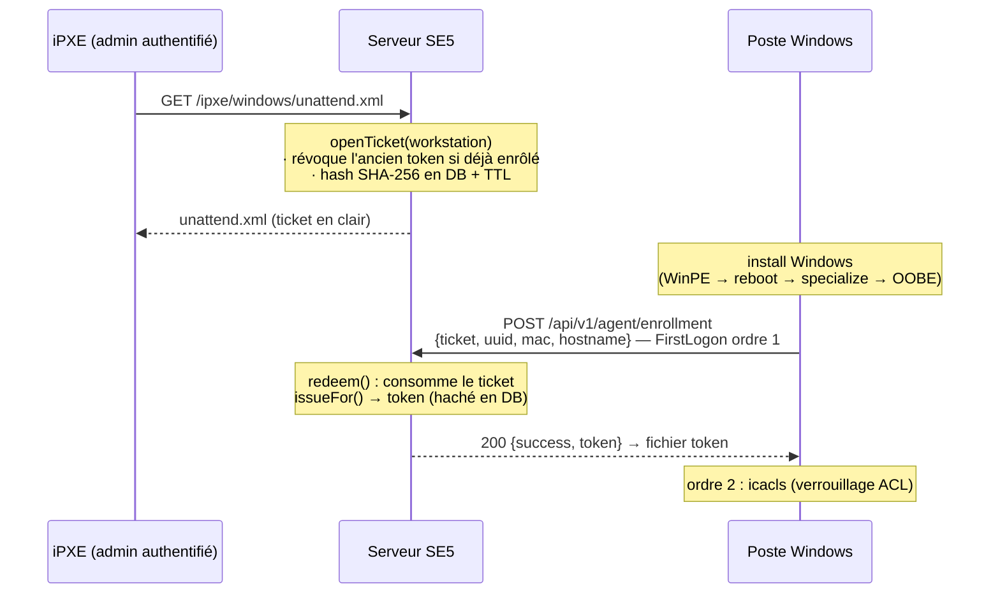
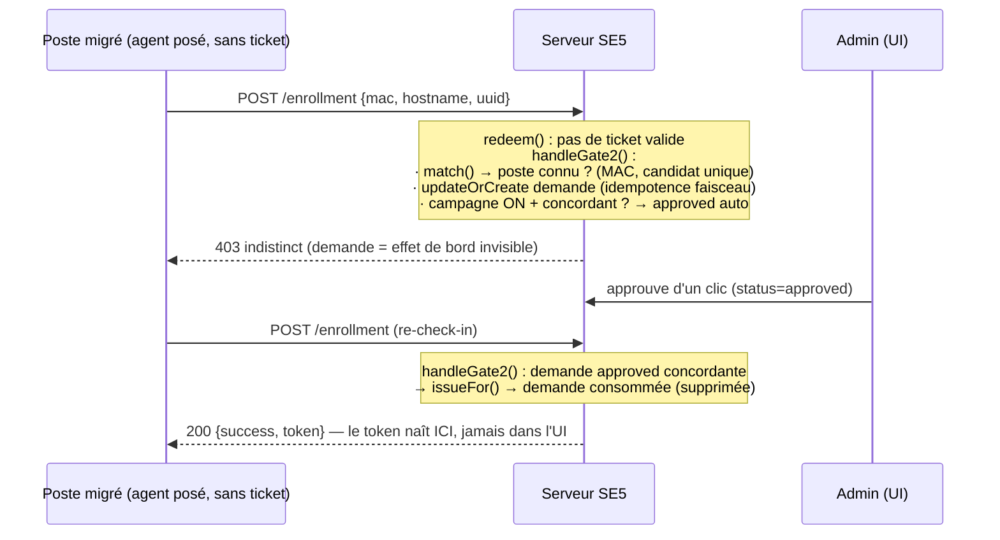

# Enrôlement du poste — porte 1 (installation iPXE)

> **Naissance du token agent** sur la chaîne d'install iPXE Windows : un poste
> neuf reçoit son token au premier logon, sans action manuelle. Le cycle de vie
> du token (rotation, révocation, anti-clonage) est décrit dans
> [token-lifecycle.md](token-lifecycle.md) ; le contenu JSON échangé est figé par
> [contract-v1.md](contract-v1.md). Les deux sont orthogonaux à ce document : ici,
> on ne traite que la **naissance** du token.

## 1. Vue d'ensemble

Deux portes d'entrée vers l'état « enrôlé » :

- **Porte 1 (ce document)** — postes installés par la chaîne iPXE : l'admin
  est déjà authentifié au menu iPXE, un **ticket d'enrôlement one-time** est
  émis côté serveur à la génération de l'`unattend.xml`, le poste l'échange
  contre son token au premier logon. Aucune action manuelle.
- **Porte 2 ([§9](#9-porte-2--enrôlement-des-postes-migrés))** — postes
  migrés/clonés sans ticket : approbation un-clic par l'admin (ou
  auto-approbation bornée en mode campagne). Réutilise **le même endpoint** :
  la branche d'échec de `redeem()` crée une **demande d'enrôlement** au lieu
  d'un 403 sec. Le poste reste 403 (indistinct) tant qu'il n'est pas
  approuvé ; le token naît à son prochain check-in.

## 2. Flux porte 1



1. **Émission** (`EnrollmentService::openTicket()`) — à la génération de
   l'unattend (`IpxeWindowsUnattendController`). Ticket = 64 hex
   (`bin2hex(random_bytes(32))`), seul le SHA-256 est persisté
   (`workstations.agent_enroll_ticket_hash` + `agent_enroll_ticket_expires_at`).
   TTL : `config('agent.enroll_ticket_ttl_minutes')` (env
   `AGENT_ENROLL_TICKET_TTL_MINUTES`, défaut **240 min** — couvre une install
   lente, plancher serveur 1 min). Un re-fetch WinPE écrase simplement le
   ticket précédent.
2. **Réinstallation = révocation immédiate.** Si le poste était déjà enrôlé,
   `TokenRotationService::revokeFor($ws, 'reinstall')` est appelé à l'émission
   du ticket — le clone éventuel de l'ancien token meurt **au début** de la
   réinstall, pas à la fin.
3. **Échange** (`POST /api/v1/agent/enrollment`, route `agent.v1.enrollment`)
   — résolution par **hash du ticket** exclusivement : le ticket EST
   l'identité ; uuid/mac sont spoofables sur le LAN et ne servent qu'au log
   de cohérence (`agent.enroll.identity_mismatch`, warning sans blocage). Le
   choix 409/403 en cas d'échec se fonde sur la **seule MAC** (ancre) — l'uuid
   ne sert jamais d'oracle. Le ticket est consommé atomiquement (un seul redeem
   gagne, même concurrent), le token naît via
   `TokenRotationService::issueFor()` et le clair est renvoyé **une seule
   fois** (`{success: true, token}`, `Cache-Control: no-store`).
4. **Dépôt** — `FirstLogonCommands` de l'unattend, **ordres 1-2, avant le
   curl `etape=oobe`** historique (l'`action.cmd` récupéré peut rebooter le
   poste en ~5 s) :
   1. PowerShell : le dossier `C:\ProgramData\SambaEdu\Agent` est créé **et
      verrouillé d'abord** (`icacls /inheritance:r`, accès **SYSTEM +
      Administrators uniquement** via SID `*S-1-5-18`/`*S-1-5-32-544`,
      insensible à la locale) — le token n'existe jamais dans un dossier aux
      ACL héritées (Users-readable). Si le verrouillage échoue, on n'échange
      pas (ticket non consommé → porte 2). Puis POST de l'échange (URL
      absolue `http://<se4fs>/api/v1/agent/enrollment`) et écriture du token.
      Réseau indisponible ou erreur transitoire (5xx, 429) → retry 30×10 s ;
      un 4xx définitif → arrêt immédiat. **Un échec ne bloque jamais la
      suite de l'install** — le poste retombera sur la porte 2.
   2. `icacls` ceinture-et-bretelles : ré-application du verrouillage si le
      fichier token existe.

## 3. Chemin du fichier token — contrat avec l'agent

```
C:\ProgramData\SambaEdu\Agent\token
```

Fichier texte sans newline final, contenu = token 64 hex. ACL : SYSTEM +
Administrators uniquement (**ProgramData**, pas `%PROGRAMFILES%` — Program
Files est lisible par les Users standard, un élève pourrait lire le token).
L'agent lit ce fichier. **Toute modification de ce chemin casse le contrat** —
à synchroniser avec l'agent et la purge sysprep (§5).

## 4. Codes de réponse de l'endpoint

Format d'erreur JSON SE5 : `{error, message, code}`. Middlewares :
`auth.v1.lan-only` (LAN only) + `auth.v1.secure-headers` + `throttle:10,1` —
**pas** `agent.token` (le poste n'a pas encore de token).

| HTTP | `code` | Cas |
|---|---|---|
| 200 | — | Ticket valide : `{success: true, token}` (clair, une seule fois) |
| 409 | `AGENT_ENROLL_CONFLICT` | Ticket invalide **et** un poste **partageant la MAC** (ancre) est **déjà enrôlé** — son token reste intact, rien n'est écrasé silencieusement. Conflit fondé sur la **seule MAC** (`exists()` d'un enrôlé) : l'uuid (preuve faible) ne déclenche jamais de 409 (pas d'oracle) |
| 403 | `AGENT_ENROLL_NOT_ALLOWED` | Tout le reste : ticket absent/inconnu/expiré/déjà consommé, poste non enrôlé ou inconnu — **volontairement indistincts** (pas d'oracle sur l'état des tickets). C'est le point d'accueil de la **porte 2** ([§9](#9-porte-2--enrôlement-des-postes-migrés)) : une demande d'enrôlement est créée/rafraîchie en effet de bord, sans que la réponse ne change (toujours 403 indistinct) |

Note collision : `POST /api/v1/agent/enroll` (`agent.v1.enroll`) appartient
au canal JWT **legacy-migration** — intouché pendant la transition, d'où l'URI
`/enrollment`. Seule la chaîne d'install appelle cet endpoint, jamais l'agent
en routine.

## 5. Hygiène clonage (sysprep & nosysprep)

Le token est déposé au premier logon du master : une image capturée avec le
fichier ferait présenter **le token du master par N clones** →
`clone_detected` → quarantaine. La purge `C:\ProgramData\SambaEdu\Agent\` est
donc exécutée sur **les trois chemins de préparation de capture** :

- `sysprep.blade.php` — **avant** `sysprep.exe /generalize` ;
- `sysprep.blade.php`, bloc fallback `:nosysprep` (sysprep.exe KO) — avant
  le reboot de capture ;
- `nosysprep.blade.php` (clonage sans sysprep, `etape=sysprep&type=clonage`)
  — avant le reboot de capture.

Les clones déployés repassent par OOBE → sans ticket valide → porte 2
([§9](#9-porte-2--enrôlement-des-postes-migrés)) : ils créent une demande
d'enrôlement que l'admin tranche (jamais d'auto-approbation d'un poste inconnu,
même en campagne). Un clone sans token reste **non-enrôlé** tant qu'il n'est pas
approuvé (pas de quarantaine de masse).

## 6. Risques assumés (iso-legacy)

- **Résidu Panther** : le ticket reste en clair dans
  `C:\Windows\Panther\unattend.xml` après install — il est **single-use et
  déjà consommé** au moment où il y traîne (inerte). L'unattend y laisse
  déjà les mots de passe AutoLogon (risque legacy préexistant, non aggravé).
- **Transport HTTP en clair sur le LAN** : iso chaîne d'install existante
  (curl oobe, action.cmd). Le ticket est one-time + TTL court ; le token,
  lui, ne transite qu'une fois dans la réponse `no-store`.

## 7. Logging

Channel **`agent`** (cf. [token-lifecycle.md](token-lifecycle.md) §8) — jamais
de ticket/token en clair ni de hash :

| Action | Niveau | Moment |
|---|---|---|
| `agent.enroll.ticket_opened` | info | Émission du ticket (génération unattend) |
| `agent.enroll.reinstall_revoked` | info | Révocation de l'ancien token à la réinstall |
| `agent.enroll.enrolled` | info | Échange réussi, token né |
| `agent.enroll.identity_mismatch` | warning | uuid/mac/hostname reçus ≠ fiche (sans blocage) |
| `agent.enroll.rejected` | warning | Échec d'échange (avec raison interne + choix conflit) |

## 8. Renvois

- [token-lifecycle.md](token-lifecycle.md) — cycle de vie du token né ici.
- [contract-v1.md](contract-v1.md) — contenu JSON v1 (le ticket/token sont
  du transport, jamais dans le corps v1).
- **[§9 — Porte 2](#9-porte-2--enrôlement-des-postes-migrés)** — approbation
  un-clic des postes migrés.

## 9. Porte 2 — enrôlement des postes migrés

> Étend la **branche d'échec** de `EnrollmentService::redeem()` (sinon un 403
> sec) sans toucher au flux ticket (porte 1, §2) ni au canal JWT legacy.
> Implémentée par `App\Services\Agent\Enrollment\{EnrollmentService,
> EnrollmentMatchService, EnrollmentCampaign}`, modèle `AgentEnrollmentRequest`,
> table `agent_enrollment_requests`, UI `parc-settings/agent`.

### 9.1 Pourquoi une porte 2

Un poste **migré** (existant, déjà joint au domaine, agent posé par la
GPO-dispatcher figée) n'a **pas de ticket** : personne ne génère d'unattend pour
lui. Il rejoue son `POST /api/v1/agent/enrollment` à chaque check-in et
retombait sinon sur un 403 sec. La porte 2 transforme ce 403 en une **demande
d'enrôlement** que l'admin approuve d'un clic — l'existant rejoint SE5 **sans
réinstallation**.

### 9.2 Faisceau de preuves

L'identité présentée par le poste = `hostname` + `mac` + `uuid` SMBIOS.
**Aucune preuve n'est suffisante seule.** L'uuid SMBIOS s'est montré **peu
fiable** (champ vide côté iPXE), d'où la hiérarchie figée :

| Preuve | Rôle | Usage |
|---|---|---|
| **MAC** | **ancre fiable** | seule clé de rapprochement (normalisée `MacAddressNormalizer` des deux côtés — tirets/colons/nu acceptés) |
| **hostname** | corroborant | exige la cohérence pour la concordance (ou absent côté demande) |
| **uuid SMBIOS** | corroborant faible | jamais utilisé pour résoudre un candidat ; log de cohérence seulement |

Le rapprochement (`EnrollmentMatchService::match()`) ne retient un poste connu
que s'il est un **candidat UNIQUE** par MAC. Lecture seule sur `workstations`,
**zéro AD**.

### 9.3 Flux



### 9.4 Idempotence et anti-bruit

- Le poste **rejoue** son POST à chaque check-in : `updateOrCreate` sur la **clé
  du faisceau** (MAC normalisée, à défaut hostname lowercase) rafraîchit
  `last_seen_at` — **pas de doublon**.
- Une demande **`rejected`** n'est **pas ré-ouverte** par un re-POST (l'admin
  garde la main pour re-armer) — anti-bruit.
- Un faisceau intégralement vide est tout de même tracé mais **jamais
  dédupliquable ni auto-approuvable**.

### 9.5 Mode campagne — auto-approbation bornée, anti-usurpation jamais débrayé

Réglage admin stocké dans `system_settings`
(`agent_enroll_campaign_until` = échéance ISO-8601), activable/désactivable
depuis l'UI **sans déploiement** (pas de `config:cache`). La campagne est active
ssi l'échéance est dans le futur — une **borne dépassée = retour au manuel par
construction** (vérifié à chaque `redeem()`, aucune tâche planifiée requise).

L'auto-approbation est accordée **uniquement** si, cumulativement :

1. la campagne est active **ET**
2. le faisceau rapproche un **candidat unique** connu **ET**
3. ce candidat est **concordant** (`isConcordant()` : MAC connue **ET** hostname
   cohérent/absent **ET** poste **non enrôlé**).

**Toute divergence** (hostname différent, multi-candidats, poste inconnu, ou
poste déjà enrôlé = conflit) reste en **approbation manuelle, même campagne
active**. L'anti-usurpation **ne se débraye jamais** — invariant verrouillé par
test (`EnrollmentGate2Test`, `EnrollmentMatchServiceTest`).

### 9.6 Codes de réponse (porte 2)

Mêmes codes que la porte 1 (§4), **réponse sans oracle** : le poste n'apprend
jamais l'état de sa demande.

| HTTP | `code` | Cas |
|---|---|---|
| 200 | — | Demande **approuvée** (un-clic ou auto) concordante re-présentée : `issueFor()`, token né, demande consommée |
| 409 | `AGENT_ENROLL_CONFLICT` | Un poste **partageant la MAC** (ancre) est **déjà enrôlé** — jamais de demande pending, jamais d'auto, token intact. Fondé sur la seule MAC (`exists()`), l'uuid ne fait jamais oracle |
| 403 | `AGENT_ENROLL_NOT_ALLOWED` | Tout le reste : demande créée/rafraîchie/pending/rejetée — **indistinct** |

### 9.7 Logs porte 2 (channel `agent`)

| Action | Niveau | Moment |
|---|---|---|
| `agent.enroll.requested` | info | Création **ou** rafraîchissement d'une demande (faisceau résumé, `workstation_id` si rapproché) |
| `agent.enroll.auto_approved` | info | Campagne active + concordance + candidat unique (`auto_approved = true`) |
| `agent.enroll.approved` | info | Approbation un-clic admin (`resolved_by`) |
| `agent.enroll.rejected` | warning | Rejet admin (`reason = manual_reject`) — distinct du rejet technique porte 1 ; **ou** conflit (`conflict = true`) |
| `agent.enroll.enrolled` | info | Token né à la consommation d'une demande approuvée (`gate = 2`) |

Jamais de token/hash en clair, jamais de preuve sensible excédant le faisceau.

## 10. Porte 2 — le client agent

La porte 2 serveur (§9) est consommée par **l'agent Go lui-même** sur le chemin
migré : un poste installé par la GPO-dispatcher figée (`se4_agent_bootstrap`) ou
réparé reçoit le service **sans token**, puis s'auto-enrôle.

### 10.1 Garde d'install relâchée

`agent.exe install` n'exige **pas** un token présent
(`agent/windows/install_windows.go`). L'install procède sans token : config,
arborescence, ACL, enregistrement SCM. Conséquence bénigne — sans token, le run
loop ne converge pas, il **demande** son enrôlement. Sur un poste **déjà
enrôlé** dont l'agent est briqué, la réinstall **conserve** le token (hors
périmètre install) → convergence directe, **jamais** de ré-enrôlement.

### 10.2 Branche « token absent » du run loop

À chaque cycle, `runCycle` (`agent/shared/loop.go`) teste la présence du fichier
token (`Store.TokenExists()`) :

- **token présent** → flux nominal (GET /state / POST /report / rotation) ;
- **token absent** → `runEnrollment` : faisceau `{uuid, mac, hostname}`, POST
  `/api/v1/agent/enrollment` **sans bearer** (`Client.PostNoAuth`), ticket vide.

Un token présent mais **corrompu** reste un échec de cycle (backoff) — **jamais**
un déclencheur d'auto-enroll (un poste enrôlé ne se ré-enrôle jamais auto).

### 10.3 Mapping des réponses (client)

Le token de réponse est lu dans le **corps JSON** `{success, token}` (jamais
dans l'en-tête de rotation).

| HTTP | Outcome client | Comportement |
|---|---|---|
| 200 `{token}` | `EnrollApproved` | `Store.WriteToken` (atomique + ACL SID), bascule en convergence au cycle suivant ; cadence normale |
| 403 | `EnrollPending` | Demande enregistrée (ou poste rejeté) → check-ins légers, **cadence normale**, jamais de backoff agressif ni d'escalade |
| 409 | `EnrollConflict` | Log conflit + check-ins légers, **jamais** de ré-enrôlement automatique silencieux (le serveur tranche) |
| réseau KO / 5xx / autre | `EnrollError` | Backoff exponentiel |

### 10.4 MAC — ancre de rapprochement

Le faisceau porte la **MAC** (`agent/windows/mac_windows.go` : première interface
active, up, non-loopback, MAC matérielle non vide ; le serveur normalise via
`MacAddressNormalizer`). Une MAC absente rend la demande **non
auto-approuvable** (tracée, jamais rapprochée) — on **n'invente jamais** une MAC
en silence ; le client logge un warning et poste quand même (l'admin peut
approuver manuellement).

### 10.5 Anti-boucle & poste rejeté

Un cycle qui reçoit 403/409 ne déclenche **aucune** re-tentative immédiate :
cadence normale (timer + jitter), exactement comme la quarantaine. Un poste
`rejected` boucle dans le vide — aucune escalade, aucun brick : la demande n'est
jamais ré-ouverte par un re-POST côté serveur.
