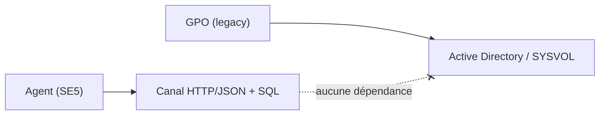

# Agent *desired-state* — le *pourquoi* (décisions structurantes)

> Couche **métier** du domaine agent : les décisions qui expliquent *pourquoi*
> le système a cette forme. La couche technique (le *comment*) est dans les
> autres fiches de `docs/agent/` ; l'index est `README.md`.
>
> Format : une décision = un ADR (contexte → décision → conséquences). On
> compare toujours à l'état de référence : les **GPO** du legacy.

---

## ADR-1 — Configurer les postes par un agent, pas par les GPO

**Contexte.** Dans le legacy, la configuration des postes passe par les GPO :
elle impose Active Directory et SYSVOL, ne vaut que pour Windows, et s'applique
selon un cycle de rafraîchissement opaque, difficile à observer et à tester.

**Décision.** Chaque poste porte un **agent** qui tire sa configuration du
serveur en **pull HTTP/JSON authentifié**, puis l'applique localement.

**Conséquences.**
- La configuration devient lisible et reproductible : un mainteneur tire l'état
  cible d'un poste au `curl` et voit exactement ce qui lui est destiné.
- Le canal ne dépend plus de SYSVOL ni du cycle GPO.
- Le poste exécute du code : sa sécurité (token, droits SYSTEM, signature du
  binaire) devient un sujet à part entière — voir `token-lifecycle.md`.

## ADR-2 — Aucune dépendance à Active Directory dans le canal agent

**Contexte.** AD est aujourd'hui au cœur de l'authentification et de la diffusion
de configuration. C'est aussi le principal frein à toute évolution de la couche
identité.

**Décision.** Le flux agent (émission de token, état cible, rapports,
distribution des binaires) est **100 % SQL/HTTP**, sans le moindre appel
LDAP/Kerberos/samba-tool.

**Conséquences.**
- L'agent ne fait reposer **aucune** de ses fonctions sur AD : c'est le critère
  qui ouvre la stratégie long terme de **sortie vers Keycloak**.
- Invariant d'enforcement : toute PR qui introduit un appel AD dans le flux agent
  se rejette.

## ADR-3 — La GPO subsiste comme simple amorce

**Contexte.** Couper les GPO d'un coup est impossible : il faut bien un mécanisme
natif Windows pour *installer et démarrer* l'agent sur un poste neuf.

**Décision.** Une **unique GPO générique** (`SE_agent_bootstrap`) installe et
lance l'agent. Elle ne porte **aucune** configuration métier ; une fois l'agent
en place, il prend tout le relais.

**Conséquences.**
- La GPO devient un point d'amorçage statique, qui ne change plus.
- Toute la configuration métier vit côté serveur, plus dans SYSVOL.
- Détail d'exploitation : `../runbooks/gpo-se4-agent-bootstrap.md`.

## ADR-4 — L'état cible est une projection des tables métier, pas une ressaisie

**Contexte.** La tentation serait de créer une couche de « règles » dédiée à
l'agent. Ce serait une seconde source de vérité à maintenir et à tenir
synchronisée avec les écrans d'administration existants.

**Décision.** L'état cible d'un poste est **calculé** (compilé) à la volée depuis
les tables métier déjà alimentées par les écrans d'administration. Aucune table
de règles générique, aucune double saisie.

**Conséquences.**
- Les écrans d'admin existants **sont** la source : ce qu'ils décrivent est ce
  que l'agent applique.
- La logique de fusion (précédence par maille : poste, groupes, parc, diffusion)
  est implémentée **une seule fois**, côté serveur — voir `state-providers.md`.

## ADR-5 — Convergence inconditionnelle

**Contexte.** Un agent peut soit *signaler* un écart et attendre, soit le
*corriger*. Le premier mode laisse les postes diverger silencieusement.

**Décision.** L'agent **converge toujours** : il ramène le poste à son état cible
sans exception. Ce que le serveur décrit fait foi.

**Conséquences.**
- Pas de « configuration locale qui survit » : toute modification hors canal est
  écrasée au cycle suivant.
- Le rapport remonté sert au constat (conforme / en écart / erreur), pas à
  négocier l'application.

## ADR-6 — Une seule source de configuration à la fois

**Contexte.** Faire cohabiter le canal legacy (SE4) et l'agent pendant la
transition créerait deux sources de vérité concurrentes — donc des conflits
indécidables sur un même poste.

**Décision.** Le canal de configuration legacy est **éteint en bloc** : chaque route
client encore appelée reçoit une réponse native **terminale, typée et inerte**
(tombstones, story 38.2) — le kill-switch `LEGACY_CONFIG_CHANNEL_ENABLED` (sémantique
410) a été RETIRÉ, remplacé par ces tombstones. Il n'existe pas d'état transitoire où
les deux canaux configurent le même poste.

**Conséquences.**
- Un poste donné est configuré par **un** canal, jamais par les deux.
- La bascule est franche, assumée comme telle.

## ADR-7 — Le token est l'identité du poste

**Contexte.** Le canal doit garantir qu'un poste ne lit que *sa* configuration et
n'écrit que *ses* rapports, sans s'appuyer sur AD (cf. ADR-2).

**Décision.** Chaque poste détient un **bearer token opaque**, de portée minimale.
L'identité d'une requête **est** le poste résolu par son token ; les endpoints
n'acceptent jamais d'identifiant de poste en paramètre.

**Conséquences.**
- Supprimer le poste **le révoque** par construction (le token vit sur sa ligne).
- Anti-clonage : un même token rejoué depuis une autre machine est neutralisé —
  voir `token-lifecycle.md`.

## ADR-8 — Publier au parc *est* le geste de validation

**Contexte.** Aucun parc en production ne consomme encore le canal. Une release
« validée mais jamais diffusée » n'a en réalité rien prouvé.

**Décision.** Tant qu'il n'y a pas de production, **publier une release stable au
parc** constitue le test : c'est l'acte qui démontre que la chaîne
build → distribution → application fonctionne de bout en bout.

**Conséquences.**
- Le « done » d'une évolution agent inclut sa publication effective au parc.
- Mécanique de distribution (rings, stable) : `release-distribution.md`.

## ADR-9 — Runtime Go, par contrainte

**Contexte.** L'agent cible des postes Windows alignés sur le legacy, et sera
maintenu par une équipe qui n'est pas constituée de développeurs systèmes.

**Décision.** L'agent est écrit en **Go** : un binaire unique, compilé et signé,
sans toolchain ni runtime à déployer sur le poste.

**Conséquences.**
- Déploiement = un `.exe` signé, rien d'autre à installer.
- Le partage du cœur OS-agnostique (`agent/shared`) ouvre la voie à d'autres
  cibles si besoin, sans réécriture du métier.
