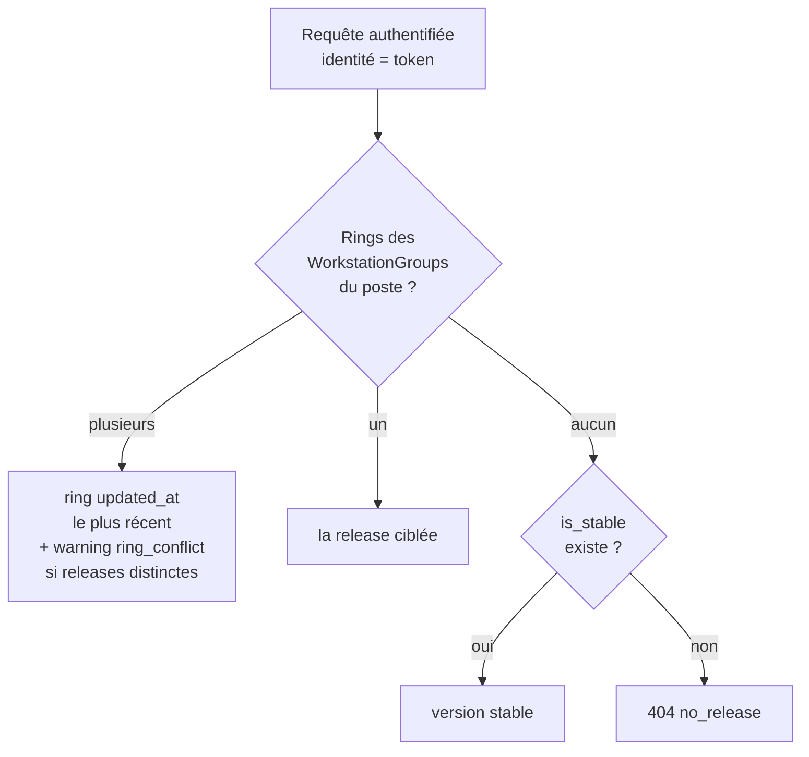

# Distribution des releases agent — côté serveur

> **Référence serveur** de la distribution canari : publier une version du
> binaire agent, la cibler par **ring**, la servir aux postes authentifiés.
> Orthogonal à [token-lifecycle.md](token-lifecycle.md) (le transport — auth,
> rotation, révocation) : cette fiche décrit les **tables, endpoints et règles**
> de résolution. La **procédure pas-à-pas** d'exploitation (build, publication,
> ciblage, rollback) vit dans
> [../runbooks/agent-build-publish-update.md](../runbooks/agent-build-publish-update.md).
> L'auto-update côté agent (download, vérification hash + signature, swap
> binaire) est traité par l'agent lui-même.

## Tables

| Table | Rôle |
|---|---|
| `agent_releases` | Une ligne par version publiée : `version` (unique), `hash` (SHA-256 **vérifié** contre le fichier réel à la création), `filename` (unique — la donnée stable ; l'`url` du manifest est calculée à la réponse, jamais stockée), `is_stable` (au plus une ligne à true — invariant transactionnel du service). |
| `agent_release_rings` | Ciblage : **un ring = UN WorkstationGroup existant** (salle physique OU parc logique — le pivot global ne distingue pas), `workstation_group_id` UNIQUE → `agent_release_id`. L'`updated_at` est la donnée de **récence**. FK cascade des deux côtés : la release ou le groupe supprimé emporte le ring (le poste retombe sur la stable). |

Le canal agent n'écrit **que** dans `agent_*` : le ciblage LIT les
WorkstationGroups, n'y écrit jamais. Aucune dépendance AD.

## Commandes artisan

`ReleaseCreationService` est le **seul écrivain** des tables release/ring ; les
commandes en sont l'interface CLI (l'UI, si présente, appelle exactement le même
service) :

```bash
# Publier — le --hash est OBLIGATOIRE, contre-vérifié sur le fichier réel.
# Toute incohérence (fichier absent, hash divergent, version dupliquée, formats
# invalides, filename ≠ sambaedu-agent-<version>.exe) = REFUS, aucune ligne
# écrite, exit ≠ 0. [--stable] marque la release stable (au plus une — swap
# transactionnel).
php artisan agent:release:create 2.1.2 sambaedu-agent-2.1.2.exe \
    --hash=$(sha256sum storage/agent/releases/sambaedu-agent-2.1.2.exe | cut -d' ' -f1)

# Cibler un ring (canari) — le ring est un WorkstationGroup existant, lookup
# par `name`.
php artisan agent:release:target 2.1.2 salle_lab

# Promouvoir stable (défaut des postes sans ring — c'est aussi le rollback du
# pointeur).
php artisan agent:release:promote 2.1.2
```

## Endpoints (canal agent — bearer)

| Endpoint | Réponse |
|---|---|
| `GET /api/v1/agent/release` (`agent.v1.release`) | **Manifest** wrapper SE5 `{success, version, hash, url}` — `url` **absolue** vers le download. Golden : `tests/Fixtures/Agent/release-manifest.v1.json` (évolution : champ AJOUTÉ = mineur ; champ retiré/renommé = breaking, interdit sans nouvelle version de contrat). |
| `GET /api/v1/agent/releases/{filename}` (`agent.v1.release.download`) | **Binaire** (`BinaryFileResponse`, pas de wrapper SE5). Pattern strict `sambaedu-agent-<version>.exe` AVANT tout accès ; seul un filename présent dans `agent_releases` est servi (lookup DB d'abord, disque ensuite, realpath confiné). |

**Codes** : 200 (servi) · 401 `AGENT_TOKEN_MISSING`/`AGENT_TOKEN_INVALID` ·
403 `AGENT_QUARANTINED` · 404 — manifest : `{error: "no_release"}` (aucune
release applicable, traité par l'agent comme « rien à faire ») ; download :
`{error: "not_found"}` **indistinct** (malformé / inconnu DB / fichier absent —
aucun oracle de présence) · 429 (throttle 60/min). La rotation
`X-Agent-New-Token` survit aux deux réponses.

## Règle de résolution du manifest



1. **Rings** des WorkstationGroups du poste authentifié (identité = le token,
   jamais un identifiant en entrée) ;
2. plusieurs rings → la ligne ring **la plus récemment modifiée**
   (`updated_at`) gagne + warning `agent.release.ring_conflict` **seulement
   si les rings pointent des releases distinctes** (salle + parc alignés sur la
   même version ne warne pas). Couvre le canari (ciblage lab posé APRÈS le parc)
   et le rollback (re-ciblage posé APRÈS — `agent:release:target` rafraîchit
   toujours `updated_at`, même pour la même version) ;
3. aucun ring → version **stable** (`is_stable = true`) — jamais une canari
   par accident ;
4. ni ring ni stable → **404 `no_release`** (jamais un 200 vide ambigu).

## Répartition de l'intégrité

| Garantie | Où | Quoi |
|---|---|---|
| Intégrité à la **création** | Serveur (`ReleaseCreationService`) | SHA-256 du fichier réel = hash déclaré par le build, sinon refus. Impossible de publier un artefact incohérent. |
| Intégrité au **transport** | Agent | SHA-256 du corps téléchargé = `hash` du manifest, avant écriture. |
| Authenticité à l'**exécution** | Agent + build | Vérification de la signature Authenticode avant swap du binaire ; le build refuse de produire du non-signé (sauf `ALLOW_UNSIGNED=1`). Le serveur ne re-vérifie PAS Authenticode (osslsigncode n'est pas une dépendance runtime du serveur). |

## Convention de dépôt des binaires

- Répertoire : `config('agent.releases_path')` — défaut
  `storage/agent/releases/` (clé `AGENT_RELEASES_PATH`). **Non versionné**
  (convention storage), **hors inotify** : dépôt direct sur le serveur
  (scp/cp/install), jamais committé.
- **chown www-admin** (uid 599 — PHP-FPM) obligatoire : un fichier illisible
  fait échouer `hash_file()` à la création et tomber le serving en 404
  silencieux.
- Le fichier doit rester en place après publication : le hash en DB ne protège
  pas d'une substitution disque côté serveur (root requis) — c'est la
  vérification hash + signature côté agent qui couvre le poste.

## Observabilité

Channel `agent`, actions `agent.release.*` : `created` (info) / `rejected`
(warning + raison machine) / `promoted` (info) / `targeted` (info) /
`ring_conflict` (warning — uniquement si releases distinctes) /
`manifest_served` (**debug** — un par check-in) / `no_release` (debug) /
`download_served` (**debug** — un téléchargement n'est qu'un préalable sans
garantie : la trace de déploiement qui fait foi est la **version rapportée par
l'agent au check-in**) / `download_not_found` (info — l'anomalie reste visible) /
`releases_path_missing` (warning — `releases_path` absent/illisible : distingue
côté ops « config cassée, parc entier en 404 » de « release inconnue » ; la
réponse client reste le 404 indistinct). Toujours `workstation_id` quand
applicable ; jamais de token ni de payload binaire.

**Versions exotiques** : `version` admet `+`/`~` ; dans l'`url` du manifest, le
filename est alors **percent-encodé** (`2.1.2+r1` →
`sambaedu-agent-2.1.2%2Br1.exe`). Le serveur décode à la réception ; l'agent
décode avant toute comparaison littérale filename ↔ version. Sans objet pour le
semver simple produit par le build.

## Endpoints d'amorçage LAN (non authentifiés)

Les deux chemins d'installation de l'agent (GPO-dispatcher figée pour les postes
migrés, unattend iPXE pour les postes neufs) tournent **avant** que l'agent ait
un token. Ils ne passent donc pas par les endpoints ci-dessus (derrière
`agent.token`). Trois endpoints **non authentifiés**, chaîne middleware iso
`/v1/agent/enrollment` (`local.request` LAN-only + `auth.v1.secure-headers` +
`throttle:60,1`), **hors** du groupe `agent.token`
(`app/Http/Controllers/Api/V1/Agent/BootstrapController.php`) :

| Méthode | URI | Route | Réponse |
|---|---|---|---|
| GET | `/api/v1/agent/stable` | `agent.v1.stable` | Manifest stable `{success, version, hash, url}` (URL **absolue**, FIXE) ; 404 `no_release` si aucune stable |
| GET | `/api/v1/agent/stable/download` | `agent.v1.stable.download` | Binaire **stable** (octet-stream). URL FIXE : la résolution du filename est interne (jamais un input client). Confinement realpath, 404 indistinct |
| GET | `/api/v1/agent/ca` | `agent.v1.ca` | Racine CA en PEM (`text/plain`) ; **503** si la PKI n'est pas initialisée (`php artisan auth:ca:init`), jamais 500 |

**Résolution forcée stable** : l'appelant n'a pas de token, donc aucun ring à
résoudre — `ReleaseManifestService::stableManifest()` sert **toujours** la
`is_stable` (jamais une canari). Une canari publiée ne fuit jamais par ces
endpoints.

**Frontière `agent_*` + zéro AD** : lecture seule `agent_releases` + le `.crt`
PKI sur disque ; **aucune** écriture, **aucun** appel
LdapRecord/Kerberos/samba-tool. Le périmètre de confiance est le réseau
(`local.request`).

**Intégrité au premier dépôt** : aucun re-signage / re-vérif Authenticode côté
serveur. La confiance repose sur (a) le canal LAN/VPN, (b) le hash
optionnellement vérifié par le script via `/stable`, (c) la signature
Authenticode validée **ensuite** à chaque auto-update par l'agent. La racine CA
est le **prérequis de confiance** déployée par **les deux** chemins.

**Logs (channel `agent`)** : `agent.release.stable_served` (manifest + binaire),
`agent.ca.served`, `agent.ca.unavailable` (503), `agent.release.stable_not_found`
(404 indistinct). Jamais de token/hash en clair.

## Progression du déploiement

La version rapportée par l'agent (`agent_version`, présente dans chaque report)
est **persistée** dans `workstations.agent_reported_version` (+ `_at`) par
`ReportController::store()` (hors transaction d'ingestion ;
`ReportIngestService` reste read-only sur `workstations`). La surface
« progression du déploiement » LIT cette colonne (jointure lecture seule
`rings × workstation_group_workstation × workstations`) pour montrer, par ring,
les postes à jour / en retard / jamais vus vs la version ciblée. Le contrat de
report est inchangé — la colonne ne modifie pas le payload.

**Pas de modèle d'ordre des rings** : la promotion « 1 poste → 1 salle → parc »
reste du **jugement humain** (l'admin choisit le groupe ET la version) — aucune
auto-promotion.

## Renvois

- [token-lifecycle.md](token-lifecycle.md) — transport du canal (auth, rotation,
  révocation, anti-clonage).
- [../runbooks/agent-build-publish-update.md](../runbooks/agent-build-publish-update.md)
  — procédure d'exploitation (build, publication, ciblage, rollback).
