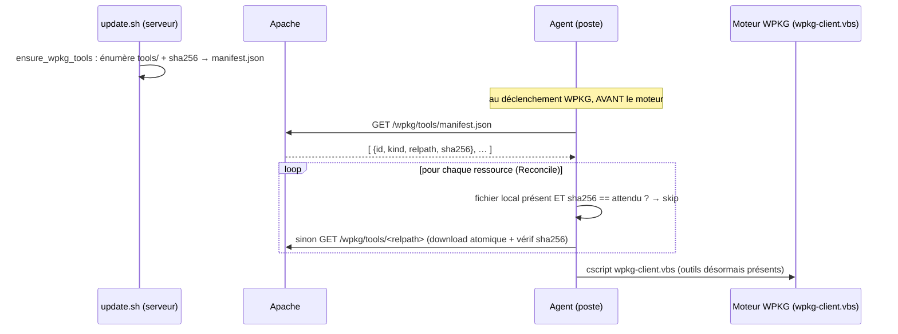

# Provisioning de ressources partagées — module `provision`

> Mécanisme **côté agent** qui garantit la présence sur le poste de **ressources
> de support partagées** (outils invoqués par les recettes, non spécifiques à une
> application) avant qu'elles ne soient nécessaires. Premier consommateur : les
> **outils WPKG** (`7za.exe` archiveur, `nircmd.exe` raccourcis, `tooltip/*`).
>
> **Orthogonal aux 9 handlers desired-state** ([contract-v1.md](contract-v1.md)) :
> ce n'est PAS un handler `Test`/`Apply` passant par le moteur de convergence
> ([`agent/shared/engine.go`](agent-skeleton.md)), mais une **étape de staging
> préalable** invoquée directement avant le déclenchement WPKG. Orthogonal au
> handler `applications`/WPKG, qu'il *sert*. Le contrat serveur est un
> **`manifest.json` déclaratif** servi en HTTP statique.
>
> **Implémentation : binaire Go** (`agent/provision/`), entièrement testable sur
> l'hôte (`go test ./agent/provision`) — le seul spécifique OS vit derrière un
> build tag.

## 1. Le problème

Certaines recettes WPKG appellent des **outils partagés** via un chemin en dur
`%Z%\wpkg\tools\…` (où `%Z%` = `c:\windows\install`) — par exemple `adnarn`
extrait son archive avec `%Z%\wpkg\tools\7za.exe`. Ces binaires ne sont **pas**
des payloads d'application (aucun `<download saveto>` dans la recette) : c'est de
la **configuration d'instance**, identique pour tout le parc. Personne ne les
dépose sur le poste (`%Z%\wpkg\tools\` est vide), donc l'extraction échoue —
même quand le payload de l'application, lui, est bien livré.

La direction retenue est de **déposer ces outils une fois sur le poste**, à
l'emplacement que le chemin en dur résout (`c:\windows\install\wpkg\tools\`), de
sorte que **les recettes restent inchangées**. Le dépôt est **piloté par
l'agent** (et non par un script GPO), cohérent avec l'agent comme successeur des
GPO.

## 2. Principe — serveur déclaratif / agent impératif

- **Le serveur est déclaratif** : il énumère le *quoi* (quelles ressources, leur
  `relpath`, leur `sha256` attendu) dans un `manifest.json`. Il ignore le FQDN du
  poste : le manifeste ne porte **pas** d'URL absolue.
- **L'agent est impératif** : il résout la cible selon l'OS, **compare par
  sha256**, télécharge/pose/applique les perms **uniquement en cas de dérive**,
  puis dispose d'un `Outcome` par ressource (`skipped`/`applied`/`failed`).

Aucune notion « WPKG » dans le moteur : un `7za.exe` est une `Resource`
`kind:"wpkg-tool"` ; un futur AppImage Linux serait `kind:"appimage"` — **même
moteur**, on ajoute seulement un `TargetResolver`.

## 3. Le moteur générique — `Reconcile`

`agent/provision/provision.go` (OS-agnostique, **stdlib seule**) :

| Élément | Rôle |
|---|---|
| `Resource{ID,Kind,RelPath,URL,SHA256,Executable}` | description d'une ressource ; champs alignés sur le `manifest.json` |
| `TargetResolver` (interface) | résout le chemin absolu local + garantit le dossier parent ; **point d'extension OS** |
| `Reconcile([]Resource, TargetResolver) []Outcome` | réconcilie chaque ressource, **jamais d'erreur globale** (un échec n'interrompt pas les suivants) |

Pour chaque ressource (`reconcileOne`) :

1. **garde-fou** `validateRelPath` (§6) — refuse un `RelPath` dangereux **avant**
   toute résolution ;
2. `Resolve(r)` → chemin absolu + dossier parent garanti ;
3. **TEST** — idempotence VRAIE par hash : fichier présent **ET** `sha256 ==`
   attendu → `StatusSkipped` (aucune écriture, aucune charge réseau). Un hash
   attendu vide force toujours l'`APPLY` ;
4. **APPLY** — `download` : récupère l'URL, **vérifie le sha256 du flux AVANT de
   publier**, écrit **atomiquement** (`os.CreateTemp` dans le dossier cible +
   `rename`) ; le tmp est nettoyé sur tout échec. Le consommateur ne voit jamais
   un fichier à demi écrit ni au mauvais hash.

## 4. L'adaptateur Windows — `WindowsResolver`

`agent/provision/provision_windows.go` (build tag `windows`) :

- `kind:"wpkg-tool"` → `%WinDir%\install\wpkg\tools\<RelPath>` — exactement le
  chemin que le moteur WPKG résout pour `%Z%\wpkg\tools` (la sous-arborescence
  `tooltip/…` est préservée via `RelPath`). Un autre `kind` → erreur explicite
  (jamais un placement deviné).
- **Garantit le dossier cible** (`MkdirAll`) : sur un poste neuf, `…\install\wpkg`
  existe (créé par l'amorce GPO `startup.cmd`) mais **pas** `…\wpkg\tools`.
- **Matérialise `%Z%`** (`c:\windows\install`) en vrai dossier local : sur un
  poste **migré**, ce chemin pouvait être un *reparse point* (montage SMB legacy
  débranché) ; on le détecte (`Lstat` + `fsutil reparsepoint query`) et on le
  retire avant de créer le dossier local. Idempotent : un vrai dossier existant
  n'est pas touché.

> L'interface Linux n'est **pas** implémentée (agent Linux post-MVP) : un
> `TargetResolver` Linux s'ajouterait sans toucher `Reconcile`. Pas de code mort.

## 5. Le manifeste serveur

`ensure_wpkg_tools` (`scripts/update.sh`) — idempotent, rejoué à chaque
`update.sh` :

- applique les droits sur l'arbre `…/install/wpkg/tools/` : fichiers **664**
  (world-readable — le poste lit en classe SMB « other »), dossiers 755, owner
  `www-admin` ;
- **génère `manifest.json`** : énumération récursive (`find -print0`, robuste aux
  espaces), `sha256sum` par fichier, tableau JSON
  `[{id, kind:"wpkg-tool", relpath, sha256}]` aligné sur `provision.Resource`
  (`relpath` en slashes Unix, le manifeste s'exclut de sa propre énumération) ;
  écriture **atomique** (tmp hors arbre + `mv` branché sur le résultat réel),
  664/`www-admin`.

Servi par l'alias Apache **`/wpkg/tools`** (`scripts/setupApache.sh`, modèle
`/wpkg/files`) : pointe **exactement** le sous-arbre des outils (jamais l'arbre
`install` entier, jamais `storage/keys/pki`), `-Indexes`, pas de
`FallbackResource`. Complétude vérifiée par `update_apache()`.

## 6. Câblage & sécurité

**Câblage** (`agent/windows/handler_applications_windows.go`) — `stageSharedTools`
est appelé **avant** `cscript wpkg-client.vbs` (`o.stageSharedTools()`, ~l.346) :

- `toolsURL()` dérive la base de `server_url` + `shared.WpkgToolsPath`
  (`/wpkg/tools`) — **exactement** comme `bundleURL()` dérive `WpkgBundlePath` ;
- `fetchToolManifest` récupère + décode le manifeste, mappe vers `[]Resource`
  (URL composée = `toolsURL + "/" + relpath`), puis `Reconcile` ;
- **FAIL-SOFT par contrat** : un manifeste inaccessible, un outil en échec — rien
  ne bloque le déclenchement WPKG (warning logué). Le binaire agent reste
  inchangé dans son comportement nominal si le canal outils est absent.

**Sécurité** (defense-in-depth, le manifeste est servi en HTTP sans TLS/auth sur
le LAN) :

- `validateRelPath` (core, OS-agnostique) rejette tout `RelPath` **absolu**, avec
  **volume** (`C:`), ou contenant une **remontée `..`** — en normalisant les deux
  séparateurs (`\` et `/`), car le manifeste peut provenir d'un OS distant. Un
  manifeste forgé ne peut donc pas faire écrire l'agent hors de la racine des
  outils ;
- le **sha256** garantit l'intégrité du contenu (un binaire altéré en transit est
  rejeté et re-téléchargé).

## 7. Invariants à ne pas casser

- Le moteur `provision` ne dépend **que** de la stdlib et **ne connaît aucun
  type métier** (« WPKG », « AppImage ») : ces notions vivent dans le `kind` et
  le `TargetResolver`, jamais dans `Reconcile`.
- Pour livrer une nouvelle ressource partagée sur le poste : **l'ajouter à l'arbre
  serveur** (le manifeste se régénère) — ne **jamais** réécrire les recettes ni
  `wpkg.cmd`.
- Pour un nouvel OS : ajouter un `TargetResolver`, sans toucher `Reconcile`.
- `validateRelPath` s'exécute **avant** toute résolution : ne pas la court-circuiter.
- Toute édition `agent/**` ⇒ **bump `agent/shared/version.go`** ; l'effet sur le
  parc n'existe qu'après **rebuild + publication** du binaire
  ([`../runbooks/agent-build-publish-update.md`](../runbooks/agent-build-publish-update.md)).

## 8. Carte du code (ancrage `fichier:ligne`)

### Agent (Go)

| Rôle | Chemin |
|---|---|
| Moteur générique (`Resource`, `TargetResolver`, `Reconcile`, `download`, `validateRelPath`) | `agent/provision/provision.go` |
| Adaptateur Windows (`WindowsResolver`, matérialisation `%Z%`) | `agent/provision/provision_windows.go` |
| Tests hôte (skip/apply/drift/mismatch/404/sous-arbre/traversal…) | `agent/provision/provision_test.go` |
| Câblage (`stageSharedTools`, `toolsURL`, `fetchToolManifest`) | `agent/windows/handler_applications_windows.go` |
| Constante du sous-chemin (`WpkgToolsPath = "/wpkg/tools"`) | `agent/shared/files.go` |

### Serveur

| Rôle | Chemin |
|---|---|
| Génération du `manifest.json` + droits (idempotent) | `scripts/update.sh` (`ensure_wpkg_tools`) |
| Alias Apache `/wpkg/tools` (scopé, `-Indexes`) | `scripts/setupApache.sh` + complétude `update_apache()` |
| Tests infra (alias, génération manifeste) | `tests/Unit/Wpkg/Deployment/WpkgSharedToolsStagingTest.php` |
| Runbook QA (e2e `adnarn`) | `docs/qa/domains/wpkg-deploy.md` |

---

*Convention : on documente le livré et stable. Cette fiche est orthogonale aux
fiches handlers ; elle décrit un mécanisme de staging **préalable**, pas un type
de ressource desired-state.*
