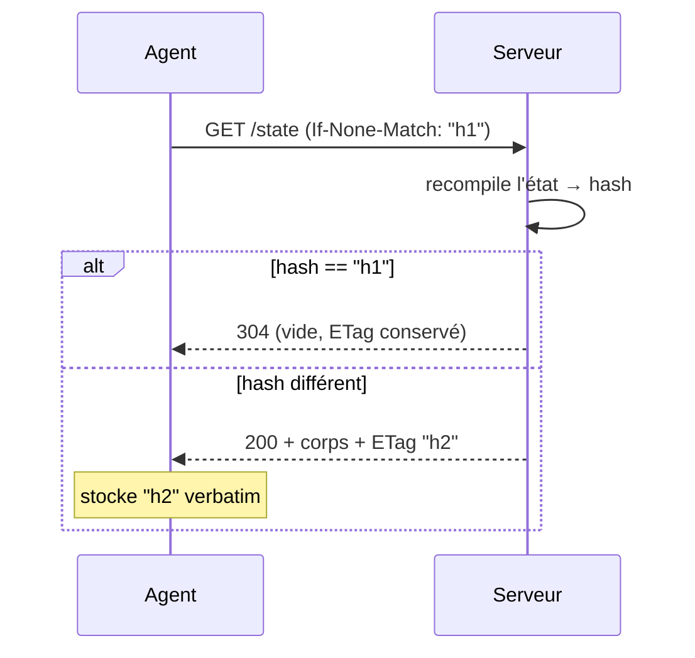

# `GET /api/v1/agent/state` — l'état cible servi

> **Transport** du canal desired-state : comment un agent (ou un mainteneur
> en curl/jq) tire l'enveloppe d'état compilée, et le contrat HTTP de cet
> endpoint. Orthogonal à [contract-v1.md](contract-v1.md) (le wire format
> figé, qui ne documente volontairement PAS la couche HTTP) et à
> [state-providers.md](state-providers.md) (la compilation côté serveur). Le
> rapport remonte par `POST /api/v1/agent/report` — voir
> [report-endpoint.md](report-endpoint.md).

## L'endpoint

| | |
|---|---|
| URL | `GET /api/v1/agent/state` (route `agent.v1.state`) |
| Auth | bearer token per-poste — l'identité de la requête EST le poste résolu par le token, jamais un paramètre |
| Middlewares | `auth.v1.secure-headers` + `throttle:60,1` + `agent.token` |
| Corps 200 | l'enveloppe `se5.desired-state/v1` **BRUTE** (`{schema, generated_at, ttl_seconds, machine, session, machine_user}`) — aucun wrapper `{success, …}` |
| Écritures | aucune côté controller — `agent_last_checkin_at` et la rotation sont gérés par le middleware `agent.token` |

Le throttle (60/min/IP) est posé **avant** `agent.token` : le lookup DB du
middleware est protégé du flood. Pas de restriction LAN : l'auth est le
token (un poste en VPN admin peut tirer son état). Les `secure-headers`
posent `Cache-Control: no-store` — sans incidence sur la revalidation
ci-dessous, qui ne repose pas sur un cache HTTP.

Diagnostic mainteneur :

```bash
curl -sS -H "Authorization: Bearer $TOKEN" \
  https://se4fs/api/v1/agent/state | jq .
```

## `?user=<login>` — le contexte de session

L'état est `f(poste, user)`. Le user de session est **optionnel** :

- **Absent ou vide** → compilation machine-only : les mailles user
  (`user`, groupes user) ne contribuent rien. C'est le check-in du service
  SYSTEM au boot.
- **Login connu** → les règles ciblées user / groupes user du contexte
  sortent. C'est le compagnon de session. Lookup **case-insensitive**
  (`JDOE` = `jdoe`, sémantique AD).
- **Login inconnu ou compte local** (admin local, compte hors SE5 — cas
  légitime du compagnon) → comportement machine-only + log
  `agent.state.unknown_user`, **jamais d'erreur** : une session locale doit
  recevoir un état.

Pas de cloisonnement par user dans la portée du token : le poste (SYSTEM)
est l'autorité sur QUI est dans SA session — demander l'état pour un user,
c'est lire SON état.

⚠️ `user=null` ne vide PAS mécaniquement les portées `session` /
`machine_user` : le scope est déclaré **par type** (ex. `wallpaper` =
`session`), pas par maille. Un wallpaper broadcast sort en portée `session`
même sans user — « vides » se lit « vides de toute contribution user ».
Le service SYSTEM ne traite que `machine` de toute façon.

## ETag / If-None-Match — la réponse conditionnelle

- Le header `ETag` de la réponse 200 porte `StateHasher::hashState()` du
  corps, sous la **forme quotée** RFC 7232 : `ETag: "6c0e8135…"`.
- L'agent stocke le header **verbatim** et le renvoie **verbatim** dans
  `If-None-Match` au prochain poll. Le hash est **opaque de bout en bout** :
  jamais de recalcul, jamais de déquotage côté agent.
- Correspondance → **304 sans corps**, ETag conservé sur la réponse. Le
  serveur économise le CORPS, pas le calcul : l'état est recompilé à chaque
  hit.
- `generated_at` est exclu du hash (contrat §4) : deux compilations du même
  état à des instants différents → même ETag. Seul un changement
  **sémantique** (nouvelle règle, règle modifiée) invalide l'ETag.

**Un ETag par couple (poste, user)** : deux contextes = deux états = deux
hashes. Le service machine et le compagnon de session tiennent chacun LEUR
`If-None-Match` — cache par contexte de requête, pas global.



### Rotation sur 304

Le header `X-Agent-New-Token` (rotation du token) survit au 304 : rotation
due + état inchangé est un cas réel (réponse de rotation perdue puis
re-check-in). L'agent doit traiter ce header sur **toute** réponse du
canal, y compris 304.

### « Forcer la synchro » — bypass du 304 pendant une demande

L'admin peut **forcer une resynchronisation** d'un poste depuis l'UI parc.
Le mécanisme est du **pull pur**, pas un push : poser une demande revient à
écrire un timestamp `workstations.agent_sync_requested_at`. Tant que cette
demande est **pendante** :

- `GET /api/v1/agent/state` (tous contextes : machine ET `?user=`) répond
  **200 corps complet même si `If-None-Match` concorde** — le 304 est
  bypassé. RIEN d'autre ne change : MÊME `ETag`, enveloppe contrat BRUTE,
  aucun recalcul de hash. Le controller reste **zéro write** (la lecture du
  flag ne consomme PAS la demande — elle vit pour TOUS les fetchs du même
  cycle).
- Effet poste : le cache `state.json` est réécrit → `mtime` change → le
  compagnon rejoue les handlers ≤ ~60 s après le check-in. L'agent restocke
  le même `ETag` verbatim et reprend ses 304 au cycle suivant (un 200 « au
  lieu d'un 304 » est un chemin nominal de l'agent).
- La demande est **soldée** au premier `POST /api/v1/agent/report` suivant
  (`agent_sync_requested_at` remis à null) — voir
  [report-endpoint.md](report-endpoint.md). Le cycle agent étant
  GET(s) → … → report, tous les contextes ont bénéficié du bypass avant le
  solde.

`agent_sync_requested_at` a exactement **deux écrivains** : l'UI admin (pose
la demande) et `ReportController` (la solde). `StateController` ne l'écrit
jamais. Un log debug `agent.sync.state_forced` (channel `agent`) trace
chaque bypass.

**Latence** : la demande est servie au **prochain contact** (timer + jitter,
ou boot/login immédiats) — c'est le modèle pull. Depuis l'agent **2.2.0**,
`ttl_seconds` **gouverne l'intervalle de poll** (`agent/shared/loop.go` :
clamp [60 s, 24 h], appris sur chaque 200, amorcé depuis le cache d'état au
redémarrage du service ; `interval_seconds` de `config.json` n'est plus que
le repli avant la première enveloppe vue). Le serveur pilote donc la cadence
du parc via `AGENT_STATE_TTL_SECONDS` — p. ex. 60 s en dev/lab, sans toucher
aux postes. Les binaires 2.1.x et antérieurs ignorent ce champ (intervalle
local fixe ≤ 60 min). Aucun push (WoL/reboot/WinRM) : choix
anti-couteau-suisse.

### Cadence PAR CONTEXTE — `ttl_seconds` dynamique (Story 43.3)

Le `ttl_seconds` de l'enveloppe n'est plus une constante globale : il est
calculé par `App\Services\Agent\AgentTtlResolver::ttlSeconds(TargetContext)`,
appelé par `StateCompiler::compile()` à chaque compilation.

- **TTL court** (`config('agent.ttl_sensitive_seconds')`, défaut 90 s,
  plancher serveur `max(60, …)`) si le contexte (poste + chaîne physique
  étendue aux ancêtres + parcs logiques directs + user + groupes user) porte
  AU MOINS un `capability_assignments.value` non-null pour une capacité dont
  la `key` figure dans `config('agent.ttl_sensitive_capabilities')` (défaut
  `['restrict_run']` — la capacité n'existe pas encore tant que 41.2 n'est
  pas livrée : zéro ligne, zéro changement de comportement).
- **TTL global** (`config('agent.ttl_seconds')`, défaut 3600 s) sinon —
  comportement historique inchangé.

Consommateur cible : la bascule mode examen (Epic 41, story 41.3) pose/retire
un assignment `restrict_run` sur le parc physique de la salle flaguée — le
poste bascule automatiquement sur une cadence de poll resserrée pendant la
fenêtre sensible, sans aucun code supplémentaire côté serveur agent.

**Limite 1 — la première bascule reste bornée par l'ancien TTL.** Le TTL
court n'atteint l'agent qu'à son **prochain check-in** (`noteServerTtl`,
`loop.go:561-565` — un 304 ne re-livre rien). Concrètement, pour la bascule
mode examen : créer/retirer l'assignment `restrict_run` change AUSSI les
items machine du poste (ex. `internet_access=off` → item `firewall`), donc
l'ETag machine change lui aussi → 200 → le TTL court est livré **dans la
même réponse**. C'est le défaut global (3600 s) qui borne le pire cas de
cette première latence ; le TTL court sert les bascules **suivantes**
(reflag, déflag, retour à la normale) une fois le poste déjà en cadence
resserrée.

**Limite 2 — un changement de TTL sans changement d'items ne franchit pas le
304.** `ttl_seconds` est un champ **volatil** exclu du hash d'état (AC3,
`StateHasher::VOLATILE_STATE_KEYS`) : si SEUL le TTL change (ex. abaissement
du défaut global, voir procédure ci-dessous) sans qu'aucun item ne change,
l'ETag reste identique et le poste continue de recevoir des 304 jusqu'à son
prochain 200 naturel. Le remède existe déjà : **« forcer la synchro »**
(story 24.7, ci-dessus) bypass le 304 et re-livre l'enveloppe avec le TTL
frais dès le prochain contact.

**Hors-scope** : le vrai temps réel (un canal wake serveur→agent qui
pousserait le TTL sans attendre un check-in) n'est PAS traité ici — le
transport reste 100 % pull. À n'ouvrir que si un besoin résiduel le
justifie après usage du mécanisme ci-dessus.

#### Procédure d'abaissement du défaut global (action opérateur, PAS de code)

Le défaut global (`AGENT_STATE_TTL_SECONDS`, 3600 s en code, INCHANGÉ par la
story 43.3) peut être abaissé en exploitation — recommandation cible **600 s**
— mais c'est une décision **opérateur réversible**, jamais gravée dans le
code :

1. **Mesurer AVANT de trancher.** Les `GET /state` conditionnels (304) sont
   quasi gratuits, mais chaque cycle de poll embarque AUSSI un
   `POST /report` (écriture check-in + ingestion de conformité) — à 600 s
   au lieu de 3600 s, c'est **×6 la fréquence des écritures `POST /report`**
   sur tout le parc. Mesurer la charge réelle (DB, logs) avant de généraliser.
2. **Effet de bord n°1 — seuils de présence resserrés IMMÉDIATEMENT.**
   `Workstation::isAgentSilent()`, `agentPresence()` et
   `WorkstationGroupRepository` dérivent « muet »/« online » de
   `2 × config('agent.ttl_seconds')`. Abaisser l'env resserre CES seuils dès
   le `config:cache`, alors que les agents n'adoptent la nouvelle cadence
   qu'à leur **prochain 200** (limite 1 ci-dessus) → des postes bien vivants
   peuvent apparaître « silencieux » en masse pendant la transition.
3. **Effet de bord n°2 — adoption paresseuse.** Un agent qui n'a vu aucun
   changement d'items depuis l'abaissement reste sur son ancien intervalle
   tant qu'il n'a pas franchi un 200 (limite 2 ci-dessus).
4. **Remède recommandé** : après le changement d'env, lancer une **synchro
   forcée du parc** (story 24.7 — `agent_sync_requested_at` sur les postes
   concernés) pour faire franchir le 304 et livrer le nouveau TTL au plus
   vite, réduisant la fenêtre de faux « silencieux ».
5. **Déploiement** : modifier `AGENT_STATE_TTL_SECONDS` dans l'env de la VM,
   puis `config:cache` **+ chown** (le cache de config n'est pas synchronisé
   par inotify — cf. `project_vm_config_cache_not_synced`).

Le TTL **par contexte** (bascule sensible) n'est PAS concerné par ces effets
de bord : un poste qui polle plus souvent que le seuil `2×ttl` reste
« online » de toute façon — seul l'abaissement du **défaut global** couple
aux seuils de présence.

## Codes de réponse

| Code | Sens | Corps |
|---|---|---|
| 200 | état compilé | enveloppe v1 brute + header `ETag` |
| 304 | `If-None-Match` à jour | vide (ETag conservé, `X-Agent-New-Token` possible) |
| 401 | bearer absent (`AGENT_TOKEN_MISSING`) ou invalide/révoqué (`AGENT_TOKEN_INVALID`) | `{error, message, code}` |
| 403 | poste en quarantaine (`AGENT_QUARANTINED`) | `{error, message, code}` |
| 429 | throttle 60/min/IP dépassé | réponse Laravel standard (hors contrat) |

## `config/agent.php` — clés du canal

| Clé | Défaut | Rôle |
|---|---|---|
| `ttl_seconds` | 3600 | TTL **global** (défaut), servi hors bascule sensible — champ `ttl_seconds` de l'enveloppe (env `AGENT_STATE_TTL_SECONDS`). **Gouverne l'intervalle de l'agent ≥ 2.2.0** (clamp côté agent [60 s, 24 h]) ; indicatif pour les 2.1.x. Pilote AUSSI le seuil « muet » UI (2 × ttl). Voir § cadence PAR CONTEXTE avant de l'abaisser |
| `ttl_sensitive_seconds` | 90 | TTL **court** (Story 43.3) servi quand le contexte est en « bascule sensible » (env `AGENT_STATE_TTL_SENSITIVE_SECONDS`), plancher serveur `max(60, …)` |
| `ttl_sensitive_capabilities` | `['restrict_run']` | Clés de capacités (`capabilities.key`) dont un assignment non-null déclenche le TTL court (array PHP, pas d'env — Story 43.3) |
| `report_history` | `false` | historique de débogage des rapports |
| `report_events_retention_days` | 14 | rétention courte du journal des changements rapportés |
| `report_history_retention_days` | 30 | purge auto de l'historique de débogage |
| `token_rotation_days` | 30 | échéance de rotation du token |
| `enroll_ticket_ttl_minutes` | 240 | TTL du ticket d'enrôlement one-time |

Toutes les clés numériques portent un plancher `max(1, …)` évalué au
`config:cache` : une env mal renseignée (0, négatif, vide → `null`) ne
produit jamais de valeur dégénérée. La lecture du compilateur est durcie en
plus (`config('agent.ttl_seconds') ?? 3600`) : une clé **présente mais
null** ne produit pas `ttl_seconds: 0`.

## Ce que l'agent doit retenir

1. Parser le corps 200 comme l'enveloppe contrat v1 — pas de wrapper à
   déballer.
2. Stocker l'`ETag` verbatim, le renvoyer verbatim, **par contexte**
   (machine-only ≠ avec user).
3. Traiter `X-Agent-New-Token` sur toute réponse, 304 compris.
4. `ttl_seconds` = cadence de poll conseillée, pas une expiration de bail.
5. 401 → re-enrôlement ; 403 → quarantaine, check-ins légers uniquement.
