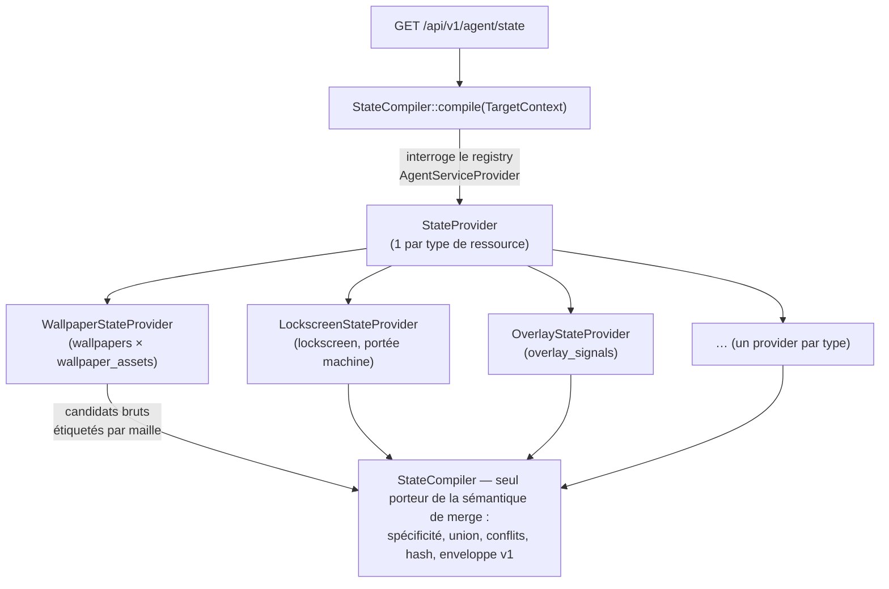

# StateProviders & compilation d'état — `se5.desired-state/v1`

> **Côté serveur** du canal desired-state : comment l'état cible d'un couple
> (poste, user) est **calculé** depuis les tables métier, et comment on ajoute un
> type de ressource. Orthogonal à [contract-v1.md](contract-v1.md) (le wire
> format figé, qu'on ne modifie pas) et à [state-endpoint.md](state-endpoint.md)
> (qui sert le compilé via `GET /api/v1/agent/state`).

## Vue d'ensemble

Là où le canal legacy poussait la configuration des postes par GPO/SYSVOL,
l'agent **tire** son état cible : le serveur le compile à la demande depuis les
écrans d'administration existants.



Deux principes structurent l'ensemble :

- **L'état cible est une projection pure des tables métier.** Les écrans
  d'administration existants SONT la source : aucune table générique de règles,
  aucune ressaisie.
- **La sémantique de merge est implémentée une seule fois, dans le
  `StateCompiler`** (précédence par maille pour les types exclusifs, union pour
  les types aggregate). Un provider qui trie, filtre par maille ou applique la
  précédence lui-même est une **violation bloquante en review**.

## L'interface `StateProvider`

`App\Services\Agent\Contracts\StateProvider` :

```php
interface StateProvider {
    public function type(): string;                    // identifiant figé (contrat §7)
    public function semantics(): ResourceSemantics;    // aggregate | exclusive
    public function scope(): StateScope;               // machine | session | machine_user
    public function itemsFor(TargetContext $ctx): Collection; // candidats bruts par maille
}
```

`itemsFor()` retourne des `StateCandidate` (readonly) : `maille` (enum interne
`App\Enums\StateMaille`), `payload`, `updatedAt` + `sourceId` (récence pour
l'arbitrage des conflits + ids loggés). **Pas** des items finaux : le
compilateur applique la sémantique de merge, calcule `hash` via
`StateHasher::hashItem()` et assemble l'enveloppe.

Règles du provider :

- **Lecture seule** sur les tables métier — aucun write, aucun appel
  AD/LdapRecord/APCu (condition de la sortie vers Keycloak).
- Il restreint sa requête aux règles **applicables au contexte**
  (appartenances déjà résolues dans `TargetContext`) et étiquette chaque
  candidat par maille — c'est de l'applicabilité et de l'étiquetage, pas de la
  précédence.
- Jamais de float dans un payload (contrat §4.1) ; dates en ISO 8601 UTC.

L'item du contrat comporte 4 clés ; il n'y a **pas** de notion de mode sur
l'assignation — la cible fait toujours loi (convergence STRICT
inconditionnelle).

## `TargetContext`

`App\Services\Agent\TargetContext::for(Workstation $ws, ?User $user)` résout
**une fois** les appartenances depuis Postgres (pivot global + `user_group_user`) :
`physicalGroupIds` (salles, `is_physical = true`), `logicalGroupIds` (parcs),
`userGroupIds`. Les providers consomment ces listes et ne re-requêtent jamais
les appartenances.

`$user` est **nullable** : compilation machine-only (check-in boot) — les
mailles user sont alors vides, aucune erreur. Ne pas confondre avec
`App\Dto\Wallpaper\WallpaperContext` (canal legacy, hydraté depuis APCu).

## Chaîne de spécificité

```
user > groupes user > poste > WG LOGIQUE > WG PHYSIQUE > broadcast
```

Le **parc LOGIQUE** est une **sélection délibérée de postes** (transverse aux
salles) → plus spécifique que la **salle PHYSIQUE**. Cet ordre s'applique à
**TOUS** les types exclusifs (registry, wallpaper, associations) et à la
résolution du défaut `printers`.

Iso-legacy : le wallpaper plaçait déjà le user et ses groupes au-dessus de la
salle et de l'étab — un wallpaper personnel bat celui de la salle, comportement
connu des admins. La distinction legacy « type principal vs groupe AD » s'écrase
en UNE maille `groupes user` (un conflit entre deux groupes devient une règle
intra-maille, ci-dessous).

- **Type `aggregate`** : UNION des candidats de toutes les mailles applicables
  (la spécificité ne joue pas).
- **Type `exclusive`** : la maille la plus spécifique gagne. **Conflit
  intra-maille** : la règle la plus récente gagne (`updated_at` desc, tiebreak
  `id` desc — déterminisme du hash) + warning loggé `agent.state.conflict`
  (channel `agent`, contexte `workstation_id`, `type`, maille, ids des règles).
  Le warning n'est émis que pour la maille gagnante.

Le rang de spécificité vit dans `StateCompiler::specificity()` **seul** — ni
dans l'enum `StateMaille`, ni dans les providers.

## Déterminisme (exigence ETag)

Deux compilations du même état à des instants différents → même
`StateHasher::hashState()` (seul `generated_at` est volatil). Garanties :

- providers traités par `type` asc (`strcmp`), indépendamment de l'ordre
  d'enregistrement dans le registry ;
- intra-type aggregate : candidats triés par `sourceId` asc (overlay : `id` asc
  des signaux) ;
- conflits arbitrés avec tiebreak `id` desc (jamais d'ambiguïté à `updated_at`
  égal) ;
- aucun float, aucune clé volatile hors `generated_at`.

L'ordre de sortie est fixé par le serveur et significatif : le hasher ne trie
pas les listes (contrat §4).

## Payloads v1

> La sous-structure de `payload` est ownée par ce document (contrat §3.2) ; les
> payloads des golden files sont **illustratifs**.

### `wallpaper` — `exclusive` / `session`

```json
{ "asset": "9aa326c3….jpg", "checksum": "9aa326c3…" }
```

- `asset` : filename content-addressed de la bibliothèque (`<checksum>.<ext>`,
  cf. `WallpaperAsset::libraryPath()`), `checksum` : SHA-256 du fichier — ce que
  le handler compare en `test`.
- `{"asset": null, "checksum": null}` = règle explicite « pas de fond imposé »
  (contrat §8) — distinct du type absent (« aucune règle »).
- Mailles lues : broadcast (`owner_id` null + `is_default`), WG physique ou
  logique (owner `WorkstationGroup`, départagé par `is_physical`), groupe user
  (owner `UserGroup`), user (owner `User`).
- **Pas de champ `url`.** La route de serving existe
  (`GET /api/v1/agent/assets/wallpaper/{filename}`, route
  `agent.v1.assets.wallpaper` — cf. [handlers-wallpaper-overlay.md](handlers-wallpaper-overlay.md))
  mais le payload reste `{asset, checksum}` : l'agent construit l'URL depuis
  `server_url` + chemin documenté, comme pour `/state` et `/report`. Un champ
  `url` resterait ajoutable plus tard sans casse (champ ajouté = mineur, §9).

### `lockscreen` — `exclusive` / `machine`

```json
{ "asset": "9aa326c3….jpg", "checksum": "9aa326c3…" }
```

- **Pendant pré-login du `wallpaper`** : fond de l'écran de **verrouillage**,
  affiché AVANT toute session (LogonUI tourne en SYSTEM) → portée **`machine`**,
  appliqué par le **service SYSTEM** (`PersonalizationCSP`, HKLM), pas le
  compagnon. Payload **identique** à `wallpaper` (`{asset, checksum}`), même
  bibliothèque content-addressed, **même route de serving** (`agent.v1.assets.wallpaper`,
  agnostique au type) et même pré-téléchargement SYSTEM.
- `{"asset": null, "checksum": null}` = règle explicite « pas de fond de
  verrouillage imposé » (contrat §8), distinct du type absent.
- **Mailles lues : broadcast + WG physique/logique SEULEMENT** — jamais
  `UserGroup`/`User` : il n'y a pas d'utilisateur au verrouillage. C'est la
  restriction « niveaux 1-3 » (défaut système → étab → salle) que le résolveur
  legacy appliquait déjà au lockscreen.

### `overlay` — `aggregate` / `session`

Un item **par signal posté actif** (`overlay_signals`, union) :

```json
{ "kind": "info", "severity": "warning", "title": "…", "text": "…",
  "expires_at": "2026-06-12T08:00:00+00:00" }
```

**+ un item synthétique `identity`** (uniquement en contexte user — jamais en
machine-only) :

```json
{ "kind": "identity", "login": "mdupont", "fullname": "Marie Dupont",
  "room": "salle_201" }
```

- `expires_at` : ISO 8601 UTC ou null. Signal expiré = exclu à la compilation
  (l'état change réellement → l'ETag change : correct).
- Maille d'un signal : `user_login` → user ; `workstation_uuid` → poste ;
  `workstation_group_id` → WG (physique/logique selon le groupe) ; tout null →
  broadcast. Multi-critères → maille la plus spécifique (étiquette cohérente
  pour logs/tests ; sans incidence de précédence, aggregate).
- Item `identity` : `fullname` = users (fallback login), `room` = nom du WG
  **physique** du poste (null sans salle) — données STABLES (l'ETag ne bouge que
  si elles bougent), maille User, `sourceId` 0 (sort en tête de l'union).
  Permet au handler overlay de composer « identité user + parc » sans appel AD
  côté poste. Champ de payload owné par le provider (§3.2). Les alertes dérivées
  volatiles (quota, multi-session) restent HORS desired-state.

### `shortcuts` — `aggregate` / `machine_user`

Un item **par couple (raccourci actif × assignation applicable)** — union des
mailles, dédoublonnée par contenu au compilateur :

```json
{ "name": "Intranet", "target": "https://intranet.example.edu",
  "args": "", "icon": "",
  "place": "desktop",
  "desktop_path": "\\\\<se4fs>\\users\\<user>\\Bureau\\" }
```

- **Lecture Postgres PURE** (`shortcuts` × `shortcut_assignables`, morph
  WorkstationGroup + Workstation + UserGroup + User restreint au
  `TargetContext`). Le ciblage AD-CN legacy (`ad_users`/`ad_user_groups`, cache
  APCu) n'est **JAMAIS** lu (condition Keycloak). Raccourci `is_active = false`
  = exclu.
- **`desktop_path` résolu côté serveur** via
  `WorkstationEnvironmentResolver::resolveForGroupIds()` — bureau **réseau** si
  le parc est `shared_local` (`\\<se4fs>\users\<user>\Bureau\`), bureau **local**
  si `personal_local`/`nomade` (`%USERPROFILE%\Desktop\`). C'est la donnée du
  domaine qui dicte le chemin. Les tokens `<se4fs>` / `<user>` (et les `%VAR%`
  Windows) restent dans le payload : l'agent les substitue **localement** (login
  courant, nom serveur) — aucune fuite de secret, aucune dépendance réseau au
  calcul. `desktop_path` n'est présent **que** pour `place=desktop`
  (startup/taskbar = chemins standards résolus par l'agent).
- **`scope=machine_user`** : le set dépend du user, le chemin du poste — le
  calcul est un croisement (poste, user). **`semantics=aggregate`** : le poste
  reçoit l'union de toutes ses mailles, sans précédence.
- **Convergence level-triggered** côté agent (handler Go `shortcuts`) : un
  raccourci retiré des règles **disparaît** au passage suivant ; un raccourci
  créé par l'utilisateur (hors marqueur de gestion) n'est **jamais** supprimé
  (cf. [`handlers-wallpaper-overlay.md`](handlers-wallpaper-overlay.md)).
- `place` ∈ `desktop|startup|taskbar` (iso `Shortcut::PLACE_*`). Tous les champs
  sont des strings (jamais de float, §4.1).

**Icône uploadée → asset statique content-addressed.** Le champ `icon` peut
porter soit un **chemin réel** (`firefox.exe,0`, `%APPDATA%\x.ico` — géré par
`ParseIconLocation` côté agent), soit le **nom NU** d'un raccourci dont l'admin a
**uploadé** une icône (`Calculatrice` — le `.ico` réel vit côté serveur). Le
provider reproduit la détection legacy `!preg_match('#[\\/.,%]#', $icon)`
(`ShortcutCompilerService:187`) : aucun séparateur de chemin/index ⇒ nom nu.
Quand c'est un nom nu **ET** qu'un asset content-addressed existe en base
(`shortcuts.icon_asset` non null), le payload **ajoute** deux champs
(forward-compatible) :

```json
{ "name": "Calculatrice", "target": "C:\\Windows\\System32\\calc.exe",
  "args": "", "icon": "Calculatrice",
  "icon_asset": "3a7b…abcd.ico", "icon_checksum": "3a7b…abcd",
  "place": "desktop", "desktop_path": "\\\\<se4fs>\\users\\<user>\\Bureau\\" }
```

- **PAS de champ `url`** : l'agent **dérive** l'URL depuis
  `server_url + "/assets/shortcut-icons/" + icon_asset` (Alias Apache statique
  scopé, cf. `config/apache/sambaedu.conf`).
- **Transport STATIQUE, pas token'd** (≠ wallpaper) : un `.ico` est un blob
  public-safe ; l'agent fait un **GET HTTP simple** (sans token), vérifie le
  SHA-256 = `icon_checksum` **AVANT** écriture locale, dépose
  `%PROGRAMDATA%\SambaEdu\Agent\icons\<sha>.ico` (content-addressed, idempotent).
  Le content-addressing + checksum **EST** la garantie d'intégrité.
- **Lecture de colonnes pures** au render (`icon_asset`/`icon_checksum` lus,
  jamais hashés à la volée — le checksum est calculé à l'**upload**/au
  **backfill** et persisté). Invariant perf des providers préservé.
- **Convergence gracieuse** : un nom nu **sans** asset backfillé (`icon_asset`
  null) tombe sur `icon` brut, JAMAIS un asset cassé ; côté agent, un `.ico`
  local manquant/checksum KO ⇒ raccourci posé **sans IconLocation** (icône
  défaut), drift + re-sync au cycle suivant, JAMAIS d'icône « feuille blanche »
  ni d'erreur bloquant les autres raccourcis.
- **Backfill** : `php artisan shortcuts:backfill-icons` content-adresse les
  icônes uploadées **existantes** (name-addressed `<name>.ico` → `<sha>.ico`,
  copie jamais déplacement, dédup checksum) et renseigne les colonnes.

### `printers` — `aggregate` / `session`

Un item **par (imprimante × maille POSTE applicable)** — union des mailles
(salle physique + parc logique), dédoublonnée par contenu au compilateur :

```json
{ "cups_name": "imp-salle101",
  "connection": "\\\\<se4fs>\\imp-salle101",
  "description": "HP LaserJet salle 101",
  "location": "Salle 101",
  "is_default": true }
```

- **Lecture Postgres + CUPS PURE** (`printer_workstation_group` restreint aux
  `physicalGroupIds` + `logicalGroupIds` du `TargetContext`). L'imprimante est
  une **ressource de POSTE** (« l'imprimante de la salle ») : il n'existe
  **aucune** relation `UserGroup → Printer`, le ciblage est purement par maille
  POSTE. Aucun appel AD/LdapRecord/APCu (condition Keycloak).
- **`connection` = connexion LOGIQUE** : le partage Samba imprimante
  `\\<se4fs>\<cups_name>`, **jamais** l'URI back-end CUPS (`socket://…`,
  `ipp://…`). `CupsPrinterService::getPrinter()` est lu **uniquement** pour la
  métadonnée (`description`/`location`) — jamais d'écriture CUPS, jamais l'URI
  live. CUPS injoignable à la compilation = métadonnée vide, l'imprimante reste
  servie (la connexion logique est stable). Le token `<se4fs>` est substitué
  **localement** par l'agent.
- **`is_default` = sous-item `exclusive`** (drapeau de PAYLOAD, pas une
  sémantique de type) : réglé **explicitement** par l'admin sur l'attachement
  imprimante↔WG (colonne pivot `is_default`), valable pour un WG **physique
  comme logique**. L'unicité (un seul défaut par poste) est résolue **côté
  serveur** : parmi les WG porteurs d'un défaut applicables au poste, le **WG
  physique l'emporte sur le logique** ; départage déterministe `cups_name` asc à
  spécificité égale. **UN SEUL** `is_default: true` dans la collection. L'agent
  applique bêtement `SetDefaultPrinter` sur l'item marqué — il ne recalcule
  **jamais** la spécificité.
  > **⚠️ Invariant de garde** : `is_default` doit être résolu **GLOBALEMENT par
  > le provider** (un seul gagnant calculé sur l'ensemble des mailles),
  > **jamais** porté tel quel depuis le pivot brut au payload par maille. Raison :
  > la dédup aggregate du compilateur fusionne par CONTENU de payload. Si deux
  > candidats de la **même** imprimante (rattachée à 2 WG) portaient des
  > `is_default` divergents (`true` côté WG-défaut, `false` côté autre WG), leurs
  > payloads différeraient → **non dédupliqués** → l'agent recevrait l'imprimante
  > en double. La résolution globale garantit le même `is_default` sur tous les
  > candidats d'une imprimante donnée, donc la dédup tient. Ne pas régresser cet
  > invariant lors d'un refactor.
- **`scope=session`** (la connexion imprimante est per-user) ;
  **`semantics=aggregate`** (union sans précédence). Convergence level-triggered
  côté agent : une imprimante retirée des règles est **désinstallée** au passage
  suivant ; une imprimante installée par l'utilisateur hors périmètre SambaEdu
  n'est **jamais** désinstallée (marqueur de périmètre = serveur SambaEdu).
  > **Périmètre géré = serveur SambaEdu** : toute connexion per-user dont la
  > cible est `\\<se4fs>\…` est considérée **gérée** (donc désinstallable si hors
  > règles), **y compris** une connexion que l'utilisateur aurait ajoutée
  > lui-même vers le serveur SambaEdu. L'agent ne touche **jamais** une connexion
  > vers un **autre** serveur (`ListManaged` filtre par préfixe du serveur
  > SambaEdu). « Connexion vers le serveur SambaEdu = du ressort de SambaEdu ».
- **Retrait du défaut** : si l'admin **décoche** le défaut sur tous les WG (plus
  aucun `is_default: true` au payload), l'agent **laisse l'imprimante par défaut
  Windows en place** — Windows impose toujours UNE par-défaut, sans cible
  naturelle vers quoi rebasculer. Ni `Apply` ni `Test` ne touchent au défaut
  quand aucune cible n'est marquée (figé par
  `TestPrintersDefaultRemovedLeavesCurrentInPlace`).
- **Isolation des erreurs** : serveur d'impression injoignable à l'`apply` →
  statut `error` + détail pour le SEUL type `printers` ; `drives` et les autres
  types continuent (engine `RunPass` §5 réutilisé). Retry au cycle suivant.

### `drives` — `aggregate` / `session`

Le jeu **standard FIXE** des lecteurs réseau SambaEdu, géré **nativement** par
l'agent (et non plus par l'attribut AD `homeDrive`/`homeDirectory` ni la GPO
« lecteurs reseau » legacy — décision Henri 2026-06-29, successeur de GPO/AD) :

```json
{ "letter": "K:", "unc": "\\\\<se4fs>\\users\\<user>\\",  "label": "Mes documents" }
{ "letter": "H:", "unc": "\\\\<se4fs>\\classes\\",        "label": "Classes" }
```

- **K: = home** de l'utilisateur (partage `users`, sous-dossier = login) —
  `\\<se4fs>\users\<user>\`. C'est « Mes documents / Bureau ». Maille `user`.
- **H: = racine du partage `classes`** — `\\<se4fs>\classes\`. L'utilisateur
  navigue vers sa/ses classe(s) (`H:\Classe_<nom>\<login>`, ACL POSIX par élève).
  On ne cible **jamais** une classe unique : un user peut en avoir plusieurs
  (jusqu'à 3) — un lecteur par classe écraserait les autres. Maille `broadcast`.
- **Pourquoi natif** : le bon `K: = home` venait jusqu'ici du compte AD, pas de
  SE5 ; l'ancien provider posait un lecteur de CLASSE sur K:, **écrasant le home
  natif** pour les élèves. L'agent devient l'autorité sur les lecteurs.
- `I:` (Docs) et `L:` (Progs) ne sont **pas** portés : leur usage est couvert
  autrement en SE5 (fonds d'écran natifs, distribution applicative WPKG) ou
  relève d'un futur système de partages/ACL (module legacy `acls/`, restauration
  au déploiement via `/admin/sync-from-ad`).
- **Lettres figées serveur** (iso-legacy `individuel.php` : K=home, H=Classes).
  Tokens `<se4fs>` / `<user>` substitués **localement** par l'agent.
- **Émis pour toute session user**, indépendamment du `WorkstationEnvironment`
  (le resolver n'est **pas** consommé — un montage réseau est réseau par nature)
  et de l'appartenance à une classe (H: = racine du partage, ACL-gated). Contexte
  machine-only (user null) = aucun lecteur (un montage dépend du login).
- **`scope=session`** ; **`semantics=aggregate`**. Convergence level-triggered :
  un mapping retiré des règles est **démonté** ; un lecteur monté par
  l'utilisateur hors périmètre SambaEdu n'est **jamais** démonté (marqueur de
  périmètre = serveur SambaEdu).

#### Répertoires réseau gérés CONFIGURABLES (Story 34.1)

En **plus** du jeu fixe K:/H:, le provider émet un candidat par `network_shares`
applicable au `TargetContext`. Le payload reste **identique** au type figé —
`{letter, unc, label}`, aucun champ ajouté, donc **golden `state.v1.json` /
`FROZEN_STATE_HASH` PHP+Go INCHANGÉS** (quand aucune ligne `network_shares`
n'existe, la sortie est byte-identique au jeu fixe ; un test l'asserte) :

```json
{ "letter": "P:", "unc": "\\\\<se4fs>\\partages\\<directory_name>\\", "label": "<label>" }
```

- **Source** : table `network_shares` (le répertoire nommé) + pivot **polymorphe
  SQL** `network_share_assignables` (cible `User | UserGroup | WorkstationGroup`,
  porte `access = ro|rw`). Lecture **Postgres only** (ids du `TargetContext`),
  **zéro AD/LdapRecord/APCu**, zéro re-requête d'appartenance (NFR7, Keycloak).
- **Modèle d'accès à DEUX axes orthogonaux** (décision Henri 2026-06-29) sur le
  MÊME jeu d'assignations :
  - **Visibilité (montage)** : N'IMPORTE QUELLE maille assignée fait apparaître
    la lettre — `User` → maille `user`, `UserGroup` → `user_group`,
    `WorkstationGroup` → `physical_group`/`logical_group` selon `is_physical`.
    L'union / dédup / précédence du `StateCompiler` gère tout (ZÉRO modif
    compilateur). Un même répertoire atteint par plusieurs mailles produit le
    **même** payload → dédupliqué naturellement (zéro doublon).
  - **ACL POSIX (RO/RW réel)** : gouvernée **côté serveur** par
    `NetworkShareService` (`user:<login>` / `group:<unix>` à `rx`/`rwx` selon
    `access`), JAMAIS par le payload — `access` n'apparaît pas dans `{letter,
    unc, label}`. Une assignation `WorkstationGroup` est **montage-seul** (la
    lettre s'affiche sur les postes du parc, mais POSIX ne sait pas exprimer
    « les users de la machine X » — l'accès réel vient des grants user/group).
- **Lettre auto-assignée** : si `network_shares.letter` est null, le provider
  attribue déterministiquement la première lettre libre du pool **`M..Z`**
  (exclut `A,B,C,D,H,I,K,L` + toute lettre déjà émise « dans le même set »),
  shares triés par `id` asc. Une lettre forcée (`letter = 'P:'`) la fixe. La
  **collision de lettre entre deux répertoires DIFFÉRENTS** n'est pas gérée ici
  (volontaire — pas de surface de création en 34.1 ; sera bloquée par la
  validation prédictive d'une story UI ultérieure).
- **Export SMB** : un seul partage Samba `[partages]` → `/var/sambaedu/Partages`
  (provisionné en git — voir §ci-dessous), chaque répertoire = un sous-dossier.
  L'agent Go monte n'importe quelle lettre→UNC **sans modification**
  (`handler_drives.go` réutilisé tel quel, **pas de bump de version agent**).

##### Provisioning de l'export `[partages]`

> Historique : initialement cadré « infra serveur hors git ». Internalisé après
> validation e2e (sans le partage, le montage échoue `WNetAddConnection2 code=67`
> « Nom de réseau introuvable » — le paquet Debian `sambaedu` ne livre que
> `[users]/[classes]/[docs]/[progs]`, jamais `[partages]`).

Provisionné automatiquement, idempotemment, par
`scripts/update.sh:ensure_samba_partages_share()` (rejoué à chaque
`update.sh`/`install.sh`) :

- Dépôt du stanza versionné `scripts/config/smb-partages.conf` vers
  `/etc/samba/smb.conf.d/partages.conf`, inclus depuis `smb.conf` via une
  directive `include = <fichier précis>` (la directive `include` **ne globe
  pas**). Le stanza : `path = /var/sambaedu/Partages`, `read only = no`
  (l'accès réel est gaté par l'ACL POSIX de chaque sous-dossier), `inherit acls
  = yes`, `vfs objects = acl_xattr`.
- La racine `/var/sambaedu/Partages` est garantie par la fonction (`mkdir -p`,
  **traversable** `other r-x` → les participants `ro` atteignent leur
  sous-dossier) ; elle est sinon créée au premier `provision()` de
  `NetworkShareService`. `hide unreadable = Yes` (global) masque côté SMB les
  dossiers non lisibles.
- Validation `testparm` + reload `smbd` à chaud intégrés à la fonction.
- Diagnostic : `php artisan sambaedu:doctor --tag=filesystem`
  (`PartagesShareCheck`) signale l'absence ou le mauvais `path` du partage.
- **Sudoers** : déjà couvert — `/etc/sudoers.d/sambaedu` whiteliste
  `setfacl/getfacl/mkdir/mv/chown/chgrp` **par binaire** (path-agnostique), donc
  les commandes sous `Partages` passent sans nouvelle entrée.

### `registry` — `exclusive` PAR IDENTITÉ DE CLÉ / `machine` + `session`

> Le registre n'est **pas** une table d'authoring : c'est une **PROJECTION de
> capacité**. L'admin manipule une **capacité** (intention métier OS-agnostique
> — « Afficher les extensions », « Bureau à distance », « MAJ Windows gérées »…),
> jamais une clé de registre. La table centrale est `capabilities` ; le registre
> est une `capability_projections` (mechanism `registry`). Le payload `registry`,
> le `StateCompiler`, le contrat et le handler Go sont identiques quel que soit
> l'authoring : l'item reste `{hive, path, name, type, value}`.

#### Modèle capacité → projection → item (3 couches)

- **Capacité** (`capabilities`) : intention métier. Porte le modèle de valeur
  (`value_type` = toggle/enum/scalar, `options`), le **défaut diffusé**
  (`default_value`), les métadonnées (`warning`, `applies_to_os`), `is_active`,
  `overrides_locked`. Le `key`/`id` ne fuite **JAMAIS** au payload (invariant
  central, piège n°1).
- **Projection** (`capability_projections`, unique `(capability_id, os,
  mechanism)`) : COMMENT l'intention se matérialise sur un `os` via un `mechanism`
  (= `type` du contrat). `registry` est publié ; un nouveau mécanisme
  (firewall/localgroup) = ajout au contrat figé + handler Go.
- **Item de contrat** : concret, mécanisme-typé, ce que l'agent reçoit.

#### Interpréteur de `spec`

Une projection registry porte `spec = { "keys": [ {hive, path, name, type, value},
… ] }`. Pour chaque clé **de la ruche du provider**, `value` est résolu contre la
**valeur effective de capacité** (`assignment.value ?? default_value`) :

- **littéral** (scalaire OU liste détectée par `array_is_list($value)`, ex.
  MULTI_SZ `["a","b"]`) → **toujours émis** quand la capacité s'applique ;
- **map** valeur-capacité → donnée (objet assoc, ex. `{"on":0,"off":1}`) → on
  cherche la valeur effective ; **clé de map absente ⇒ la clé n'est PAS émise**
  (= cesser de gérer cette clé, ex. bundle on-only `{"on":1}` : un override `off`
  n'émet rien). Disambiguïsation map vs littéral-MULTI_SZ via `array_is_list`.

Puis **coercition par `type`** (DWORD/QWORD→int, MULTI_SZ→liste de chaînes,
SZ/EXPAND_SZ→chaîne) pour le contrat §4.1 (**zéro float**).

> ⚠️ **Coin liste vide.** `array_is_list([]) === true` → un littéral `value: []`
> est traité comme **littéral liste** (MULTI_SZ vide ÉMIS), PAS comme « cesser de
> gérer ». Pour « cesser de gérer » une clé selon la valeur de capacité, utiliser
> **une map** sans la valeur effective (ex. on-only `{"on":1}`), jamais `[]`.

#### Compilation

- **DEUX providers, UN handler Go.** `RegistryMachineCapabilityProvider`
  (`hive=HKLM`, `scope=Machine`) et `RegistryUserCapabilityProvider`
  (`hive=HKCU`, `scope=Session`) ; logique commune dans
  `AbstractCapabilityStateProvider`. Côté agent : UN seul handler Go `registry`
  (HKLM par le service SYSTEM, HKCU par le compagnon). Note **HKCR** : routé en
  `HKCU\Software\Classes\…` (vue per-user, ex. `onedrive_hidden`).
- **Ruche `HKU` (Story 35.3, contrat §7.1) : troisième valeur de `hive`,
  MACHINE-only.** Une clé `hive: 'HKU'` est émise par le provider **Machine**
  seul (prédicat `handlesHive()` surchargé — les autres providers gardent le
  défaut byte-identique) : le service SYSTEM la **fan-out** vers `HKU\.DEFAULT`
  (écran de logon, ex. numlock au logon) + chaque ruche utilisateur chargée
  (`HKU\<SID>`), à chaque cycle — fan-out INTERNE au handler agent, l'item
  reste UN item (hash inchangé par le nombre de sessions), drift AGRÉGÉ. Le
  `path` de `spec` ne porte jamais `.DEFAULT\` (le handler préfixe). Pas de
  ciblage par utilisateur (structurel : le service fetch sans `?user`) ; maps
  HKU/HKCU jumelles valeur-consistantes ; `HKU` REFUSÉ en `registry_list`
  (guard). Débouché : les clés `HKCU\Software\Policies\*` (lecture seule pour
  l'utilisateur, leçon fix-Copilot) deviennent diffusables en machine/parc.
- **Broadcast (défaut diffusé) + override par maille.** Le provider émet, par
  capacité applicable : (1) un lot de candidats **Broadcast** pour `default_value`
  (`sourceId` = `capability.id`, maille `Broadcast`) ; (2) un lot par maille par
  assignation applicable, valeur effective = `assignment.value ?? default_value`.
  Candidats **BRUTS** (aucune précédence/tri/dédup). La précédence (`logique >
  physique > broadcast`) fait que l'override bat le défaut **pour cette clé**.
- **Bundle = une capacité → N candidats.** Une projection de N clés produit N
  candidats (un par clé émise), tous au même `sourceId`. Deux capacités
  définissant la **même** clé → collision arbitrée par la récence au compilateur.
- **Exclusive PAR IDENTITÉ DE CLÉ** (`KeyedExclusiveProvider`,
  `exclusiveKey={hive,path,name}` insensible à la casse).
- **Lecture Postgres pure** : `capabilities` actives (projection registry
  windows) × `capability_assignments` restreint aux ids du `TargetContext`.
  Aucun AD/APCu/`samba-tool`.
- **« Retirer un override = revenir au défaut ».** Supprimer la ligne
  `capability_assignments` fait re-converger le poste vers `default_value` au
  cycle suivant (PAS « cesser de gérer »). Métadonnées d'authoring (`options`,
  `warning`, `overrides_locked`) = serveur/UI uniquement, **jamais** au payload.
- **Rapport unique-type** : les deux portées émettant `registry`, l'agent
  fusionne par type avant le POST /report (`MergeReportItemsByType`, pire statut
  gagne).

#### Limites connues

- **`REG_EXPAND_SZ` comparé en littéral non développé.** `RegistryHandler.Equal`
  compare la chaîne cible telle quelle (NFC), et `registryOps.Read` lit la valeur
  BRUTE non développée (écriture via `SetExpandStringValue`). Si un autre acteur a
  stocké la valeur DÉJÀ développée (`C:\Users\…` au lieu de `%USERPROFILE%\…`) ou
  avec une casse de variable différente, l'agent verra un **drift permanent** et
  réécrira à chaque cycle. Le set initial du catalogue n'a aucun `REG_EXPAND_SZ` →
  impact nul aujourd'hui ; à garder à l'esprit quand le catalogue grossit par data.
- **`registry` machine + session collapsé en UNE ligne d'état serveur.** Le
  contrat §6 exige des types uniques au rapport ; quand un poste a des clés HKLM
  (machine) ET HKCU (session), les deux verdicts sont fusionnés
  (`MergeReportItemsByType`, pire statut gagne) → l'ingestion écrit UNE ligne
  `agent_resource_states(poste, 'registry')`. Conséquences : (a) si le hash
  dominant alterne entre les deux portées d'un cycle à l'autre, un
  `AgentReportEvent` peut être émis sans dérive « réelle » d'une ressource
  unique ; (b) un seul `detail` survit → on ne distingue pas côté serveur « HKLM
  en erreur » de « HKCU en erreur ». Acceptable en v1 ; un raffinement futur
  (sous-type `registry:machine`/`registry:session` ou portée au rapport) lèverait
  la limite.

### `registry_list` — `exclusive` PAR CLÉ-CONTENEUR / `machine` + `session`

Story 35.2 (contrat §7.6) — listes registre à **sous-valeurs indexées** `\1..\N`
(policies Windows type `ExtensionInstallForcelist`, `DisallowRun`), hors
d'atteinte du mécanisme `registry` (item à `name` fixe, rien ne réconcilie les
entrées surnuméraires). Même modèle capability-first que `registry` : la table
d'authoring est `capabilities`, la liste est UNE projection
(`capability_projections.mechanism = registry_list`).

- **Bi-projection (D5).** L'unique `(capability_id, os, mechanism)` autorise
  une capacité à porter `registry` ET `registry_list` sur le même OS —
  `blocked_executables` inaugure : flag `…\Policies\Explorer!DisallowRun = 1`
  (registry) + entrées `…\Policies\Explorer\DisallowRun\1..N` (registry_list).
  Chaque provider ne voit que SA projection (`itemsFor()` filtre par mécanisme).
- **Interpréteur de `spec`.** `spec = { "keys": [ {hive, path, entry_type,
  values}, … ] }` ; `values` = littéral LISTE (toujours émis) ou map
  valeur-capacité → liste (clé absente ⇒ UNMANAGED ⇒ conteneur non émis).
  **Liste vide `[]` = vraie valeur** (« purger les entrées numérotées », le
  « off » honnête d'une liste) — le marqueur `$ensure` de 35.1 n'existe PAS en
  registry_list (forme assoc résolue ⇒ non émis défensif). `entry_type ∈
  REG_SZ | REG_EXPAND_SZ` (défaut REG_SZ ; hors contrat ⇒ non émis). Payload
  émis = EXACTEMENT `{hive, path, entry_type, values: list<string>}` — jamais
  de `name`, jamais d'id de capacité, zéro float.
- **DEUX providers, UN handler Go.** `RegistryListMachineCapabilityProvider`
  (HKLM, `scope=Machine`, SYSTEM) et `RegistryListUserCapabilityProvider`
  (HKCU, `scope=Session`, compagnon) — mêmes casiers que `registry`, logique
  commune dans `AbstractRegistryListCapabilityProvider` (généralisation
  minimale de `AbstractCapabilityStateProvider` : `mechanism()` paramétré,
  `expand()` surchargé — le mécanisme `registry` reste byte-identique).
- **Exclusive PAR CLÉ-CONTENEUR** (`exclusiveKey = {hive|path}` minuscules,
  2 segments — jamais de `name`) : la maille la plus spécifique gagne la
  clé-conteneur **ENTIÈRE** par la précédence existante du `StateCompiler`
  (INTOUCHÉ, D2) — **jamais d'union/fusion de listes entre mailles** ; les
  conteneurs distincts s'accumulent.
- **Réconciliation D3 côté agent** (`RegistryListHandler`, op additif
  `RegistryOps.ValueNames`) : l'agent POSSÈDE les valeurs au nom NUMÉRIQUE
  (`^[0-9]+$`) de la clé-conteneur — écrit `"1".."N"` dans l'ordre, supprime
  les noms numériques hors canon strconv (`"01" ≠ "1"`, comparaison stricte).
  Jamais une valeur à nom non numérique, jamais la clé-conteneur elle-même
  (liste vide = purge des seules entrées numérotées). Changement effectif HKCU
  ⇒ rafraîchissement shell (même gate que registry ; `DisallowRun` est lu par
  l'Explorer au logon SUIVANT).
- **Garde-fou d'authoring** (`CapabilitySpecCollisionGuard`, service pur +
  invariant `CapabilitiesSchemaAndSeedTest`) : une clé-conteneur ciblée à la
  fois par un scalaire `registry` et un `registry_list` est REFUSÉE (les
  `exclusiveKey` sont incomparables, le compilateur ne peut pas arbitrer).
  Parent/enfant (`…\Explorer` vs `…\Explorer\DisallowRun`) ≠ collision.
- **`registry_list` machine + session collapsé en UNE ligne d'état serveur** —
  même mécanique (et mêmes limites) que `registry` : fusion par type au
  rapport (`MergeReportItemsByType`, pire statut), ingestion
  `agent_resource_states(poste, 'registry_list')`.
- **⚠️ Binaire antérieur = silence.** Un agent ≤ 2.3.0 IGNORE le type (contrat
  §8, aucun statut au rapport, aucune erreur) — publier la release **2.4.0**
  (update.sh ne publie jamais seul).

### `associations` — `exclusive` PAR IDENTIFIANT / `session`

Successeur natif du volet poste `associations.ps1`/`SFTA.ps1` (le canal legacy
`gpo/associations_out.php` reste intouché jusqu'à extinction). Table catalogue
**DÉDIÉE** `file_associations` + pivot `file_association_assignables` (morph
WorkstationGroup/Workstation/UserGroup/User).

- **UN provider, portée session.** `AssociationsStateProvider` (`scope=Session`) :
  l'association vit sous `HKCU` (UserChoice de l'utilisateur connecté), appliquée
  par le **compagnon** au logon. Pas de pendant machine (contrairement à
  `registry`) — l'association par défaut est intrinsèquement per-user.
- **Catalogue → items CONCRETS.** Chaque association se **compile** en un payload
  `{identifier, progid, type}` concret (cf. [contract-v1.md](contract-v1.md)
  §7.2). 🔴 **Invariant central** : le `key`/`id` du catalogue ne fuite **JAMAIS**
  au payload. 🔴 **Le hash UserChoice n'est JAMAIS au payload** : il dépend du
  SID/timestamp/GUID « user experience » du poste → calculé **100 % côté agent**
  (piège n° 2).
- **Exclusive PAR IDENTIFIANT** (`KeyedExclusiveProvider`). Une extension/un
  protocole = UN programme par défaut ; le `StateCompiler` groupe les candidats
  par `exclusiveKey(payload)` = `identifier` (insensible à la casse) et arbitre
  CHAQUE groupe : la maille la plus spécifique gagne **pour cet identifiant** (WG
  logique > WG physique), les identifiants distincts **s'accumulent**. Même
  mécanisme générique que `registry` — zéro modification du compilateur.
- **Lecture Postgres pure** : catalogue × pivot restreint aux ids du
  `TargetContext`. Aucun AD/APCu/`samba-tool`. ⚠️ **NE réutilise PAS** la
  dépendance APCu/WPKG de `AssociationsResolver` — le canal desired-state lit
  Postgres et lui seul.
- **Couplage app installée.** Le provider **émet** l'item tel quel (pas de filtre
  WPKG). Côté agent : si le **ProgId cible n'est pas enregistré** sur le poste,
  le handler **ne supprime pas et ne réécrit pas** la clé UserChoice existante →
  **choix utilisateur préservé** (pas de clobber), statut `error` **non fatal**
  (`detail` = « ProgId X non enregistré, choix utilisateur conservé »), **pas de
  réécriture en boucle**.
- **Reproduction legacy.** Migration de seed (baseline figée
  FirefoxHTML/FirefoxURL + visionneuse photos, iso fixture
  `legacy-associations-out.json`) **+** `FileAssociationSeeder` (câblé dans
  `DatabaseSeeder`, idempotent/rejouable) qui **parse `default.xml` legacy** quand
  il est lisible (VM/prod) sinon retombe sur la baseline. But : à la bascule, les
  défauts d'associations sont déjà en base — zéro régression.
- **« Désactiver = cesser de gérer ».** Une association retirée disparaît →
  l'agent ne touche plus la clé (le choix courant reste, pas de reset OFF, §8).
- **Catalogue tagué `native` / `wpkg` + validation PRÉDICTIVE UI.** Chaque
  entrée porte une `source` SERVEUR-only : `native` (built-in Windows, ex.
  `.txt → txtfile`, `.jpg → WindowsPhotoViewer` — toujours applicable) ou `wpkg`
  avec `wpkg_package` = le `<package id>` WPKG d'origine (= `Application::app_id`).
  L'**UI** d'assignation calcule, par parc, un statut EXACT : `native` →
  applicable ; `wpkg` & paquet déployé sur le parc → applicable ; `wpkg` & paquet
  NON déployé → **`unavailable`** affiché AVANT déploiement (warning rouge +
  tooltip nommant le paquet : « `<pkg>` n'est pas déployé sur ce parc → cette
  association échouera ici », toast EXACT à l'activation). Source du déploiement
  par parc = requête **group-level Eloquent PG-pure** (`appProfiles.applications`
  + `applications` directes du `WorkstationGroup` + déps transitives), **SANS le
  cache APCu** de `WorkstationPackagesResolver`. 🔴 Ce croisement WPKG vit
  UNIQUEMENT dans l'UI (Livewire) : `AssociationsStateProvider` reste PG-pur et
  **émet toujours** ; `source`/`wpkg_package` ne fuient JAMAIS au payload contrat.
  L'agent (`ProgIDRegistered`) reste le dernier rempart sur un poste divergent.
  Clé de jointure vérifiée : `<package id>` (clé du reader
  `PackagesXmlAssociationsReader`) = `Application::$app_id` (sortie du resolver) —
  `PackagesXmlService::regenerate()` émet le `$app->xml` dont la racine
  `<package id>` vaut `app_id`.
- **Composer + resolver riche/générique.** L'UI offre un **composer** : l'admin
  saisit une extension/protocole et choisit une app PAR SON NOM (apps WPKG
  `Application` + natives Win32 curées `NativeApplication`, UWP exclues). Un
  service serveur **`AssociationResolver`**
  (`App\Services\Agent\Resolvers\AssociationResolver`, **PG-pur**) traduit
  *(extension X, app A)* → *(progid, source, wpkg_package)* : (1) **A native
  curée** déclarant X → ProgId canonique (`txtfile`…), `source=native` ;
  (2) **A WPKG déclarant un handler POUR X** (`packages.xml`) → ProgId **riche**,
  `source=wpkg`, `wpkg_package=A.app_id` ; (3) **sinon** → ProgId **générique**
  `Applications\<exe de A>` (`source=wpkg`/`native` selon A). Le résultat est
  **upserté** comme ligne `file_associations` (clé `catalogKey(identifier,
  progid)`) attachée au parc — **payload aval inchangé**. La lecture
  `packages.xml` du resolver est un geste d'**administration** admis (hors chemin
  desired-state, iso `FileAssociationSeeder`) — `AssociationsStateProvider` reste
  PG-pur. **Donnée** : `applications.executable` (nullable) + table
  `native_applications` (`{label, progid, executable, assoc_types}`, seedée
  idempotente). **Garde-fou (piège n°4)** : générique requis sans exe →
  composition refusée (le `%1` est obligatoire dans la commande générée).
- **Agent : auto-enregistrement per-user du générique.** Pour un ProgId
  générique `Applications\<exe>` non enregistré, le **compagnon** (droits user)
  résout le chemin de l'exe sur le poste (`App Paths`/PATH — jamais reçu du
  serveur) et écrit
  `HKCU\Software\Classes\Applications\<exe>\shell\open\command = "<chemin>" "%1"`
  AVANT d'imposer UserChoice (aucune écriture HKLM/admin). `ProgIDRegistered` est
  raffiné **pour ce cas générique uniquement** (vérifie `shell\open\command`, pas
  juste le nœud). Exe introuvable → abstention (pas de clobber). Le hash
  UserChoice (`getHash`) et `WriteUserChoice` sont **réutilisés tels quels**.

#### Le hash UserChoice (cœur de risque)

Le handler `agent/shared/handler_associations.go` porte FIDÈLEMENT l'algorithme
`SFTA.ps1::Get-Hash` (~565-711) : `baseInfo = ("{identifier}{sid}{progid}{dateTimeHex}
{userExperience}").ToLower()` → **MD5 sur l'encodage UTF-16LE** de `baseInfo + "\x00\x00"`
→ deux passes de dérivation à constantes → 16 octets → XOR fold 8 octets → **Base64**.
La logique pure (calcul du hash) est **testable hôte** (`handler_associations_test.go`,
**vecteurs de hash** verrouillés contre un portage indépendant) ; les ops Windows
(SID via token de processus, FileTime hex secondes mises à zéro, GUID `{D18B6DD5-…}`
extrait de `shell32.dll`, écriture HKCU + **suppression-avant-réécriture** de la clé
UserChoice à ACL hérité) vivent dans `handler_associations_windows.go`. Une seule
constante fausse = hash silencieusement rejeté par Windows = association non
appliquée — d'où les tests vectoriels obligatoires.

### `app_config` — `aggregate` PAR `app_kind` / `machine`

Successeur natif du canal export-FS des policies d'app (`exportToFs` →
`/etc/sambaedu/applications/{kind}/*.json`, tiré par GPO/scripts WPKG — le canal
legacy reste intouché jusqu'à extinction). Contrairement à `registry`/
`associations` (types sans table métier propre), `app_config` est dans le cas
`wallpaper`/`printers` : la **table métier existe déjà** (`app_customizations`)
avec son service de résolution. **On la LIT, on ne la double pas** (créer une 2ᵉ
table de policies = doublon de source de vérité, interdit).

> **Deux mécanismes legacy distincts.** Le legacy traite Firefox via DEUX
> mécanismes qui coexistent : (A) **config** = `policies.json` (marque-pages,
> page d'accueil, extensions, proxy), écrit dans
> `%ProgramFiles%\Mozilla Firefox\distribution\policies.json` = **machine-wide,
> contexte SYSTEM/admin, PAR-PARC** — **c'est le périmètre de `app_config`** ;
> (B) **profil user** = jonctions/redirection du dossier profil vers le home
> (roaming) — **HORS périmètre** (sujet roaming). Le par-user de Firefox est le
> Mécanisme B (le PROFIL), PAS `policies.json`.

- **Provider `AppConfigStateProvider`** (`aggregate` / `machine`) : un candidat
  PAR `app_kind` (`AppKind::cases()` = Firefox, Thunderbird), résolu via
  `AppCustomizationService::resolvePoliciesForMachine($wg, null, $kind, 'windows')`
  — **`$user = null`** : résolution PAR PARC, niveaux **1-4** (template → auto
  proxy/DNS/popup → défaut étab → WG). Les niveaux 5-6 (UserGroups/User) ne sont
  PAS résolus (le par-user de Firefox = le profil, Mécanisme B). **PG +
  config-pur** : le cache APCu `CacheAppContextRepository` sert l'AUTRE canal
  (legacy-port), jamais ce chemin.
- **Pourquoi `machine`.** `policies.json` est **machine-wide**, posé sous
  `%ProgramFiles%\…\distribution\` (ACL admin-write). Un compagnon aux droits
  user prendrait `ACCESS_DENIED` à chaque logon — la portée est donc **`machine`** :
  le **service SYSTEM** écrit le fichier (iso le handler `registry` HKLM). La
  config est par-parc (parité legacy) ; le par-user de Firefox passe par le
  profil (Mécanisme B / roaming).
- **Impédance « WG unique » vs « mailles ».** `resolvePoliciesForMachine` prend
  UN `WorkstationGroup`, alors que le `TargetContext` expose des LISTES de
  mailles. Le provider collapse l'axe WG en feedant le WG **gagnant en
  précédence** du poste (`logique > physique`, aligné sur
  `StateCompiler::specificity()`) → un candidat par app. Sans ce collapse, itérer
  tous les WG produirait plusieurs items Firefox (un par override de WG).
  - ⚠️ **Tiebreak multi-parcs logiques (limite connue).** Un poste appartenant à
    PLUSIEURS parcs logiques avec des policies différentes : seul le WG gagnant
    (précédence, puis **plus petit id** — déterminisme) est résolu ; les autres
    parcs logiques sont **silencieusement ignorés**. `policies.json` est
    machine-wide (un fichier par install) : il ne peut pas porter deux configs
    Firefox concurrentes. Tiebreak documenté ici et dans le docblock du provider.
- **Payload `{app_kind, policies}`** : policies CONCRÈTES (jamais un id de
  scope/customization), sans float (§4.1 — un float de policy → string).
- **Handler `app_config`** (`agent/shared/handler_app_config.go` pur +
  `agent/windows/handler_app_config_windows.go`) : UN SEUL mécanisme — écrire le
  `policies.json` enterprise natif au chemin d'install de l'app (écriture
  atomique), level-triggered, drift STRICT, marqueur de périmètre (clé
  `_sambaedu_managed`). Enregistré dans le **MachineEngine SYSTEM** (portée
  machine). Réutilise `engine.go::ResolveItemStatus` (§5) + `AggregateHash`. La
  canonicalisation du `policies.json` (cible côté serveur ET fichier relu côté
  agent) passe par **UNE seule fonction** `shared.CanonicalJSON` (idempotence
  garantie sur les `json.Number`).

#### Limites connues

- **App butée sans mécanisme enterprise = non géré.** Une app qui écrirait un
  réglage **sans aucun `policies.json` exploitable** n'est **PAS bricolée** (pas
  de patch de config user, pas de hook) : le réglage est documenté comme non
  géré. Invariant : un handler n'écrit que via un mécanisme enterprise documenté
  de l'app.
- **Couplage installation.** Pour que la policy ait un effet, l'app doit être
  installée (canal `applications`/WPKG). Le service SYSTEM écrit sous Program
  Files ; si le dossier d'install est absent (app non installée), l'écriture
  échoue → `{status: error}` pour le seul type `app_config`, les autres types
  convergent (isolation `engine.go::RunPass`).
- **`policies.json` hors périmètre = conflit `error`.** Un fichier posé au chemin
  natif par un autre outil/admin (sans marqueur) n'est **jamais écrasé ni
  supprimé** (non-ingérence préservée). Mais comme la policy agent n'est alors PAS
  active, l'item de cette app est rapporté **`error`** (détail : « policies.json
  hors-périmètre présent, policy agent non appliquée ») au lieu de `compliant`
  (qui serait trompeur). Les autres apps/types convergent.
- **Chrome/Edge + redirection de profil = HORS périmètre.** Le legacy ne gère
  aucune policy Chrome/Edge ; la redirection de profil est un sujet **roaming**
  serveur (Mécanisme B, pas une policy client) → renvoyé au domaine
  roaming/`WorkstationEnvironment`.

### `applications` — `aggregate` / `machine`

- **Provider `ApplicationsStateProvider`** (`aggregate` / `machine`) : projection
  en LECTURE SEULE de l'**ensemble cible WPKG** d'un poste vers des candidats
  d'état. Un candidat **par `app_id` affecté** (union poste + groupes +
  dépendances transitives), payload concret `{app_id, name}`.
- **Single source of truth, NON CACHÉE.** Le provider réutilise la résolution
  WPKG existante via `WorkstationPackagesResolver::computePackages($hostname)` —
  la méthode **NON CACHÉE** (la logique d'union 4 sources + BFS de dépendances).
  Il n'appelle **JAMAIS** le wrapper `resolve()` (qui enveloppe
  `Cache::remember`/APCu — interdit dans un provider). Réimplémenter l'union/BFS
  ici divergerait de WPKG réel → interdit. Le grep garde
  `ldap|apcu|samba-tool|Cache::|LdapRecord|PackagesXml` est **vide**
  (commentaires exceptés).
  > ⚠️ **Préempter un faux positif de revue.** Le cas des associations (où
  > `AssociationsResolver` APCu n'est PAS réutilisé) concernait une lecture de
  > cache pour validation UI. Ici, la **résolution de l'ensemble** est la logique
  > métier centrale ; on la réutilise **non cachée** → le grep reste vide.
- **Maille `Broadcast`.** `computePackages($hostname)` résout déjà l'union
  poste + groupes + dépendances — résolution **finale, mono-sortie** (pas une
  liste de candidats par maille à composer). On émet donc chaque app comme
  candidat `StateMaille::Broadcast` ; le compilateur en `aggregate` fait l'union
  sans précédence à arbitrer (tous Broadcast). Alternative écartée : ré-étiqueter
  par maille d'origine (coûteux, sans valeur — aggregate ⇒ union de toute façon).
- **Portée MACHINE** : WPKG installe machine-wide → le service SYSTEM déclenche.
  `sourceId` = `Application::id` (PK stable, déterministe & injectif → ordre
  aggregate / ETag stable). `payload` = `{app_id, name}` — jamais une recette
  d'install (pas de version/`<check>`/`<install>`), jamais un id de
  catalogue/pivot/scope (invariant central, contrat §7.4).
- **« Un tuyau, deux outils ».** Le provider projette l'**ensemble** (les
  `app_id`), pas les recettes. Le handler agent **déclenche** WPKG (le moteur
  déclaratif, non absorbé) et lit `wpkg.xml`. Inventaire par app rapporté en
  champ additif (contrat §6) → `agent_application_inventory`.

### `fs_acl` — `exclusive` PAR ACE / `machine`

**Story 36.1.** Premier mécanisme **HORS-REGISTRE** de la bibliothèque de
capacités : des **ACE NTFS gérées** sur le poste. `FsAclCapabilityProvider`
(portée **Machine** — le service SYSTEM est le seul acteur des ACE NTFS) EXPANSE
une capacité → items concrets 6 clés `{path, trustee, ace_type, rights,
applies_to, ensure}` (cf. contrat §7.7). Même modèle capability-first que
`registry` : `AbstractCapabilityStateProvider` fournit Broadcast + overrides par
maille, `resolveKeyValue()` (map/littéral), `UNMANAGED` ; le provider ne SURCHARGE
que l'interpréteur `expand()` — `StateCompiler` INTOUCHÉ (D2). `hive()` renvoie
`''` (non applicable — piège #14 : `expand()` surchargé, `handlesHive()` jamais
consulté).

- **`exclusiveKey() = {path|trustee|ace_type}`** (3 segments minuscules) : la
  maille la plus spécifique gagne CETTE ACE ; deux ACE d'identités distinctes
  (mêmes `path`, trustees différents) **COEXISTENT** (cumul assumé, pas
  remplacement — pour un deny c'est un sur-masquage bénin). La précédence par
  maille se joue sur identité ÉGALE (ex. broadcast `off`/`absent` battu par un
  override de parc `eleves`/`present`).
- **Jetons d'audience (Q1, `AudienceTokens`)** : un `trustee` `@eleves`/`@profs`/
  `@personnels` est un **enum FERMÉ EN DUR** résolu par convention vers le groupe
  principal global (`Eleves`/`Profs`/`Administratifs`) — SI ce groupe existe dans
  `user_groups`. Jeton inconnu OU groupe absent ⇒ **entrée non émise + log
  warning** (jamais de payload avec un jeton brut). Un trustee littéral
  (`Domain Users`) part VERBATIM (résolu par LSA côté poste). AUCUNE UI, AUCUNE
  table d'audiences ; le groupe arbitraire est le formulaire 36.4.
- **Résolution SID côté POSTE (D5)** : le provider n'émet que des NOMS
  (Postgres pur, NFR7) ; l'agent résout le SID par LSA sur le poste joint.
- **Pas de ciblage par utilisateur** (piège #10, STRUCTUREL) : portée Machine ⇒
  le service fetch sans `?user` → un override UserGroup/User est SANS EFFET. « Qui
  est bridé » = le `trustee` du payload, « quels postes » = les assignations.
- **Validation d'authoring** (`FsAclAuthoringGuard`, service PUR réutilisé tel
  quel par 36.4) : refuse un `deny` sur principal système (`SYSTEM_TRUSTEES`), un
  `deny` à héritage descendant sur racine protégée (`PROTECTED_ROOTS` Q2 — le
  `deny list_folder folder_only` y reste autorisé), les enums hors domaine, un
  path non absolu, un jeton inconnu, et une capacité avec un `deny` sans
  `warning` non vide.
- **Limites (à documenter, pas sur-conçu)** : deux valeurs qui résolvent des
  TRUSTEES DIFFÉRENTS produisent des identités distinctes → les DEUX ACE
  convergent (piège #2) ; le retrait PROPRE passe par un `off` réel
  (`ensure:absent`), JAMAIS par la sentinelle `unmanaged` (piège #3 : type absent
  du state ⇒ handler non invoqué). Le store agent « dernier appliqué » réconcilie
  les orphelins au cycle suivant.

Capacité de preuve seedée : `program_files_browse_denied` (2 chemins × 2 trustees
= 4 entrées `deny list_folder folder_only`).

### `firewall` — `exclusive` PAR `rule_id` / `machine`

**Story 36.2.** Deuxième mécanisme **HORS-REGISTRE** : des **règles pare-feu
Windows possédées PAR GROUPE**. `FirewallCapabilityProvider` (portée **Machine**)
EXPANSE une capacité → items concrets `{rule_id, direction, action, remote_scope,
protocol, ensure}` (+ `remote_addresses` ssi `explicit`, + `ports` ssi tcp|udp —
cf. contrat §7.8). Jumeau structurel de `fs_acl` : `expand()` surchargé,
`StateCompiler` INTOUCHÉ (D2), `hive()` renvoie `''` (piège #14), `resolveKeyValue()`
hérité pour `ensure` (seul champ mappable — v1 minimal).

- **`exclusiveKey() = rule_id`** (1 segment minuscule) : la maille la plus
  spécifique gagne CETTE règle ; les `rule_id` distincts s'accumulent dans le
  groupe. Le `rule_id` est une **identité GLOBALE inter-capacités** (piège #10) :
  deux capacités émettant le même `rule_id` collisionnent (invariant de test
  d'unicité sur le catalogue seedé).
- **Propriété PAR CONTENEUR (D4, marqueur = le GROUPE, PAS de store)** : côté
  agent, le champ `Grouping = SambaEdu-Agent` de la règle EST le marqueur ; le
  handler réconcilie le groupe entier (iso `registry_list`), jamais les règles
  hors groupe, la politique par défaut ou le service. La traduction
  `remote_scope: internet` → plages inverses-RFC1918 (IPv4 `a-b` + IPv6
  `2000::/3`) vit dans le HANDLER (D6, figée + testée).
- **Écart assumé `ensure`** (piège #2) : `on` émet le MÊME `rule_id` en
  `ensure:absent` → la précédence par maille joue dans les deux sens et le groupe
  finit VIDE (« on ⇒ groupe vide »). `unmanaged` (défaut) = sentinelle (rien
  émis).
- **Validation d'authoring Q3** (`FirewallAuthoringGuard`, service PUR, câblé au
  runtime via `CapabilityProjectionObserver` en dispatch par mécanisme) : un
  `action: block` couvrant le réseau local (RFC1918/loopback/link-local/ULA) ou
  tout (`/0`) est REFUSÉ par **INTERSECTION mathématique d'intervalles** IPv4/IPv6
  (`PROTECTED_RANGES`, MIROIR du Go) — jamais un match textuel (`192.160.0.0/12`,
  `0.0.0.0/0`, `::/0` refusés). `block internet` reste AUTORISÉ (usage nominal).
  Échappatoire = `explicit` avec adresses PUBLIQUES. Le REFUS est aussi appliqué
  côté agent (Test ET Apply, défense en profondeur). Enums hors domaine, slug
  invalide, cohérences conditionnelles, ports hors 1-65535, et `block` sans
  `warning` sont également refusés.
- **Pas de ciblage par utilisateur** (piège #15, Q4, STRUCTUREL) : portée Machine
  → override UserGroup/User SANS EFFET. « Couper Internet » se cible par
  parc/salle.
- **Limites (à documenter, pas sur-conçu)** : type absent du state ⇒ handler non
  invoqué (piège #3) → une règle `block` survivrait (la salle resterait coupée) ;
  le retrait PROPRE passe par `on`, JAMAIS par `unmanaged`. Remède manuel : les
  règles du groupe `SambaEdu-Agent` sont visibles/supprimables dans `wf.msc`
  (marqueur DANS l'objet). Un proxy d'établissement peut re-donner Internet : le
  couper via une règle `explicit` sur son adresse PUBLIQUE.

Capacité de preuve seedée : `internet_access` (enum `unmanaged`/`on`/`off` — `off`
⇒ règle `block out internet any`).

## Ajouter un type de ressource

1. **Identifiant figé** : ajouter le type à [contract-v1.md](contract-v1.md) §7
   (snake_case, jamais renommé).
2. Choisir `semantics` / `scope` (constantes déclarées par le provider).
3. Écrire `App\Services\Agent\Providers\<Type>StateProvider` : lecture seule des
   tables métier, candidats étiquetés par maille, payload sans float.
4. L'enregistrer dans `AgentServiceProvider::register()` (une ligne dans le
   tableau du `StateCompiler`) — **zéro modification du compilateur**.
5. Tests unit du provider (mapping mailles, applicabilité, payload) ; le golden
   file n'évolue que si l'on veut illustrer le nouveau type (et alors : mise à
   jour SCIEMMENT du hash figé `ContractV1Test`).
6. Handler côté agent : `test`/`apply`/`report` idempotent.

## Environnement de poste (`WorkstationEnvironment`)

La **nature d'un poste** est une donnée du domaine portée **par parc** sur
`workstation_groups.environment` (colonne VARCHAR(32) nullable, cast enum
`App\Enums\WorkstationEnvironment`). Trois valeurs aux **identifiants figés** :

| Valeur | Sémantique |
|---|---|
| `shared_local` | Poste **partagé** : bureau réseau, profils redirigés. C'est le parc historique (salle de classe). **Défaut implicite.** |
| `personal_local` | Modèle **perdir / direction** : bureau local à l'utilisateur, données sur le home réseau (nominatif, pas déconnecté). |
| `nomade` | **Tout local avec synchronisation** (offline / resync). |

### Résolution multi-parcs

Un poste appartient à N parcs (sa salle physique + ses parcs logiques). Le
service `App\Services\Agent\WorkstationEnvironmentResolver` résout **un** seul
environnement avec la **précédence** :

    nomade > personal_local > shared_local

et le **défaut `shared_local`** quand aucune valeur n'est déclarée (poste sans
groupe, ou tous les parcs à `null`). La précédence vit **dans le service SEUL**
(parallèle `StateMaille`/`StateCompiler`) — ni dans l'enum, ni dans les
providers. `null` (« non déclaré ») reste distinct de `shared_local` (pas de
default SQL, pas de backfill).

Lecture **exclusivement Postgres** (`WorkstationGroup::whereIn('id', …)`),
JAMAIS d'AD / LdapRecord / APCu (même discipline que `TargetContext`). Pour la
consommation par un `StateProvider`, préférer
`resolveForGroupIds(TargetContext::workstationGroupIds())` — les ids sont déjà
résolus, le provider ne re-requête pas les appartenances.

### Mode nomade

**Le poste nomade est 100 % LOCAL, et c'est ASSUMÉ.** Concrètement, un poste
`nomade` :

- **n'a pas de profil utilisateur réseau** (ni itinérant, ni redirigé) ;
- **stocke ses documents en local sur la machine**, et ils **ne sont jamais
  supprimés** (le poste *est* la source de vérité de ses données) ;
- reçoit sa configuration (logiciels WPKG, raccourcis, wallpaper, …) par
  **l'agent desired-state**, qui converge comme sur tout autre poste. **C'est
  tout.**

> **Pas de redirection / offline / synchronisation serveur.** Un modèle
> « serveur = source de vérité + cache offline + resynchronisation » (Folder
> Redirection + Offline Files / CSC) est **écarté** : il ne correspond pas à
> l'exploitation réelle des nomades (qui gardent tout en local) et ajouterait une
> machinerie Windows lourde sans bénéfice recherché. **Conséquence explicitement
> acceptée** : si le portable est perdu/volé/en panne, ses données locales sont
> perdues (pas de copie serveur).

> **`clean_profiles` / `del-roam` ne concernent PAS les nomades.** Ces mécanismes
> legacy agissent sur le store des profils **itinérants** `/home/profiles`, par
> **user**, et sont **aveugles au poste** (`clean_profiles('*')` = purge des
> orphelins, action admin manuelle `ldap_cleaner.php?do=3` ; `del-roam.sh` =
> trim per-`${username}`, logon script SYSVOL). Un nomade n'ayant **pas de profil
> réseau**, ces mécanismes ne le touchent pas. La réimplémentation native du
> nettoyage de profils (pastille tableau user + purge des orphelins, calcul
> journalier) est un sujet **distinct**.

### UI

Onglet « Environnement » de `parc-settings` (SFC Livewire
`_partials/environment-tab.blade.php`) : un `<select>` par parc (logiques ET
physiques), Gate `update-workstationGroup` (même autorisation que l'édition d'un
parc), persistance via le modèle, toast de succès.

## Hors scope (et où ça vit)

| Sujet | Pourquoi pas ici | Où |
|---|---|---|
| Alertes overlay dérivées (quota, multi-session) | volatiles à chaque poll → détruiraient l'ETag ; métrologie temps réel, pas état cible | hors desired-state (composition locale par le handler ; identité stable servie par l'item `identity`) |
| Fallback wallpaper système (`default.jpg`), perso `/home/<user>/Photos`, override quota | features du canal legacy, pas des règles d'état serveur | canal legacy jusqu'à extinction |
| URL de téléchargement des assets | route de serving livrée, payload INCHANGÉ (« pas de champ url » ci-dessus) | [handlers-wallpaper-overlay.md](handlers-wallpaper-overlay.md) §2 |
| UI des warnings de conflit | le log structuré suffit à ce stade | UI conformité (suivi) |
