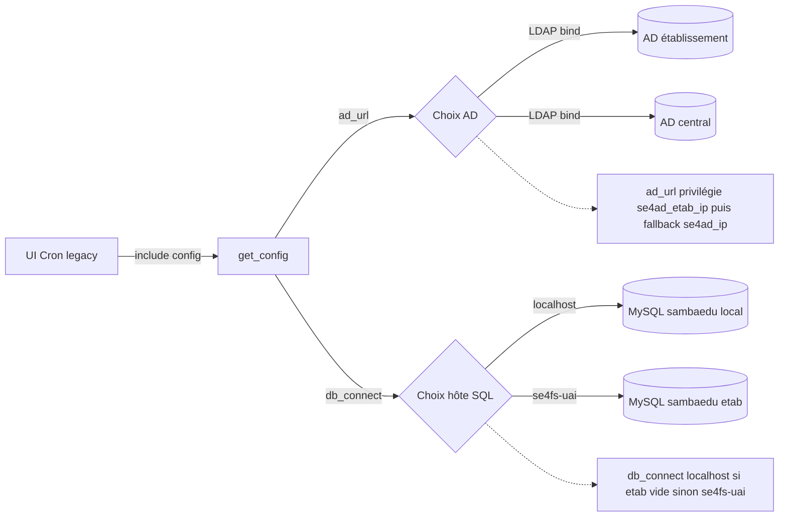
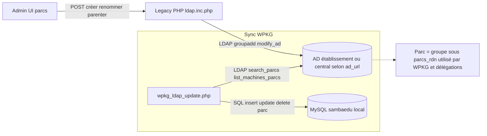
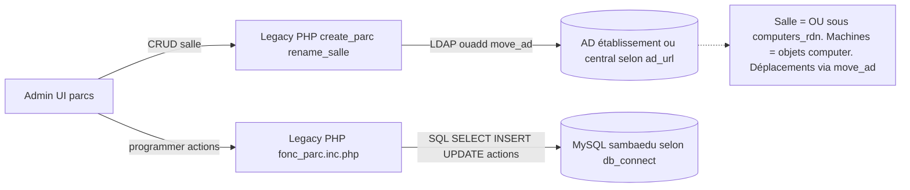
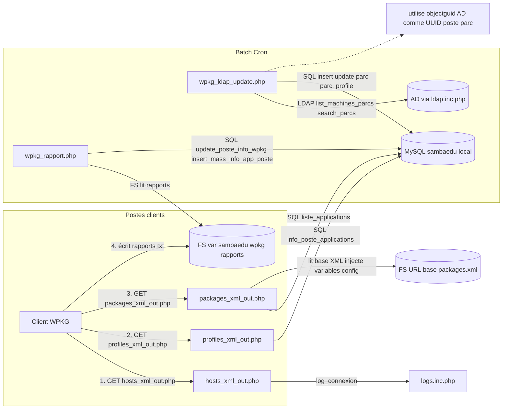
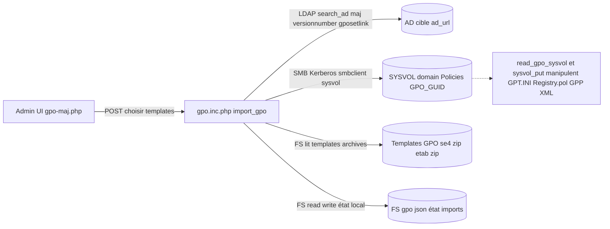
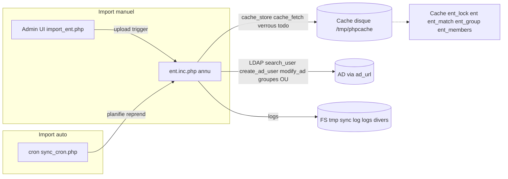
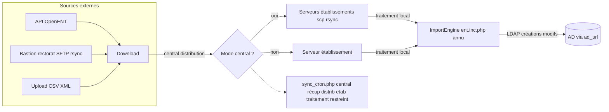
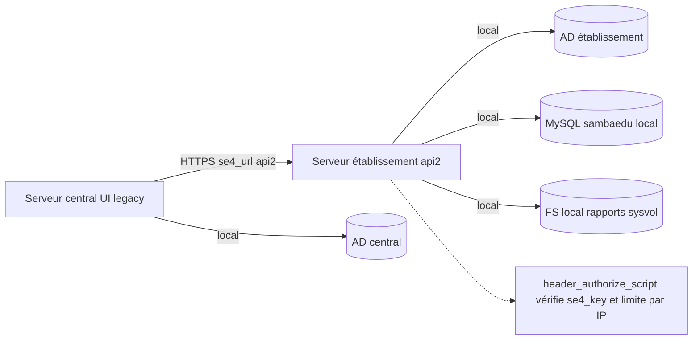

# Data flows (Legacy) — AD central / AD établissement / SQL

## Périmètre

- **[code concerné]** Tout le code legacy (tout sauf `/laravel`).
- **[objectif]** Décrire les flux de données entre :
  - **[AD établissement]** Active Directory du collège (quand présent)
  - **[AD central]** Active Directory central
  - **[SQL]** Base MySQL `sambaedu`
- **[référence d’implémentation]** Les chemins / fonctions cités ci-dessous sont ceux observés dans le legacy, notamment :
  - `includes/config.inc.php` (routage central/étab, `db_connect()`, `ad_url()`, `is_local()`)
  - `includes/ldap.inc.php` (LDAP/AD: `search_ad()`, `modify_ad()`, `search_parcs()`, `list_machines_parcs()`…)
  - `includes/wpkg_libsql.php` (SQL WPKG)
  - `includes/gpo.inc.php` (GPO: AD + SYSVOL)
  - `annu/*` (imports utilisateurs / sources)

## Terminologie (conventions utilisées dans ce document)

- **[serveur local / établissement]** serveur SE4FS d’un collège.
- **[serveur central]** serveur qui agrège (multi-établissements) et qui peut piloter des serveurs d’établissements.
- **[local vs central dans le code]**
  - `is_local($config)` (dans `includes/config.inc.php`) renvoie `true` si on est en “mode local”, typiquement si `etab_ou` est vide **ou** si `central_se4fs_ip` n’est pas défini.
- **[AD utilisé par défaut]** `ad_url($config, ...)` (dans `includes/config.inc.php`) privilégie l’AD établissement (`se4ad_etab_ip`) quand disponible, sinon l’AD central (`se4ad_ip`).
- **[multi-établissements]** `get_config()` construit des DN “scopés” par établissement quand `etab_ou` est non vide (ex: préfixe `OU=<etab_ou>,...`).

---

# Fondations communes (config / routage AD / routage SQL)

- **[rôle]** Tout le legacy s’appuie sur `get_config()` pour obtenir :
  - DN cibles (people, computers, parcs, groups, …)
  - un bind LDAP (`$config['bind']`)
  - les paramètres de routage (local vs central)

- **[AD]** `get_config()` crée un bind LDAP et stocke le handle dans `$config['bind']`.
- **[SQL]** `db_connect($config, $etab = 'localhost')` se connecte à MySQL `sambaedu` :
  - `localhost` pour le serveur courant
  - `se4fs-<uai>` si `$etab != 'localhost'`

- **[central only]** Le routage et la construction de DN (préfixe `OU=<etab_ou>`) sont critiques côté central quand on manipule des objets “par établissement”.

---

# Gestion des profils applicatifs (OU=Parc)

## Ce que le legacy manipule

- **[objet “profil applicatif”]** Dans le legacy, un “parc” (au sens applicatif) est principalement :
  - un **groupe AD** sous le conteneur “parcs” (`$config['parcs_rdn']`), utilisé pour WPKG / délégations.
  - (optionnel) une **OU** si le parc est de type “salle” (voir section suivante).

## Data stores

- **[AD]** Groupes “parcs” via `search_ad(..., "parc")` / `groupadd()` / `groupaddmember()`.
- **[SQL]** Tables WPKG (ex: `parc`, `parc_profile`) pour relier parcs ↔ machines ↔ applis.

## Code pivot

- **[LDAP]** `includes/ldap.inc.php`
  - `search_parcs($config, $search, $type)` combine “OU salle” + “groupe parc”.
  - `create_parc($config, $parc, ..., $type="parc"|"salle")` crée le groupe, et éventuellement l'OU.

> [!warning]
> Les fonctions `groupadd()` et `ouadd()` sont définies dans `includes/samba-tool.inc.php`, pas dans `ldap.inc.php`. Le fichier `ldap.inc.php` inclut `samba-tool.inc.php` via `require_once`.

- **[WPKG sync]** `wpkg/wpkg_ldap_update.php` : aligne les parcs AD avec les parcs SQL.

---

# Gestion des parcs de type salle (OU=computer)

## Ce que le legacy manipule

- **[salle]** une “salle” est une **OU** sous l’arbre computers (ex: `OU=<Salle>,OU=Computers,...`).
- **[relation salle → parc]** le legacy associe souvent une salle à un groupe (même nom) pour l’héritage / WPKG / délégations.

## Data stores

- **[AD]** OUs `computers_rdn` + objets `computer`.
- **[SQL]** tables d’actions planifiées côté parcs (ex: table `actions`) via `db_connect()` (cf `includes/fonc_parc.inc.php`).

## Code pivot

- **[LDAP]** `includes/ldap.inc.php`
  - `create_parc(..., $type="salle")` : crée **groupe + OU**.
  - `rename_salle(...)` : rename/move d’OU avec déplacement temporaire des machines.
  - `list_machines_parcs($config)` : calcule les “parcs” d’une machine via :
    - `memberof` (groupes parcs)
    - **hiérarchie d’OUs** sous `dn['computers']`
- **[UI]** `parcs/action_parc.php`, `parcs/create_parc.php`, `parcs/*`.

- **[central only]** certaines pages/status/actions peuvent “proxy” vers le serveur d’établissement via `/api2/...` (voir section “Autres”).

---

# Gestion des WPKG

## Ce que le legacy manipule

- **[référentiel WPKG]** stocké en SQL (postes, parcs, applis, dépendances, rapports…).
- **[réalité terrain]** les postes produisent des rapports texte et consomment des XML (packages / profiles / hosts).

## Data stores

- **[SQL]** `MySQL sambaedu` (tables typiques : `postes`, `parc`, `parc_profile`, tables applis/dépendances/rapports…).
  - Connexion via `includes/wpkg_libsql.php::connexion_db_wpkg()` (toujours `localhost`).
- **[FS]** rapports WPKG : `/var/sambaedu/unattended/install/wpkg/rapports/`.
- **[AD]** utilisé pour synchroniser l’inventaire machines/parcs (objectguid, appartenance, hiérarchie).

## Flux principaux

- **[AD → SQL]** alignement “inventaire” (machines/parcs) : `wpkg/wpkg_ldap_update.php`.
- **[FS → SQL]** ingestion des rapports : `wpkg/wpkg_rapport.php`.
- **[SQL → XML]** exposition des XML WPKG :
  - `wpkg/hosts_xml_out.php` (host)
  - `wpkg/profiles_xml_out.php` (profil poste)
  - `wpkg/packages_xml_out.php` (packages, filtrés selon applis actives en SQL)

---

# Gestion des GPO

## Ce que le legacy manipule

- **[AD]** objets GPO (container `CN=Policies,...`) + liens de GPO sur des OUs.
- **[SYSVOL]** contenu des GPO via le partage `sysvol` (copie de fichiers, lecture/écriture de `GPT.INI`, `Registry.pol`, GPP XML...).

## Data stores

- **[AD]** recherche via `search_ad($config, $name, "gpo")`, liens via `gposetlink()`.
- **[FS]**
  - templates GPO (paquets/archives),
  - cache local des exports/état (ex: JSON via `read_gpo_json()` / `write_gpo_json()`),
  - SYSVOL (accès distant via `smbclient`)

## Code pivot

- **[UI]** `gpo/gpo-maj.php`, `gpo/gestion_gpo.php`, …
- **[moteur]** `includes/gpo.inc.php`
  - `import_gpo(...)` : importe un template, pousse vers SYSVOL (`sysvol_put()`), met à jour attributs AD, (re)lie la GPO via `gposetlink()`.
  - `read_gpo_sysvol(...)` / `update_gpo_sysvol(...)` : lecture/écriture via `smbclient`.

- **[central only]** la gestion “globalisée” des templates/liste GPO peut être opérée sur le serveur central, mais techniquement c’est **l’AD ciblé par `ad_url(..., master=true|false)`** qui fait foi.

---

# Gestion des utilisateurs

## Ce que le legacy manipule

- **[AD]** utilisateurs (OU Eleves/Profs/Administratifs), groupes, droits, corbeille.
- **[SQL]** la “gestion utilisateurs” est majoritairement AD-centric dans le legacy (peu de persistance SQL directe), mais elle s’appuie sur cache/locks et sur des traitements batch.

## Points d’entrée

- **[UI]** `annu/import_ent.php` (assistant d’import)
- **[cron]** `annu/sync_cron.php` (orchestration import + reprise)

## Code pivot

- **[LDAP]** `includes/ldap.inc.php`
  - `search_user()`, `create_ad_user()`, `modify_ad()`, `delete_ad()`, etc.
- **[orchestration import]** `includes/ent.inc.php` + `annu/*`.

- **[central only]** dépend des sources : certaines récupérations/distributions sont centrales, tandis que l’application des changements peut être parallélisée par établissement (cf `annu/sync_cron.php`).

> [!warning]
> Le cache utilisé pour l'import ENT n'est **pas APCu** mais un **cache disque** défini dans `config.inc.php` (`CACHE_DIR = /tmp/phpcache`). Les fonctions `cache_fetch()`, `cache_store()`, `cache_delete()` utilisent des fichiers sérialisés, pas APCu. APCu est utilisé uniquement pour les verrous courts (`apcu_add()` pour `_lock`).

---

# Gestion des sources

## Ce que le legacy considère comme “source”

- **[OpenENT]** récupération en ligne via API.
- **[GPEI]** fichiers (SFTP/rsync) depuis un bastion rectorat.
- **[CSV/XML]** upload manuel (ENT type csv/xml/kosmos…).
- **[Autres]** `asm`, `pronote`, … (selon configuration).

## Central vs établissement

- **[central only]** `annu/sync_cron.php` indique explicitement le cas GPEI :
  - central : récupère et **distribue** vers les établissements
  - établissement : traite seulement les comptes de son établissement

---

# Autres (flux inter-serveurs central ↔ établissements via API2)

## Pourquoi c’est structurant

- Une partie du legacy est écrite pour fonctionner :
  - **en local** (serveur d’établissement) : accès direct AD/SQL/FS
  - **en central** : agrégation et déclenchement à distance sur les établissements

## Indices dans le code

- **[local vs central]** `includes/config.inc.php::is_local()`
- **[proxy HTTP]** `includes/parcs.inc.php` :
  - `machine_status()` / `parc_status()` : si non-local → appelle `/api2/status/machine` ou `/api2/status/parc`
  - `start_machine()` : si non-local → appelle `/api2/action/machine`

> [!warning]
> Les endpoints API2 sont plus précis que `/api2/status/*` : ce sont `/api2/status/machine` et `/api2/status/parc` distinctement.
- **[auth scripts inter-serveurs]** `includes/config.inc.php::header_authorize_script()` : check `REMOTE_ADDR == se4fs_ip` + `se4_key`.

