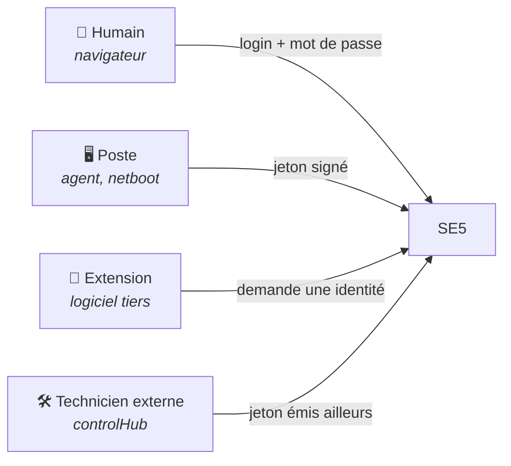

# Authentification & SSO

> **Porte d'entrée du domaine.** Qui frappe à la porte de SE5, comment on
> vérifie que c'est bien lui, et ce qu'il obtient. Le détail de chaque
> mécanisme vit dans les fiches liées.

---

## En une phrase

**Quatre sortes de visiteurs frappent à la porte de SE5, et chacun prouve son
identité autrement.** Un humain se connecte avec son mot de passe. Une machine
présente un jeton signé. Une extension demande à SE5 « qui est cet
utilisateur ? ». Un technicien extérieur arrive avec un jeton émis ailleurs.

Il n'y a pas un système d'authentification mais quatre, parce que ces quatre
visiteurs n'ont rien en commun : l'un a un navigateur et une session, l'autre
n'a pas d'écran, le troisième est un logiciel tiers, le quatrième n'existe pas
dans l'annuaire de l'établissement.

## Les quatre portes

| Visiteur | Ce qu'il présente | Ce qu'il obtient | Fiche |
| --- | --- | --- | --- |
| **Humain** | Identifiant et mot de passe, vérifiés sur l'annuaire | Une session web | [session-humaine.md](session-humaine.md) |
| **Poste** | Un jeton signé, obtenu à l'enrôlement | L'accès aux points d'entrée de l'agent | [poste-serveur.md](poste-serveur.md) |
| **Extension** | Un code d'autorisation, échangé contre un jeton d'identité | Le nom, le rôle et les groupes d'un utilisateur | [fournisseur-oidc.md](fournisseur-oidc.md) |
| **Technicien externe** | Un jeton signé par controlHub | Une session web, avec un rôle limité | [login-federe.md](login-federe.md) |

## Le pourquoi

Sur SE4, il y avait **une** authentification : l'annuaire. Une page de connexion
vérifiait le couple identifiant/mot de passe, ouvrait une session PHP, et tout
le reste en découlait. Les postes, eux, ne s'authentifiaient pas — ils
appelaient des scripts sur le réseau local, et **être sur le réseau valait
autorisation**.

Deux choses ont rendu ce modèle intenable :

- **un agent tourne maintenant sur chaque poste** et récupère un état de
  configuration. Un poste doit donc prouver *qu'il est ce poste*, pas seulement
  qu'il est branché quelque part ;
- **des logiciels tiers s'intègrent à SE5** (visioconférence, documentation) et
  ont besoin de savoir qui est l'utilisateur, sans qu'on leur confie son mot de
  passe ni un accès à la base.

Chacun des quatre mécanismes répond à un besoin distinct. Ils ne se remplacent
pas et ne se recouvrent pas.

## Parcours de lecture

**Tu enquêtes sur un poste qui n'arrive plus à parler au serveur.**
[poste-serveur.md](poste-serveur.md) — les trois causes fréquentes y sont, dans
l'ordre où les vérifier.

**Tu intègres une extension.** [fournisseur-oidc.md](fournisseur-oidc.md), puis
`docs/qa/domains/auth.md` pour ce qu'il ne faut pas casser.

**Un technicien extérieur ne peut pas se connecter.**
[login-federe.md](login-federe.md).

**Tu veux savoir pourquoi c'est fait ainsi.** [metier.md](metier.md).

## Carte des fiches

| Fiche | Axe | Sujet |
| --- | --- | --- |
| [metier.md](metier.md) | métier | Les décisions et leurs conséquences |
| [session-humaine.md](session-humaine.md) | technique | Connexion par mot de passe, et les trois autres voies d'entrée d'un humain |
| [poste-serveur.md](poste-serveur.md) | technique | Enrôlement d'un poste, jeton d'accès, renouvellement, révocation |
| [fournisseur-oidc.md](fournisseur-oidc.md) | technique | SE5 comme fournisseur d'identité pour les extensions |
| [login-federe.md](login-federe.md) | technique | SE5 recevant un jeton émis par controlHub |

Dette connue : [`tech-debt-auth.md`](../tech-debt-auth.md).
Checklists de pré-production : [`qa/domains/auth.md`](../qa/domains/auth.md),
[`qa/domains/federated-login.md`](../qa/domains/federated-login.md).

## Invariants à ne jamais casser

- **Aucun secret dans un journal.** Ni mot de passe, ni jeton complet, ni jeton
  de renouvellement en clair — même tronqué. Les traces portent des
  identifiants de jeton, jamais leur contenu.
- **Un jeton de renouvellement n'est jamais stocké en clair.** Seule son
  empreinte est en base ; sa valeur ne quitte le serveur qu'une fois, dans la
  réponse qui la crée.
- **Un seul endroit décide de ce qu'est l'identité d'un utilisateur pour
  l'extérieur.** Changer d'identifiant canonique doit coûter une méthode, pas
  une fouille (`OidcSubjectResolver`).
- **Une identité fédérée ne passe jamais par l'annuaire.** Elle est marquée
  comme telle en base et le canal AD l'ignore.
- **On ne redirige jamais vers une adresse de retour non validée.** Un
  fournisseur d'identité qui renvoie ses messages de refus vers une adresse
  fournie par l'appelant devient un tremplin de redirection.
- **Toute page derrière la session web journalise les actions d'un externe.**
  Un test d'architecture vérifie que la couverture est totale, sans exception
  oubliée (`tests/Architecture/FederatedAuditCoverageTest.php`).

## Manques connus

- **La fenêtre de confiance au premier amorçage.** Un poste qui n'a pas encore
  l'autorité de certification du serveur télécharge son script d'amorçage sans
  vérifier le certificat. La fenêtre est courte et limitée au réseau local,
  mais elle existe — c'est la seule dette formellement acceptée du domaine
  ([`tech-debt-auth.md`](../tech-debt-auth.md)).
- **La rotation des clés de signature des jetons de postes n'est pas
  outillée.** La commande existe mais échoue délibérément ; la séquence
  manuelle est décrite dans son aide.
- **Le cycle de vie d'une identité fédérée** — conservation, purge — relève du
  domaine identité, où sa fiche n'est pas écrite
  ([`identite/README.md`](../identite/README.md)).
- **Trois voies d'entrée héritées de SE4 sont vivantes mais non documentées
  ailleurs qu'ici** : portail d'établissement, service d'authentification
  central, connexion automatique par adresse IP. Leur avenir n'est pas tranché.

## Carte du code

| Mécanisme | Code | Configuration | Tables |
| --- | --- | --- | --- |
| Session humaine | `app/Http/Controllers/AuthController.php`, `app/Services/AuthenticationService.php` | `config/auth.php` | — (session) |
| Poste ↔ serveur | `app/Auth/V1/` | `config/auth_v1.php` | `workstation_refresh_tokens`, `workstation_jwt_revocations` |
| Fournisseur OIDC | `app/Auth/Oidc/` | `config/oidc.php` | `oidc_clients`, `oidc_authorization_codes`, `oidc_access_tokens` |
| Login fédéré | `app/Auth/Federated/` | `config/federated_auth.php` | `external_identities`, `federated_jwt_consumptions` |
| Témoin d'intégration | `app/OidcWitness/` | `config/oidc.php` | — |

**Filtres de route** — `auth.v1.workstation` (jeton de poste),
`auth.v1.bootstrap` (jeton d'amorçage), `auth.v1.refresh`, `auth.v1.lan-only`
(adresses privées), `auth.v1.secure-headers`, `sambaedu.auth` (session web),
`federated.audit` (journalisation des actions d'un externe).

**Tests** — `tests/Feature/Auth/`, `tests/Feature/Oidc/`,
`tests/Feature/OidcWitness/`, et quatre gardes d'architecture :
`AuthV1NamespaceTest`, `OidcRoutesTest`, `FederatedRouteTest`,
`FederatedAuditCoverageTest`.
