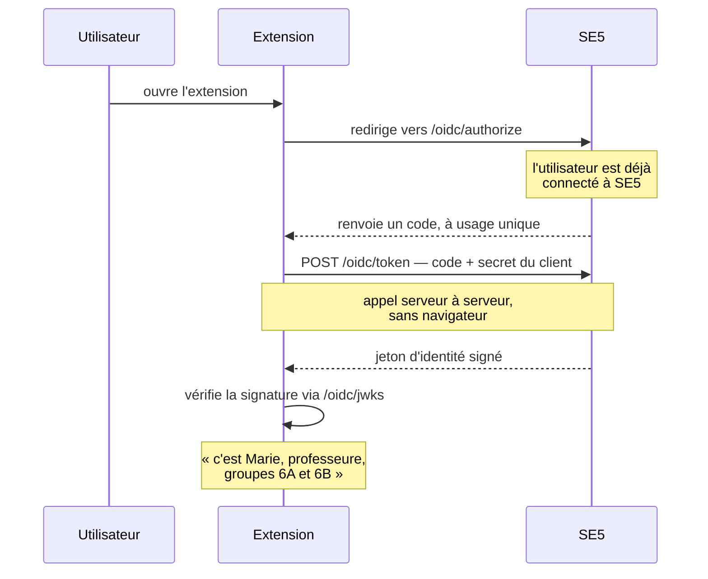

# SE5 dit aux extensions qui est l'utilisateur

> **Ce que couvre cette fiche.** Comment un logiciel tiers intégré à SE5 —
> visioconférence, documentation — apprend qui est l'utilisateur connecté, sans
> jamais voir son mot de passe ni toucher à la base.
>
> Ce qu'elle ne couvre pas : comment une extension s'installe et tourne — voir
> le domaine extensions.

---

## En une phrase

**Une extension ne demande pas « donne-moi le mot de passe », elle demande
« dis-moi qui c'est ».** SE5 renvoie un petit document signé qui contient le
nom, le rôle et les groupes de l'utilisateur — et rien d'autre.

C'est le protocole standard OpenID Connect. SE5 en tient le rôle de
**fournisseur d'identité**.

## Le déroulé

Le détour par un code, plutôt qu'un renvoi direct de l'identité, a une raison
simple : **ce qui transite par le navigateur peut être lu**. Le code seul ne
sert à rien ; il faut le secret du client, qui ne quitte jamais le serveur de
l'extension, pour l'échanger contre l'identité.

## Les cinq points d'entrée

| Adresse | Rôle | Qui appelle |
| --- | --- | --- |
| `/oidc/.well-known/openid-configuration` | Décrit les autres adresses | L'extension, au démarrage |
| `/oidc/jwks` | Publie la clé publique de signature | L'extension, pour vérifier |
| `/oidc/authorize` | Émet le code, derrière la session SE5 | Le navigateur |
| `/oidc/token` | Échange le code contre l'identité | Le serveur de l'extension |
| `/oidc/userinfo` | Redonne les mêmes informations sur présentation d'un jeton | Le serveur de l'extension |

## L'ordre de validation est la sécurité

À `/oidc/authorize`, SE5 vérifie les paramètres **dans un ordre qui n'est pas
négociable** :

1. le client existe et est actif → sinon **refus affiché sur place** ;
2. l'adresse de retour est exactement l'une des adresses déclarées → sinon
   **refus affiché sur place** ;
3. *à partir d'ici seulement*, les refus peuvent être renvoyés à l'extension.

> **Pourquoi cet ordre.** Renvoyer un message de refus vers une adresse non
> validée, c'est envoyer ce message à qui a fabriqué l'URL. SE5 deviendrait un
> tremplin de redirection — un attaquant se servirait de son nom de domaine pour
> rediriger ailleurs.

Viennent ensuite le type de réponse, la présence du périmètre `openid`, la
preuve de possession, les bornes de longueur, et l'appartenance des périmètres
demandés au catalogue.

**La preuve de possession est obligatoire, et dans sa forme forte seulement.**
Ni son absence ni sa variante en clair ne sont tolérées : sans elle, un code
intercepté — dans un historique de navigation, un journal de mandataire — suffit
à obtenir l'identité.

**Le code ne sert qu'une fois**, sous verrou sur sa ligne en base : deux
échanges simultanés, un seul gagnant. Et **un échec de vérification consomme
quand même le code** : dès lors qu'il a été présenté, il est brûlé.

## Ce que SE5 accepte de dire

| Périmètre demandé | Ce que SE5 renvoie | D'où ça vient |
| --- | --- | --- |
| `openid` | Le sujet — l'identifiant de l'utilisateur | Un point unique de résolution |
| `profile` | Le nom affiché et le rôle | Base SQL |
| `groups` | Les classes et équipes | Base SQL |

**Tout vient de la base, jamais de l'annuaire.** Une extension qui interroge SE5
ne déclenche aucun aller-retour LDAP.

Le vocabulaire du rôle est fermé — `prof`, `eleve`, `administratif`, `admin` —
et ne laisse jamais fuiter un nom de rôle technique interne.

> ### ⚠️ Ce contrat est gelé
>
> Ce que SE5 émet ici est consommé par du code que nous n'écrivons pas et que
> nous ne redéployons pas. La règle est asymétrique :
>
> - on peut **ajouter** une information ;
> - on ne peut **jamais** en retirer une, la renommer, ni changer son type — une
>   valeur simple qui devient une liste casse tous les clients existants.
>
> Corollaire : **une clé de trop est une dette permanente.** La liste exacte de
> ce qui sort est verrouillée par test, et pas seulement par des vérifications
> d'absence — celles-ci n'attrapent que ce à quoi on a pensé.

**L'identifiant de l'utilisateur a un seul point de résolution**
(`OidcSubjectResolver`). Aucun autre fichier ne construit un sujet. En changer
doit coûter une méthode, pas une fouille dans tout le domaine.

## Déclarer un client

Un client se déclare par commande — `oidc:client:register` — et son **secret
n'existe en clair qu'une fois**, dans la réponse de la commande. Seule son
empreinte est conservée : un secret perdu se remplace, il ne se retrouve pas.

Deux révocations existent, et **les confondre transforme un réglage de
confidentialité en panne de connexion** :

| Commande | Ce qu'elle coupe | Effet pour l'utilisateur |
| --- | --- | --- |
| `oidc:client:revoke` | L'accès entier — le client n'obtient plus rien | L'extension ne se connecte plus |
| Retrait d'un périmètre accordé | Une donnée seulement | La connexion marche, l'extension ne voit plus cette information |

**Un périmètre demandé mais non accordé n'est pas servi.** Le défaut est fermé :
une liste d'accords vide ne donne rien, elle ne donne pas tout.

## Le témoin d'intégration

`app/OidcWitness/` est un **client OIDC honnête, mis en quarantaine**. Deux
routes, une page : « Bonjour X, rôle Y, groupes Z ». Tout ce qu'il affiche vient
d'un jeton d'identité vérifié, obtenu par le protocole public.

Il s'interdit tout accès à la base, à l'annuaire, aux services de SE5 et à
l'utilisateur connecté — et un test d'architecture le vérifie
(`tests/Architecture/ExtensionIsolationTest.php`).

> **Un témoin qui triche ne prouve rien.** S'il lisait la session SE5, il
> validerait la connexion à SE5, pas le protocole. C'est tout l'intérêt de
> l'objet : il échoue exactement là où une vraie extension échouerait.

## Prérequis d'exploitation

`php artisan oidc:keys:init` puis `php artisan oidc:client:register`. Les deux
sont idempotentes. `oidc:keys:init --force` **invalide tous les jetons
d'identité en circulation** — les clients reprennent la nouvelle clé publique
d'eux-mêmes.

## Carte du code

| Rôle | Fichier |
| --- | --- |
| Validation et émission du code | `app/Auth/Oidc/Services/OidcAuthorizationService.php` |
| Registre des clients | `app/Auth/Oidc/Services/OidcClientRegistry.php` |
| Résolution du sujet — **point unique** | `app/Auth/Oidc/Support/OidcSubjectResolver.php` |
| Contrat de claims | `app/Auth/Oidc/Support/OidcClaimsResolver.php` |
| Émission du jeton d'identité | `app/Auth/Oidc/Jwt/OidcIdTokenIssuer.php` |
| Clés de signature | `app/Auth/Oidc/Keys/OidcKeyManager.php` |
| Points d'entrée | `app/Auth/Oidc/Http/Controllers/` |
| Témoin | `app/OidcWitness/` |

Réglages : `config/oidc.php`.
Tables : `oidc_clients`, `oidc_authorization_codes`, `oidc_access_tokens`.
Tests : `tests/Feature/Oidc/`, `tests/Feature/OidcWitness/`,
`tests/Architecture/OidcRoutesTest.php`.

## Aller plus loin

- Les autres façons d'entrer : [porte d'entrée du domaine](README.md)
- Pourquoi le contrat est gelé : [décisions](metier.md)
