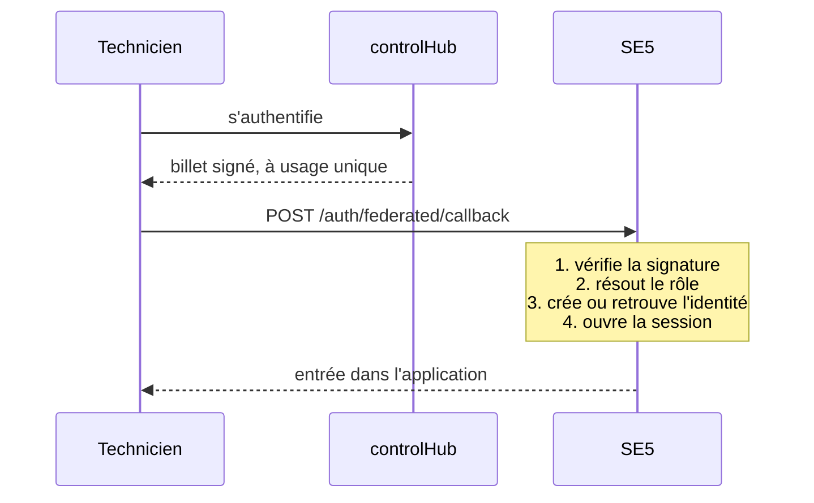

# Un technicien extérieur entre sans compte dans l'annuaire

> **Ce que couvre cette fiche.** Comment quelqu'un qui n'existe pas dans
> l'annuaire de l'établissement — un technicien du service académique — ouvre
> une session sur SE5.
>
> Ce qu'elle ne couvre pas : la conservation et la purge de son identité, qui
> relèvent du domaine identité.

---

## En une phrase

**La personne s'est déjà authentifiée ailleurs, et arrive avec un billet
d'entrée signé.** SE5 vérifie la signature, crée ou retrouve une identité
externe, ouvre une session — et journalise tout ce que cette personne fait
ensuite.

C'est l'inverse du [fournisseur d'identité](fournisseur-oidc.md) : là, SE5
*émet* des identités ; ici, il en *reçoit* une.

## Pourquoi ce n'est pas un compte dans l'annuaire

Un technicien intervient sur plusieurs établissements. Lui créer un compte dans
chaque annuaire poserait trois problèmes : autant de mots de passe à gérer,
autant de comptes à retirer à son départ, et un compte qui survit à l'oubli.

Le billet d'entrée déplace le problème au bon endroit : **l'autorité qui sait si
cette personne travaille encore là est en amont, pas dans l'établissement.**

## Le déroulé

Le billet arrive **en POST, jamais dans l'adresse**. Une valeur en paramètre
d'URL finit dans les journaux du serveur, dans l'historique du navigateur, et
dans l'en-tête de provenance envoyé au site suivant. Un billet d'entrée n'a rien
à faire dans ces trois endroits.

## Les quatre contrôles

**1. La signature et les bornes.** Émetteur, destinataire, niveau, dates de
validité — et **un billet ne sert qu'une fois** : son identifiant est
enregistré, une seconde présentation est refusée.

**2. Le rôle.** Le billet annonce un rôle. SE5 le cherche **parmi les rôles qui
existent déjà** dans l'instance, après normalisation de la casse.

> **Aucune table de correspondance, et aucune création.** Le nom annoncé *est*
> le contrat. S'il ne correspond à rien en base : refus, aucune session, et
> surtout **aucun rôle créé**. Un système qui crée le rôle qu'on lui demande
> laisse l'extérieur définir ses propres droits.

**3. L'identité externe.** SE5 crée ou retrouve une ligne dans
`external_identities`, et provisionne le compte associé — le tout dans une seule
transaction. Une identité révoquée, supprimée ou anonymisée est refusée.

**4. La session.** Session SE5 standard, **marquée comme fédérée**. Cette marque
n'est pas décorative : c'est elle qui déclenche la journalisation.

## La traçabilité, sans exception

Toute page derrière la session web porte un filtre qui **journalise les actions
d'un utilisateur externe**. Ce n'est pas une convention de relecture : un test
d'architecture vérifie que la couverture est **totale**
(`tests/Architecture/FederatedAuditCoverageTest.php`).

C'est la contrepartie du modèle. On accepte que quelqu'un entre sans compte dans
l'annuaire ; on sait en échange exactement ce qu'il a fait.

**Aucune donnée personnelle dans les journaux** — ni nom, ni adresse
électronique, ni identifiant en clair. Les traces portent l'identifiant interne
et une empreinte du sujet.

## Le cycle de vie d'une identité externe

Quatre états, et une règle de fin :

| État | Ce qui l'a produit | Connexion possible |
| --- | --- | --- |
| Active | Premier billet accepté | oui |
| Désactivée | Geste d'administration | non |
| Supprimée | Suppression tracée, avec motif | non |
| Anonymisée | Fin de la durée de conservation | non, définitivement |

**L'anonymisation ne supprime jamais la ligne.** Elle remplace les données
personnelles par une empreinte et désactive les comptes liés. Elle est
idempotente et **irréversible par construction** : c'est ce qu'on attend d'une
purge. Elle est jouée par `federated:purge-identities`, planifiée.

## Ce qui manque

- **La fiche de conservation et de purge** appartient au domaine identité, où
  elle n'est pas écrite ([`identite/README.md`](../identite/README.md)).
- **Le rôle annoncé est cru sur parole**, dans les limites posées plus haut : il
  doit exister en base, mais rien ne vérifie que l'émetteur avait le droit de
  l'annoncer. La confiance est entière envers le signataire du billet.

## Carte du code

| Rôle | Fichier |
| --- | --- |
| Point d'entrée | `app/Auth/Federated/Http/FederatedLoginController.php` |
| Vérification du billet | `app/Auth/Federated/Jwt/FederatedJwtVerifier.php` |
| Usage unique | `app/Auth/Federated/Jwt/FederatedJwtReplayChecker.php` |
| Résolution du rôle | `app/Auth/Federated/FederatedRoleMapper.php` |
| Cycle de vie de l'identité | `app/Auth/Federated/ExternalIdentityLifecycleService.php` |
| Marque de session | `app/Auth/Federated/Session/FederatedSession.php` |

Réglages : `config/federated_auth.php`.
Tables : `external_identities`, `federated_jwt_consumptions`.
Tests : `tests/Feature/Auth/Federated/`,
`tests/Architecture/FederatedAuditCoverageTest.php`,
`tests/Architecture/FederatedRouteTest.php`.

## Aller plus loin

- L'autre sens du flux : [SE5 fournisseur d'identité](fournisseur-oidc.md)
- Les autres façons d'entrer : [porte d'entrée du domaine](README.md)
