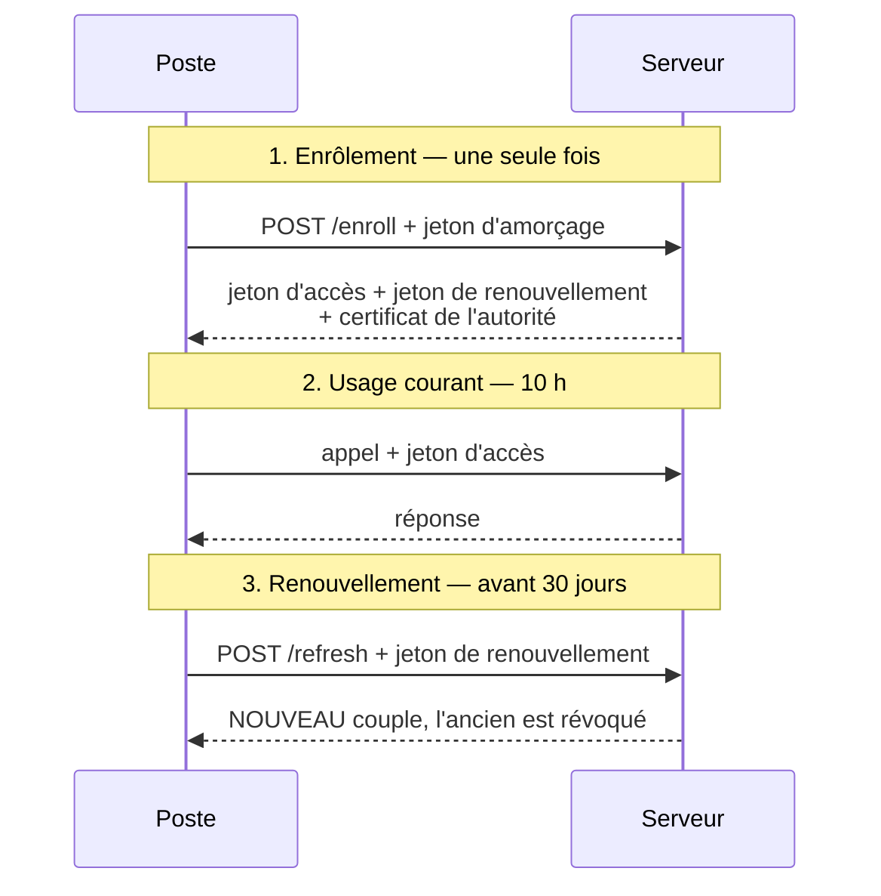

# Le poste prouve qu'il est ce poste

> **Ce que couvre cette fiche.** Comment un poste obtient le droit de parler au
> serveur, comment il le conserve, et comment on le lui retire.
>
> Ce qu'elle ne couvre pas : ce qu'il fait de ce droit une fois obtenu — voir
> [`agent/`](../agent/README.md).

---

## En une phrase

**Un poste n'a pas de mot de passe et personne ne se tient devant son écran.**
Il reçoit donc, une fois, un jeton signé par le serveur, et le présente à chaque
appel. Quand le jeton expire, il en demande un nouveau ; s'il est volé, on le
révoque.

## Pourquoi ce n'est pas « être sur le réseau »

Sur SE4, un poste appelait des scripts sur le réseau local et **être branché
valait autorisation**. Cela suffisait tant que le poste ne faisait que
*demander* : une liste d'applications, un fond d'écran.

Un agent, lui, applique un état de configuration : il faut donc savoir *à quel
poste* on répond. Deux machines sur le même réseau ne doivent pas recevoir le
même état, et une machine qui n'est plus au parc ne doit plus rien recevoir du
tout. Le réseau ne sait rien dire de cela ; un jeton, si.

## Les trois moments

### 1. L'enrôlement

`POST /api/v1/agent/enroll` — le poste présente un **jeton d'amorçage**, la
seule chose qu'il possède avant d'exister aux yeux du serveur. Il reçoit en
retour :

- un **jeton d'accès**, valable 10 heures ;
- un **jeton de renouvellement**, valable 30 jours ;
- le **certificat de l'autorité** du serveur, qu'il épingle — c'est ce qui lui
  permettra de vérifier le serveur à tous les appels suivants ;
- l'**adresse du serveur**, pour savoir où s'adresser ensuite.

Trois protections encadrent ce point d'entrée : adresses privées uniquement,
jeton d'amorçage exigé, et dix appels par minute au plus.

> **Ré-enrôler n'invalide rien.** Un poste qui refait un enrôlement reçoit un
> couple neuf ; l'ancien reste valable jusqu'à sa propre expiration. C'est
> délibéré — un enrôlement raté en cours de déploiement ne doit pas couper un
> poste qui fonctionne.

### 2. L'usage courant

Le jeton d'accès est un jeton signé en RS256, avec une revendication `tier` qui
vaut `workstation`. C'est elle qui distingue un poste des autres appelants de
l'API, sur des points d'entrée qui cohabitent.

**Deux fichiers seulement ont le droit de manipuler la bibliothèque de
signature** — celui qui émet, celui qui vérifie. Un test d'architecture le
vérifie (`tests/Architecture/AuthV1NamespaceTest.php`). Sans cette frontière, la
vérification finirait recopiée à moitié dans un contrôleur.

### 3. Le renouvellement

`POST /api/v1/agent/refresh` — le poste échange son jeton de renouvellement
contre un couple neuf. **L'ancien est révoqué dans la même transaction.** Il n'y
a jamais deux jetons de renouvellement valides pour un poste : ce serait un
défaut, pas une commodité.

Ce point d'entrée n'est **pas** limité aux adresses privées, contrairement à
l'enrôlement : un poste en télémaintenance doit pouvoir renouveler.

## Quand un jeton est volé

**Un jeton de renouvellement ne sert qu'une fois.** S'il est présenté une
seconde fois, c'est que quelqu'un en détient une copie : le légitime l'a déjà
échangé, ou le voleur prend les devants.

Le serveur ne se contente alors pas de refuser. Il **révoque en cascade tous les
jetons de renouvellement actifs du poste** et journalise l'événement. Le poste
légitime comme le voleur se retrouvent dehors ; le premier se réenrôlera, le
second n'a plus rien.

> **Une limite assumée.** Les jetons d'**accès** déjà émis ne sont pas révoqués
> par cette cascade : le serveur ne garde pas la liste de ceux qu'un jeton de
> renouvellement a produits. Un voleur peut donc continuer d'appeler jusqu'à
> expiration — **au plus 10 heures**. C'est la fenêtre, et elle est bornée.

Les jetons stockés le sont **par empreinte**. La valeur en clair ne quitte le
serveur qu'une fois, dans la réponse qui la crée : une base compromise ne livre
aucun jeton utilisable.

## Diagnostiquer un poste qui ne parle plus

Dans cet ordre — du plus fréquent au plus rare :

| Symptôme | Cause probable | Vérification |
| --- | --- | --- |
| Refus avec mention d'expiration | Le poste n'a pas renouvelé depuis 30 jours | Sa dernière trace dans `workstation_refresh_tokens` |
| Refus avec mention de rejeu | Le poste a été cloné, ou sa sauvegarde restaurée | Deux machines partagent le même identifiant |
| Erreur de certificat | L'autorité du serveur a été régénérée | Le poste doit se réenrôler |
| Refus dès l'enrôlement | Adresse hors des plages privées autorisées | `auth_v1.bootstrap.allowed_subnets` |

Les traces vivent sur le canal `auth-v1`, avec un `action_type` par événement :
`auth.token.issued`, `auth.token.replay_detected`, et leurs voisins.

## Ce qui manque

- **La rotation des clés de signature n'est pas outillée.** La commande
  `workstation:jwt:rotate-keys` échoue délibérément ; son aide décrit la
  séquence manuelle, qui reste la seule voie.
- **La fenêtre du tout premier amorçage.** Un poste sans l'autorité du serveur
  télécharge son script d'amorçage sans vérifier le certificat — il ne peut pas
  faire autrement, c'est ce script qui installe l'autorité. La fenêtre est
  courte et limitée au réseau local. C'est la seule dette formellement acceptée
  du domaine ([`tech-debt-auth.md`](../tech-debt-auth.md)).

## Carte du code

| Rôle | Fichier |
| --- | --- |
| Enrôlement | `app/Auth/V1/Http/Controllers/EnrollController.php` |
| Renouvellement et détection de rejeu | `app/Auth/V1/Jwt/WorkstationJwtRefreshService.php` |
| Émission | `app/Auth/V1/Jwt/WorkstationJwtIssuer.php` |
| Vérification | `app/Auth/V1/Jwt/WorkstationJwtVerifier.php` |
| Révocation | `app/Auth/V1/Jwt/WorkstationJwtRevocationChecker.php` |
| Autorité de certification | `app/Auth/V1/Pki/CaInitializer.php` |
| Filtres de route | `app/Auth/V1/Http/Middleware/` |

Réglages : `config/auth_v1.php`.
Tables : `workstation_refresh_tokens`, `workstation_jwt_revocations`.
Tests : `tests/Feature/Auth/V1/`, `tests/Architecture/AuthV1NamespaceTest.php`.

## Aller plus loin

- Ce que le poste fait de son jeton : [`agent/`](../agent/README.md)
- Les autres façons d'entrer : [porte d'entrée du domaine](README.md)
