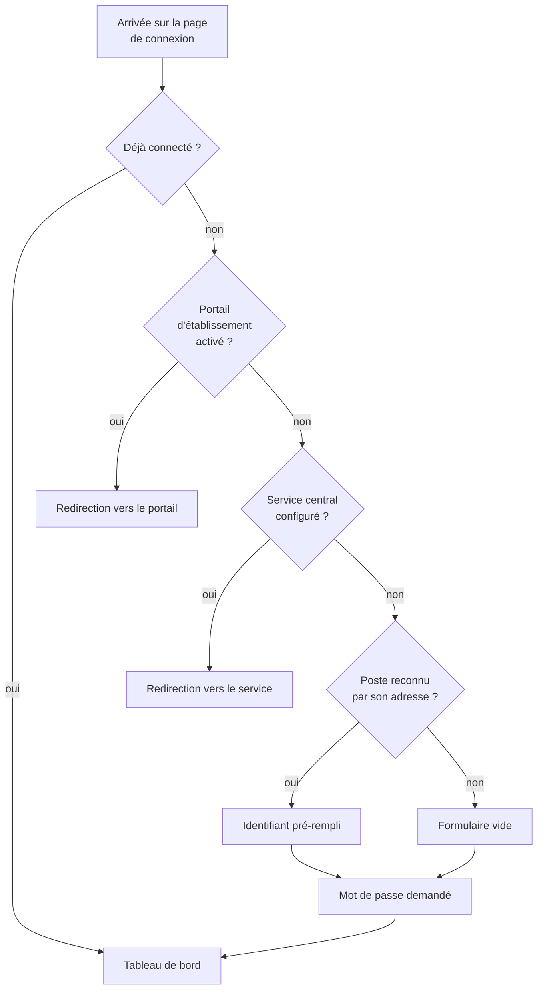

# Un humain se connecte

> **Ce que couvre cette fiche.** Comment une personne de l'établissement ouvre
> une session sur SE5, et les quatre chemins par lesquels elle peut y arriver.
>
> Ce qu'elle ne couvre pas : ce qu'elle a le droit de faire une fois entrée —
> voir [`domains/rights-management.md`](../domains/rights-management.md).

---

## En une phrase

**Le mot de passe est vérifié par l'annuaire, jamais par SE5.** SE5 ne stocke
aucun mot de passe d'utilisateur : il demande à l'annuaire « ce couple est-il
valide ? », et ouvre une session si la réponse est oui.

## Les quatre chemins d'entrée

Ils sont testés **dans cet ordre**, et le premier qui s'applique gagne :

| Chemin | Ce qui le déclenche | Origine |
| --- | --- | --- |
| **Mot de passe** | Le cas courant | Le socle |
| **Portail d'établissement** | Un réglage actif *et* le portail joignable | Hérité de SE4 |
| **Service d'authentification central** | Une adresse configurée | Hérité de SE4 |
| **Reconnaissance par adresse** | Le poste appelant est identifié | Hérité de SE4 |

> **Les trois derniers sont vivants mais leur avenir n'est pas tranché.** Ils
> viennent de SE4 et n'ont pas été réexaminés. Le quatrième mérite une
> attention particulière : il ne connecte personne, il **pré-remplit
> l'identifiant** — le mot de passe reste exigé. La même page accepte aussi un
> identifiant pré-rempli par paramètre d'adresse, ce qui revient au même :
> aucune session n'est ouverte sans mot de passe.

Le [technicien extérieur](login-federe.md) est un cinquième chemin, assez
différent pour avoir sa fiche.

## Ce qui se passe à la connexion

1. **L'annuaire vérifie le couple.** SE5 tente une liaison ; il ne compare
   aucune empreinte locale.
2. **La ligne en base est créée si elle manque.** Un compte peut exister dans
   l'annuaire sans avoir jamais ouvert SE5.
3. **La session est ouverte** et le tableau de bord s'affiche.

> **Pourquoi créer la ligne à la connexion, et pas avant.** C'est le seul moment
> où deux conditions sont réunies : la liaison à l'annuaire vient de réussir —
> donc la personne existe vraiment — et l'opération n'a lieu **qu'une fois par
> session**. La faire ailleurs voudrait dire soit interroger l'annuaire à chaque
> requête, soit peupler la base d'utilisateurs qui ne viendront jamais.
>
> Le contrôle de session, lui, ne lit **que la base**. Il ne crée rien et ne
> touche plus à l'annuaire : ce qui garde l'accès aux pages est en base, pas en
> LDAP.

**Un cas particulier :** l'annuaire peut répondre « valide, mais le mot de passe
doit être changé ». SE5 émet alors un jeton de changement et détourne vers le
formulaire dédié — sauf en environnement de portail d'établissement, où la
connexion est acceptée telle quelle.

## Ce qui garde les pages

Trois filtres se composent sur les routes de l'application :

| Filtre | Ce qu'il vérifie |
| --- | --- |
| `sambaedu.auth` | Une session est ouverte |
| `sambaedu.admin` | La session appartient à un administrateur |
| `federated.audit` | Si la session est celle d'un externe, journalise l'action |

**`federated.audit` accompagne systématiquement `sambaedu.auth`.** Ce n'est pas
une consigne de relecture : un test d'architecture vérifie que la couverture est
totale (`tests/Architecture/FederatedAuditCoverageTest.php`). Une page ajoutée
sans lui fait échouer la suite.

## Ce qui manque

- **L'avenir des trois chemins hérités n'est pas tranché** — portail, service
  central, reconnaissance par adresse. Ils fonctionnent, personne ne les a
  réexaminés depuis le portage.
- **`AuthenticationService` mélange plusieurs responsabilités** : vérification
  d'identifiants, gestion de session, jetons de changement de mot de passe,
  intégration du portail. Sept cents lignes, quatre sujets.
- **Le contrôle de session s'appuie sur `$_SESSION` autant que sur la session
  Laravel**, héritage du portage. Les deux sont maintenus en parallèle.

## Carte du code

| Rôle | Fichier |
| --- | --- |
| Écrans et redirections | `app/Http/Controllers/AuthController.php` |
| Vérification, session, jetons | `app/Services/AuthenticationService.php` |
| Filtres de route | `sambaedu.auth`, `sambaedu.admin`, `federated.audit` |

Tests : `tests/Feature/Auth/SambaEduAuthGuardPostgresTest.php`,
`tests/Feature/Auth/LoginAutoProvisioningTest.php`,
`tests/Feature/CasAuthenticationTest.php`,
`tests/Feature/AuthGuardInterfaceTest.php`.

## Aller plus loin

- Qui a le droit de quoi : [`domains/rights-management.md`](../domains/rights-management.md)
- D'où viennent les comptes : [`identite/`](../identite/README.md)
- Les autres façons d'entrer : [porte d'entrée du domaine](README.md)
