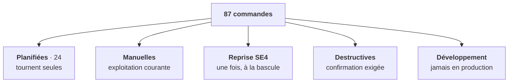

# Domaine Exploitation — la carte des commandes

> **Cette fiche ne liste pas les commandes.** `php artisan list` le fait déjà, et
> mieux : il ne peut pas dériver. Chaque commande porte sa description et son aide
> longue dans son propre code — `php artisan help <commande>` donne les exemples,
> les effets de bord et les codes de retour.
>
> Ce que la ligne de commande ne peut PAS vous dire, et que cette fiche donne :
> **à quelle famille appartient chaque commande.** Une liste plate de 87 entrées
> ne distingue pas celle qui tourne déjà toute seule de celle qui détruit
> définitivement un serveur.

---

## 1. En une phrase

L'exploitation de SE5 passe par des **commandes**, jamais par des procédures
manuelles à rejouer : les garde-fous vivent dans le code, pas dans un document.
C'est une règle du projet — une opération qu'on doit répéter sur plusieurs
instances devient une commande idempotente.

## 2. Les cinq familles

| Famille | Ce que ça implique |
| --- | --- |
| **Planifiée** | Tourne toute seule. La lancer à la main est au mieux inutile, jamais nécessaire. |
| **Manuelle** | Geste d'exploitation courant, sans danger particulier. |
| **Reprise SE4** | Import de migration. À jouer **une fois**, au moment de basculer un établissement. |
| **Destructive** | Supprime, révoque ou anonymise. Toutes exigent un drapeau explicite ; certaines sont irréversibles. |
| **Développement** | Génère du code, ou écrit dans un annuaire de test. **Jamais** sur une instance servant des utilisateurs. |

## 3. Ce qui tourne déjà tout seul

24 commandes sont planifiées. Inutile de les déclencher — et si l'une ne produit
pas son effet, le problème est presque toujours en amont : le planificateur ou les
files d'attente ne tournent pas.

| Cadence | Commandes |
| --- | --- |
| **Chaque minute** | `controlhub:heartbeat` · `controlhub:report-compliance` · `parc:execute-group-schedules` · `parc:reinstall-due` · `sambaedu:totp:reconcile` |
| **Toutes les 5 min** | `users:sync-from-ad` (incrémental) · `ext:health:check` |
| **Nuit — purges** | `error-logs:prune` · `parc:prune-group-schedule-runs` · `parc:prune-reinstall-requests` · `trash:purge` · `queue-task-runs:prune` · `agent:reports:prune` · `federated:purge-identities` · `wpkg:reports:archive:rotate` · `script-logs:archive:rotate` |
| **Nuit — relevés** | `quota:snapshot` · `profiles:snapshot` |
| **Nuit — réconciliations** | `users:reconcile-departures` · `printers:sync` · `printer-drivers:sync` · `ext:sources:sync` · `migration:health-check` |
| **Le soir** | `gpo:warm-cache` (cache chaud pour le lendemain matin) |

Trois de ces commandes ne font QUE mettre en file : `parc:execute-group-schedules`,
`parc:reinstall-due` et `controlhub:report-compliance`. Le travail réel est fait
par les services de file d'attente — sans eux, la planification s'exécute sans
effet visible.

> **Point d'attention.** `wpkg:process-reports`, qui relève les comptes rendus
> d'installation déposés par les postes, **n'est ni planifié ni dans le cron
> système du dépôt**. Il ne tourne qu'à la demande. Si l'état d'installation des
> postes n'avance plus, vérifiez d'abord que les fichiers ne s'accumulent pas dans
> le répertoire de dépôt.

## 4. À ne pas rejouer par curiosité

Ces commandes importent l'état d'un serveur SE4. Elles ont leur place **une fois**,
au moment de basculer un établissement — pas dans l'exploitation courante.

`import:sync-from-ad` · `apps:import-customizations-from-legacy` ·
`quota:seed-from-legacy` · `sambaedu:migrate-delegations` ·
`sambaedu:migrate-rights-to-spatie` · `shares:import-from-fs` ·
`shares:seed-etablissement` · `shares:materialize-class-trees` ·
`shortcuts:backfill-icons`

Toutes sont idempotentes et proposent un aperçu (`--dry-run`, ou l'absence de
`--apply`) : les relancer ne casse rien. Le risque n'est pas là — il est de
**réécrire par une copie du legacy ce que vous avez réglé depuis**. C'est ce que
fait `quota:seed-from-legacy --force`, et c'est pour cela que le drapeau existe.

## 5. Ce qui détruit, révoque ou coupe

| Commande | Portée | Réversible ? |
| --- | --- | --- |
| `se4:purge --confirm` | Supprime l'arborescence du serveur SE4 | **Non** — dernier geste de l'extinction |
| `se4:unplug` | Éteint le serveur SE4 | Oui — `se4:replug` |
| `se4:prune-ad-parcs --confirm` | Supprime des objets d'annuaire résiduels | Non — refusée tant que SE4 sert |
| `federated:purge-identities` | Anonymise des identités externes | **Non** — par construction |
| `trash:purge` | Vide la corbeille au-delà de la rétention | Non |
| `workstation:revoke` | Coupe l'accès d'un poste | Le poste doit se ré-enrôler |
| `oidc:client:revoke`, `oidc:witness:disable` | Désactive un client | Oui — réenregistrer |
| `auth:ca:init --force` | Invalide **tous** les jetons de postes | Ré-enrôlement de tout le parc |
| `oidc:keys:init --force` | Invalide tous les jetons d'identité | Les clients reprennent la clé publique |
| `ext:remove` | Désinstalle une extension | Oui — réinstaller |
| `sambaedu:app:update --resync-seeded-roles` | Écrase les rôles ajustés depuis l'interface | Non |
| `tests:cleanup-ad-residues --apply` | Supprime des objets d'annuaire | Non — **réservée aux tests** |

Toutes exigent un drapeau explicite et offrent un aperçu. Aucune ne détruit par
défaut.

## 6. Diagnostiquer

Par ordre de dégainage, du plus général au plus ciblé :

| Commande | Répond à |
| --- | --- |
| `sambaedu:doctor` | « Cette instance est-elle saine ? » — le seul **verdict** (code de retour 0/1/2) |
| `se4:status` | « Où en est l'extinction du legacy, et qui le sollicite encore ? » |
| `ldap:test-connection` | « Le serveur atteint-il l'annuaire, et avec quels paramètres ? » |
| `ask:ad` | « Cet objet existe-t-il, et où ? » — annuaire **et** base |
| `shares:inspect-fs` | « Quels droits porte réellement ce répertoire ? » |
| `winscript-logs:status` | « La journalisation des scripts est-elle vraiment active ? » |
| `migration:health-check` | « La migration des postes se passe-t-elle bien ? » |

Toutes sont en **lecture seule**. Deux nuances de vocabulaire à connaître :
`sambaedu:doctor` rend un **verdict** dans son code de retour, alors que
`ext:health:check` ne fait que **constater** — un service arrêté volontairement
n'est pas une erreur, et son code de retour reste 0.

## 7. Ce qui marche mais qu'on déconseille

- **`nextcloud:provision`**, et précisément **son volet montages**. Il pose dans
  l'instance des montages de stockage externe en **SMB** vers le serveur de
  fichiers, et ce chemin d'accès n'est pas acquis : le partage SMB est appelé à
  disparaître. Ce qui est monté aujourd'hui devra être démonté ensuite, et chaque
  instance provisionnée est un état de plus à défaire. La commande demande donc
  confirmation avant de créer ou de modifier un montage.

  **Le volet comptes n'est pas concerné** : il n'écrit aucun montage, il reste la
  seule façon d'aligner les comptes de l'instance, et le backend `nextcloud` y
  renvoie encore quand l'identité d'un compte manque. `--users-only` ne demande
  donc rien, pas plus que `--dry-run`, qui n'écrit pas.

  `--force` lève la question pour un usage scripté. Son absence hors terminal
  interactif fait échouer un passage touchant aux montages, ce qui est voulu : une
  planification qui les reposerait chaque nuit est exactement ce qu'on ne veut
  plus.

## 8. Deux commandes qui ne font rien

- **`sambaedu:sync-rights`** — désactivée. Les droits d'accès à l'application ne
  sont plus dérivés de l'annuaire ; les resynchroniser depuis lui écraserait la
  vérité par une copie périmée.
- **`workstation:jwt:rotate-keys`** — non implémentée : elle échoue délibérément.
  Son aide décrit la séquence manuelle de rotation, qui reste la seule voie.

## 9. Invariants

- **Une opération multi-instance est une commande, jamais une procédure.** Si vous
  vous surprenez à écrire une suite de gestes à rejouer sur chaque serveur, c'est
  une commande qui manque.
- **La documentation d'une commande vit dans la commande.** `$description` pour la
  ligne de `artisan list`, `$help` pour la forme longue. Un document externe qui
  listerait les commandes serait faux à la première évolution — et
  `tests/Architecture/ArtisanCommandDocumentationTest.php` empêche que la
  documentation reparte du code.
- **La sortie CLI s'adresse à l'exploitant.** Pas de numéro de lot, pas de code
  d'exigence interne : la règle s'y énonce en clair. Le test d'architecture le
  vérifie.
- **Le docblock est pour le mainteneur, `$help` pour l'exploitant.** Les deux
  coexistent sans se recopier : l'un dit pourquoi c'est fait ainsi, l'autre
  comment s'en servir.

## 10. Manques connus

- `wpkg:process-reports` n'a aucun déclencheur automatique (cf. § 3).
- La famille « développement » (`make:page`, `make:SEpolicy`,
  `wallpaper:rebuild-badges`, `tests:interactive`, `compare:legacy-laravel`,
  `tests:cleanup-ad-residues`) cohabite avec les commandes d'exploitation dans le
  même espace de noms `artisan list`. Rien ne signale à l'écran qu'elles écrivent
  dans un annuaire de test ou génèrent du code.
