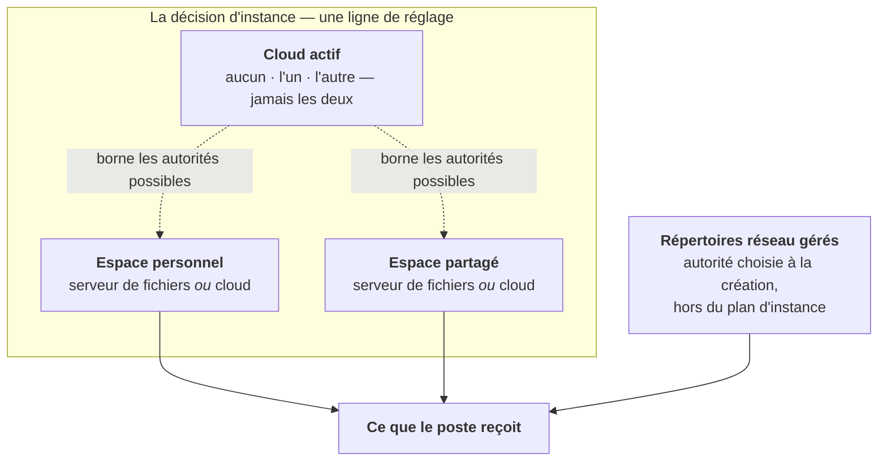
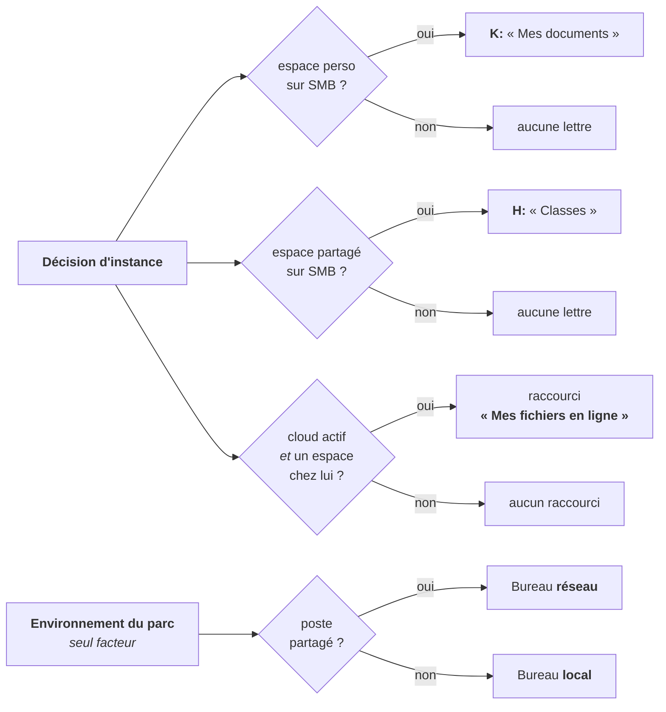

# Domaine Fichiers — le plan de fichiers

> **Où vivent les fichiers de l'établissement, et ce que le poste en reçoit.**
> Cette fiche décrit la décision d'instance (deux espaces, un cloud), les gardes
> qui la rendent cohérente, sa projection sur les postes, le plafond de stockage
> et l'arborescence de droits du serveur de fichiers.
>
> Elle ne contient **aucune procédure pas-à-pas** : les gestes d'exploitation
> vivent dans [`../installation/SCRIPTS.md`](../installation/SCRIPTS.md) et dans
> [`exploitation.md`](exploitation.md), les scénarios de pré-production dans
> [`../qa/domains/filesystem.md`](../qa/domains/filesystem.md), et les gestes de
> l'administrateur dans le guide public `userDoc/admin/fichiers/`.

---

## 1. En une phrase

Un établissement décide **où vivent deux espaces** — l'espace personnel de chaque
compte et l'espace partagé des groupes — puis SE5 **compile cette décision** en un
état désiré que l'agent applique sur chaque poste : une lettre de lecteur ici, un
raccourci là, rien du tout ailleurs.

## 2. Le pourquoi — d'où l'on vient, où l'on va

Dans SE4, **rien de tout cela n'était une décision**. L'annuaire et les stratégies
de groupe portaient à la fois la donnée et le comportement du poste : les fichiers
étaient sur le serveur de fichiers parce qu'il n'y avait pas d'autre endroit, les
lecteurs `K:` et `H:` étaient un fait de la configuration Windows, et les droits
d'un dossier de classe étaient une liste d'accès POSIX écrite par un script au
moment où quelqu'un cliquait. Changer d'idée supposait de rejouer des scripts et
d'espérer que le parc suive.

Aujourd'hui, la vérité est **une ligne de base de données**. Le serveur en dérive
un état désiré par couple (poste, utilisateur) ; l'agent le compare à ce qu'il
observe et converge. Trois conséquences qui structurent tout le reste :

- un espace peut vivre **ailleurs que sur le serveur de fichiers**, et le poste
  s'en aperçoit sans qu'aucun script de session ne change ;
- l'écriture des droits devient un **contrat** que plusieurs implémentations
  honorent — le serveur de fichiers historique en est une, deux produits cloud en
  sont deux autres ;
- ce que le poste reçoit se **déduit** de la décision, il ne se configure plus
  case par case.

## 3. Le modèle : trois objets, deux décisions, un cloud

**Trois objets** portent des fichiers :

| Objet | Ce que c'est | Qui décide de son emplacement |
| --- | --- | --- |
| **Espace personnel** | le répertoire de chaque compte | une décision d'instance |
| **Espace partagé** | les arborescences produites pour les groupes | une décision d'instance |
| **Répertoires réseau gérés** | les partages qu'un administrateur crée | le choix fait **à la création** de chacun, jamais après |

**Deux décisions, une par espace.** Chacune vaut pour tout l'établissement : il
n'existe aucun réglage par salle, par parc ni par population.

**Un cloud, ou aucun.** Le produit cloud actif est **une valeur à trois
positions**, pas deux interrupteurs : l'état « les deux à la fois » n'est pas
seulement interdit, il est **irreprésentable**. Un emplacement ne peut désigner
que le serveur de fichiers ou **exactement** le cloud actif.

> ### ⚠️ L'invariant le plus facile à re-casser
>
> **Les lecteurs réseau sont TOUJOURS servis en SMB. Une lettre de lecteur ne
> pointe jamais un cloud.** Un espace servi par un cloud n'a aucun chemin SMB —
> ce n'est pas une coupe de périmètre, c'est une propriété mesurée des deux
> produits. Il se consulte au navigateur ou par le client de synchronisation.
> Aucune lettre n'est émise pour lui, dans aucun cas, y compris pour un
> répertoire géré dont l'autorité est un cloud.

### Deux vocabulaires, et c'est voulu

La **décision** (« où vit cet espace ») et le **mécanisme** (« quelle
implémentation écrit ses droits ») partagent le même vocabulaire fermé de noms de
backend. Ce n'est pas une confusion : deux vocabulaires parallèles diraient la
même chose et finiraient par diverger. Une seule nuance les sépare — le backend
d'**aperçu**, qui n'exécute rien, existe comme mécanisme et n'est jamais un
emplacement.

### Un répertoire géré n'est pas gouverné par le plan

Le plan décide de **deux espaces d'instance**, pas de chaque partage. Un
répertoire réseau géré porte sa propre autorité d'écriture, choisie au moment où
on le crée et **immuable ensuite** : il n'existe aucun chemin d'édition, et la
colonne est délibérément hors des attributs assignables en masse. Déplacer
l'espace partagé au cloud retire le lecteur `H:` **et rien d'autre** — les
répertoires gérés gardent leur lettre, parce qu'ils gardent leur autorité.

## 4. Une seule ligne de réglage, trois clés

La décision vit dans **une ligne** de la table des réglages système, sous la clé
`files.locations`, et porte exactement trois valeurs :

| Clé | Ce qu'elle dit |
| --- | --- |
| `espace_perso.autorite` | qui sert l'espace personnel |
| `espace_partage.autorite` | qui sert l'espace partagé |
| `cloud.actif` | quel produit cloud est en service, ou aucun |

**Les trois s'écrivent d'un seul geste**, jamais séparément. Le motif est double :
les gardes portent sur leur **combinaison** — une autorité cloud n'a de sens que
rapportée au cloud actif —, et l'écriture d'un réglage est un remplacement de
ligne non transactionnel : trois écritures successives exposeraient un état
transitoire incohérent à un lecteur concurrent, c'est-à-dire à la compilation de
l'état d'un poste.

Aucune mémoïsation, aucun cache : chaque lecture relit la ligne.

## 5. Les trois gardes

**Garde 1 — l'incohérence est irreprésentable PAR LE TYPE, pas interdite par un
test.** L'objet qui porte les trois valeurs est immuable, son constructeur est
privé, et une fabrique unique est la seule porte d'entrée. Il n'existe ni setter,
ni constructeur acceptant un tableau brut. Un développeur qui en ajouterait un
rouvrirait exactement le trou que cette forme ferme. La fabrique rejoue trois
refus :

1. l'aperçu n'est jamais un emplacement — il n'écrit aucun droit ;
2. une autorité cloud qui ne désigne pas le cloud actif est refusée ;
3. par conséquent, une autorité cloud alors qu'aucun cloud n'est actif l'est
   aussi.

En revanche, « espace personnel sur le serveur de fichiers » **avec** un cloud
actif est parfaitement accepté : c'est le cas courant — le cloud est configuré
pendant que les fichiers restent sur le serveur.

**Garde 2 — elle est rejouée À LA LECTURE, donc opposable à une ligne forgée.**
Une ligne de réglage se modifie en SQL, en console interactive, ou par un import
de configuration. Une garde qui ne vivrait qu'à l'écriture protégerait
l'étourderie, pas la ligne forgée. La lecture repasse donc systématiquement par la
fabrique : une combinaison incohérente persistée **lève**, elle n'est jamais
servie.

**Garde 3 — aucune valeur nulle, et l'absence n'est pas l'illisibilité.** La
lecture ne rend jamais `null` et ne connaît aucun état « non décidé » observable :

- clé **absente** ⇒ les défauts (les deux espaces sur le serveur de fichiers,
  aucun cloud) ;
- clé **présente mais illisible** (incomplète, hors vocabulaire, structurellement
  incohérente) ⇒ **refus nommé**. Jamais un repli silencieux : replier une ligne
  corrompue sur les défauts inventerait une décision que personne n'a prise, et
  déplacerait en silence les lecteurs de tout un établissement.

Même figure dans le vocabulaire : « aucun cloud » est une **valeur**, pas
l'absence de valeur. Un type nullable rouvrirait l'état « non décidé » que la
garde 3 ferme, et un appelant qui l'oublierait traiterait silencieusement
l'absence comme un produit.

## 6. Le refus de déplacement, et sa limite

**Changer l'emplacement d'un espace qui porte déjà des données est refusé.** Le
refus est **total** : ni la décision ni sa forme dérivée ne sont écrites, et la
décision précédente reste en vigueur — l'écran reprend les valeurs persistées
plutôt que d'afficher un état que la base ne porte pas.

Le motif est simple : rien, dans ce qui est livré, ne déplace un octet. Autoriser
le changement reviendrait à promettre un déménagement que personne n'exécute. Le
déplacement des données est un travail distinct, et cette fiche ne le décrit pas.

La garde ne porte **que sur les deux emplacements**. Changer le cloud actif, une
adresse, un identifiant, un secret, la vérification du certificat ou le chemin
d'accès n'est jamais refusé par elle. Le **ricochet**, lui, est couvert : changer
le cloud actif alors qu'un emplacement désigne le cloud oblige à changer aussi cet
emplacement, la soumission retombe donc sous la garde et est refusée avec le même
motif. Basculer d'un produit à l'autre n'est libre que lorsque les deux espaces
sont restés sur le serveur de fichiers.

> ### ⚠️ Le refus est total à l'écran, pas dans le dépôt
>
> La commande de reprise (§ 11) n'appelle **jamais** cette garde. Son option de
> forçage écrase donc une décision d'emplacement déjà enregistrée **sans que le
> refus s'exerce**, et c'est le seul geste du dépôt qui le fasse. Aucune donnée
> n'est déplacée pour autant — et c'est bien le problème : l'instance déclarerait
> alors un emplacement que personne n'a déménagé, avec des lecteurs qui
> disparaissent des postes pendant que les fichiers restent sur le serveur.
>
> L'option existe parce que la reprise doit pouvoir **transcrire l'état
> historique** d'une instance dont la ligne enregistrée est illisible ou
> divergente. Elle n'est pas un contournement documenté du refus : un exploitant
> bloqué par l'écran la trouvera pourtant en lisant l'aide de la commande, et il
> faut qu'il sache ce qu'elle ne fait pas.

> ### ⚠️ Ce que la garde ne voit pas
>
> Elle s'appuie sur **deux constats d'existence en base** — au moins un compte
> d'annuaire actif ou porteur d'une identité cloud, et au moins un groupe ou un
> répertoire géré. Aucun parcours du stockage, aucun appel réseau : l'écran doit
> rester utilisable instance injoignable, et le vocabulaire du serveur de fichiers
> n'a pas le droit de vivre dans ce fichier.
>
> Elle est donc **aveugle à une reprise d'existant** : sur un serveur de fichiers
> déjà en service où SE5 vient d'être posé, avant le premier import d'annuaire,
> les tables sont vides pendant que les répertoires sont pleins. La garde autorise
> alors la bascule sans un mot — et c'est précisément la population visée par une
> reprise.
>
> Aucune détection n'est ajoutée : la seule qui serait honnête supposerait de
> parcourir le stockage. L'écran porte donc, à côté du bouton d'enregistrement, la
> phrase qui dit que le choix **se fige dès qu'un compte existe**. Sur une reprise
> d'existant, la fenêtre où le choix reste libre se referme au premier import.

## 7. La même décision, écrite à deux endroits

Un mainteneur qui ouvre ce domaine tombera sur **une seconde écriture de la même
décision**, et il faut savoir ce qu'elle est avant de la prendre pour une
concurrente.

À côté de la ligne source vit une ligne de réglage plus ancienne,
`files.policy`, qui porte quatre **booléens de capacité** : accès au répertoire
personnel, accès aux partages, et une capacité par produit cloud. Ces quatre
valeurs sont **dérivées** de la décision et écrites **dans la même transaction**,
par un service dédié — jamais depuis un gabarit d'écran, qui finirait par en
oublier une.

La dérivation est **strictement mono-directionnelle** : aucun chemin de code ne
relit ces booléens pour en déduire un emplacement. La dérivation inverse est un
geste explicite et unique, la commande de reprise (§ 11), qui peut dire non.

Ces booléens ont des **lecteurs bien vivants**, et c'est pour cela qu'ils
continuent d'être écrits :

- la **posabilité d'une autorité d'écriture** à la création d'un répertoire géré ;
- la porte **fail-closed** des deux objets de configuration de connexion : une
  capacité éteinte éteint la connexion correspondante.

> ⚠️ **Ne pas croire que cette ligne est entièrement dérivée.** Elle porte aussi
> ce qui n'est dérivé de rien et n'a **aucun autre foyer** : l'adresse de chaque
> instance cloud, son compte d'administration, la vérification du certificat, le
> serveur de fichiers à monter, le **chemin d'accès au cloud** et les **deux
> désignations d'application cliente**. Cesser de l'écrire éteindrait toute la
> chaîne cloud.

## 8. Ce que le poste reçoit

| Ce que l'agent pose | À quelle condition |
| --- | --- |
| Lecteur `K:` « Mes documents » | **si et seulement si** l'espace personnel est servi en SMB |
| Lecteur `H:` « Classes » | **si et seulement si** l'espace partagé est servi en SMB |
| Lettres des répertoires gérés | selon l'autorité **de chaque répertoire**, jamais selon la décision d'instance |
| Bureau redirigé sur le réseau | sur un poste **partagé** — et sur lui seul |
| Bureau local du profil | sur un poste **personnel** ou un **portable** |
| Raccourci « Mes fichiers en ligne » | un cloud est actif, **et** au moins un des deux espaces y vit, **et** l'adresse du produit actif n'est pas vide |
| Application cliente du cloud | le chemin d'accès est réglé sur le client de synchronisation, **et** une désignation résout une entrée du catalogue |

### Le Bureau ne suit plus l'emplacement de l'espace personnel

Le chemin du Bureau se résout **sur un seul facteur : l'environnement du parc**.
Un poste partagé reçoit un Bureau réseau ; un poste personnel ou un portable
reçoit son Bureau local, parce qu'il n'a aucune autorité sur un emplacement
partagé entre tous les postes de son utilisateur.

Le Bureau réseau vit dans le partage personnel SMB — et **ce partage-là est
toujours en service**, quelle que soit la décision.

> ### ⚠️ Le partage personnel porte DEUX choses, et une seule déménage
>
> - les **fichiers de l'utilisateur**, qui peuvent partir au cloud ;
> - l'**infrastructure de l'agent** — Bureau redirigé, raccourcis gérés, profils
>   applicatifs — qui **ne déménage jamais** et n'est pas un réglage.
>
> « L'espace personnel est au cloud » ne signifie donc **pas** que le partage SMB
> du répertoire personnel disparaît. Il cesse d'être **monté comme lecteur pour
> l'utilisateur** ; l'agent, lui, continue d'y lire et d'y écrire. Sans cette
> distinction, couper `K:` semblerait rendre le répertoire inaccessible — c'est
> faux, et c'est exactement l'effet de bord qui faisait autrefois basculer le
> Bureau d'un poste partagé en local.

### Le raccourci de portail nomme la destination

Il s'appelle **« Mes fichiers en ligne »** : l'utilisateur cherche ses fichiers,
pas le nom d'un produit. Le même libellé sert quel que soit le produit en service,
sans que les bureaux de l'établissement changent de vocabulaire. Il n'est pas
assigné par une règle d'établissement — c'est une **conséquence technique** : un
espace servi par un cloud n'a aucun chemin SMB, donc aucune lettre, et son seul
chemin d'accès est le navigateur.

Trois cas rendent **rien** plutôt qu'un raccourci mort : aucun cloud actif, les
deux espaces sur le serveur de fichiers, ou une adresse vide.

### Le client de synchronisation : SE5 n'installe rien

L'administrateur **désigne** une application **du catalogue** ; elle entre alors
dans l'ensemble cible des applications du poste, et c'est le moteur de
déploiement applicatif qui l'installe et qui la retire. SE5 ne connaît **aucun**
identifiant de paquet client, et ne peut pas en connaître : le catalogue est sous
autorité amont, un dépôt imposé désinstalle en cascade ce qui n'y figure pas, et
une entrée ajoutée localement disparaît à la synchronisation suivante. Un
identifiant codé en dur serait faux sur la moitié des instances et effacé sur
l'autre.

Sans désignation, la position « par le client de synchronisation » est **absente**
de l'écran, avec son motif — jamais grisée, jamais proposée puis refusée au clic.
Seules sont désignables les applications **installées** dont la recette décrit une
**désinstallation** : désigner un paquet qu'on ne sait pas retirer serait promettre
une convergence qu'on ne peut pas tenir. Cette validation est **prédictive** : elle
constate qu'une désinstallation est décrite, pas qu'elle est complète.

> ### ⚠️ La borne de version d'agent, et ce qui casse en dessous
>
> La convergence du **retrait** repose sur une condition qui n'existe qu'à partir
> d'une certaine version d'agent : la comparaison entre l'ensemble cible et le
> profil réellement déposé sur le poste. Sur un poste dont l'agent est **antérieur
> à cette borne**, le client s'installe correctement et **ne se retire jamais** —
> sans aucun signal : ni statut, ni erreur, ni ligne de rapport.
>
> L'écran **avertit** et n'interdit rien : interdire figerait la décision d'un
> établissement sur l'état de mise à jour de son parc. Les postes qui n'ont jamais
> rapporté de version sont comptés **à part**, jamais rangés d'un côté ou de
> l'autre. La valeur de la borne se lit dans `CloudSyncClient::MIN_AGENT_VERSION`.
>
> ⚠️ **Et au-dessus de la borne, la convergence n'est pas constatée non plus.**
> La chaîne complète — désignation, installation, retrait de la désignation,
> désinstallation, absence de résidu — **n'a jamais été jouée sur un poste réel**
> (§ 15). Franchir la borne lève un empêchement connu ; ce n'est pas une preuve.

### Une ligne forgée lève, et l'exception se propage

Les fournisseurs d'état qui lisent la décision **n'attrapent rien**. Un repli sur
les défauts inventerait une décision que personne n'a prise et déplacerait en
silence les lecteurs de tout un établissement ; une émission vide les retirerait
tous, tout aussi silencieusement. L'**absence** de ligne, elle, n'est pas une
corruption : elle rend les défauts et ne lève jamais.

## 9. Le plafond de stockage et la corbeille

### Un seul plafond d'instance, trois étages de résolution

La résolution s'arrête à la **première** réponse trouvée :

1. la règle **nominative**, posée sur le compte ;
2. sinon, une règle de **groupe** parmi les groupes du compte ;
3. sinon, le **défaut d'instance** — une ligne par partition, la même pour tout
   compte qu'aucune des deux premières ne couvre ;
4. **aucune règle du tout signifie illimité.**

Il n'existe **plus de profils de quota**. Le plafond ne se devine plus par
comparaison de sous-chaînes sur des noms de groupes, et un même compte ne peut
plus recevoir deux plafonds différents selon l'écran qui pose la question. Un
budget particulier pour une population donnée se pose en **règle de groupe**, où
il se voit.

Enregistrer un plafond d'instance **n'est pas l'appliquer** : la valeur écrite
n'atteint les comptes existants qu'au geste explicite qui la porte, et ce geste
annonce avant de l'exécuter combien de comptes sont couverts et combien passeraient
immédiatement en dépassement.

> ### ⚠️ Écart connu — une règle de groupe illimitée perd contre une règle bornée
>
> **Le mécanisme.** « Illimité » se code par un plafond dur à zéro. La sélection
> de la règle de groupe trie les règles applicables par plafond dur **décroissant**
> puis ne charge que la première. Zéro étant la plus petite valeur numérique, une
> règle illimitée finit **dernière** et n'est jamais chargée dès qu'un autre groupe
> du compte porte un plafond chiffré. La branche qui honore l'illimité s'exécute
> **après** cette sélection : elle n'est donc atteinte que si **toutes** les règles
> de groupe du compte sont illimitées.
>
> **Ce qu'un exploitant observe.** Un compte membre d'un groupe « illimité » et
> d'un groupe borné reçoit le plafond **borné**. Poser l'illimité sur un groupe ne
> garantit rien tant que le compte appartient à un autre groupe réglé.
>
> **Ce n'est pas voulu.** Le commentaire du code annonce une priorité que la
> requête a déjà supprimée, et le même raisonnement métier est correctement
> implémenté ailleurs dans le dépôt — le regroupement des anciens profils retient
> l'illimité **avant** de chercher un maximum. Les deux divergent sur la même règle.
> Un tri correct exigerait de faire remonter l'illimité en tête, ou de réduire les
> règles en mémoire.

### Un dépassement ne bloque pas tout de suite

Un plafond n'est pas une valeur : c'est un **seuil**, une **tolérance**, un point
de blocage **calculé** et un **délai**. Ce sont eux, et pas le seuil seul, qui
décident de ce que vit l'utilisateur :

| Ce qui compose un plafond | Ce que c'est |
| --- | --- |
| **Plafond souple** | la valeur saisie. Au-delà, le compte est **en dépassement** — il écrit encore. |
| **Dépassement toléré** | un pourcentage, saisi lui aussi. Il ne se règle pas en valeur absolue. |
| **Plafond dur** | le souple augmenté de ce pourcentage. **Il se calcule, il ne se saisit pas** — l'écran l'affiche sans l'offrir. Au-delà, l'écriture est refusée par le système de fichiers, sans délai ni recours. |
| **Période de grâce** | un délai **en jours**, réglé par partition, entre le franchissement du souple et le blocage effectif de l'écriture. |

Entre le souple et le dur, l'utilisateur dispose donc de la période de grâce pour
redescendre sous son plafond. Passé ce délai — ou dès le plafond dur atteint, ce
qui arrive en premier —, **l'écriture est bloquée**. C'est ce délai, et pas le
plafond lui-même, qui décide **quand un compte est réellement arrêté** : lire le
dépassement comme un blocage immédiat conduit à régler des plafonds beaucoup trop
larges pour compenser une brutalité qui n'existe pas.

Les deux valeurs sont posées sur le système de fichiers, et le délai l'est par un
appel distinct. **L'échec de cet appel ne fait pas échouer l'enregistrement** : la
valeur reste en base, et l'application est signalée comme reportée — un serveur de
fichiers momentanément muet ne doit pas faire perdre une décision d'exploitation.

**L'utilisateur en dépassement est averti à l'ouverture de session** : un message
lui est présenté, une seule fois par session, à partir du dernier relevé
d'occupation connu. C'est le seul canal par lequel il l'apprend avant de heurter
le refus d'écriture ; il n'est jamais bloquant, et un incident dans ce message ne
peut pas empêcher une connexion.

### Le regroupement des anciens défauts, et ce qu'il a élargi

Les défauts par profil ont été **regroupés en un seul défaut par partition**, et
la valeur retenue est **la plus large** de celles qui existaient.

Le motif est asymétrique, et c'est ce qui a tranché. Un plafond qui **rétrécit**
arrête des gens en écriture sans que personne n'ait cliqué, et il le fait sur
**deux plans** — le système de fichiers, et le cloud, dont le balayage de
provisionnement réécrit le plafond de chaque compte depuis cette même règle. Un
plafond qui **s'élargit** ne bloque personne et **n'alloue aucun disque** : un
quota plafonne, il n'attribue rien. Des deux erreurs possibles, une seule se
répare sans avoir mis des utilisateurs à l'arrêt.

⚠️ **La conséquence se regarde en face** : sur une instance qui portait les
anciens défauts, **tout le monde monte à l'ex-valeur la plus large**, élèves
compris. Personne ne perd de place, mais le garde-fou qui bornait les comptes
d'élèves a disparu, et le dimensionnement disque de l'établissement change. Le
resserrement est un **geste explicite**, et l'écran annonce avant le clic combien
de comptes basculeraient en dépassement.

C'est pourquoi la carte des plafonds porte un **avertissement permanent** tant
qu'aucune valeur n'a été enregistrée à la main : il nomme ce qui a été regroupé et
avec quelles valeurs. Il disparaît au premier enregistrement — à ce moment-là, le
plafond en vigueur est celui de l'administrateur, et rappeler d'où il vient
n'apprend plus rien.

> ⚠️ **Le regroupement est irréversible.** Le chemin de retour ne restaure rien :
> ce qui a été retiré n'existe plus que dans le journal d'audit, ligne par ligne,
> avec son type, sa partition et ses valeurs. Reconstituer un budget particulier se
> fait à la main, en **règle de groupe** — le code ne peut pas deviner à la place
> de l'exploitant lequel méritait de survivre.

### Ce que le contrat a appris à distinguer

Un plafond non posable est un **champ fermé avec son motif**, jamais un champ
ouvert qui accepte une valeur sans effet. Et le motif distingue trois issues qu'il
serait facile d'écraser en une :

| Constat | Ce que ça veut dire |
| --- | --- |
| appliqué | la partition porte des quotas, le champ est ouvert |
| **pas de quota appliqué sur cette partition** | un fait, à corriger côté serveur |
| **mesure impossible** | SE5 **ne sait pas** — un appel en échec ne prouve pas une absence |

Écrire « il n'y a pas de quota » quand l'élévation est cassée mettrait une
contre-vérité sous les yeux de l'exploitant. La même exigence gouverne le décompte
des dépassements : « zéro dépassement constaté » et « je n'ai pas pu mesurer » ne
se confondent jamais.

Un espace qui **ne vit plus sur le serveur de fichiers** échappe à cette fermeture :
le plafond y gouverne le compte sur l'instance cloud, et laisser un système de
fichiers local hors sujet fermer ce champ fermerait le seul écran où se règle le
plafond du cloud.

### La corbeille n'est pas ce que son nom suggère

> ⚠️ **Ce n'est pas une corbeille d'utilisateur.** Aucun fichier supprimé par
> quelqu'un ne s'y retrouve, et rien de ce qui s'y trouve n'est récupérable par
> l'intéressé.

C'est l'**archive du répertoire personnel d'un compte désactivé**. Désactiver un
compte déplace son répertoire personnel dans une racine d'archive ; le réactiver
l'en ramène. Une commande planifiée détruit ensuite **définitivement** les archives
dont l'âge dépasse un délai de rétention, et la planification n'a lieu que si la
purge automatique est activée — la condition est réévaluée à chaque passage, la
bascule prend donc effet sans redéploiement.

Sans délai configuré, la commande **ne fait rien** et le dit : elle ne devine pas
une rétention. Chaque suppression est tracée, et un échec sur une archive
n'interrompt pas les suivantes.

**Il n'existe aucune corbeille côté cloud.** Ce mécanisme ne concerne que les
répertoires personnels servis par le serveur de fichiers.

## 10. Répertoires gérés, arbres de groupes et droits POSIX

Le serveur de fichiers historique est **une implémentation du contrat**, pas un
cas particulier. Le contrat lui-même est décrit au § 12.

### Deux arborescences coexistent, sur des zones disjointes

- **l'arbre de classe historique**, sous la racine des classes, produit et
  entretenu par les services de partage et de listes d'accès ;
- **l'arbre neuf**, porté par une recette d'arborescence et écrit par le backend
  du serveur de fichiers, sous la racine des répertoires gérés.

Les deux voies ne doivent **surtout pas être factorisées** : elles gouvernent des
zones différentes, avec des cycles de vie différents.

### Le schéma de droits d'un partage de classe

Pour une classe donnée, la racine porte le propriétaire en écriture, l'équipe
enseignante en lecture-exécution, le groupe de la classe en lecture-exécution, les
administrateurs du domaine en écriture, et **rien pour les autres** — le tout
répliqué en entrées par défaut pour l'héritage.

| Sous-dossier | Ce qu'il porte |
| --- | --- |
| dossier de travail | le groupe de la classe en **lecture seule** |
| dossier réservé aux enseignants | hérité de la racine — privé de l'équipe |
| dossier d'échange | le groupe de la classe en **écriture**, ou **aucun accès** quand l'échange est désactivé |
| dossier au nom d'un élève | l'élève **nominativement** en écriture, plus l'équipe et les administrateurs |

Le nominatif est **réservé aux dossiers par membre**. Les listes d'accès POSIX ont
une limite physique d'entrées : un groupe de plusieurs centaines de membres en
nominatif ne passe pas, et la traduction d'un rôle en accès partagé se fait par un
**groupe dérivé**, jamais par une énumération de personnes.

**Convention de nommage héritée du legacy** : les noms de groupe dans les listes
d'accès sont en minuscules, espaces échappés ; le chemin sur disque, lui, conserve
la casse d'origine. Un nom de classe contenant un espace n'est **pas supporté** —
la validation le refuse plutôt que de produire un chemin bancal.

### Le changement de classe d'un élève

Deux canaux déclenchent la même synchronisation, et il faut les connaître tous les
deux : l'**import et l'édition d'annuaire**, qui désactive l'observateur pendant la
passe puis appelle la synchronisation explicitement, et l'**attachement ou le
détachement ponctuel** d'un élève à un groupe, capté par un observateur sur la
table de liaison, filtré sur les groupes de type classe.

L'effet est le même : l'accès nominatif est retiré du dossier de l'ancienne classe
— **le dossier de l'élève n'est jamais supprimé, ses données sont préservées** —,
un dossier est créé dans la nouvelle, et l'ancien y est déplacé sous un
sous-dossier d'archive. Si une archive existe déjà, l'ancienne est supprimée
plutôt qu'écrasée, et l'événement est journalisé.

Un rattrapage idempotent existe en commande : il ré-applique les droits sur toutes
les classes ou sur une seule, sans risque à la relance.

### Ce qui écrit sur le disque, et sous quelles gardes

Les gestes système passent par des binaires appelés avec élévation — pose et
lecture de listes d'accès, création, déplacement, changement de propriétaire,
suppression. **Trois gardes, cumulées :**

1. **validation de chemin** — préfixe de racine obligatoire, jeu de caractères
   restreint, refus des remontées de répertoire, **profondeur bornée** ;
2. **échappement systématique** du chemin et de chaque argument ;
3. **liste blanche de binaires** dans le fragment d'élévation attendu sur le
   serveur.

Une garde jumelle protège l'arbre neuf, transposée du même patron.

> ⚠️ **Le fragment d'élévation des partages n'est pas posé par le dépôt.** Il est
> attendu sur le serveur ; aucun fichier du dépôt ne le génère. C'est un prérequis
> d'installation, pas une conséquence du déploiement.

### Le partage SMB n'est pas généré par l'application

**Aucun code applicatif n'écrit la configuration Samba.** La section qui expose les
répertoires est un fichier versionné hors de l'application, déposé par le script de
mise à jour. Le seul lien depuis l'application est un contrôle de diagnostic **en
lecture seule**, qui interroge la configuration effective et pointe le fichier à
corriger. Ajouter un répertoire ne demande donc aucun rechargement de service : la
section expose les sous-dossiers de sa racine.

## 11. Exploitation

> Les commandes portent leur propre documentation : `php artisan help <commande>`
> donne les options, les effets de bord et les codes de retour. Ce qui suit est
> **l'ordre**, et la conséquence de ne pas le tenir.

### La reprise des emplacements précède le déploiement

`files:adopt-locations` dérive la décision (deux emplacements + cloud actif) des
quatre booléens de capacité historiques. Elle **doit être jouée avant** qu'une
version portant ce modèle ne serve, et voici pourquoi :

- **sans ligne de décision, la lecture rend les défauts** — les deux espaces sur le
  serveur de fichiers. Une instance qui servait ses fichiers en accès web
  **retrouve donc `K:` et `H:`** à la seconde où la version est déployée ;
- **l'écran ne permet aucune décision tant que la reprise n'a pas eu lieu** : il
  affiche l'état hérité en lecture seule et renvoie vers la commande. Les
  contrôles de décision sont **absents**, pas grisés.

La commande **n'invente jamais un emplacement**. Elle refuse, en nommant le cas,
quand les deux produits cloud sont configurés à la fois, ou quand un emplacement
devrait désigner un cloud alors qu'aucun n'est configuré. Dans ces deux cas,
l'option qui désigne le cloud actif fait du choix de l'administrateur une entrée —
c'est la seule sortie, et elle n'assouplit rien d'autre : le produit désigné doit
avoir une connexion complète.

Elle est **idempotente** et n'écrase jamais une décision divergente sans qu'on le
lui demande. Son aperçu **rend un code d'échec** tant qu'il reste quelque chose à
écrire : c'est délibéré, et c'est ce qui permet de garder **la bascule** derrière
l'aperçu dans un script — *aperçu vert, donc l'instance est déjà reprise, donc on
peut déployer*.

> ⚠️ **Ce n'est pas une amorce pour la reprise elle-même.** Enchaîner l'aperçu
> puis le geste réel derrière un « et » logique produit exactement la panne que
> l'aperçu existe pour éviter : sur une instance **non reprise**, l'aperçu échoue,
> la reprise ne s'exécute jamais, rien ne le signale — et les lecteurs `K:`/`H:`
> reviennent sur tout le parc au déploiement suivant. La reprise se joue seule.

Elle ne lit, n'écrit ni ne déplace **aucun octet de donnée**, et n'émet aucun appel
réseau.

### Ce qui tourne tout seul

La purge des archives de répertoires personnels est planifiée chaque nuit,
**conditionnée** par l'activation de la purge automatique. Le relevé d'occupation
disque est planifié dans la nuit également, après la purge, pour que le rapport
porte sur un état stable.

Le relevé alimente une colonne que l'interface lit directement : la liste des
comptes ne mesure rien à l'affichage, ce qui est la seule façon de la garder
rapide à plusieurs milliers de comptes. Son comportement en échec est **délibéré,
et il se casse facilement en croyant bien faire** :

- une partition qu'on ne sait pas interroger est **journalisée puis sautée**, et le
  relevé continue avec les suivantes ;
- un compte présent en base mais **absent du rapport** conserve son relevé
  précédent — il n'est **jamais effacé**. Un compte archivé ou momentanément
  invisible ne doit pas se lire comme une consommation **nulle** ;
- un identifiant présent dans le rapport mais **inconnu de la base** ne crée
  aucune ligne : il est compté et journalisé, rien de plus ;
- le relevé ne rend un **code d'échec** que si **toutes** les partitions ont
  échoué. Une passe partielle est un succès.

⚠️ **Un « nettoyage des relevés orphelins » casserait ce contrat** : ce qui
ressemble à une donnée périmée est ici le dernier état connu, délibérément
conservé, et une mesure manquante ne se confond jamais avec une mesure à zéro.

## 12. Le contrat d'écriture des droits

Une interface unique, six méthodes, et **aucune ne rend un booléen ni rien du
tout** : le premier backend est local et synchrone, les suivants sont des interfaces
distantes, partiellement asynchrones, avec des réussites partielles. Un contrat
dessiné sur le cas local se casse au premier backend distant — et il se casse
**silencieusement**, parce qu'un « vrai » peut être rendu par une interface qui n'a
rien fait.

| Méthode | Ce qu'elle rend |
| --- | --- |
| `name()` | le nom du backend |
| `provision()` | un rapport de réconciliation, un statut **par nœud** |
| `deprovision()` | idem |
| `inspect()` | un rapport d'observation couvrant les nœuds du plan, **racine comprise** |
| `quota()` | un rapport de réconciliation, avec deux façons de **décliner** |
| `location()` | une chaîne d'**affichage**, jamais une adresse à réutiliser |

**Ce qui a été mesuré, et qui a façonné cette forme :**

- un octroi posé sur un ancêtre **propage** au sous-arbre, et l'instruction de
  retrait sur un dossier privé peut être acceptée **sans effet** — un verdict global
  n'aurait jamais vu cette fuite ;
- une lecture unique de sous-arbre rend les enfants **mais pas la racine** — d'où le
  balayage explicite ;
- trois sémantiques natives différentes pour « c'était déjà fait » — l'adaptateur
  **normalise** : « déjà conforme » est un **état**, et le vocabulaire de résultat ne
  contient aucun code de transport ;
- la **clôture** du plan traverse la ligne **intacte** : un nœud porte les rôles qui
  n'ont rien reçu, le serveur de fichiers l'ignore, un backend à propagation la
  matérialise en règle de masque.

> ### ⚠️ « Non supporté » ne veut pas dire « non implémenté »
>
> Le vocabulaire de résultat distingue **non exprimable** — une limite permanente
> du modèle du backend, que l'interface masque — et **non implémenté** — une dette
> de notre code, temporaire, que l'interface grise. Le serveur de fichiers *sait*
> plafonner une arborescence : s'il ne le fait pas, c'est que nous ne l'avons pas
> branché. Écrire « non supporté » dans les deux cas mettrait une contre-vérité
> dans le code, et l'écran ne saurait plus quoi montrer.

Le registre des implémentations est une **table fermée, en code et non en
configuration** ; un nom inconnu lève, il ne retombe jamais sur un défaut. Ce qui
est **choisissable** est une troisième notion, distincte du vocabulaire (ce qui
existe) et du registre (ce qui répond) : c'est ce qu'un administrateur peut retenir
ici et maintenant, compte tenu des capacités et de la complétude des connexions.

Un backend d'**aperçu**, pur et sans aucune entrée-sortie, décline tout en le
disant : il sert la prévisualisation avant application, et il est la seconde
implémentation qui prouve que le contrat n'est pas le serveur de fichiers déguisé.

## 13. Les deux chemins d'accès au cloud

Un espace hébergé par un cloud s'atteint de **deux façons, et de deux seulement** :

- **par le navigateur** — le raccourci du bureau ouvre le portail de l'instance ;
- **par le client natif de l'éditeur** — l'application de synchronisation posée sur
  le poste.

Le vocabulaire est fermé : il n'existe littéralement aucune valeur qui signifierait
« les deux » ni « on verra ».

### Il n'y a pas de montage VFS, et c'est une décision

**Aucune lettre de lecteur ne pointe un cloud**, et il n'existe aucun montage de
système de fichiers virtuel. Cette décision mérite d'être écrite, parce que sans
elle quelqu'un rouvrira le sujet en toute bonne foi.

**Ce que le montage apportait**, et qui était réel :

- le « **pas de copie locale** » — décisif sur un **poste de salle partagé**, où un
  client de synchronisation télécharge le dossier de **chaque** élève qui s'y
  connecte ;
- une **lettre de lecteur familière**, dans le même explorateur que le reste ;
- un **outil unique** pour les deux produits cloud.

**Pourquoi il tombe quand même :**

- il exige l'installation d'un **pilote noyau** sur chaque poste ;
- le protocole sous-jacent est **lent** et gère **mal les verrous** des suites
  bureautiques ;
- il n'offre **ni gestion de conflit ni reprise hors ligne** ;
- ce **n'est pas le chemin supporté par l'éditeur** — un défaut s'y débogue seul.

**Ce qui l'a rendu superflu :** le client officiel sait désormais faire des
**fichiers à la demande**. C'est le principal avantage du montage, sans ses
inconvénients.

> ### ⚠️ L'argument ne disparaît pas — il se déplace
>
> Le problème du poste partagé était le vrai motif du montage, et il ne s'évapore
> pas. Il devient une **exigence de configuration** : **le client natif doit être
> réglé en fichiers à la demande.** Sans cela, on retombe exactement sur le
> problème d'origine — chaque session télécharge l'espace complet de son
> utilisateur sur le disque local du poste de classe.

## 14. Invariants à ne jamais casser

1. **Une lettre de lecteur ne pointe jamais un cloud.** Un espace servi par un
   cloud n'a aucun chemin SMB, dans aucun cas.
2. **Un seul cloud actif à la fois**, et un emplacement ne peut désigner que le
   serveur de fichiers ou exactement ce cloud-là.
3. **Les trois clés s'écrivent ensemble**, en une seule écriture, parce que les
   gardes portent sur leur combinaison.
4. **La cohérence est rejouée à la lecture**, pas seulement à l'écriture.
5. **Aucun repli silencieux** : une ligne illisible refuse en nommant ; seule
   l'absence rend les défauts.
6. **Le partage personnel SMB reste en service pour l'agent**, quelle que soit la
   décision. Il porte deux publics, un seul déménage.
7. **Le Bureau ne dépend que de l'environnement du parc**, jamais d'un réglage de
   fichiers.
8. **L'autorité d'un répertoire géré se choisit à sa création et ne change pas.**
   Aucun chemin d'édition n'existe, et la colonne reste hors des attributs
   assignables en masse.
9. **La dérivation vers la forme héritée est mono-directionnelle.** Personne ne
   relit les booléens de capacité pour en déduire un emplacement, hors de la
   commande de reprise.
10. **Aucun identifiant de paquet client n'est codé en dur** : le catalogue est
    sous autorité amont.
11. **Le plan de fichiers ne parle jamais le vocabulaire d'un backend.** Une règle
    d'architecture nommée l'épingle.
12. **Aucun octet de donnée n'est déplacé par une décision d'emplacement** — dans
    aucun sens, y compris quand la commande de reprise force la décision (§ 6).

## 15. Manques connus

1. **La garde de déplacement est aveugle à une reprise d'existant** (§ 6). La seule
   détection honnête supposerait de parcourir le stockage ; l'écran compense par un
   avertissement, ce qui est plus faible.
2. **Le refus de déplacement se contourne par la commande de reprise** (§ 6) : son
   option de forçage écrase une décision enregistrée **sans passer par la garde**,
   et rien dans le dépôt ne l'en empêche. L'écart est assumé — la reprise doit
   pouvoir transcrire un état historique —, mais il fait de la garde une protection
   **d'écran**, pas une protection d'instance.
3. **L'écart de résolution du quota de groupe** (§ 9) : une règle illimitée perd
   contre une règle bornée. Le service et la migration de regroupement divergent sur
   la même règle métier.
4. **Le prérequis de reprise est documenté, pas câblé.** Un prérequis écrit dépend
   de quelqu'un qui le lit ; la doctrine du dépôt veut qu'une opération multi-instance
   soit une commande idempotente jouée par le chemin de mise à jour.
5. **Le fragment d'élévation des partages n'est pas posé par le dépôt** (§ 10) —
   contrairement à ceux des extensions et du déploiement cloud, qui le sont.
6. **Deux lecteurs de listes d'accès coexistent**, avec deux jeux d'options
   d'appel et donc deux analyseurs de sortie.
7. **L'archivage d'un partage de classe entier est exposé mais n'a aucun
   appelant** : l'interface publique existe, aucun déclencheur ne l'emprunte.
8. **La validation de la désinstallation d'un client est prédictive** : elle
   constate qu'un retrait est *décrit*, jamais qu'il est *complet*. Ce que la
   recette nettoie réellement ne se constate que sur un poste.
9. ⚠️ **La pose et le retrait du client de synchronisation n'ont jamais été
   observés sur un poste réel.** Aucune instance portant un paquet client au
   catalogue, aucun poste enrôlé n'a déroulé la chaîne complète — désignation,
   entrée dans l'ensemble cible, installation, retrait de la désignation,
   désinstallation. **L'absence de résidu après désinstallation n'est pas
   constatée, elle est déduite.** La borne de version d'agent borne ce qui se
   *retire* ; elle ne prouve rien de ce qui se retire **au-dessus** d'elle.
10. **Le regroupement des anciens défauts de quota est irréversible** (§ 9), et il
    a élargi les plafonds de toute une instance. Le chemin de retour ne restaure
    rien ; seul le journal d'audit garde trace de ce qui a disparu.
11. **L'audit du domaine partage la table des journaux de quota**, distinguée par un
    type de cible.

## 16. Carte du code

**La décision et ses gardes**

| Sujet | Où |
| --- | --- |
| La ligne de réglage et ses trois clés | `app/Services/Filesystem/FileLocationService.php:43,46,49,52` |
| Lecture — défauts, refus nommé, garde rejouée | `app/Services/Filesystem/FileLocationService.php:80-97` |
| Écriture unique | `app/Services/Filesystem/FileLocationService.php:108-111` |
| L'objet de valeur, sa fabrique et ses trois refus | `app/Services/Filesystem/FileLocations.php:40,61,73,84-107` |
| Le refus de déplacement et ses deux constats | `app/Services/Filesystem/FileLocationChangeGuard.php:96,120,147,162` |
| La forme héritée, écrite dans la même transaction | `app/Services/Filesystem/FileLocationPolicyMirror.php:56-64` |
| La ligne héritée et ses quinze clés | `app/Services/FilePolicyService.php:69,82-153` |
| Les quatre capacités effectives dérivées de cette ligne | `app/Services/FilePolicyService.php:238-248` |
| L'écran | `resources/views/pages/admin/settings/files/_partials/emplacements-tab.blade.php` |

**Le vocabulaire**

| Sujet | Où |
| --- | --- |
| Noms de backend | `app/Enums/FileBackendName.php:68,79,95,115` |
| Cloud actif | `app/Enums/ActiveCloud.php:36,39,42,65-72` |
| Chemin d'accès au cloud | `app/Enums/CloudAccessPath.php:27,30` |

**La projection sur le poste**

| Sujet | Où |
| --- | --- |
| Lecteurs `K:` / `H:` et répertoires gérés | `app/Services/Agent/Providers/DrivesStateProvider.php:143-197` |
| Chemin du Bureau et emplacements balayés | `app/Services/Agent/DesktopPathResolver.php:78,129` |
| Raccourci de portail | `app/Services/Agent/Providers/ShortcutsStateProvider.php:99,264-300` |
| Client de synchronisation | `app/Services/Agent/CloudSyncClient.php:97,177,263,350` |
| Union dans l'ensemble cible des applications | `app/Services/Agent/Providers/ApplicationsStateProvider.php:218` |

**Le contrat et ses implémentations**

| Sujet | Où |
| --- | --- |
| L'interface | `app/Services/Filesystem/Backend/FileBackend.php:92-201` |
| Le registre fermé | `app/Services/Filesystem/Backend/FileBackendRegistry.php:45-58,67,89` |
| Ce qui est choisissable, et le choix à la création | `app/Services/Filesystem/Backend/FileBackendSelection.php:52,66,129,144` |
| Serveur de fichiers | `app/Services/Filesystem/Backend/Posix/` |
| Dossier d'équipe | `app/Services/Filesystem/Backend/Nextcloud/` |
| Espace de projet | `app/Services/Filesystem/Backend/OpenCloud/` |
| Aperçu | `app/Services/Filesystem/Backend/PreviewBackend.php:40` |
| Colonne d'autorité d'un répertoire géré | `app/Models/NetworkShare.php:86-124,190` |

**Plafond, corbeille, arborescences**

| Sujet | Où |
| --- | --- |
| Résolution à trois étages, et l'écart de tri | `app/Services/Filesystem/XfsQuotaService.php:122-200` (tri `:150`, branche illimitée `:155-163`) |
| Plafond dur calculé depuis le souple et le dépassement toléré | `app/Models/QuotaSetting.php:24,29,41` |
| Période de grâce — pose système et persistance | `app/Services/Filesystem/XfsQuotaService.php:799-834` |
| Avertissement de dépassement à l'ouverture de session | `app/Listeners/NotifyQuotaOverageOnLogin.php:30`, `app/Providers/EventServiceProvider.php:32` |
| Regroupement des anciens défauts, et son irréversibilité | `database/migrations/2026_08_15_100000_collapse_quota_profile_defaults.php:192,292,431` |
| Disponibilité d'une partition — trois issues | `app/Services/Filesystem/XfsQuotaService.php:344-370` |
| Couverture et mesurabilité | `app/Services/Filesystem/XfsQuotaService.php:471-501` |
| Cartes de l'écran | `resources/views/pages/admin/settings/files/_partials/quotas-card.blade.php`, `corbeille-card.blade.php` |
| Archive d'un répertoire personnel | `app/Services/Filesystem/HomeDirService.php:99,151,190` |
| Purge de l'archive, et sa planification conditionnelle | `app/Console/Commands/TrashPurgeCommand.php:88,111-130`, `app/Console/Kernel.php:111-125` |
| Arbre de classe, droits et changement de classe | `app/Services/Filesystem/ShareService.php:250-360,394,543,673` |
| Pose et lecture des listes d'accès, gardes | `app/Services/Filesystem/AclService.php:87,137,196,227` |
| Arbre neuf et sa garde de chemin | `app/Services/Filesystem/ClassTreeShareService.php`, `app/Services/Filesystem/Backend/Posix/PosixPathGuard.php:51,89,201` |
| Contrôle de diagnostic du partage SMB | `app/Doctor/Checks/Filesystem/PartagesShareCheck.php:39-56` |

**Exploitation**

| Sujet | Où |
| --- | --- |
| Reprise des emplacements | `app/Console/Commands/AdoptFileLocationsCommand.php:87-92` |
| Relevé d'occupation, et son comportement en échec | `app/Console/Commands/QuotaSnapshotCommand.php` |
| Reprise des plafonds depuis un serveur historique | `app/Console/Commands/QuotaSeedFromLegacyCommand.php` |
| Rattrapage des droits de classe | `app/Console/Commands/SharesResyncClassCommand.php:61` |
