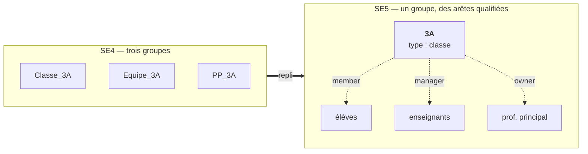
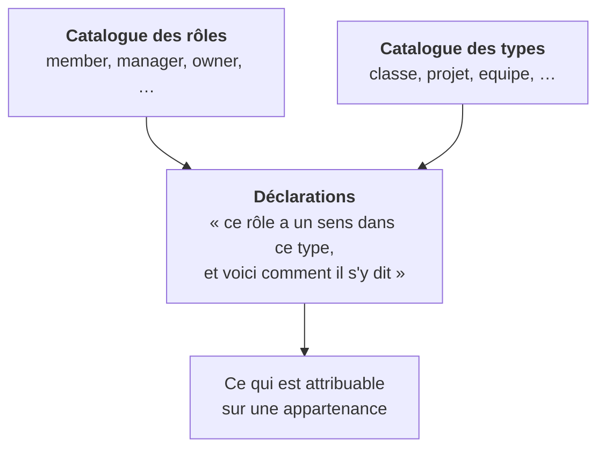
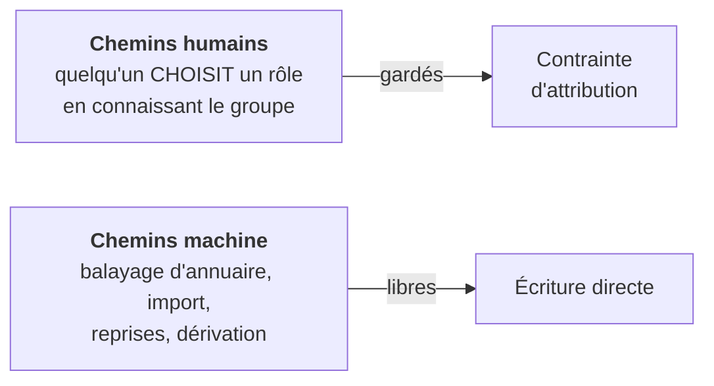

# Groupes, rôles et types — le vocabulaire de l'appartenance

> **Ce que couvre cette fiche.** Comment SE5 dit « cette personne appartient à
> ce groupe, **en tant que quoi** », et qui décide du vocabulaire disponible.
>
> Ce qu'elle ne couvre pas :
> - **l'accès aux écrans de l'application** — c'est un modèle entièrement
>   distinct : [`rights-management.md`](rights-management.md) ;
> - **ce que les droits produisent sur le disque** —
>   [`../filesystem/`](../filesystem/README.md) ;
> - **d'où viennent les groupes** (balayage d'annuaire, import) —
>   [`../identite/`](../identite/README.md).

---

## 1. En une phrase

**Un groupe n'a pas de nature intrinsèque : il porte un *type*, et chaque
appartenance porte un *rôle*.** Les deux vocabulaires sont administrables, et
c'est leur croisement qui dit ce qui est attribuable où.

## 2. D'où l'on vient : trois groupes deviennent un

C'est la décision qui explique tout le reste.

En SE4, une classe existait sous **trois noms d'annuaire** : les élèves dans
`Classe_3A`, les enseignants dans `Equipe_3A`, le professeur principal dans
`PP_3A`. Trois objets pour une seule réalité, à créer, nommer et maintenir
ensemble.



Aujourd'hui, **une seule ligne** au nom nu — `3A`, de type `classe` — et le
statut de chacun vit sur son **arête d'appartenance**.

> **Conséquence à ne jamais perdre de vue : l'équipe pédagogique n'a plus
> d'existence propre.** Il n'y a aucune ligne « Equipe_3A » à retrouver.
> « Les professeurs de cette classe » se dit **uniquement** « les membres de 3A
> qui portent le rôle enseignant ». Tout mécanisme qui voudrait viser cette
> audience doit passer par le rôle d'arête — il n'y a pas d'autre chemin.

## 3. Trois catalogues, une arête



| Objet | Ce qu'il dit | Écran |
| --- | --- | --- |
| Rôle | Une façon d'appartenir | Réglages → Groupes → onglet Rôles |
| Type | Une nature de groupe | Réglages → Groupes → onglet Types |
| Déclaration | Le croisement des deux | Dans l'édition d'un type |

Une déclaration dit **deux choses à la fois** : que ce rôle a un **sens** dans
ce type, et éventuellement comment il s'y **dit** — « gestionnaire » se lit
« Enseignant » en classe, « Porteur » en projet, « Référent » en équipe.

> Le libellé local est **optionnel**. Absent, il ne signifie pas « pas de
> libellé » mais « pas de surcharge » : c'est celui du catalogue qui s'applique.
> Confondre les deux rendrait « membre » inattribuable dans tout type qui ne le
> renomme pas.

## 4. La clé ne bouge jamais, le libellé oui

Chaque ligne de catalogue a une **clé** et un **libellé**. Ce n'est pas une
coquetterie : c'est la clé qui est **stockée** sur les arêtes, visée par les
recettes d'arborescence et comparée en toutes lettres par le code métier. Le
libellé n'est que ce qui s'affiche.

**Renommer « Classe » en « Division » ne doit toucher aucune donnée.** C'est
exactement ce que cette séparation garantit — et c'est pourquoi la clé est
refusée à la modification.

> **La changer réécrirait le sens de tout ce qui la porte, en silence.** Une
> recette qui ne s'apparie plus est indiscernable d'une recette légitimement
> absente : rien ne casserait, tout deviendrait faux. Changer de vocabulaire se
> fait en créant une entrée et en migrant.

Une clé est un mot en minuscules. **Sauf celles héritées** : des valeurs comme
`Custom` existent en base et n'ont délibérément pas été renormalisées. Le
contrôle de forme porte donc sur ce qu'un humain **saisit**, jamais sur ce qui
est relu — sinon une seule ligne héritée bloquerait le réordonnancement du
catalogue entier.

## 5. Déclarer un rôle **ferme** le type

C'est la règle la plus importante de la fiche, et la moins intuitive.

| État du type | Rôles attribuables |
| --- | --- |
| **Aucune déclaration** | **Tout** le catalogue |
| **Au moins une déclaration** | **Uniquement** les rôles déclarés |

Poser la première déclaration sur un type le **restreint**. Un type découvert en
base ou créé à l'écran n'a aucune déclaration : le priver de tout rôle le
rendrait inutilisable — la déclaration est une restriction volontaire, pas un
péage d'entrée.

> **C'est pour cela que le vocabulaire scolaire ne s'installe pas tout seul.**
> Déclarer « Élève / Enseignant / Professeur principal » sur les classes **ferme**
> `classe`, `projet` et `equipe`. C'est sans effet visible aujourd'hui — mais au
> premier rôle personnalisé créé par un administrateur, celui-ci serait
> attribuable partout **sauf** dans les trois types les plus utilisés. Fermer un
> type est une décision ; une migration ne la prend à la place de personne, et
> SE5 n'est pas réservé aux établissements scolaires.

Le vocabulaire scolaire s'installe donc par un geste explicite :

```
php artisan college:seed:role-x-type            # pose ce qui manque
php artisan college:seed:role-x-type --resync   # réaligne aussi les libellés
```

**Additive par défaut** : une déclaration déjà présente est laissée telle quelle,
libellé compris — un administrateur a pu le changer, et le sien fait foi.
`--resync` est le **seul** chemin qui écrase, et il faut le taper.

## 6. Où la contrainte mord — et où elle ne mord pas

C'est délibéré, et c'est ce qui rend l'ensemble tenable.



La garde vit aux points où **un humain choisit** : changer le rôle d'un membre,
préparer un rattachement, enregistrer le formulaire. Elle n'est **ni** sur la
table, **ni** sur un événement de sauvegarde.

**Pourquoi.** Le balayage d'annuaire, l'import d'utilisateurs et les reprises
écrivent des appartenances sans que personne n'ait rien choisi. Les brider
casserait un flux dont l'annuaire reste l'autorité — et la dérivation
automatique ne connaît même pas le type du groupe qu'elle alimente.

> **Ce qui rend l'ensemble cohérent n'est pas la garde, c'est la composition :**
> les chemins libres n'écrivent que les trois rôles historiques, et le
> vocabulaire scolaire les déclare tous les trois. Un test épingle cette
> composition — si quelqu'un ampute le vocabulaire livré, il tombe.

Même logique un cran au-dessus : le vocabulaire des **types** est gardé au
service qui valide un groupe, pas sur la table des groupes.

## 7. Le plancher : trois rôles qui ne disparaissent jamais

La lecture du catalogue rend **toujours** au moins `member`, `manager` et
`owner`, quel que soit l'état de la base — non migrée, non semée, injoignable.

Ces trois clés sont écrites **en toutes lettres** par du code vivant : la
dérivation du rôle au rattachement, la garde « professeur principal », la
projection vers l'annuaire, les recettes livrées. Une base neuve ne doit jamais
faire refuser « membre ».

> **Ce n'est pas une ouverture de secours.** Le repli **restreint** au
> vocabulaire historique : il n'autorise pas une valeur de plus. Et il est
> **journalisé** — sans quoi une vraie panne de base emprunterait exactement le
> même chemin qu'une base non migrée, avec des rôles personnalisés qui
> disparaissent sans une ligne pour l'expliquer.

Un cas particulier tient dans le code à deux endroits, volontairement :
**`owner` ne se déclare que sur `classe`**. Il porte la désignation du
professeur principal, qui n'a de sens que dans une classe. Le déclarer ailleurs
produirait un rôle mort-né — affiché, jamais attribuable — et c'est précisément
ce que refuse la garde.

## 8. On ne supprime pas, on refuse et on dit pourquoi

Aucune suppression n'emporte de donnée métier. À chaque fois, le refus est
**nommé et chiffré**, et rien n'est écrit.

| Ce qu'on veut supprimer | Refusé si |
| --- | --- |
| Un rôle | Il est **structurel** · un type le **déclare** · des appartenances ou des recettes le portent |
| Un type | Il est **structurel** · des groupes le portent · des arborescences s'y accrochent |
| Une déclaration | Des appartenances portent la paire |

> **Pourquoi aucune clé étrangère.** Une contrainte de base refuserait aussi —
> mais sans savoir dire « 47 appartenances portent ce rôle dans des classes,
> changez-les d'abord ». Le motif utile est celui qu'on peut agir.

Trois rôles et neuf types sont **structurels** : leur clé est écrite en toutes
lettres dans le code. Les supprimer ne casserait aucune contrainte — seulement
du code, et le prochain balayage d'annuaire les réécrirait. Leur libellé, lui,
se modifie.

Une exception, et c'est la bonne : supprimer un type **emporte ses
déclarations**. Elles ne décrivent que lui, comme son icône ; les laisser
produirait des lignes orphelines qui rendraient inutilisable une clé recréée
plus tard sous le même nom.

## 9. Ce que les arborescences en font

Une recette d'arborescence dit qui reçoit quoi. La question « qui » se répond de
quatre façons :

| Stratégie | La cible |
| --- | --- |
| Le groupe lui-même | Le groupe pour lequel on matérialise, en entier |
| Un groupe désigné | Choisi à la main au moment de matérialiser |
| Un groupe apparenté | Dérivé par motif de nom |
| **Par rôle d'arête** | Les membres qui portent tel rôle |

**La dernière n'est pas une commodité : c'est ce qui remplace les groupes
multiples de SE4.** Puisque l'équipe pédagogique n'a plus de ligne propre (§2),
« les profs de cette classe » n'est exprimable que comme ça.

Corollaire : la stratégie « groupe apparenté » **ne peut pas** retrouver
`Equipe_3A` — la ligne n'existe plus. Elle sert les apparentés qui existent
réellement.

Seules les stratégies qui savent répondre **seules** permettent à une recette de
s'accrocher à un type de groupe : créer un groupe doit matérialiser son
arborescence sans demander à personne.

> **Le rôle d'arête n'est pas un niveau d'accès.** Un `member` peut recevoir
> l'écriture ; le droit se dit ailleurs, en verbes
> ([`../filesystem/recettes-et-plan.md`](../filesystem/recettes-et-plan.md)).
> Renommer les rôles en
> « contributeur / lecteur » a été examiné puis écarté pour cette raison
> exacte : ce serait faire croire qu'une façon d'appartenir détermine un droit.

## 10. Invariants à ne jamais casser

- **Une clé de catalogue ne se modifie jamais.** Seul le libellé change.
- **Un type sans déclaration garde tout le catalogue.** Inverser ce défaut
  rendrait inutilisable tout type nouvellement créé.
- **Le plancher de trois rôles tient toujours**, même base absente.
- **La contrainte d'attribution reste aux points humains.** La descendre sur la
  table casserait le balayage d'annuaire.
- **Aucune suppression en cascade sur de la donnée métier** — on refuse, on
  chiffre, on n'écrit rien.
- **Le rôle d'arête qualifie une appartenance, il n'accorde aucun droit.**

## 11. Manques connus

1. **Le croisement rôles × droits n'a pas d'écran.** On déclare aujourd'hui
   qu'un rôle a un sens dans un type ; dire ce qu'il **peut faire** reste à
   construire.
2. **Les clés de recette ne référencent pas le catalogue.** Les noms internes
   d'une arborescence (`profs`, `eleves`) restent locaux à chaque recette : une
   homonymie avec un vrai rôle est possible, et volontairement non comptée
   comme un usage.
3. **La casse des clés de type n'est pas normalisée.** `Custom` et `custom`
   peuvent coexister. La lecture apparie en insensible à la casse, mais un
   groupe stocké dans une casse donnée lit d'abord ses propres déclarations ;
   en cas d'homonymie, le premier type déclarant emporte tout.
4. **La colonne miroir du professeur principal survit** sans être lue par aucun
   code vivant — conservée pour les bases existantes, à retirer.

## 12. Carte du code

| Rôle | Fichier |
| --- | --- |
| **Point de lecture unique du vocabulaire** — libellés, attribuables, garde | `app/Support/RoleCatalog.php` |
| Catalogue des rôles | `app/Models/GroupRole.php` |
| Catalogue des types | `app/Models/GroupType.php` |
| Déclarations (le croisement) | `app/Models/GroupTypeRole.php` |
| L'arête d'appartenance et ses trois clés historiques | `app/Models/Pivot/UserGroupUserPivot.php` |
| Les quatre stratégies de résolution | `app/Enums/RoleResolutionStrategy.php` |
| Installation du vocabulaire scolaire | `app/Console/Commands/CollegeSeedRoleXTypeCommand.php` |
| Écrans d'administration | `resources/views/pages/admin/settings/groups/` |
| Écran d'un groupe (les points gardés) | `resources/views/pages/users/groups/[id]/` |

Semis : `GroupRoleSeeder`, `GroupTypeSeeder`.

## Aller plus loin

- Ce que les droits produisent sur le disque :
  [`../filesystem/`](../filesystem/README.md)
- L'autre modèle de droits, celui des écrans :
  [`rights-management.md`](rights-management.md)
- D'où viennent les groupes : [`../identite/`](../identite/README.md)
