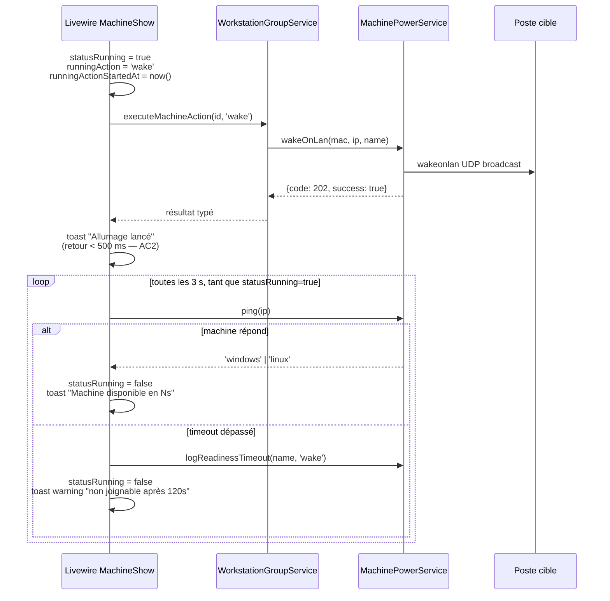
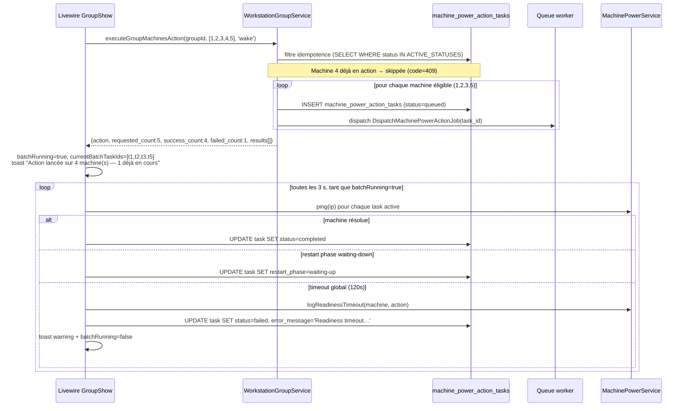
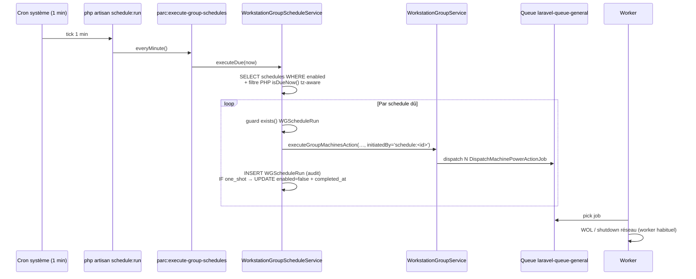

# Domaine Parc — actions machines et feedback readiness

_Dernière mise à jour : 2026-04-21 (story 4-3 — actions batch sur un WorkstationGroup)._

Ce document décrit la façon dont les actions **unitaires** sur une machine (`/parc/machines/{id}`, story 4-2) et les actions **batch** sur un WorkstationGroup (`/parc/groups/{id}`, story 4-3) sont déclenchées, confirmées à l'utilisateur, et suivies jusqu'à réponse (ou timeout) de chaque machine cible.

## Actions supportées

| Clé               | Libellé UI              | Confirmation ? | Notes |
|-------------------|-------------------------|----------------|-------|
| `wake`            | Allumer                 | Non            | WOL via `wakeonlan` + double envoi si `wol_broadcast` configuré. |
| `shutdown`        | Éteindre                | Oui            | Windows : `net rpc shutdown -t 30 -f`. Linux : `ssh … shutdown -h now`. |
| `shutdown-force`  | Forcer l'extinction     | Oui (warning)  | Bypass sémantique de la vérification "utilisateur connecté" (cf. legacy `start_machine_local()` ligne 272). Loggé comme `shutdown-force` dans `machine_boot_logs`. |
| `restart`         | Redémarrer              | Oui            | Reboot + fallback WOL si la machine est éteinte. |
| `remote`          | Accès distant           | Non            | Génère un token Guacamole via `RemoteAccessService` (shim legacy). |

> **Note sur `shutdown-force`** — la commande shell Windows est identique en mode `force=true` et `force=false` (le flag `-f` est historiquement toujours appliqué dans le legacy). La distinction est purement sémantique côté SER : confirmation renforcée côté UI, et trace d'audit distincte dans `machine_boot_logs.action`.

## Flux complet : action → toast immédiat → readiness polling



## Configuration — `config/parc.php`

Le polling utilise deux constantes exposées via la config Laravel :

| Clé                                        | Défaut | Env var                                       | Description |
|--------------------------------------------|--------|------------------------------------------------|-------------|
| `parc.machine_readiness_timeout_seconds`   | `120`  | `PARC_MACHINE_READINESS_TIMEOUT_SECONDS`       | Durée max d'attente post-action avant d'afficher le toast "non joignable". |
| `parc.machine_readiness_poll_interval_seconds` | `3` | `PARC_MACHINE_READINESS_POLL_INTERVAL_SECONDS` | Intervalle entre deux pings de readiness côté Livewire (`wire:poll.{interval}s`). |

## Décision d'architecture (D1 — story 4-2)

Le feedback readiness post-WOL est implémenté en **polling Livewire pur** (`wire:poll.{N}s`), **pas** via `ControlHubTask` ni `Job async`.

Rationale :
- Un re-ping périodique (`MachinePowerService::ping()`) est strictement suffisant pour détecter la readiness.
- L'arrêt du poll est naturel : dès que `$statusRunning = false`, l'attribut `wire:poll` n'est plus rendu dans le Blade et Livewire cesse d'interroger le serveur.
- `ControlHubTask` est un pattern d'orchestration async pour tâches longues coordonnées avec ControlHub. Il ne s'applique pas ici (un simple ping local).

## Références legacy

- [`sambaedu/parcs/action_machine.php`](../../sambaedu/parcs/action_machine.php) — UI legacy (actions wake/shutdown/reboot via GET/POST).
- [`sambaedu/includes/parcs.inc.php:171-320`](../../sambaedu/includes/parcs.inc.php) — `start_machine_local($config, $action, $machine, $force, $silent)` : fonction pivot des actions power en legacy PHP. C'est cette fonction qui implémente le `$force` réel (bypass `count($machine['user']) == 0`).
- [`sambaedu/includes/fonc_parc.inc.php:33-47`](../../sambaedu/includes/fonc_parc.inc.php) — `fping()` : détection OS par ports 22 (Linux) / 445 (Windows), portée intacte dans `MachinePowerService::ping()`.

## Actions batch (story 4-3)

La vue `/parc/groups/{id}` permet de lancer les 4 actions power (`wake`, `shutdown`, `shutdown-force`, `restart`) sur plusieurs machines simultanément. `remote` reste exclu du dropdown batch (AC6 — un token Guacamole est par machine et ouvrable individuellement).

### Flow



### Garanties architecturales

- **NFR2 — retour UI < 500 ms** : le composant Livewire ne fait que créer les rows `machine_power_action_tasks` et dispatcher les jobs. La réponse est émise avant que le worker queue ne touche la première machine.
- **Idempotence multi-couches** :
    1. Service : filtre `whereIn('workstation_id', $ids)->whereIn('status', ACTIVE_STATUSES)` avant dispatch → les machines déjà en action sont comptées `failed_count` avec `code=409, reason='already-running'`.
    2. Livewire : guard `$batchRunning` en tête de `executeSelectedGroupMachinesAction()` → toast warning + return.
    3. Blade : `@disabled($batchRunning)` sur le dropdown batch → désactive visuellement le bouton.
    4. Gate : `Gate::allows('computer.control')` en tête de la méthode Livewire → guard serveur-side même si le Blade est contourné (devtools).
- **Polling performant** : un SEUL `wire:poll` global (pas un par ligne). `pollGroupReadiness()` consomme les tasks du batch courant en un seul SELECT avec eager-loading (`with('workstation')`), puis applique la résolution par task en PHP.
- **Résumé de fin de batch persistant** : l'encart `Résumé du batch` reste affiché tant que l'opérateur ne clique pas "Effacer". Les rows `machine_power_action_tasks` sont conservées en DB pour l'audit trail (pas purgées par `clearBatchSummary`).
- **Une task par machine** : pas de "batch task" agrégée. Chaque task vit indépendamment avec son cycle `queued → running → completed|failed` — cohérent avec la vue machine 4-2, permet de ré-émettre une action sur une machine isolée sans artefact batch.

### Contrat de retour (préservé depuis le backend synchrone initial)

```php
[
    'action' => 'wake',
    'requested_count' => 5,
    'success_count' => 4,
    'failed_count' => 1,
    'results' => [
        // dispatchés en async → code 202 + task_id (rétrocompat)
        ['machine' => 'pc-01', 'success' => true, 'code' => 202, 'task_id' => 42],
        ['machine' => 'pc-02', 'success' => true, 'code' => 202, 'task_id' => 43],
        // skippé pour cause d'idempotence → code 409
        ['machine' => 'pc-03', 'success' => false, 'code' => 409, 'reason' => 'already-running'],
        // introuvable dans le groupe → code 404
        ['machine' => 'id:99', 'success' => false, 'code' => 404, 'reason' => 'not-found'],
    ],
]
```

Les clés `task_id` et `reason` sont des **ajouts rétrocompat** : les consommateurs historiques qui lisent uniquement `{action, requested_count, success_count, failed_count, results[].machine/success/code}` continuent de fonctionner à l'identique.

### `ParcController::massAction` reste synchrone

L'endpoint JSON historique `POST /admin/parcs/{parc}/mass-action` (utilisé par scripts externes et crons legacy) n'est **PAS touché** par le refactor async (D5 story 4-3). Il route toujours via `WorkstationService::wakeOnLan / shutdownMachines / restartMachines` en synchrone. Pour les nouveaux développements **utiliser la vue Livewire** — l'endpoint JSON doit être considéré comme historique.

### Tester manuellement

Voir [`docs/qa/4-2-e2e-manual.md`](../qa/4-2-e2e-manual.md) (unitaire machine) et [`docs/qa/4-3-e2e-manual.md`](../qa/4-3-e2e-manual.md) (batch WorkstationGroup).

---

## Programmations (story 4-4)

_Ajout 2026-04-22 — story 4-4._

Permet de programmer automatiquement l'allumage (`wake`) ou l'extinction (`shutdown`) d'un WorkstationGroup, soit à intervalle récurrent (jours de la semaine + heure), soit à une date/heure unique (one-shot).

### Architecture `tick → enqueue → worker`



Points clés :

- La commande artisan `parc:execute-group-schedules` (Kernel everyMinute) ne fait **que** lire les schedules dûs et enqueuer des jobs. **Aucune I/O réseau.**
- Les workers `laravel-queue-general.service` (déjà packagés depuis 4.2) traitent les jobs — pas de nouveau worker à déployer.
- Le champ `initiated_by` des `MachinePowerActionTask` vaut `schedule:<id>` pour les actions cron (vs `user:<id>` pour les actions manuelles) — utile pour l'audit.

### Modes (D7)

| Mode | Déclenchement | Auto-complétion |
|---|---|---|
| `recurring` | triplet `days_of_week` (ARRAY SMALLINT[] ISO 8601 : 1=lun … 7=dim) + `time_of_day` (TIME) + `timezone` (VARCHAR) | Non — re-tire chaque jour matchant |
| `one_shot` | `run_at` (TIMESTAMPTZ unique, futur) | Oui — `enabled=false` + `completed_at=ran_at` après exécution |

Contrainte CHECK DB `wgs_mode_exclusivity` garantit l'exclusivité au niveau stockage. Validation FormRequest conditionnelle en amont.

### Idempotence multi-couches

1. **Garde `exists()` côté service** (`WorkstationGroupScheduleService::runAlreadyExists`) : skip si run déjà existant pour `(schedule_id, ran_for_date, ran_for_time)`.
2. **Index unique DB** `wgsr_schedule_date_time_unique` : anti double-fire race entre 2 workers.
3. **`withoutOverlapping(5)` côté scheduler** : anti overlap si un run > 1 min.
4. **Filtre 409 hérité 4.3** (`WorkstationGroupService`) : skip silencieux si une machine a déjà une task active.

### Actions MVP (D5)

Seules `wake` et `shutdown` sont autorisées (contrainte CHECK + enum modèle + validation FormRequest). `shutdown-force`, `restart`, `remote` sont exclus du scheduling — usage manuel uniquement.

### Historique et rétention

- Table `workstation_group_schedule_runs` : 1 row par exécution avec JSONB `summary` (success/failed/skipped + `task_ids[]` + `errors[]` + `drift_seconds?` pour one-shot rattrapé).
- Rétention **30 jours** via `parc:prune-group-schedule-runs` (scheduler daily).
- Visualisation : page `/parc/groups/{id}` — panneau Programmations (affichage mixte récurrents / one-shots futurs / one-shots terminés).

### UI

- Page `/parc/groups/{id}` — partiel `_partials/schedules-panel.blade.php`.
- Modale de création/édition avec toggle `Récurrent / Date unique` (D7).
- Bouton « Dupliquer » sur un one-shot terminé → nouveau schedule one-shot (non éditable via « Modifier »).
- Permission Spatie `computer.control` (mêmes droits que les actions manuelles).

### E2E manuel

Voir [`docs/qa/4-4-e2e-manual.md`](../qa/4-4-e2e-manual.md) (10 scénarios VM, dont DST et one-shot rattrapé après downtime).

## Scoping des listings (Story 7.1)

Depuis la Story 7.1, `WorkstationGroupService::listGroups()` et `listMachines()` acceptent un paramètre optionnel `?User $scopeFor = null`. Dans `resources/views/pages/parc/index.blade.php`, on passe `auth()->user()` via un helper `scopedUser()` (qui vérifie `instanceof App\Models\User`).

Comportement :

- `scopeFor === null` → pas de restriction (comportement historique preserved pour les appelants non Livewire / jobs legacy).
- `scopeFor` avec `computer.view` global via Spatie → pas de restriction (admin).
- `scopeFor` sans droit global → restreint aux WorkstationGroups autorisés via délégation `computer.view` positive non négateée (cf. `PermissionService::getAuthorizedWorkstationGroups`).

Voir [`docs/domains/rights-management.md`](rights-management.md) pour le détail du modèle de délégation.

Sur `/parc/groups/{id}`, un check `Gate::allows('view', $group)` dans le `mount()` garantit le blocage silencieux (redirect + toast) en cas d'accès hors périmètre (AC3 Story 7.1).

## Onglet Imprimantes (Story 6.1)

Depuis la Story 6.1, `/parc?tab=printers` expose un troisième onglet (entre `Groupes` et `Postes`) qui liste les imprimantes CUPS, permet le CRUD complet (ajout / configuration / suppression / toggle enable/disable), et porte le **rattachement N:N à un ou plusieurs `WorkstationGroup`** via la table pivot `printer_workstation_group`.

Détails techniques (Service `CupsPrinterService`, modèle Eloquent `Printer`, commande `printers:sync`, cascade FK pivot, sudoers, scope délégué Epic 7) : voir [`docs/domains/printers.md`](printers.md).

Cohérence scope :
- Admin global (`server.admin`) → toutes les imprimantes (y compris orphan, avec filtres dédiés).
- Délégué scopé Epic 7 (`server.admin` scopé sur ≥ 1 parc) → uniquement les imprimantes rattachées à un de ses parcs (les orphans ne lui sont jamais visibles).
- Utilisateur lambda → vide.

E2E manuel : voir [`docs/qa/domains/printers.md`](../qa/domains/printers.md) (20 scénarios dont drift CUPS↔SER, restauration orphan, validation injection).
