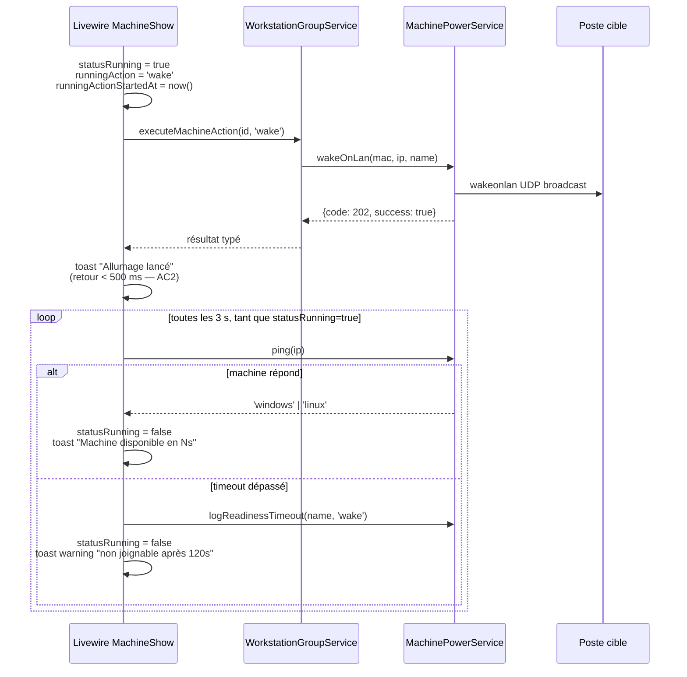

# Domaine Parc — actions machines et feedback readiness

_Dernière mise à jour : 2026-04-20 (story 4-2)._

Ce document décrit la façon dont les actions unitaires sur une machine (`/parc/machines/{id}`) sont déclenchées, confirmées à l'utilisateur, et suivies jusqu'à réponse (ou timeout) de la machine cible.

## Actions supportées

| Clé               | Libellé UI              | Confirmation ? | Notes |
|-------------------|-------------------------|----------------|-------|
| `wake`            | Allumer                 | Non            | WOL via `wakeonlan` + double envoi si `wol_broadcast` configuré. |
| `shutdown`        | Éteindre                | Oui            | Windows : `net rpc shutdown -t 30 -f`. Linux : `ssh … shutdown -h now`. |
| `shutdown-force`  | Forcer l'extinction     | Oui (warning)  | Bypass sémantique de la vérification "utilisateur connecté" (cf. legacy `start_machine_local()` ligne 272). Loggé comme `shutdown-force` dans `machine_boot_logs`. |
| `restart`         | Redémarrer              | Oui            | Reboot + fallback WOL si la machine est éteinte. |
| `remote`          | Accès distant           | Non            | Génère un token Guacamole via `RemoteAccessService` (shim legacy). |

> **Note sur `shutdown-force`** — la commande shell Windows est identique en mode `force=true` et `force=false` (le flag `-f` est historiquement toujours appliqué dans le legacy). La distinction est purement sémantique côté SER : confirmation renforcée côté UI, et trace d'audit distincte dans `machine_boot_logs.action`.

## Flux complet : action → toast immédiat → readiness polling

## Configuration — `config/parc.php`

Le polling utilise deux constantes exposées via la config Laravel :

| Clé                                        | Défaut | Env var                                       | Description |
|--------------------------------------------|--------|------------------------------------------------|-------------|
| `parc.machine_readiness_timeout_seconds`   | `120`  | `PARC_MACHINE_READINESS_TIMEOUT_SECONDS`       | Durée max d'attente post-action avant d'afficher le toast "non joignable". |
| `parc.machine_readiness_poll_interval_seconds` | `3` | `PARC_MACHINE_READINESS_POLL_INTERVAL_SECONDS` | Intervalle entre deux pings de readiness côté Livewire (`wire:poll.{interval}s`). |

## Décision d'architecture (D1 — story 4-2)

Le feedback readiness post-WOL est implémenté en **polling Livewire pur** (`wire:poll.{N}s`), **pas** via `ControlHubTask` ni `Job async`.

Rationale :
- Un re-ping périodique (`MachinePowerService::ping()`) est strictement suffisant pour détecter la readiness.
- L'arrêt du poll est naturel : dès que `$statusRunning = false`, l'attribut `wire:poll` n'est plus rendu dans le Blade et Livewire cesse d'interroger le serveur.
- `ControlHubTask` est un pattern d'orchestration async pour tâches longues coordonnées avec ControlHub. Il ne s'applique pas ici (un simple ping local).

## Références legacy

- [`sambaedu/parcs/action_machine.php`](../../sambaedu/parcs/action_machine.php) — UI legacy (actions wake/shutdown/reboot via GET/POST).
- [`sambaedu/includes/parcs.inc.php:171-320`](../../sambaedu/includes/parcs.inc.php) — `start_machine_local($config, $action, $machine, $force, $silent)` : fonction pivot des actions power en legacy PHP. C'est cette fonction qui implémente le `$force` réel (bypass `count($machine['user']) == 0`).
- [`sambaedu/includes/fonc_parc.inc.php:33-47`](../../sambaedu/includes/fonc_parc.inc.php) — `fping()` : détection OS par ports 22 (Linux) / 445 (Windows), portée intacte dans `MachinePowerService::ping()`.

## Tester manuellement

Voir [`docs/qa/4-2-e2e-manual.md`](../qa/4-2-e2e-manual.md).
