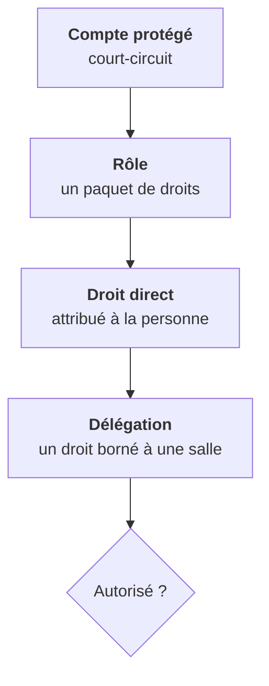
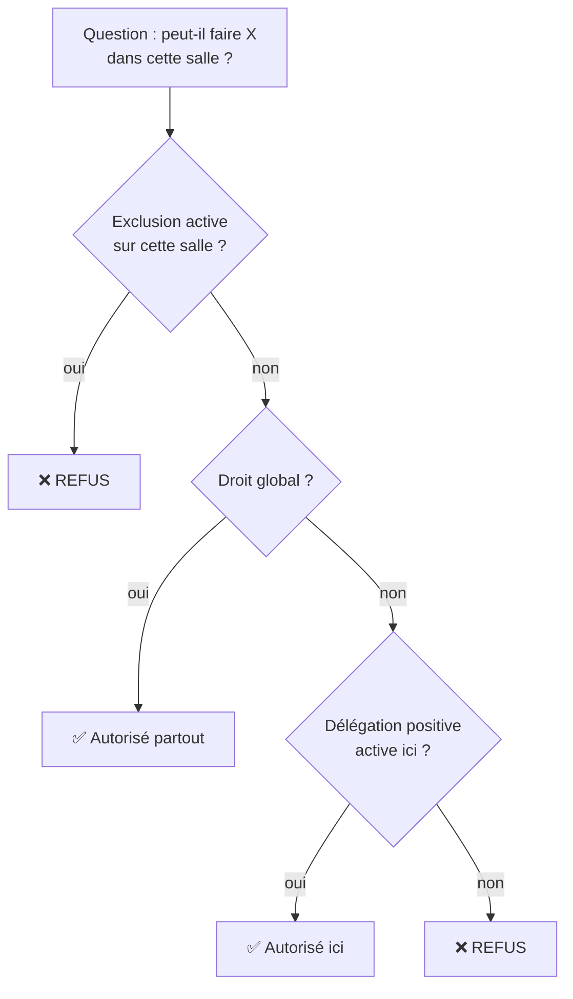

# Droits & délégations — qui a le droit de quoi dans SE5

> **Ce que couvre cette fiche.** L'accès aux **pages et aux gestes de
> l'application** : qui peut ouvrir un écran, cliquer un bouton, lancer une
> action.
>
> Ce qu'elle ne couvre pas :
> - **qui est l'utilisateur** et comment il prouve son identité —
>   [`../auth/`](../auth/README.md) ;
> - **ce qu'un membre d'un groupe peut faire des fichiers** de ce groupe :
>   c'est un modèle entièrement distinct, décrit dans
>   [`groupes-roles.md`](groupes-roles.md) et
>   [`../filesystem/`](../filesystem/README.md).
>
> Les deux modèles ne se recouvrent pas et n'ont pas la même autorité. Un
> professeur peut avoir tous les droits sur les fichiers de sa classe sans
> pouvoir ouvrir le moindre écran d'administration.

---

## 1. En une phrase

**Un utilisateur détient des droits nommés, et un droit peut être borné à une
salle.** La base de données en est la seule source ; l'annuaire n'est plus
consulté pour décider.

C'est la rupture avec SE4, où les droits vivaient dans un attribut d'annuaire
sous forme de **masque binaire** — un entier dont chaque bit valait une
autorisation — relu à chaque page. Un annuaire indisponible rendait alors
l'application inutilisable ; aujourd'hui elle décide sans lui.

## 2. Les quatre couches qui décident

Elles se lisent de haut en bas, et chacune ne fait qu'**ajouter** — sauf la
dernière, qui sait aussi **retirer**.

| Couche | Ce qu'elle est | Où elle vit |
| --- | --- | --- |
| Compte protégé | Le login réservé `admin` | Décidé dans le code, pas en base |
| Rôle | Un paquet de droits nommé (« Technicien ») | Table des rôles |
| Droit direct | Un droit attaché à une personne, hors rôle | Table de liaison |
| Délégation | Un droit **borné à une salle**, positif ou négatif | Table dédiée |

## 3. Le vocabulaire : 24 droits, 9 profils

Un droit est un **nom en clair** — `computer.control`, `user.password.init` —
et non plus un bit. L'énumération `app/Enums/SambaPermission.php` **fait foi** :
c'est la seule liste, et elle est exhaustive.

| Catégorie | Droits | Délégable |
| --- | --- | --- |
| Utilisateurs | 6 | non |
| Partages de classe | 3 | non |
| Lecteurs réseau gérés | 2 | non |
| Règles d'accès aux dossiers | 2 | non |
| **Machines** | **5** | **oui** |
| **Applications déployées** | **3** | **oui** |
| Serveur | 1 | non |
| Fonds d'écran | 1 | non |
| Personnalisation applicative | 1 | non |

**Seules les catégories « machines » et « applications déployées » sont
déclarées délégables.** C'est cohérent avec ce qu'une salle est : un périmètre
de postes. Déléguer « modifier les utilisateurs » sur une salle n'aurait pas de
sens — un utilisateur n'appartient pas à une salle.

> **Deux droits peuvent se ressembler sans se confondre.** « Voir les partages »
> gouverne les partages **de classe** ; « voir les lecteurs réseau gérés »
> gouverne les **répertoires réseau**. Le référent numérique a le second et pas
> le premier : réutiliser le même droit lui aurait ouvert les partages de classe
> par effet de bord.

Neuf **profils** sont livrés — élève, professeur, admin élèves, admin partages,
admin utilisateurs, technicien, référent numérique, admin machines, super
administrateur. Un établissement peut en créer d'autres depuis l'écran ; ceux
livrés ne se renomment ni ne se suppriment, parce que le code les nomme.

> **Le semis ne réécrit jamais un profil existant.** Il crée ce qui manque et
> n'attache les droits canoniques qu'à la **création**. Un administrateur qui a
> retiré un droit d'un profil livré le retrouve retiré après une mise à jour —
> c'est voulu : son choix vaut plus que le nôtre.

## 4. La délégation : un droit borné à une salle

Une délégation dit « cette personne a ce droit **ici** ». Elle porte
éventuellement une **date d'expiration**, et elle peut être **négative** : une
exclusion.

**L'exclusion prime sur le droit global, et c'est le cœur du mécanisme.** Sans
elle, la seule façon de retirer une salle à quelqu'un serait de lui retirer son
rôle — donc toutes les autres. L'exclusion est toujours plus spécifique que le
droit qu'elle corrige.

Trois conséquences à connaître :

- **révoquer une délégation positive ne retire pas forcément le droit.** Si la
  personne le tient aussi d'un rôle global, elle le garde. L'écran propose donc
  l'action la plus probable selon l'état constaté — révoquer, ou exclure ;
- **une exclusion expirée ne bloque plus rien.** L'expiration est vérifiée à
  chaque lecture, jamais par une purge ;
- **l'effet est immédiat**, y compris sur une session ouverte : rien n'est mis
  en cache côté délégation.

### Les salles logiques ne sont pas déléguables

Une délégation ne s'applique qu'à une salle **physique**. Sur un groupe de
rangement — un conteneur hiérarchique — c'est le droit global qui décide, et lui
seul.

Conséquence assumée : un délégué qui remonte le fil d'Ariane vers le groupe
parent reçoit un refus. Acceptable tant que le nom du parent n'est pas affiché
aux non-administrateurs.

### Le périmètre est opposable jusque dans les écrans

La garde de périmètre n'est pas seulement à l'entrée des pages. Quatre gestes
la consultent avec la salle en main : consulter la salle, la piloter (actions
groupées, planifications), y **affecter des applications**, y **écrire une
option de configuration**.

> **Pourquoi ces deux derniers ont demandé un traitement propre.** Ils étaient
> gardés par un droit **global**, aveugle au périmètre : un délégué d'une seule
> salle pouvait, en changeant l'identifiant de salle envoyé par son navigateur,
> écrire dans une autre. La garde scopée et le figement de cet identifiant côté
> serveur ferment les deux moitiés du problème — la seconde seule ne suffisait
> pas.

## 5. Ce qui garde réellement les pages

Trois mécanismes se superposent, et **ils n'ont pas la même finesse**.

| Mécanisme | Granularité | Où |
| --- | --- | --- |
| Droit nommé sur la route | Un droit précis | Déclaration de route |
| Garde d'administration | Grossière — voir ci-dessous | Une seule route parente |
| Autorisation dans l'écran | La ressource elle-même | Au montage du composant |

**Un seul droit garde presque toute l'administration.** « Administration
serveur » couvre à lui seul dix-huit écrans : réglages, catalogue d'agents,
extensions, images d'installation, politiques de fichiers. Il n'y a pas de
graduation à l'intérieur — on l'a, ou on n'a rien.

> **La garde d'administration héritée décide par comparaison de texte.** Elle
> accorde l'accès si le nom d'un des groupes de la personne **contient**
> « admin » — donc « Administrateurs de labo » ou « admin-stagiaires » ouvrent
> la porte en grand. Ce motif vient de SE4 et a été porté tel quel lors de la
> bascule vers la base : c'était un changement de **transport**, pas de
> sémantique. Il reste à éteindre au profit des droits nommés.

### Le refus ne dit pas ce qu'il cache

Un accès hors périmètre produit trois effets : un message d'erreur, une
redirection vers la liste, et une ligne de journal. **Pas de page 404
distincte** : révéler qu'une salle existe est déjà une information.

## 6. Le compte protégé

Le login `admin` détient **tous les droits déclarés dans le code**, sans lire
une seule ligne en base. Un droit ajouté demain lui est acquis immédiatement, et
on ne peut lui en retirer aucun.

**Le court-circuit est volontairement restreint aux droits.** Une garde qui
encode une **règle métier** — au premier chef le verrou posé par l'autorité
amont sur une configuration imposée — reste opposable au compte protégé.
L'autorité amont prime sur tout acteur local, celui-ci compris.

> Ne pas confondre « être le compte protégé » et « être administrateur ». Le
> second est un rôle, il vaut pour plusieurs comptes, et il se retire.

## 7. La trace

Toute pose, tout retrait et toute exclusion écrivent une ligne dans un journal
**non modifiable** : le modèle refuse toute réécriture d'une ligne existante.

| Propriété | Choix | Pourquoi |
| --- | --- | --- |
| Nom du droit | Copié en texte, pas une référence | Une ligne reste lisible après renommage du droit |
| Acteur, cible, salle | Références **annulées** à la suppression | La ligne survit à la disparition de son sujet |
| Écriture | **Au mieux** | Une base d'audit en panne ne doit pas empêcher de retirer un droit |
| Opération sans effet | N'écrit rien | Une pose répétée ne produit qu'une ligne |

**« Au mieux » est un choix, et il se voit.** Quand la trace échoue, le geste
est appliqué quand même et l'écran affiche un avertissement explicite —
« délégation appliquée mais traçabilité non enregistrée ». L'administrateur a le
signal tout de suite plutôt qu'un blocage qu'il ne saurait pas expliquer.

Deux limites à connaître :

- **une suppression en cascade n'est pas tracée.** Supprimer une salle efface
  ses délégations sans écrire de ligne de retrait ;
- **l'immuabilité est applicative.** Une écriture directe en base contourne la
  garde ; seul un verrou dans le moteur la rendrait inconditionnelle.

## 8. Ce que l'annuaire ne décide plus

C'est la bascule la plus importante, et elle est **achevée** côté décision.

| Avant (SE4) | Aujourd'hui |
| --- | --- |
| Les droits sont un masque binaire dans l'annuaire | Ce sont des droits nommés en base |
| Chaque requête relit l'annuaire | Aucune lecture d'annuaire pour décider |
| Les profils sont des groupes d'annuaire | Ce sont des lignes en base, renommables |

La reprise des profils historiques est un outil de **migration**, pas un flux :
elle pose un verrou après son premier passage et devient sans effet ensuite. Les
profils sont, à partir de là, des objets de la base — un administrateur peut les
renommer sans craindre qu'un import les recrée.

Ce qui subsiste de l'ancien monde est **une projection sortante**, pas une
source : la conversion vers le masque binaire existe encore, pour afficher une
valeur de compatibilité et pour la commande de migration. Aucune décision
d'autorisation n'en dépend.

## 9. Le professeur ne voit que ses classes

Deux gestes sont restreints à la classe pour les profils **professeur** et
**admin élèves** : consulter la fiche d'un utilisateur, et réinitialiser son mot
de passe. La règle est simple : **acteur et cible doivent partager un groupe de
type classe**.

Les profils d'administration globaux ne sont pas concernés. Un profil
personnalisé qui reçoit ces droits est traité comme global — la restriction se
déclenche sur le **profil**, pas sur le droit.

> **Un professeur rattaché à plusieurs établissements ne demande aucun
> traitement particulier.** Les droits sont rattachés aux personnes et aux
> classes, jamais à un lieu.

## 10. Invariants à ne jamais casser

- **La base décide, l'annuaire n'est pas consulté.** Toute politique d'accès
  s'écrit contre les droits nommés — jamais contre les colonnes miroir de
  l'annuaire, jamais contre un masque binaire.
- **L'exclusion prime sur le droit global.** Réordonner la précédence
  rendrait l'exclusion inopérante précisément dans le cas où elle sert.
- **Un droit délégable se garde avec la salle en main.** Un contrôle global sur
  un geste qui porte sur une salle est une porte ouverte, pas une simplification.
- **Le compte protégé ne contourne pas les règles métier**, seulement les droits.
- **Le journal ne se réécrit pas.**

## 11. Manques connus

1. **La garde d'administration décide par comparaison de texte** sur les noms de
   groupes (§5). Elle est à remplacer par des droits nommés.
2. **Dix-huit écrans derrière un seul droit** (§5) : il n'existe aucune
   graduation dans l'administration.
3. **L'immuabilité du journal est applicative** (§7) : une écriture directe en
   base passe outre.
4. **Les suppressions en cascade ne laissent pas de trace** (§7).
5. **La conversion vers le masque binaire survit** sans consommateur de décision
   (§8) — elle reste à retirer.

## 12. Carte du code

| Rôle | Fichier |
| --- | --- |
| **Liste des droits — fait foi** | `app/Enums/SambaPermission.php` |
| Profils livrés et leurs droits | `app/Enums/SambaRole.php` |
| Délégations : pose, retrait, exclusion, décision | `app/Services/PermissionService.php` |
| Écriture de la trace | `app/Services/DelegationHistoryService.php` |
| Court-circuit du compte protégé, branchement des gardes | `app/Providers/AuthServiceProvider.php` |
| Garde d'administration héritée | `app/Http/Middleware/RequireAdminRights.php` |
| Périmètre par salle (consulter, piloter, affecter, configurer) | `app/Policies/WorkstationGroupPolicy.php` |
| Restriction à la classe | `app/Policies/UserPolicy.php` |
| Écran d'administration des droits | `resources/views/pages/rights-management/index.blade.php` |

Modèles : `Delegation`, `DelegationHistory`. Semis :
`database/seeders/PermissionSeeder.php`.

## Aller plus loin

- Comment l'utilisateur est authentifié : [`../auth/`](../auth/README.md)
- L'autre modèle de droits, celui des fichiers :
  [`groupes-roles.md`](groupes-roles.md)
- Le périmètre des salles : [`parc.md`](parc.md)
- Ce que la validation doit vérifier :
  [`../qa/domains/rights-management.md`](../qa/domains/rights-management.md)
