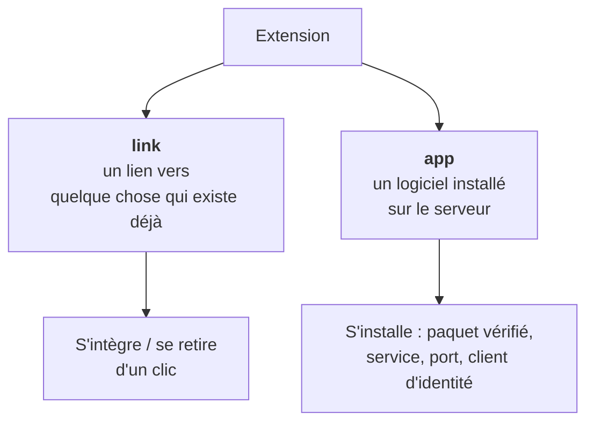

# Extensions

> **Porte d'entrée du domaine.** Ce qu'est une extension, comment elle arrive
> sur une instance, et ce qu'elle a le droit de savoir. Le détail vit dans les
> fiches liées.

---

## En une phrase

**Une extension ajoute une fonctionnalité à SE5 sans être SE5.** Elle apparaît
comme une tuile dans la barre de navigation, elle apprend qui est l'utilisateur
par le protocole d'identité standard, et elle ne touche ni à la base, ni à
l'annuaire.

## Les deux natures

Tout part de là. Une extension est de l'une des deux sortes, et rien d'autre :

| | `link` | `app` |
| --- | --- | --- |
| Ce que c'est | Une tuile qui pointe vers une adresse | Un logiciel déployé sur le serveur |
| Ce que l'intégration fait | Change un statut | Installe un paquet, ouvre un port, déclare un client d'identité |
| Réversible ? | Oui, immédiatement | Oui, par désinstallation |
| Exemple | La documentation, servie à `/doc` | La visioconférence |

Les deux familles de transitions **ne peuvent jamais se croiser** : une opération
d'installation refuse une extension `link`, et l'intégration d'un lien refuse une
`app`. Ce n'est pas une précaution de style — c'est ce qui empêche un clic dans
l'interface de déclencher une installation système.

## Le pourquoi

SE4 n'avait pas d'extensions. Ajouter une fonctionnalité voulait dire modifier
SE4 : du code dans le même dépôt, la même base, les mêmes droits. Deux
conséquences — un établissement ne pouvait rien ajouter de son côté, et tout
ajout héritait des accès de l'application entière.

Le système d'extensions renverse les deux :

- **un tiers peut publier** une extension et la faire installer sur une instance
  sans passer par nous ;
- **une extension n'hérite de rien.** Elle apprend l'identité de l'utilisateur
  par un jeton signé, et c'est tout ce qu'elle obtient.

## Parcours de lecture

**Tu découvres le domaine.** [cycle-de-vie.md](cycle-de-vie.md) — les états
qu'une extension traverse, et qui a le droit de les changer.

**Tu veux installer une extension tierce.**
[sources-et-confiance.md](sources-et-confiance.md), puis
[installation.md](installation.md).

**Une extension ne répond plus.** [sante.md](sante.md).

**Tu veux savoir pourquoi c'est fait ainsi.** [metier.md](metier.md).

## Carte des fiches

| Fiche | Axe | Sujet |
| --- | --- | --- |
| [metier.md](metier.md) | métier | Les décisions et leurs conséquences |
| [cycle-de-vie.md](cycle-de-vie.md) | technique | États, transitions, journal d'audit, le manifeste |
| [sources-et-confiance.md](sources-et-confiance.md) | technique | D'où viennent les extensions, et comment on les croit |
| [installation.md](installation.md) | technique | Ce que l'installation d'une `app` fait réellement |
| [sante.md](sante.md) | technique | Sonder un backend, et qui lit le résultat |

Checklist de pré-production : [`qa/domains/extensions.md`](../qa/domains/extensions.md).
Ce qu'une extension apprend de l'utilisateur :
[`auth/fournisseur-oidc.md`](../auth/fournisseur-oidc.md).

## Invariants à ne jamais casser

- **Un seul écrivain par colonne d'état.** Le statut n'est écrit que par le
  service de cycle de vie ; les colonnes de santé, que par le service de santé.
  Ces colonnes sont volontairement hors des attributs affectables en masse —
  rouvrir cette porte suffirait à les faire muter depuis n'importe où.
- **L'acte et sa trace sont atomiques.** Une transition et sa ligne de journal
  vivent dans la même transaction. Une opération sans effet n'écrit rien : un
  journal qui enregistre des non-événements devient illisible.
- **Rien n'est jamais supprimé.** Une extension se retire, une source se
  désactive, un client d'identité se révoque. L'historique reste lisible.
- **La barre de navigation ne fait aucun appel réseau.** Elle est rendue sur
  toute page ; une sonde par tuile et par page vue serait insoutenable. Elle lit
  des colonnes déjà remplies.
- **La barre est rendue partout, donc elle ne doit jamais faire tomber une
  page.** Toute erreur de rendu d'une tuile est absorbée.
- **Une extension ne lit ni la base, ni l'annuaire, ni la session SE5.** Elle
  n'a que ce que le jeton d'identité lui dit.

## Manques connus

- **Aucune mise à jour en place vérifiée de bout en bout.** La commande existe,
  mais le chemin « version installée → version publiée » n'est pas couvert par
  un scénario de pré-production complet.
- **La révocation d'un périmètre est à sens unique.** Il n'existe pas de
  ré-octroi : reconsentir passe par une désinstallation puis une
  réinstallation. C'est un choix, pas un oubli — mais il surprend.
- **Une seule extension existe dans le dépôt** (visioconférence). Le contrat de
  manifeste n'a donc été éprouvé que par elle et par la documentation.
- **La frontière privilégiée dépend d'une configuration système** (une entrée
  `sudo` pour un programme d'assistance). Son absence n'est constatée qu'au
  moment où une installation échoue.

## Carte du code

**Décisions et registre**

| Rôle | Fichier |
| --- | --- |
| Transitions d'état — **seul écrivain du statut** | `app/Services/Extensions/ExtensionLifecycleService.php` |
| Lecture du catalogue admin | `app/Services/Extensions/ExtensionCatalogService.php` |
| Journal d'audit | `app/Services/Extensions/ExtensionAuditJournalService.php` |
| Validation du manifeste | `app/Services/Extensions/ExtensionManifestValidator.php` |

**Sources et confiance**

| Rôle | Fichier |
| --- | --- |
| Actes d'administration d'une source | `app/Services/Extensions/ExtensionSourceService.php` |
| Récupération du catalogue distant | `app/Services/Extensions/RemoteCatalogSyncService.php` |
| Vérification de signature | `app/Services/Extensions/CatalogSignatureVerifier.php` |

**Installation**

| Rôle | Fichier |
| --- | --- |
| Moteur d'installation et de retrait | `app/Services/Extensions/ExtensionInstallService.php` |
| Suivi d'une opération | `app/Services/Extensions/ExtensionOperationRunner.php` |
| Frontière privilégiée | `app/Services/Extensions/SudoExtensionHelperRunner.php`, `Contracts/ExtensionHelperRunner.php` |
| Périmètres accordés | `app/Services/Extensions/ExtensionScopeService.php` |

**Usage** — `ExtensionLauncherService` (les tuiles),
`ExtensionHealthService` (la sonde).

**Modèles** — `Extension`, `ExtensionSource`, `ExtensionAuditLog`,
`ExtensionInstallRun`.
**Énumérations** — `ExtensionType`, `ExtensionStatus`, `ExtensionSourceKind`,
`ExtensionSourceSyncStatus`.
**Configuration** — `config/extensions.php`.

**Commandes** — `ext:install`, `ext:remove`, `ext:update`, `ext:sources:sync`,
`ext:health:check`.

**Extension livrée** — `extensions/bbb/` (visioconférence, type `app`).

**Tests** — `tests/Feature/Extensions/`,
`tests/Architecture/ExtensionIsolationTest.php`.
