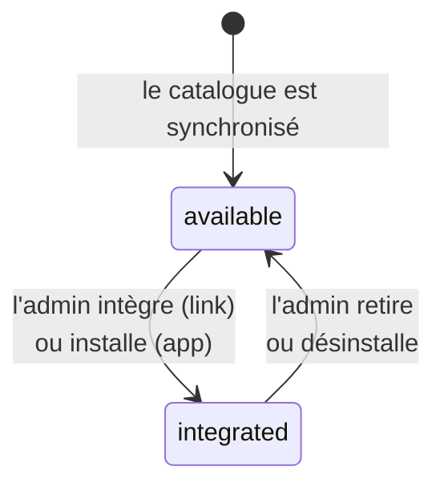

# Cycle de vie d'une extension

> **Ce que couvre cette fiche.** Les états qu'une extension traverse, qui a le
> droit de les changer, et la trace que chaque changement laisse.
>
> Ce qu'elle ne couvre pas : d'où l'extension vient
> ([sources-et-confiance.md](sources-et-confiance.md)) et ce que l'installation
> fait sur le serveur ([installation.md](installation.md)).

---

## En une phrase

**Une extension n'a que deux états** — présente au catalogue, ou en service. Le
passage de l'un à l'autre est un acte, il est tracé, et il n'est jamais
implicite.

## Les deux états

| État | Ce que ça veut dire | L'utilisateur la voit ? |
| --- | --- | --- |
| `available` | Connue du catalogue, pas en service | Non |
| `integrated` | En service | Oui, si son rôle le permet |

Il n'y a **pas** d'état intermédiaire « en cours d'installation » sur
l'extension. Une installation en cours vit dans sa propre table d'exécution —
voir [installation.md](installation.md). L'extension bascule à la toute
dernière étape, ou pas du tout.

## D'où viennent les extensions du catalogue

La synchronisation lit des **manifestes** — un par extension — et met à jour le
registre. Elle est **idempotente** : la rejouer ne duplique rien.

Trois garanties valent d'être connues :

- **Un manifeste fautif n'en casse aucun autre.** La validation est faite
  fichier par fichier ; celui qui échoue est ignoré avec une trace nommant le
  champ en cause, et la boucle continue.
- **La synchronisation n'écrit jamais le statut.** Sinon un simple rechargement
  de catalogue **désintégrerait une extension en service**. La colonne est
  d'ailleurs hors des attributs affectables en masse.
- **La clé naturelle est le couple source + identifiant.** Deux sources peuvent
  publier une extension du même nom sans se marcher dessus.

## Le manifeste

C'est le contrat public du système. Version 1 :

| Champ | Rôle |
| --- | --- |
| `manifest_version` | Refusé s'il n'est pas connu |
| `id`, `name`, `version`, `publisher` | Identité |
| `type` | `link` ou `app` |
| `entry_url` | Où mène la tuile |
| `icon`, `description` | Présentation |
| `scopes` | Ce que l'extension demande à savoir de l'utilisateur |
| `visibility.roles` | Qui voit la tuile |
| `install` | Pour une `app` : canal, paquet, empreinte, adresses de retour |

**La validation est fermée par défaut** : toute violation lève une erreur qui
**nomme le champ fautif**. C'est un contrat d'entrée — un manifeste qu'on ne
comprend pas est un manifeste qu'on refuse.

## Le journal d'audit

Chaque acte écrit une ligne : intégration, retrait, installation, échec
d'installation, mise à jour, ajout ou retrait de source, révocation d'un
périmètre.

**Deux règles font sa valeur :**

**L'acte et sa trace sont atomiques.** Ils vivent dans la même transaction. Une
opération sans effet — intégrer ce qui l'est déjà — n'écrit **rien** : un
journal qui enregistre des non-événements devient illisible, donc inutile.

**Rien de sensible n'y entre.** Ni adresse de source — elle peut porter un jeton
d'accès dans ses paramètres — ni secret, ni identifiant de client, ni empreinte
de paquet. C'est garanti à l'écriture par tous les services, et à la lecture en
n'affichant que les colonnes du journal.

> **Le journal se lit avec tolérance, à l'inverse du manifeste.** Le type
> d'action est un texte libre : cette page affichera un jour des actions qu'elle
> ne connaît pas, écrites par une version plus récente dont la base a été
> restaurée ici. Une action inconnue est affichée **telle quelle**.
>
> Ce n'est pas une incohérence avec le rejet strict du manifeste : là-bas on
> **valide une entrée**, ici on **affiche de l'historique déjà écrit**. Refuser
> de l'afficher ne protégerait rien et effacerait de la trace à l'écran.

Les lignes portent des copies des noms — clé et nom de l'extension, clé de la
source, identifiant de l'acteur. C'est ce qui les rend lisibles **après**
suppression de leur cible.

**Aucune purge automatique.** Le volume est borné par construction : ce sont des
actes humains. Un journal d'audit qui s'efface tout seul n'est pas un journal
d'audit.

## Les tuiles

Ce que l'utilisateur voit est calculé par un service distinct de tout le reste,
et il **n'écrit rien**.

Deux contraintes le façonnent :

- **une seule requête, aucun appel réseau.** La barre de navigation est rendue
  sur toute page authentifiée ; une sonde par tuile et par page vue serait
  intenable. Elle lit des colonnes déjà remplies ;
- **aucun cache.** Il faudrait l'invalider, pour un gain non mesurable sur une
  requête déjà négligeable. Un test compte les requêtes pour que ça le reste.

La visibilité vient du manifeste : une tuile n'apparaît que pour les rôles
déclarés.

> **La barre est rendue partout — donc elle ne doit jamais faire tomber une
> page.** Toute erreur de rendu d'une tuile est absorbée. Sans cela, une seule
> extension mal formée rendrait l'application entière inaccessible.

## Carte du code

| Rôle | Fichier |
| --- | --- |
| Transitions — **seul écrivain du statut** | `app/Services/Extensions/ExtensionLifecycleService.php` |
| Registre et synchronisation | `app/Services/Extensions/ExtensionCatalogService.php` |
| Validation du manifeste | `app/Services/Extensions/ExtensionManifestValidator.php` |
| Lecture du journal | `app/Services/Extensions/ExtensionAuditJournalService.php` |
| Tuiles | `app/Services/Extensions/ExtensionLauncherService.php` |

Modèles : `Extension`, `ExtensionAuditLog`.
Énumérations : `ExtensionType`, `ExtensionStatus`.

## Aller plus loin

- D'où vient l'extension : [sources-et-confiance.md](sources-et-confiance.md)
- Ce que l'installation fait : [installation.md](installation.md)
- Pourquoi c'est fait ainsi : [metier.md](metier.md)
