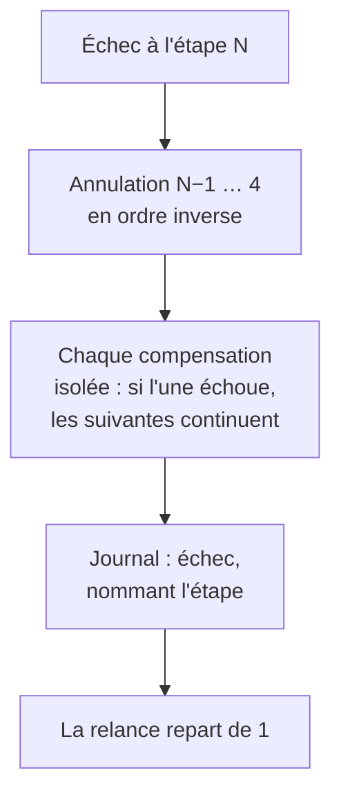

# Installer une extension applicative

> **Ce que couvre cette fiche.** Ce qui se passe réellement quand on installe
> une extension de type `app` : les neuf étapes, leur ordre, et pourquoi cet
> ordre-là.
>
> Ce qu'elle ne couvre pas : la confiance accordée à la source
> ([sources-et-confiance.md](sources-et-confiance.md)).

---

## En une phrase

**Installer une extension, c'est neuf étapes dont chacune sait se défaire.** Si
la sixième échoue, les cinq précédentes sont annulées en sens inverse et
l'instance revient à l'état d'avant.

## Pourquoi c'est construit comme ça

Une installation qui échoue à mi-chemin laisse deux traces possibles :

- **une installation zombie** — l'extension est marquée installée en base, mais
  le service n'existe pas. L'interface ment, et personne ne sait quoi réparer ;
- **rien du tout** — l'échec est propre, l'administrateur relance.

Le second est le seul acceptable. Il impose deux règles : chaque étape doit
savoir se défaire, et **la base est écrite en tout dernier**.

## Le plan

| # | Étape | Comment on la défait |
| --- | --- | --- |
| 0 | Verrou global | Libéré quoi qu'il arrive |
| 1 | Résolution et gardes — type, source, unicité | *lecture seule* |
| 2 | Lecture du bloc d'installation, allocation d'un port | *lecture seule* |
| 3 | Téléchargement borné, vérification de l'empreinte | Suppression du fichier |
| — | **Frontière : rien au-delà sans empreinte conforme** | |
| 4 | Déclaration du client d'identité | Révocation |
| 5 | Écriture de l'environnement (secret par entrée standard) | Retrait de l'environnement |
| 6 | Installation du paquet | Retrait du paquet |
| 7 | Activation du service | Désactivation |
| 8 | Publication de l'adresse web, rechargement du serveur | Retrait, rechargement |
| 9 | **Base : l'extension passe en service, journal écrit** | *dernière étape* |

### L'ordre n'est pas arbitraire

**Le réversible et local avant le privilégié.** Fichiers SE5 et registre
d'identité d'abord ; ce qui demande les droits d'administration système ensuite.
Défaire un enregistrement en base coûte moins cher que défaire une installation
de paquet.

**L'environnement avant le paquet.** L'unité de service référence le fichier
d'environnement : un démarrage prématuré échouerait.

**L'adresse web en dernier geste système.** On n'expose l'extension qu'une fois
son backend démarré — **jamais de page d'erreur servie sur une adresse qu'on
vient d'ouvrir**.

**La base en tout dernier.** Si elle échoue, les compensations ont déjà ramené le
système à l'état propre. L'inverse — base posée, système en vrac — est
précisément l'installation zombie.

### Quand ça échoue

Le paquet **vérifié** est conservé, indexé par son empreinte : relancer ne
retélécharge pas.

**La désinstallation est exactement le plan inverse**, chaque étape tolérante à
l'absence. C'est ce qui en fait à la fois la désinstallation normale **et**
l'outil de nettoyage d'un état dégradé imprévu.

## La frontière privilégiée

Une partie du plan demande les droits d'administration système. Toute cette
surface passe par **une seule interface**, volontairement étroite : « invoquer le
programme d'assistance avec ces arguments, éventuellement en lui poussant ce
contenu ».

Ce n'est **pas** un exécuteur de commandes générique. L'appelant ne choisit ni le
programme, ni l'interpréteur, ni l'environnement.

Trois propriétés en découlent :

- **le secret ne passe que par l'entrée standard.** En argument, il apparaîtrait
  dans la liste des processus, visible par n'importe quel compte de la machine,
  et dans le journal de `sudo` qui trace la commande complète. **Un secret
  journalisé est un secret perdu ;**
- **chaque argument est échappé, et le programme d'assistance revalide tout côté
  administrateur.** La défense ne repose jamais sur l'appelant ;
- **l'appel est non interactif.** Sans terminal, une configuration `sudo`
  manquante échoue immédiatement au lieu de bloquer un processus de fond sur une
  invite invisible.

Les tests observent cette frontière comme une **séquence d'appels**, vérifiable
exactement.

## Les périmètres accordés

Une extension déclare ce qu'elle veut savoir de l'utilisateur. L'administrateur
accorde — ou non. **Ce qui n'est pas accordé n'est pas servi**, et le défaut est
fermé.

Retirer un périmètre après coup est possible, et **ne coupe pas l'accès** :

> Révoquer l'accès aux groupes ne casse pas la connexion de l'extension. Ses
> utilisateurs continuent de s'y connecter, elle n'apprend simplement plus leurs
> classes. **Couper l'accès, c'est désinstaller.** Cette distinction est ce qui
> permet de restreindre sans provoquer de panne.

L'effet est **immédiat, y compris sur les jetons déjà émis** : rien n'est purgé,
le périmètre effectif est recalculé à chaque usage.

**Il n'y a pas de ré-octroi.** Reconsentir passe par une désinstallation puis une
réinstallation — même doctrine que toute modification du contrat d'une extension
installée. Un bouton « réaccorder » ferait de l'écart entre demandé et accordé un
réglage à cliquer, alors que c'est une décision.

## Les commandes

| Commande | Rôle |
| --- | --- |
| `ext:install <clé>` | Installe |
| `ext:remove <clé>` | Désinstalle — et rattrape un état dégradé |
| `ext:update <clé>` | Met à jour |
| `ext:sources:sync` | Rafraîchit les catalogues (planifiée) |

**Le canal en ligne de commande a précédé l'interface**, et c'est délibéré : il
est scriptable et auditable. L'interface n'en est qu'une autre façade.

## Carte du code

| Rôle | Fichier |
| --- | --- |
| Moteur d'installation et de retrait | `app/Services/Extensions/ExtensionInstallService.php` |
| Suivi d'une opération | `app/Services/Extensions/ExtensionOperationRunner.php` |
| Contrat de la frontière privilégiée | `app/Services/Extensions/Contracts/ExtensionHelperRunner.php` |
| Implémentation réelle | `app/Services/Extensions/SudoExtensionHelperRunner.php` |
| Périmètres accordés | `app/Services/Extensions/ExtensionScopeService.php` |

Modèle : `ExtensionInstallRun`.
Doublure de test : `tests/Support/FakeExtensionHelperRunner`.

## Aller plus loin

- Ce qui rend une source croyable :
  [sources-et-confiance.md](sources-et-confiance.md)
- Une fois installée : [sante.md](sante.md)
- Ce que l'extension apprend de l'utilisateur :
  [`../auth/fournisseur-oidc.md`](../auth/fournisseur-oidc.md)
