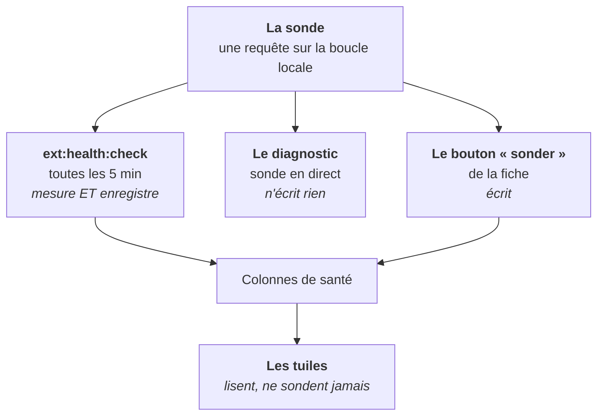

# La santé d'une extension

> **Ce que couvre cette fiche.** Comment on sait qu'une extension installée
> répond encore, et qui lit ce constat.

---

## En une phrase

**Une extension est vivante si elle répond — n'importe quoi.** Une erreur
applicative prouve qu'elle est là ; seul un silence réseau prouve qu'elle est
morte.

## Un seul mesureur, trois lecteurs

C'est la structure du sujet, et elle explique tout le reste.

| Lecteur | Sonde ? | Écrit ? | Pourquoi |
| --- | --- | --- | --- |
| La tâche planifiée | oui | oui | Le seul chemin automatique |
| Le diagnostic d'instance | oui | **non** | Aucun contrôle n'écrit, jamais |
| Le bouton de la fiche | oui | oui | C'est tout son intérêt |
| Les tuiles | **non** | non | Elles lisent les colonnes déjà remplies |

> **Les tuiles ne sondent jamais.** La barre de navigation est rendue sur toute
> page authentifiée : une requête par tuile et par page vue serait intenable.

**Un seul énoncé de « joignable » existe dans le projet**, partagé par la tâche
planifiée et par le diagnostic. Les deux ne peuvent donc pas rendre des verdicts
qui se contredisent.

## Ce que « joignable » veut dire

**N'importe quelle réponse HTTP prouve la joignabilité — y compris une erreur.**
Le service répond : il n'est pas mort. Seule une erreur réseau — connexion
refusée, délai dépassé, nom non résolu — vaut « injoignable ».

**Les redirections ne sont jamais suivies.** Une redirection est une réponse, pas
une invitation à sortir de la boucle locale.

## Pourquoi une requête HTTP, et pas l'état du service

Trois raisons, dans l'ordre d'importance :

1. **Un service actif dont le backend ne répond pas est exactement la panne
   qu'on veut voir.** Interroger l'état de l'unité système la manquerait.
2. **L'adresse sondée est celle que l'utilisateur consomme réellement** — la même
   que celle publiée par le serveur web.
3. **Aucune surface privilégiée nouvelle.** Le programme d'assistance
   d'administration n'a aucune sous-commande de lecture ; lui en ajouter une
   élargirait sa configuration `sudo` pour un besoin de simple observation.

Ce service est d'ailleurs surveillé par un test d'architecture : **aucune
primitive d'exécution système n'y est autorisée**.

## Ce qui est enregistré, et ce qui ne l'est pas

Les colonnes de santé sont écrites par **un seul service**, comme le statut l'est
par le sien. Elles sont hors des attributs affectables en masse.

**Rien n'entre au journal d'audit.** La santé est de la **télémétrie**, pas un
acte. Une tâche qui passe toutes les cinq minutes empilerait près de trois cents
lignes par jour et par extension en panne, et noierait le journal de conformité
sous de la métrologie.

Le dernier incident vit dans une colonne, écrite **à la transition seulement** —
au moment où l'état change, pas à chaque mesure.

## Constater n'est pas juger

| Commande | Ce qu'elle fait | Code de retour |
| --- | --- | --- |
| `ext:health:check` | **Constate** et enregistre | Toujours 0 |
| `sambaedu:doctor --tag=extensions` | **Juge** | 0, 1 ou 2 |

Un service arrêté volontairement n'est pas une erreur : la commande de sonde ne
peut pas le savoir, le diagnostic non plus — mais lui, au moins, rend un verdict
qu'un script peut lire.

**Le verdict porte sur un sujet, pas sur une extension.** Trois contrôles
distincts existent : les backends répondent-ils, les clients d'identité
sont-ils cohérents, le journal d'audit a-t-il des entrées non acquittées.

**Un registre illisible produit un avertissement, jamais une exception.** Une
table absente ou une base injoignable est une information, pas un plantage.

## Carte du code

| Rôle | Fichier |
| --- | --- |
| La sonde — **seul écrivain des colonnes de santé** | `app/Services/Extensions/ExtensionHealthService.php` |
| Tâche planifiée | `app/Console/Commands/ExtensionHealthCheck.php` |
| Contrôles de diagnostic | `app/Doctor/Checks/Extensions/` |
| Lecture par les tuiles | `app/Services/Extensions/ExtensionLauncherService.php` |

Garde d'architecture : `tests/Architecture/ExtensionIsolationTest.php`.

## Aller plus loin

- Le verdict d'ensemble : [`../domains/diagnostic.md`](../domains/diagnostic.md)
- Comment l'extension a été installée : [installation.md](installation.md)
