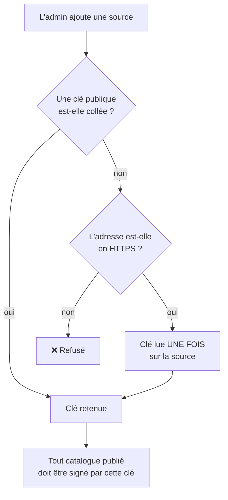
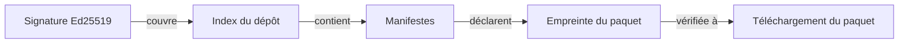

# Sources et confiance

> **Ce que couvre cette fiche.** D'où viennent les extensions, et sur quoi
> repose le fait qu'on les croie.
>
> Ce qu'elle ne couvre pas : ce que l'installation fait ensuite
> ([installation.md](installation.md)).

---

## En une phrase

**Une source est un dépôt d'extensions, et sa clé publique est retenue une fois
pour toutes.** Tout catalogue qu'elle publie doit être signé par cette clé — si
la clé change, la source passe en erreur.

C'est le modèle des clés d'hôtes SSH et du trousseau d'`apt`.

## Deux sortes de sources

| Sorte | D'où | Particularité |
| --- | --- | --- |
| **Embarquée** | Le dépôt SE5 lui-même | Ni désactivable, ni retirable — ses manifestes font partie du déploiement |
| **Distante** | Un dépôt tiers | Ajoutée, activée, désactivée, retirée par l'administrateur |

## Comment une source devient digne de confiance

Deux chemins, et deux seulement :

1. **la clé est collée par l'administrateur** — le chemin recommandé : l'éditeur
   la lui a communiquée par un autre canal ;
2. **la clé est lue une seule fois** sur la source, et **uniquement en HTTPS**.

> **Pourquoi une adresse en clair sans clé collée est refusée.** Sur un canal non
> chiffré, n'importe quel intermédiaire fournirait sa propre clé puis signerait
> son propre catalogue. La signature ne prouverait plus rien — elle donnerait
> juste l'illusion de le faire.

**Après ce premier contact, la clé n'est plus jamais retéléchargée.** Un dépôt
qui change de clé passe en erreur, et c'est le comportement voulu : c'est
exactement ce qui empêche la compromission ultérieure d'un dépôt de substituer sa
clé.

Une rotation légitime se fait par **retrait puis réajout explicites** — deux
actes journalisés, décidés par un humain.

## Ce que la signature couvre

La source signe **l'index** de son dépôt. Cet index contient les manifestes, et
chaque manifeste d'une extension installable porte **l'empreinte de son paquet**.

L'empreinte du paquet est donc **transitivement couverte** par la signature de
l'index. Vérifier que le paquet téléchargé correspond à l'empreinte déclarée
**est** la vérification contre la clé de la source. Il n'y a pas de second format
de signature à gérer.

## Pourquoi Ed25519

- **Aucune dépendance nouvelle** — la bibliothèque est dans le cœur de PHP. Elle
  est malgré tout déclarée explicitement : une dépendance implicite est une panne
  différée.
- **Un format sans ambiguïté** : une clé de 32 octets, une signature de 64. Pas
  de conteneur à analyser, pas de remplissage.
- **Aucun algorithme négociable.** La famille de failles « algorithme confondu »
  ou « aucun algorithme » **n'existe pas ici par construction** : il n'y a rien à
  replier.
- **Signer un dépôt tient en trois lignes** côté éditeur tiers.

Le service qui vérifie est **pur** : ni fichiers, ni base, ni réseau, ni
journal. Il reçoit trois chaînes et rend un booléen — ce qui le rend
exhaustivement testable, avec des paires de clés fabriquées à la volée plutôt
que des fichiers binaires figés dans le dépôt.

## Les gardes à l'administration

| Geste | Refus |
| --- | --- |
| Retirer la source embarquée | Toujours — elle fait partie du déploiement |
| Retirer une source dont une extension est en service | Toujours — la suppression en cascade emporterait des tuiles vivantes |
| Désactiver une source déjà désactivée | Sans effet, et **sans trace** |

> **On ne désintègre jamais silencieusement.** Retirer une source dont une
> extension sert encore reviendrait à retirer cette extension sans le dire.
> L'administrateur désinstalle d'abord.

**Aucun acte sans effet n'écrit dans le journal** — pas même la date de
modification. Le journal trace des transitions réelles, pas des clics.

## La synchronisation

`ext:sources:sync`, planifiée. Elle récupère les catalogues, vérifie les
signatures, et met à jour le registre.

Un échec est **enregistré sur la source** avec son motif, sans jamais y écrire
l'adresse — celle-ci peut porter un jeton d'accès dans ses paramètres.

## Carte du code

| Rôle | Fichier |
| --- | --- |
| Actes d'administration | `app/Services/Extensions/ExtensionSourceService.php` |
| Récupération distante | `app/Services/Extensions/RemoteCatalogSyncService.php` |
| Vérification de signature — **service pur** | `app/Services/Extensions/CatalogSignatureVerifier.php` |

Modèle : `ExtensionSource`.
Énumérations : `ExtensionSourceKind`, `ExtensionSourceSyncStatus`.
Commande : `ext:sources:sync`.

## Aller plus loin

- Ce que l'installation fait ensuite : [installation.md](installation.md)
- Les états d'une extension : [cycle-de-vie.md](cycle-de-vie.md)
