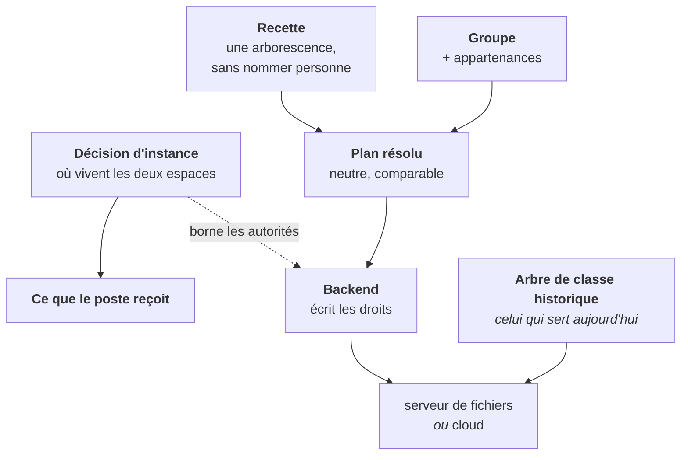

# Plan de fichiers — porte d'entrée

> **Où vivent les fichiers de l'établissement, qui a le droit d'en faire quoi, et
> ce que le poste en reçoit.**
>
> Cette fiche ne documente aucun sujet : elle dit **par où entrer**. Aucune
> procédure pas-à-pas ici — les gestes d'exploitation vivent dans
> [`../installation/SCRIPTS.md`](../installation/SCRIPTS.md) et
> [`../domains/exploitation.md`](../domains/exploitation.md), les scénarios de
> pré-production dans [`../qa/domains/filesystem.md`](../qa/domains/filesystem.md),
> et les gestes de l'administrateur dans le guide public `userDoc/admin/fichiers/`.

---

## 1. En une phrase

Un établissement décide **où vivent deux espaces** — l'espace personnel de chaque
compte et l'espace partagé des groupes — puis SE5 **compile cette décision** en un
état désiré que l'agent applique sur chaque poste : une lettre de lecteur ici, un
raccourci là, rien du tout ailleurs.

## 2. La carte du domaine

| Fiche | Ce qu'elle couvre | Axe |
| --- | --- | --- |
| [metier.md](metier.md) | **Les 12 décisions** et ce qu'elles coûtent | métier |
| [emplacements.md](emplacements.md) | La décision d'instance, ses trois gardes, la reprise | métier |
| [recettes-et-plan.md](recettes-et-plan.md) | Recette → plan : natures, verbes, clôture, stratégies | technique |
| [backends.md](backends.md) | Le contrat d'écriture, les implémentations, la comparaison | technique |
| [poste.md](poste.md) | Lecteurs, Bureau, raccourci, client de synchronisation | technique |
| [partages-classe.md](partages-classe.md) | L'arbre **réellement servi** et les gestes système | technique |
| [quotas-et-corbeille.md](quotas-et-corbeille.md) | Plafonds, dépassement, archive des comptes désactivés | processus |

## 3. Par où entrer

**Tu découvres le domaine.** [metier.md](metier.md), puis
[emplacements.md](emplacements.md). Les deux répondent à « pourquoi c'est comme
ça » avant « comment ça marche ».

**Tu vas toucher aux droits d'une arborescence.**
[recettes-et-plan.md](recettes-et-plan.md) d'abord — la ligne de coupe entre le
plan et le backend est ce qu'on casse le plus facilement — puis
[backends.md](backends.md).

**Tu débogues ce qu'un poste a reçu.** [poste.md](poste.md), puis
[`../agent/`](../agent/README.md).

**Tu interviens sur une classe existante.**
[partages-classe.md](partages-classe.md) : c'est l'arbre historique qui sert, pas
le neuf.

**Tu règles un plafond.** [quotas-et-corbeille.md](quotas-et-corbeille.md).

## 4. Ce qu'il faut savoir avant tout le reste

Trois faits qui évitent les contresens les plus coûteux.

> **1. Deux arborescences coexistent, et c'est l'historique qui sert.** L'arbre
> décrit par recette est construit, peuplé et comparé — mais les établissements
> utilisent l'autre. Les deux vivent sur des zones disjointes et **ne doivent pas
> être factorisés**. La bascule sera une décision explicite.

> **2. Une lettre de lecteur ne pointe jamais un cloud.** Ce n'est pas une coupe
> de périmètre, c'est une propriété mesurée des deux produits. Un espace au cloud
> se consulte au navigateur ou par le client natif.

> **3. Le plan ne parle jamais le vocabulaire d'un backend.** Ni mode système, ni
> nom de groupe Unix, ni chemin absolu. C'est ce qui rend la résolution testable
> sans disque, et une règle d'architecture le tient.

## 5. Invariants à ne jamais casser

1. **Une lettre de lecteur ne pointe jamais un cloud.** Un espace servi par un
   cloud n'a aucun chemin SMB, dans aucun cas.
2. **Un seul cloud actif à la fois**, et un emplacement ne peut désigner que le
   serveur de fichiers ou exactement ce cloud-là.
3. **Les trois clés de la décision s'écrivent ensemble**, parce que les gardes
   portent sur leur combinaison.
4. **La cohérence est rejouée à la lecture**, pas seulement à l'écriture.
5. **Aucun repli silencieux** : une ligne illisible refuse en nommant ; seule
   l'absence rend les défauts.
6. **Le partage personnel SMB reste en service pour l'agent**, quelle que soit la
   décision. Il porte deux publics, un seul déménage.
7. **Le Bureau ne dépend que de l'environnement du parc**, jamais d'un réglage de
   fichiers.
8. **L'autorité d'un répertoire géré se choisit à sa création et ne change pas.**
9. **La dérivation vers la forme héritée est mono-directionnelle.**
10. **Aucun identifiant de paquet client n'est codé en dur** : le catalogue est
    sous autorité amont.
11. **Le plan de fichiers ne parle jamais le vocabulaire d'un backend.**
12. **Aucun octet de donnée n'est déplacé par une décision d'emplacement.**
13. **Aucune suppression n'est exprimable** dans le vocabulaire de plan : une
    désactivation vide des octrois, elle ne détruit rien.
14. **Une audience est un sujet abstrait**, jamais une énumération de personnes.

## 6. Manques connus

**D'abord ce qui n'a jamais été observé :**

1. ⚠️ **La pose et le retrait du client de synchronisation n'ont jamais été
   joués sur un poste réel.** Aucune instance portant un paquet client au
   catalogue, aucun poste enrôlé n'a déroulé la chaîne complète. **L'absence de
   résidu après désinstallation n'est pas constatée, elle est déduite.**
2. **L'arbre neuf n'est servi à personne.** Il est peuplé et comparable ; le
   basculer est un travail distinct, avec aperçu, non livré.
3. **Le déplacement effectif des données n'existe pas.** C'est pourquoi changer
   l'emplacement d'un espace peuplé est refusé.

**Ensuite les écarts connus :**

4. **La garde de déplacement est aveugle à une reprise d'existant** : sur un
   serveur déjà en service, avant le premier import, les tables sont vides
   pendant que les répertoires sont pleins. La seule détection honnête supposerait
   de parcourir le stockage ; l'écran compense par un avertissement.
5. **Le refus de déplacement se contourne par la commande de reprise** : son
   option de forçage écrase une décision **sans passer par la garde**. L'écart est
   assumé, mais il fait de la garde une protection **d'écran**, pas d'instance.
6. **Une règle de quota illimitée perd contre une règle bornée** — le service et
   la migration de regroupement divergent sur la même règle métier.
7. **Le regroupement des anciens défauts de quota est irréversible**, et il a
   élargi les plafonds de toute une instance.

**Enfin la dette :**

8. **Le prérequis de reprise est documenté, pas câblé.** La doctrine du dépôt veut
   qu'une opération multi-instance soit une commande idempotente jouée par le
   chemin de mise à jour.
9. **Le fragment d'élévation des partages n'est pas posé par le dépôt** —
   contrairement à ceux des extensions et du déploiement cloud.
10. **Deux lecteurs de listes d'accès coexistent**, avec deux jeux d'options
    d'appel et donc deux analyseurs de sortie.
11. **L'archivage d'un partage de classe entier est exposé mais n'a aucun
    appelant.**
12. **La validation de la désinstallation d'un client est prédictive** : elle
    constate qu'un retrait est *décrit*, jamais qu'il est *complet*.
13. **L'audit du domaine partage la table des journaux de quota**, distinguée par
    un type de cible.

## 7. Carte du code

Chaque fiche porte la sienne. Les points d'entrée :

| Sujet | Où |
| --- | --- |
| La décision d'instance | `app/Services/Filesystem/FileLocationService.php` |
| La résolution d'un plan | `app/Services/Filesystem/Plan/PlanResolver.php` |
| L'assemblage du contexte | `app/Services/Filesystem/TreePlanService.php` |
| Le contrat d'écriture | `app/Services/Filesystem/Backend/FileBackend.php` |
| La comparaison désiré/observé | `app/Services/Filesystem/PlanStateComparator.php` |
| L'arbre historique | `app/Services/Filesystem/ShareService.php` |
| Les plafonds | `app/Services/Filesystem/XfsQuotaService.php` |
| Les deux clouds | `app/Services/Nextcloud/`, `app/Services/OpenCloud/` |

Audit d'arborescence et de listes d'accès :
[`../audit-arborescence-acls.md`](../audit-arborescence-acls.md).
