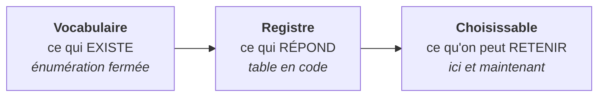

# Le contrat d'écriture des droits

> **Ce que couvre cette fiche.** L'interface que toute implémentation honore pour
> écrire les droits d'un plan, les trois implémentations réelles, et la
> comparaison entre ce qu'on voulait et ce qu'on observe.
>
> Ce qu'elle ne couvre pas : d'où vient le plan
> ([recettes-et-plan.md](recettes-et-plan.md)).

---

## 1. En une phrase

**Le serveur de fichiers historique est une implémentation parmi d'autres, pas un
cas particulier.** Une interface unique, six méthodes, et **aucune ne rend un
booléen**.

## 2. Pourquoi aucun booléen

Le premier backend est local et synchrone ; les suivants sont des interfaces
distantes, partiellement asynchrones, avec des réussites partielles.

> **Un contrat dessiné sur le cas local se casse au premier backend distant — et
> il se casse silencieusement**, parce qu'un « vrai » peut être rendu par une
> interface qui n'a rien fait.

| Méthode | Ce qu'elle rend |
| --- | --- |
| `name()` | le nom du backend |
| `provision()` | un rapport de réconciliation, un statut **par nœud** |
| `deprovision()` | idem |
| `inspect()` | un rapport d'observation couvrant les nœuds du plan, **racine comprise** |
| `quota()` | un rapport de réconciliation, avec deux façons de **décliner** |
| `location()` | une chaîne d'**affichage**, jamais une adresse à réutiliser |

### Ce qui a été mesuré, et qui a façonné cette forme

Quatre constats, tous relevés contre une instance réelle :

- **un octroi posé sur un ancêtre propage** au sous-arbre, et l'instruction de
  retrait sur un dossier privé peut être **acceptée sans effet**. Un verdict
  global n'aurait jamais vu cette fuite ;
- une lecture de sous-arbre rend les enfants **mais pas la racine** — d'où la
  racine comme nœud de première classe et le balayage explicite ;
- **trois sémantiques natives** différentes pour « c'était déjà fait ».
  L'adaptateur normalise : « déjà conforme » est un **état**, et le vocabulaire
  de résultat ne contient **aucun code de transport**. Un statut HTTP dans un
  rapport obligerait chaque appelant au-dessus de la ligne à connaître trois
  dialectes ;
- la **clôture** traverse la ligne intacte : le serveur de fichiers l'ignore, un
  backend à propagation la matérialise en règle de masque.

## 3. Les trois façons de ne rien faire

C'est la distinction la plus facile à écraser, et la plus coûteuse à perdre.

| État | Ce qui est vrai | Propriétaire | Durée |
| --- | --- | --- | --- |
| **non exprimable** | le **modèle** du backend n'a pas le concept | le backend | permanent |
| **non implémenté** | le mécanisme existe, SE5 ne le pilote pas | **notre code** | temporaire |
| **non exécuté** | ce backend n'exécute rien, par conception | la conception | sans objet |

> **« Non supporté » dans les trois cas serait une contre-vérité dans le code.**
> Le serveur de fichiers *sait* plafonner une arborescence : s'il ne le fait pas,
> c'est que nous ne l'avons pas branché. L'interface **masque** ce qui n'est pas
> exprimable et **grise** ce qui n'est pas implémenté — l'écran ne saurait plus
> quoi montrer si les deux se disaient pareil.

Exemple mesuré de « non exprimable » : le plafond d'une zone chez un backend
distant dont le quota est **par utilisateur** et non par dossier. Aucun
développement ne le rendra possible ; il faut choisir un autre backend pour ce
besoin.

## 4. Trois notions distinctes, souvent confondues

Le registre est une **table fermée, en code et non en configuration** : un nom
inconnu **lève**, il ne retombe jamais sur un défaut. Ce qui est **choisissable**
dépend en plus des capacités actives et de la complétude des connexions.

## 5. Les implémentations

| Backend | Ce qu'il écrit | Particularité |
| --- | --- | --- |
| **Serveur de fichiers** | listes d'accès POSIX | local, synchrone ; ignore la clôture |
| **Dossier d'équipe** | l'API du premier produit cloud | à propagation ; matérialise la clôture |
| **Espace de projet** | l'API du second produit cloud | rôles nommés, table de correspondance |
| **Aperçu** | **rien** | pur, sans aucune entrée-sortie |

Le backend d'**aperçu** décline tout en le disant. Il sert la prévisualisation
avant application, et il est **la seconde implémentation qui prouve que le
contrat n'est pas le serveur de fichiers déguisé**.

> Un rôle de refus **caché** existe côté cloud : c'est lui qui rend la clôture
> matérialisable. Sans lui, « ce rôle n'a rien reçu ici » ne serait pas
> exprimable sur un backend à propagation.

## 6. La comparaison : désiré contre observé

Le contrat dit ce qui **est** ; il ne dit pas si c'est ce qu'on **voulait**.

**La comparaison est écrite une fois, au-dessus de la ligne de contrat.** La
mettre dans le backend obligerait chacun à la réécrire, et deux backends
l'écriraient différemment.

| Désiré | Observé | Verdict |
| --- | --- | --- |
| actif, verbes **V** | exactement **V** | conforme |
| actif, verbes **V** | un sous-ensemble de **V** | **écart** — il manque des verbes |
| actif, verbes **V** | un surensemble de **V** | **écart** — verbes en trop |
| actif, verbes **V** | aucun verbe · absent | **écart** |
| **suspendu** | aucun verbe | **conforme** — la suspension est appliquée |
| **suspendu** | au moins un verbe | **écart** — la suspension a **fui** |
| **suspendu** | absent | **écart** — matérialisation manquante |
| aucun octroi au plan | quels que soient les verbes | **écart** — en trop |
| rôle en **clôture** | — | rien : ni attendu, ni écart *(voir §7)* |

**Les deux lignes du milieu sont celles qui comptent.** « Suspendu, observé
aucun = conforme » empêche une désactivation d'être relue comme une suppression à
réparer. « Suspendu, observé avec accès = écart » est **la seule façon de voir
qu'une suspension n'a pas pris**.

> **C'est une égalité d'ensembles, pas une comparaison de niveaux.** Avec deux
> niveaux ordonnés, « moindre » avait un sens. Avec quatre verbes combinables,
> deux octrois peuvent être **incomparables**, et la seule question honnête est
> « est-ce exactement ce qu'on voulait ? ». Un observé qui en fait **plus** est
> un écart, et même le plus grave : c'est un droit que personne n'a écrit.

Deux règles qui protègent la lecture :

- **un désir inexprimable reste un écart, et on ne le maquille pas.** Quand un
  backend déclare ne pas savoir rendre un verbe, le disque ne le porte pas — et
  la comparaison le dit. Absoudre l'écart « parce qu'on savait » afficherait
  conforme un état qui ne l'est pas, et l'administrateur perdrait le seul endroit
  où la limite se voit en continu ;
- **un nœud qu'on n'a pas lu n'est jamais déclaré conforme.** Une ignorance n'est
  pas une observation : elle remonte en erreur. L'inverse ferait passer un
  silence pour une bonne nouvelle.

## 7. La clôture devient comparable — mais seulement chez qui la matérialise

La comparaison de clôture est **gatée sur la donnée**, et c'est ce qui la rend
sûre :

| Observation | Comportement |
| --- | --- |
| le backend ne rapporte pas de clôture | **aucune comparaison** — serveur de fichiers et aperçu, inchangés |
| le backend en rapporte une | égalité d'ensembles avec la clôture attendue |

L'attendu est **dérivé**, comme la clôture elle-même : les sujets des rôles clos
du nœud, moins ceux qui y ont reçu un octroi. Un sujet octroyé par un rôle et
clos par un autre **reste octroyé** — union au plus permissif.

> **Ce que cette comparaison attrape, et qu'aucune autre n'attrapait :** une
> règle de masque retirée à la main sur le dossier privé des enseignants.
> L'octroi de la classe, lui, reste parfaitement conforme — c'est la **clôture**
> qui a sauté, et sans cette table la fuite serait invisible sur un écran tout
> vert.

## 8. Carte du code

| Sujet | Où |
| --- | --- |
| L'interface | `app/Services/Filesystem/Backend/FileBackend.php` |
| Le registre fermé | `app/Services/Filesystem/Backend/FileBackendRegistry.php` |
| Ce qui est choisissable, et le choix à la création | `app/Services/Filesystem/Backend/FileBackendSelection.php` |
| **Le vocabulaire de résultat, et les trois refus** | `app/Enums/FileBackendOutcome.php` |
| Serveur de fichiers | `app/Services/Filesystem/Backend/Posix/` |
| Dossier d'équipe | `app/Services/Filesystem/Backend/Nextcloud/` |
| Espace de projet | `app/Services/Filesystem/Backend/OpenCloud/` |
| Aperçu | `app/Services/Filesystem/Backend/PreviewBackend.php` |
| **La comparaison désiré/observé** | `app/Services/Filesystem/PlanStateComparator.php` |
| Colonne d'autorité d'un répertoire géré | `app/Models/NetworkShare.php` |

Gardes d'architecture : isolation du namespace du plan, absence de dépendance
d'exécution dans le comparateur.

## Aller plus loin

- D'où vient le plan : [recettes-et-plan.md](recettes-et-plan.md)
- Où vivent les espaces : [emplacements.md](emplacements.md)
- Les gestes système du backend POSIX :
  [partages-classe.md](partages-classe.md)
