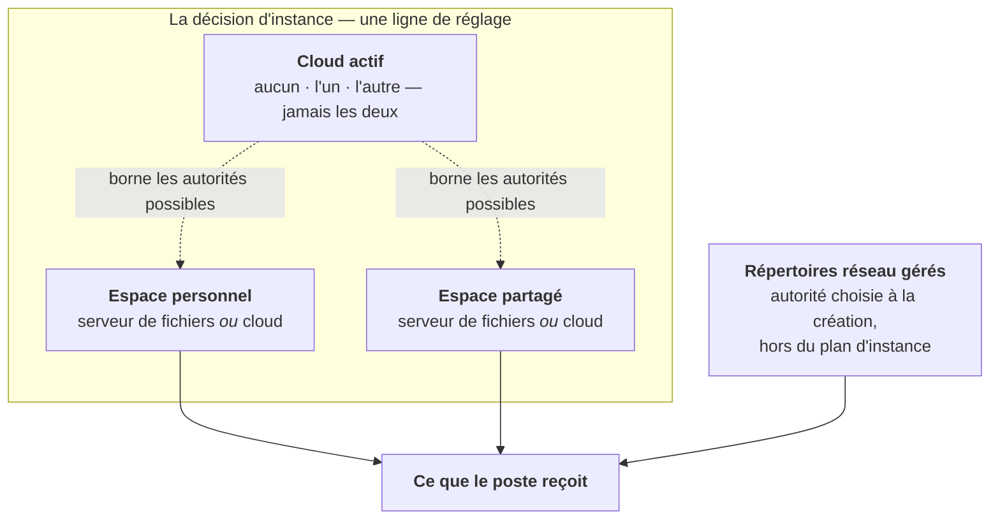

# Où vivent les fichiers — la décision d'instance

> **Ce que couvre cette fiche.** La décision « où vivent les deux espaces », les
> gardes qui la rendent cohérente, et la reprise d'une instance existante.
>
> Ce qu'elle ne couvre pas : ce que le poste en reçoit ([poste.md](poste.md)).

---

## 1. En une phrase

Un établissement décide **où vivent deux espaces** — l'espace personnel de chaque
compte, et l'espace partagé des groupes — et cette décision tient dans **une
ligne** de base de données.

## 2. Trois objets, deux décisions, un cloud

**Trois objets** portent des fichiers :

| Objet | Ce que c'est | Qui décide de son emplacement |
| --- | --- | --- |
| **Espace personnel** | le répertoire de chaque compte | une décision d'instance |
| **Espace partagé** | les arborescences produites pour les groupes | une décision d'instance |
| **Répertoires réseau gérés** | les partages qu'un administrateur crée | le choix fait **à la création** de chacun, jamais après |

**Deux décisions, une par espace.** Chacune vaut pour tout l'établissement : il
n'existe aucun réglage par salle, par parc ni par population.

**Un cloud, ou aucun.** Le produit cloud actif est **une valeur à trois
positions**, pas deux interrupteurs : l'état « les deux à la fois » n'est pas
seulement interdit, il est **irreprésentable**. Un emplacement ne peut désigner
que le serveur de fichiers ou **exactement** le cloud actif.

> ### ⚠️ L'invariant le plus facile à re-casser
>
> **Les lecteurs réseau sont TOUJOURS servis en SMB. Une lettre de lecteur ne
> pointe jamais un cloud.** Un espace servi par un cloud n'a aucun chemin SMB —
> ce n'est pas une coupe de périmètre, c'est une propriété mesurée des deux
> produits. Il se consulte au navigateur ou par le client de synchronisation.
> Aucune lettre n'est émise pour lui, dans aucun cas, y compris pour un
> répertoire géré dont l'autorité est un cloud.

### Deux vocabulaires, et c'est voulu

La **décision** (« où vit cet espace ») et le **mécanisme** (« quelle
implémentation écrit ses droits ») partagent le même vocabulaire fermé de noms de
backend. Ce n'est pas une confusion : deux vocabulaires parallèles diraient la
même chose et finiraient par diverger. Une seule nuance les sépare — le backend
d'**aperçu**, qui n'exécute rien, existe comme mécanisme et n'est jamais un
emplacement.

### Un répertoire géré n'est pas gouverné par le plan

Le plan décide de **deux espaces d'instance**, pas de chaque partage. Un
répertoire réseau géré porte sa propre autorité d'écriture, choisie au moment où
on le crée et **immuable ensuite** : il n'existe aucun chemin d'édition, et la
colonne est délibérément hors des attributs assignables en masse. Déplacer
l'espace partagé au cloud retire le lecteur `H:` **et rien d'autre** — les
répertoires gérés gardent leur lettre, parce qu'ils gardent leur autorité.

## 3. Une seule ligne de réglage, trois clés

| Clé | Ce qu'elle dit |
| --- | --- |
| `espace_perso.autorite` | qui sert l'espace personnel |
| `espace_partage.autorite` | qui sert l'espace partagé |
| `cloud.actif` | quel produit cloud est en service, ou aucun |

**Les trois s'écrivent d'un seul geste**, jamais séparément. Le motif est double :
les gardes portent sur leur **combinaison** — une autorité cloud n'a de sens que
rapportée au cloud actif —, et l'écriture d'un réglage est un remplacement de
ligne non transactionnel : trois écritures successives exposeraient un état
transitoire incohérent à un lecteur concurrent, c'est-à-dire à la compilation de
l'état d'un poste.

Aucune mémoïsation, aucun cache : chaque lecture relit la ligne.

## 4. Les trois gardes

**Garde 1 — l'incohérence est irreprésentable PAR LE TYPE, pas interdite par un
test.** L'objet qui porte les trois valeurs est immuable, son constructeur est
privé, et une fabrique unique est la seule porte d'entrée. Il n'existe ni setter,
ni constructeur acceptant un tableau brut. Un développeur qui en ajouterait un
rouvrirait exactement le trou que cette forme ferme. La fabrique rejoue trois
refus :

1. l'aperçu n'est jamais un emplacement — il n'écrit aucun droit ;
2. une autorité cloud qui ne désigne pas le cloud actif est refusée ;
3. par conséquent, une autorité cloud alors qu'aucun cloud n'est actif l'est
   aussi.

En revanche, « espace personnel sur le serveur de fichiers » **avec** un cloud
actif est parfaitement accepté : c'est le cas courant — le cloud est configuré
pendant que les fichiers restent sur le serveur.

**Garde 2 — elle est rejouée À LA LECTURE, donc opposable à une ligne forgée.**
Une ligne de réglage se modifie en SQL, en console interactive, ou par un import
de configuration. Une garde qui ne vivrait qu'à l'écriture protégerait
l'étourderie, pas la ligne forgée. La lecture repasse donc systématiquement par la
fabrique : une combinaison incohérente persistée **lève**, elle n'est jamais
servie.

**Garde 3 — aucune valeur nulle, et l'absence n'est pas l'illisibilité.**

- clé **absente** ⇒ les défauts (les deux espaces sur le serveur de fichiers,
  aucun cloud) ;
- clé **présente mais illisible** (incomplète, hors vocabulaire, structurellement
  incohérente) ⇒ **refus nommé**. Jamais un repli silencieux : replier une ligne
  corrompue sur les défauts inventerait une décision que personne n'a prise, et
  déplacerait en silence les lecteurs de tout un établissement.

Même figure dans le vocabulaire : « aucun cloud » est une **valeur**, pas
l'absence de valeur. Un type nullable rouvrirait l'état « non décidé » que la
garde 3 ferme.

## 5. Le refus de déplacement, et sa limite

**Changer l'emplacement d'un espace qui porte déjà des données est refusé.** Le
refus est **total** : ni la décision ni sa forme dérivée ne sont écrites, et la
décision précédente reste en vigueur — l'écran reprend les valeurs persistées
plutôt que d'afficher un état que la base ne porte pas.

Le motif est simple : rien, dans ce qui est livré, ne déplace un octet. Autoriser
le changement reviendrait à promettre un déménagement que personne n'exécute.

La garde ne porte **que sur les deux emplacements**. Changer le cloud actif, une
adresse, un identifiant, un secret, la vérification du certificat ou le chemin
d'accès n'est jamais refusé par elle. Le **ricochet**, lui, est couvert : changer
le cloud actif alors qu'un emplacement désigne le cloud oblige à changer aussi cet
emplacement, la soumission retombe donc sous la garde et est refusée avec le même
motif. Basculer d'un produit à l'autre n'est libre que lorsque les deux espaces
sont restés sur le serveur de fichiers.

> ### ⚠️ Le refus est total à l'écran, pas dans le dépôt
>
> La commande de reprise (§ 7) n'appelle **jamais** cette garde. Son option de
> forçage écrase donc une décision d'emplacement déjà enregistrée **sans que le
> refus s'exerce**, et c'est le seul geste du dépôt qui le fasse. Aucune donnée
> n'est déplacée pour autant — et c'est bien le problème : l'instance déclarerait
> alors un emplacement que personne n'a déménagé, avec des lecteurs qui
> disparaissent des postes pendant que les fichiers restent sur le serveur.
>
> L'option existe parce que la reprise doit pouvoir **transcrire l'état
> historique** d'une instance dont la ligne enregistrée est illisible ou
> divergente. Elle n'est pas un contournement documenté du refus : un exploitant
> bloqué par l'écran la trouvera pourtant en lisant l'aide de la commande, et il
> faut qu'il sache ce qu'elle ne fait pas.

> ### ⚠️ Ce que la garde ne voit pas
>
> Elle s'appuie sur **deux constats d'existence en base** — au moins un compte
> d'annuaire actif ou porteur d'une identité cloud, et au moins un groupe ou un
> répertoire géré. Aucun parcours du stockage, aucun appel réseau : l'écran doit
> rester utilisable instance injoignable, et le vocabulaire du serveur de fichiers
> n'a pas le droit de vivre dans ce fichier.
>
> Elle est donc **aveugle à une reprise d'existant** : sur un serveur de fichiers
> déjà en service où SE5 vient d'être posé, avant le premier import d'annuaire,
> les tables sont vides pendant que les répertoires sont pleins. La garde autorise
> alors la bascule sans un mot — et c'est précisément la population visée par une
> reprise.
>
> Aucune détection n'est ajoutée : la seule qui serait honnête supposerait de
> parcourir le stockage. L'écran porte donc, à côté du bouton d'enregistrement, la
> phrase qui dit que le choix **se fige dès qu'un compte existe**.

## 6. La même décision, écrite à deux endroits

Un mainteneur qui ouvre ce domaine tombera sur **une seconde écriture de la même
décision**, et il faut savoir ce qu'elle est avant de la prendre pour une
concurrente.

À côté de la ligne source vit une ligne de réglage plus ancienne,
`files.policy`, qui porte quatre **booléens de capacité** : accès au répertoire
personnel, accès aux partages, et une capacité par produit cloud. Ces quatre
valeurs sont **dérivées** de la décision et écrites **dans la même transaction**,
par un service dédié — jamais depuis un gabarit d'écran, qui finirait par en
oublier une.

La dérivation est **strictement mono-directionnelle** : aucun chemin de code ne
relit ces booléens pour en déduire un emplacement. La dérivation inverse est un
geste explicite et unique, la commande de reprise (§ 7), qui peut dire non.

Ces booléens ont des **lecteurs bien vivants** :

- la **posabilité d'une autorité d'écriture** à la création d'un répertoire géré ;
- la porte **fail-closed** des deux objets de configuration de connexion : une
  capacité éteinte éteint la connexion correspondante.

> ⚠️ **Ne pas croire que cette ligne est entièrement dérivée.** Elle porte aussi
> ce qui n'est dérivé de rien et n'a **aucun autre foyer** : l'adresse de chaque
> instance cloud, son compte d'administration, la vérification du certificat, le
> serveur de fichiers à monter, le **chemin d'accès au cloud** et les **deux
> désignations d'application cliente**. Cesser de l'écrire éteindrait toute la
> chaîne cloud.

## 7. La reprise précède le déploiement

`files:adopt-locations` dérive la décision des quatre booléens de capacité
historiques. Elle **doit être jouée avant** qu'une version portant ce modèle ne
serve, et voici pourquoi :

- **sans ligne de décision, la lecture rend les défauts** — les deux espaces sur le
  serveur de fichiers. Une instance qui servait ses fichiers en accès web
  **retrouve donc `K:` et `H:`** à la seconde où la version est déployée ;
- **l'écran ne permet aucune décision tant que la reprise n'a pas eu lieu** : il
  affiche l'état hérité en lecture seule et renvoie vers la commande. Les
  contrôles de décision sont **absents**, pas grisés.

La commande **n'invente jamais un emplacement**. Elle refuse, en nommant le cas,
quand les deux produits cloud sont configurés à la fois, ou quand un emplacement
devrait désigner un cloud alors qu'aucun n'est configuré. L'option qui désigne le
cloud actif fait du choix de l'administrateur une entrée — c'est la seule sortie,
et elle n'assouplit rien d'autre.

Elle est **idempotente** et n'écrase jamais une décision divergente sans qu'on le
lui demande. Son aperçu **rend un code d'échec** tant qu'il reste quelque chose à
écrire : c'est délibéré, et c'est ce qui permet de garder **la bascule** derrière
l'aperçu dans un script — *aperçu vert, donc l'instance est déjà reprise, donc on
peut déployer*.

> ⚠️ **Ce n'est pas une amorce pour la reprise elle-même.** Enchaîner l'aperçu
> puis le geste réel derrière un « et » logique produit exactement la panne que
> l'aperçu existe pour éviter : sur une instance **non reprise**, l'aperçu échoue,
> la reprise ne s'exécute jamais, rien ne le signale — et les lecteurs `K:`/`H:`
> reviennent sur tout le parc au déploiement suivant. La reprise se joue seule.

Elle ne lit, n'écrit ni ne déplace **aucun octet de donnée**, et n'émet aucun appel
réseau.

## 8. Carte du code

| Sujet | Où |
| --- | --- |
| La ligne de réglage et ses trois clés | `app/Services/Filesystem/FileLocationService.php` |
| L'objet de valeur, sa fabrique et ses trois refus | `app/Services/Filesystem/FileLocations.php` |
| Le refus de déplacement et ses deux constats | `app/Services/Filesystem/FileLocationChangeGuard.php` |
| La forme héritée, écrite dans la même transaction | `app/Services/Filesystem/FileLocationPolicyMirror.php` |
| La ligne héritée et ses quinze clés | `app/Services/FilePolicyService.php` |
| Noms de backend · cloud actif · chemin d'accès | `app/Enums/FileBackendName.php` · `ActiveCloud.php` · `CloudAccessPath.php` |
| L'écran | `resources/views/pages/admin/settings/files/_partials/emplacements-tab.blade.php` |
| Reprise | `app/Console/Commands/AdoptFileLocationsCommand.php` |

## Aller plus loin

- Ce que le poste en reçoit : [poste.md](poste.md)
- Qui écrit réellement les droits : [backends.md](backends.md)
