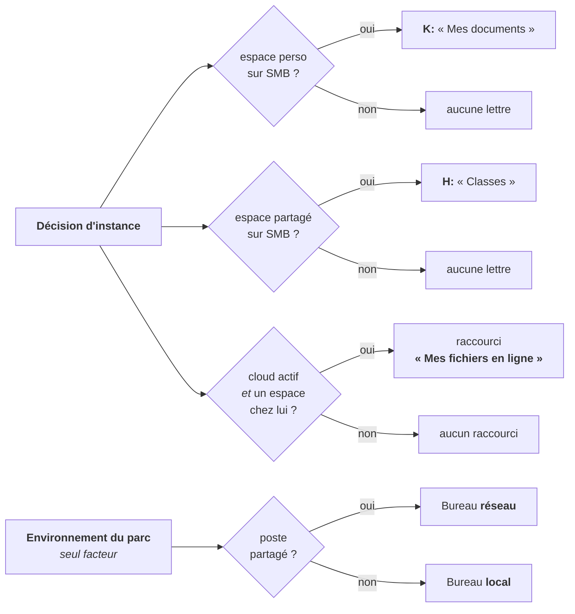

# Ce que le poste reçoit

> **Ce que couvre cette fiche.** Comment la décision d'instance se traduit en
> lettres de lecteur, en Bureau, en raccourci et en client de synchronisation sur
> chaque poste.
>
> Ce qu'elle ne couvre pas : la décision elle-même
> ([emplacements.md](emplacements.md)), ni le mécanisme de convergence de l'agent
> ([`../agent/`](../agent/README.md)).

---

## 1. En une phrase

**Rien ne se configure poste par poste : tout se déduit.** La décision
d'instance, l'environnement du parc et l'autorité de chaque répertoire suffisent.

| Ce que l'agent pose | À quelle condition |
| --- | --- |
| Lecteur `K:` « Mes documents » | **si et seulement si** l'espace personnel est servi en SMB |
| Lecteur `H:` « Classes » | **si et seulement si** l'espace partagé est servi en SMB |
| Lettres des répertoires gérés | selon l'autorité **de chaque répertoire**, jamais selon la décision d'instance |
| Bureau redirigé sur le réseau | sur un poste **partagé** — et sur lui seul |
| Bureau local du profil | sur un poste **personnel** ou un **portable** |
| Raccourci « Mes fichiers en ligne » | un cloud est actif, **et** au moins un des deux espaces y vit, **et** l'adresse du produit actif n'est pas vide |
| Application cliente du cloud | le chemin d'accès est réglé sur le client de synchronisation, **et** une désignation résout une entrée du catalogue |

## 2. Le Bureau ne suit plus l'emplacement de l'espace personnel

Le chemin du Bureau se résout **sur un seul facteur : l'environnement du parc**.
Un poste partagé reçoit un Bureau réseau ; un poste personnel ou un portable
reçoit son Bureau local, parce qu'il n'a aucune autorité sur un emplacement
partagé entre tous les postes de son utilisateur.

Le Bureau réseau vit dans le partage personnel SMB — et **ce partage-là est
toujours en service**, quelle que soit la décision.

> ### ⚠️ Le partage personnel porte DEUX choses, et une seule déménage
>
> - les **fichiers de l'utilisateur**, qui peuvent partir au cloud ;
> - l'**infrastructure de l'agent** — Bureau redirigé, raccourcis gérés, profils
>   applicatifs — qui **ne déménage jamais** et n'est pas un réglage.
>
> « L'espace personnel est au cloud » ne signifie donc **pas** que le partage SMB
> du répertoire personnel disparaît. Il cesse d'être **monté comme lecteur pour
> l'utilisateur** ; l'agent, lui, continue d'y lire et d'y écrire. Sans cette
> distinction, couper `K:` semblerait rendre le répertoire inaccessible — c'est
> faux, et c'est exactement l'effet de bord qui faisait autrefois basculer le
> Bureau d'un poste partagé en local.

## 3. Le raccourci de portail nomme la destination

Il s'appelle **« Mes fichiers en ligne »** : l'utilisateur cherche ses fichiers,
pas le nom d'un produit. Le même libellé sert quel que soit le produit en service,
sans que les bureaux de l'établissement changent de vocabulaire. Il n'est pas
assigné par une règle d'établissement — c'est une **conséquence technique** : un
espace servi par un cloud n'a aucun chemin SMB, donc aucune lettre, et son seul
chemin d'accès est le navigateur.

Trois cas rendent **rien** plutôt qu'un raccourci mort : aucun cloud actif, les
deux espaces sur le serveur de fichiers, ou une adresse vide.

## 4. Le client de synchronisation : SE5 n'installe rien

L'administrateur **désigne** une application **du catalogue** ; elle entre alors
dans l'ensemble cible des applications du poste, et c'est le moteur de
déploiement applicatif qui l'installe et qui la retire. SE5 ne connaît **aucun**
identifiant de paquet client, et ne peut pas en connaître : le catalogue est sous
autorité amont, un dépôt imposé désinstalle en cascade ce qui n'y figure pas, et
une entrée ajoutée localement disparaît à la synchronisation suivante. Un
identifiant codé en dur serait faux sur la moitié des instances et effacé sur
l'autre.

Sans désignation, la position « par le client de synchronisation » est **absente**
de l'écran, avec son motif — jamais grisée, jamais proposée puis refusée au clic.
Seules sont désignables les applications **installées** dont la recette décrit une
**désinstallation** : désigner un paquet qu'on ne sait pas retirer serait promettre
une convergence qu'on ne peut pas tenir. Cette validation est **prédictive** : elle
constate qu'une désinstallation est décrite, pas qu'elle est complète.

> ### ⚠️ La borne de version d'agent, et ce qui casse en dessous
>
> La convergence du **retrait** repose sur une condition qui n'existe qu'à partir
> d'une certaine version d'agent : la comparaison entre l'ensemble cible et le
> profil réellement déposé sur le poste. Sur un poste dont l'agent est **antérieur
> à cette borne**, le client s'installe correctement et **ne se retire jamais** —
> sans aucun signal : ni statut, ni erreur, ni ligne de rapport.
>
> L'écran **avertit** et n'interdit rien : interdire figerait la décision d'un
> établissement sur l'état de mise à jour de son parc. Les postes qui n'ont jamais
> rapporté de version sont comptés **à part**, jamais rangés d'un côté ou de
> l'autre. La valeur de la borne se lit dans `CloudSyncClient::MIN_AGENT_VERSION`.
>
> ⚠️ **Et au-dessus de la borne, la convergence n'est pas constatée non plus.**
> La chaîne complète — désignation, installation, retrait de la désignation,
> désinstallation, absence de résidu — **n'a jamais été jouée sur un poste réel**.
> Franchir la borne lève un empêchement connu ; ce n'est pas une preuve.

## 5. Les deux chemins d'accès au cloud

Un espace hébergé par un cloud s'atteint de **deux façons, et de deux seulement** :

- **par le navigateur** — le raccourci du bureau ouvre le portail de l'instance ;
- **par le client natif de l'éditeur** — l'application de synchronisation posée sur
  le poste.

Le vocabulaire est fermé : il n'existe littéralement aucune valeur qui signifierait
« les deux » ni « on verra ».

### Il n'y a pas de montage VFS, et c'est une décision

**Aucune lettre de lecteur ne pointe un cloud**, et il n'existe aucun montage de
système de fichiers virtuel. Cette décision mérite d'être écrite, parce que sans
elle quelqu'un rouvrira le sujet en toute bonne foi.

**Ce que le montage apportait**, et qui était réel :

- le « **pas de copie locale** » — décisif sur un **poste de salle partagé**, où un
  client de synchronisation télécharge le dossier de **chaque** élève qui s'y
  connecte ;
- une **lettre de lecteur familière**, dans le même explorateur que le reste ;
- un **outil unique** pour les deux produits cloud.

**Pourquoi il tombe quand même :**

- il exige l'installation d'un **pilote noyau** sur chaque poste ;
- le protocole sous-jacent est **lent** et gère **mal les verrous** des suites
  bureautiques ;
- il n'offre **ni gestion de conflit ni reprise hors ligne** ;
- ce **n'est pas le chemin supporté par l'éditeur** — un défaut s'y débogue seul.

**Ce qui l'a rendu superflu :** le client officiel sait désormais faire des
**fichiers à la demande**. C'est le principal avantage du montage, sans ses
inconvénients.

> ### ⚠️ L'argument ne disparaît pas — il se déplace
>
> Le problème du poste partagé était le vrai motif du montage, et il ne s'évapore
> pas. Il devient une **exigence de configuration** : **le client natif doit être
> réglé en fichiers à la demande.** Sans cela, on retombe exactement sur le
> problème d'origine — chaque session télécharge l'espace complet de son
> utilisateur sur le disque local du poste de classe.

## 6. Une ligne forgée lève, et l'exception se propage

Les fournisseurs d'état qui lisent la décision **n'attrapent rien**. Un repli sur
les défauts inventerait une décision que personne n'a prise et déplacerait en
silence les lecteurs de tout un établissement ; une émission vide les retirerait
tous, tout aussi silencieusement. L'**absence** de ligne, elle, n'est pas une
corruption : elle rend les défauts et ne lève jamais.

## 7. Carte du code

| Sujet | Où |
| --- | --- |
| Lecteurs `K:` / `H:` et répertoires gérés | `app/Services/Agent/Providers/DrivesStateProvider.php` |
| Chemin du Bureau et emplacements balayés | `app/Services/Agent/DesktopPathResolver.php` |
| Raccourci de portail | `app/Services/Agent/Providers/ShortcutsStateProvider.php` |
| Client de synchronisation | `app/Services/Agent/CloudSyncClient.php` |
| Union dans l'ensemble cible des applications | `app/Services/Agent/Providers/ApplicationsStateProvider.php` |

## Aller plus loin

- La décision qui gouverne tout ceci : [emplacements.md](emplacements.md)
- Comment l'état atteint le poste : [`../agent/`](../agent/README.md)
