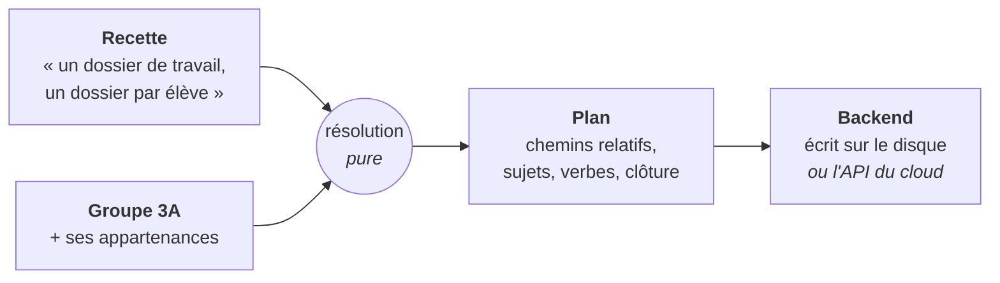
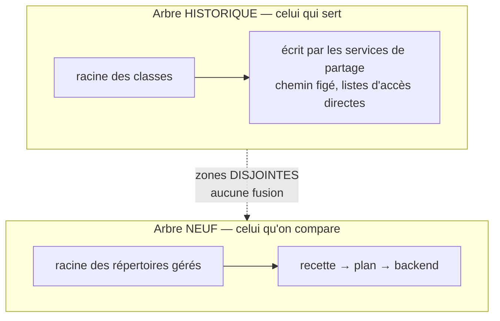

# La recette et le plan résolu

> **Ce que couvre cette fiche.** Comment une **arborescence** se décrit une fois
> pour toutes, et comment cette description devient un **plan** applicable à un
> groupe précis.
>
> Ce qu'elle ne couvre pas : ce qu'un backend en fait ensuite
> ([backends.md](backends.md)), ni l'arbre de classe historique qui n'emprunte
> pas ce chemin ([partages-classe.md](partages-classe.md)).

---

## 1. En une phrase

**Une recette décrit une arborescence sans nommer personne ; la résoudre sur un
groupe produit un plan qui nomme tout le monde.** Le plan ne sait rien du disque.

## 2. La ligne de coupe, et pourquoi elle est là

C'est la décision structurante du domaine : **le plan est neutre.**

Il ne contient **ni** mode d'accès système, **ni** ligne de liste d'accès, **ni**
nom de groupe Unix, **ni** chemin absolu. Il dit **quoi** — une zone logique, des
chemins relatifs, des sujets désignés par leur identité interne, des verbes, des
plafonds, une clôture. Il ne dit **jamais comment**.

> **Le bénéfice est immédiat et concret : la résolution se teste sans base de
> données, sans faux appels système, sans disque.** Tout lui arrive assemblé par
> l'appelant. C'est le dividende de la coupe — et il se dilapide au premier
> service d'exécution qu'on injecterait dans le résolveur.

Deux gardes la tiennent : une règle d'architecture scanne les imports du
namespace du plan, une autre scanne sa sérialisation. La première est un scan
textuel — elle attrape l'étourderie, pas une dépendance construite à l'exécution
pour la contourner. La limite est écrite là où elle vit, plutôt que promise plus
large.

**Le plan est aussi comparable.** Deux résolutions du même état produisent la
même sérialisation, octet pour octet : nœuds triés par chemin, octrois triés,
clôtures et rôles triés. Sans ce déterminisme, la détection d'écart par
comparaison serait mort-née.

## 3. Ce qu'une recette déclare

| Élément | Ce qu'il dit |
| --- | --- |
| Une **zone** | où l'arbre vit — un jeton neutre, jamais un chemin |
| Un **motif de racine** | `Classe_{group.bare_name}` — substitué à la résolution |
| Des **rôles** | « les profs », « les élèves » — avec leur stratégie de résolution |
| Des **nœuds** | les dossiers, leur nature, leurs octrois |
| Un **accrochage** | à un type de groupe, éventuellement |

Une recette ne nomme **aucune personne** et **aucun groupe**. C'est ce qui lui
permet de servir trois cents classes.

### Les quatre natures de nœud

Le vocabulaire est **fermé** : une valeur inconnue fait rejeter la recette
entière.

| Nature | Ce que c'est | Pourquoi elle existe |
| --- | --- | --- |
| **partagée** | chemin fixe, octrois dérivés des rôles | le cas ordinaire |
| **activable** | chemin fixe dont certains octrois se **suspendent** | le dossier d'échange qu'on ferme sans le vider |
| **par membre** | un dossier **par membre** portant tel rôle d'arête | le dossier personnel de l'élève |
| **contenu libre** | le plan gouverne les **droits**, pas les enfants | un enseignant qui crée un sous-dossier ne fabrique pas un écart |

> **« Activable » n'est pas « optionnel », et la nuance vaut des données.**
> Désactiver un nœud activable **vide ses octrois suspendables** ; le nœud reste,
> les fichiers restent. Modéliser ce dossier comme optionnel le détruirait à la
> désactivation. **Rien, dans ce vocabulaire, ne permet d'exprimer la suppression
> d'un nœud** — c'est délibéré.

### Les quatre verbes

Un octroi est une **liste de verbes non vide**, prise dans un vocabulaire de
quatre. Il n'existe **aucun moyen d'exprimer une interdiction** : pas de champ de
refus, pas de valeur « aucun », pas de priorité. L'absence d'octroi est la seule
restriction.

| Verbe | Ce qu'il autorise, exactement |
| --- | --- |
| `lire` | lister le dossier, le traverser, ouvrir le contenu d'un fichier |
| `editer` | modifier le **contenu** d'un fichier existant, et rien d'autre |
| `creer` | faire apparaître une entrée nouvelle dans le dossier |
| `supprimer` | faire disparaître une entrée existante du dossier |

**Les deux gestes que tout le monde croit être des cas particuliers :**

- **renommer** dans le même dossier = **créer + supprimer**. Ce n'est pas
  « éditer » : le contenu n'est pas touché, c'est l'entrée du dossier qui
  disparaît d'un côté et apparaît de l'autre ;
- **déplacer** = **supprimer à la source + créer à destination**. Deux dossiers,
  donc deux octrois consultés — et l'un des deux peut manquer.

> **Pourquoi cette découpe et pas une autre.** Elle est la seule fidèle au
> mécanisme, des deux côtés. Le serveur de fichiers historique exige l'écriture
> **sur le fichier** pour en changer le contenu, et l'écriture **sur le dossier**
> pour tout renommage, création ou suppression : deux objets, deux bits. Les
> confondre donne à un déposant le droit d'effacer le travail des autres. Et le
> plan de fichiers distant porte nativement la même distinction — le vocabulaire
> s'y consomme sans traduction.

L'ancien vocabulaire binaire a été traduit **une fois pour toutes** : lecture
seule → `lire`, lecture-écriture → **les quatre verbes**. C'est le seul mappage
qui ne retire d'accès à personne. Les recettes livrées sont donc maximalement
permissives ; les raffiner est le travail de l'écran d'édition.

> ⚠️ **Une recette non migrée est refusée nommément.** La clé d'accès abandonnée
> est détectée et rejetée avec son motif. Sans ce refus, une recette ancienne
> aurait été lue avec les verbes par défaut, et **un rôle en écriture serait
> devenu un rôle en lecture sans un mot**.

### Les quatre stratégies de résolution d'un rôle

Un rôle de recette dit **qui** reçoit. La réponse vient d'une stratégie :

| Stratégie | La cible | Sait répondre seule ? |
| --- | --- | --- |
| Le groupe lui-même | le groupe pour lequel on résout | oui |
| Un groupe **désigné** | choisi à la main à la matérialisation | **non** |
| Un groupe **apparenté** | dérivé par motif de nom | oui |
| **Par rôle d'arête** | les membres portant tel rôle | oui |

**Seules les stratégies qui répondent seules permettent l'accrochage à un type
de groupe** : créer un groupe doit matérialiser son arbre sans demander à
personne.

La dernière n'est pas une commodité parmi quatre — c'est **le mécanisme qui
remplace les groupes multiples de SE4**. Depuis le repliement, l'équipe
pédagogique n'a plus de ligne à elle : « les membres de la classe portant
gestionnaire ou propriétaire » est sa **seule** représentation en base. Voir
[`../domains/groupes-roles.md`](../domains/groupes-roles.md).

> Corollaire : la stratégie « groupe apparenté » **ne peut pas** retrouver
> `Equipe_3A`, puisque la ligne n'existe plus. Elle sert les apparentés qui
> existent réellement.

## 4. La clôture — ce que le plan dit du silence

Chaque nœud porte, **en plus** de ses octrois, la liste des rôles de la recette
qui n'ont **aucun octroi ici**.

Cette liste est **entièrement dérivée** : rôles de la recette moins rôles
octroyés. Elle n'est ni saisie, ni exposée à l'auteur de la recette, ni
modifiable autrement qu'en écrivant ou en retirant un octroi.

**Pourquoi elle existe, alors qu'elle ne sert à rien sur le serveur de
fichiers.** En POSIX, l'implicite suffit : pas d'entrée, pas d'accès — c'est
exactement ainsi que le dossier privé des enseignants se dit aujourd'hui.

> **Mais l'implicite est faux ailleurs, et ça a été mesuré.** Sur une instance
> cloud réelle : un partage posé sur un **ancêtre propage** à tout le sous-arbre,
> l'instruction de retrait est **acceptée sans effet**, et la relecture rend
> ensuite un accès en lecture là où on demandait zéro. Un plan qui ne dirait que
> ce qui est **accordé** fabriquerait donc, sur un tel backend, une **fuite de
> confidentialité silencieuse sur le dossier privé des enseignants** — que même
> la vérification ne rattraperait pas.

La clôture rend ce silence explicite sans rien ajouter à ce que l'auteur écrit.
**Ce n'est pas une interdiction** : elle ne dit pas « interdire à X », elle
constate « X n'a rien reçu ici ». Le serveur de fichiers l'ignore, un backend à
propagation la matérialise.

> Le jeton du membre énuméré n'étant pas un rôle de recette, un octroi nominatif
> **ne décharge aucun rôle** : sur le dossier personnel d'un élève, la classe
> reste dans la clôture. C'est exactement l'intention.

## 5. Trois états, jamais confondus

| État | Ce que ça veut dire |
| --- | --- |
| Octroi **actif** | le rôle a ces verbes |
| Octroi **suspendu** | l'octroi existe, temporairement vide ; dossier et données restent |
| Rôle en **clôture** | le rôle n'a **jamais** reçu d'octroi ici |

Un octroi suspendu n'est **pas** une omission : il est sérialisé, il se compare,
et un backend doit pouvoir le rendre comme un octroi explicitement vide. Le
distinguer de l'absence est ce qui empêche une **désactivation de se transformer
en suppression**.

La suspension reste un **drapeau dédié** : une liste de verbes vide n'est pas un
octroi suspendu, c'est un octroi **invalide** — le constructeur le refuse.

## 6. L'audience est un sujet abstrait — c'est une mesure, pas un goût

C'est la contrainte la plus dure du domaine, et elle vient du terrain.

Poser récursivement des entrées d'accès **nominatives** sur une arborescence de
631 entrées coûte :

| Entrées | Temps |
| --- | --- |
| 30 | 0,026 s |
| 200 | 0,32 s |
| 1 000 | **7,16 s** |
| 3 000 | **63,07 s** |

Le coût est **quadratique** — chaque entrée réécrit l'attribut étendu entier sur
chaque fichier — et il existe une **limite dure à 5 457 entrées**, au-delà de
laquelle l'appel système échoue tout simplement. Le même octroi rendu par un
**groupe dérivé** coûte 0,349 s, et un changement de rôle n'y coûte aucune
réécriture.

**Conséquence tenue par le code** : la stratégie par rôle d'arête produit **un
sujet abstrait par rôle listé** — « les membres de ce groupe qui portent ce
rôle » — et **jamais** l'énumération de ces membres. Trois membres et trois cents
membres produisent exactement les mêmes sujets.

L'énumération nominative reste légitime là où elle coûte **une entrée par
nœud** : les dossiers par membre, et une cible désignée nommément (une personne
n'est pas une audience).

> **Où la garde se tient.** Pas dans le résolveur pur : un rôle **peut**
> légitimement désigner une personne, donc le type du sujet ne suffit pas à
> distinguer une désignation légitime d'une audience énumérée à tort. C'est le
> **choix du sujet** qui se garde, dans la couche qui assemble le contexte.

## 7. La substitution, et ce qu'elle refuse

Le vocabulaire de substitution est **fermé** : tout marqueur hors des valeurs
fournies fait échouer la résolution.

| Marqueur | Fourni quand |
| --- | --- |
| nom du groupe | toujours |
| **nom nu** | le nom donne un segment de chemin sûr, préfixe de type retiré |
| matière / classe | groupe de type « matière × classe » uniquement |
| login du membre | dans un nœud par membre uniquement |

Le nom nu retire le préfixe de type — sans lui, un motif qui re-préfixe
produirait le double préfixe bien connu.

**Un segment non sûr après substitution fait échouer la résolution**, jamais un
plan partiel en silence : un plan amputé se comparerait « conforme » à un état
incomplet.

> Un nom de groupe qui ne donne **ni** segment sûr **ni** décomposition échoue
> immédiatement **en nommant le groupe**, plutôt que de se manifester plus tard
> comme un marqueur mystérieusement absent.

## 8. La maille du groupe est la maille du cloisonnement

On résout **un** groupe. L'isolation vient de l'**appartenance**, pas de
l'arborescence : deux classes ne se cloisonnent pas parce que leurs dossiers sont
voisins, mais parce que leurs groupes diffèrent.

Corollaire pour les matières : la maille pertinente est **« matière × classe »**
— le groupe qui porte réellement l'audience — et jamais « matière » nue.

## 9. Où en est la chaîne, réellement

C'est le point à connaître avant toute décision sur ce domaine.

**Les deux arborescences coexistent volontairement**, sur des zones disjointes,
avec des autorités différentes et des cycles de vie différents. **Elles ne
doivent surtout pas être factorisées.**

L'arbre neuf **est peuplé** — trois déclencheurs passent par un point d'entrée
unique : la création d'un groupe, un changement d'appartenance, et une commande
de peuplement pour les instances qui avaient déjà leurs classes. Mais **c'est
l'arbre historique qui est servi aux établissements.**

> **La bascule sera une décision explicite** — avec aperçu avant exécution — et
> jamais l'effet de bord d'une commande de peuplement. Les deux commandes ne
> doivent ni s'appeler ni se remplacer.

Deux points de vigilance sur le peuplement :

- **l'accrochage n'est pas la matérialisation.** Deux recettes s'accrochent au
  type classe : l'arbre, et une recette plate. Si créer un groupe matérialisait
  **toute** recette accrochée, chaque classe naîtrait avec un partage plat que
  personne n'a demandé. Seules les recettes **d'arbre** se matérialisent
  automatiquement ;
- **supprimer un groupe ne déprovisionne rien.** La ligne du partage survit, son
  lien de groupe passe à vide, et l'administrateur décide depuis l'écran. Un
  arbre qui disparaîtrait du disque parce qu'une ligne a été supprimée serait
  exactement le geste que tout le modèle refuse.

Sur l'instance de référence, **129 des 150 classes n'ont aucun groupe d'annuaire
résolvable** : elles déclinent sans rien écrire, en nommant le groupe attendu.
C'est le même comportement que le pré-contrôle de l'arbre historique.

## 10. Le partage plat, projeté en plan

Un répertoire réseau géré n'a pas d'arborescence : **il est sa racine**, avec des
assignations. Le projeter donne un plan à **un seul nœud** — et c'est
précisément pour cela que la racine devait devenir un nœud de première classe.

Ce projecteur ne charge même pas les cibles : le type et l'identifiant du pivot
suffisent à fabriquer un sujet. **Divergence assumée** avec la dérivation de
permissions historique, qui **saute** une assignation dont le compte est
introuvable, tandis que le plan la **porte**. Les deux comportements sont
défendables — l'un protège une exécution, l'autre décrit une intention.

Sa racine est de nature **contenu libre**, et pas autre chose : le plan gouverne
les droits de la racine, jamais l'existence de son contenu. Toute autre nature
ferait des fichiers déposés par les utilisateurs un écart à réconcilier.

## 11. Carte du code

| Sujet | Où |
| --- | --- |
| **La résolution pure** | `app/Services/Filesystem/Plan/PlanResolver.php` |
| Le plan et sa sérialisation canonique | `app/Services/Filesystem/Plan/FilePlan.php` |
| Le nœud et sa clôture | `app/Services/Filesystem/Plan/PlanNode.php` |
| L'octroi et **le contrat des quatre verbes** | `app/Services/Filesystem/Plan/PlanGrant.php` |
| Le sujet — identité interne, jamais un nom système | `app/Services/Filesystem/Plan/PlanSubject.php` |
| Substitution, chemins sûrs, noms nus | `app/Services/Filesystem/Plan/GroupNameNormalizer.php` |
| **L'assemblage du contexte, et la garde de la mesure** | `app/Services/Filesystem/TreePlanService.php` |
| Point d'entrée unique de l'arbre neuf | `app/Services/Filesystem/ClassTreeShareService.php` |
| Projection d'un partage plat | `app/Services/Filesystem/SharePlanProjector.php` |
| La recette : stockage et validation | `app/Models/DirectoryTemplate.php` |
| Natures de nœud · zones · stratégies | `app/Enums/PlanNodeNature.php` · `PlanAnchor.php` · `RoleResolutionStrategy.php` |
| L'éditeur d'arborescence | `resources/views/pages/admin/settings/groups/_partials/trees/` |
| Peuplement de l'arbre neuf | `app/Console/Commands/MaterializeClassTreesCommand.php` |

## Aller plus loin

- Ce qu'un backend fait du plan : [backends.md](backends.md)
- L'arbre historique, qui n'emprunte pas ce chemin :
  [partages-classe.md](partages-classe.md)
- Le vocabulaire des rôles et des types :
  [`../domains/groupes-roles.md`](../domains/groupes-roles.md)
