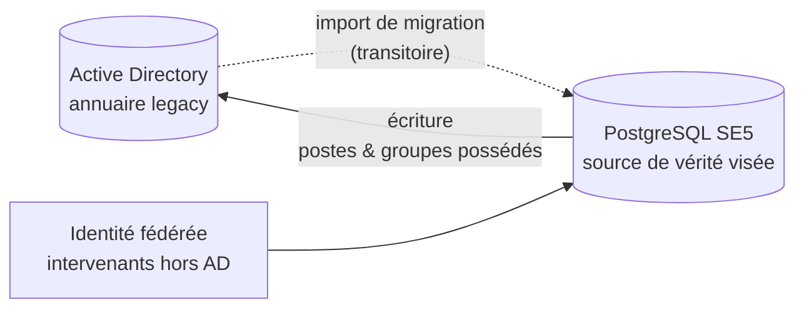

# Domaine — Identité & Active Directory

> **Porte d'entrée du domaine.** Ce fichier indexe la documentation de l'identité
> SE5 (utilisateurs, groupes, établissements, synchronisation AD) : il oriente
> vers la fiche qui décrit chaque sujet, selon qui tu es. Chaque fiche reste la
> source de vérité de son sujet ; ce README cartographie, il ne duplique pas.
>
> Si tu reprends ce domaine sans contexte, **commence ici.**

---

## 1. En une phrase

SE5 tient les identités en base **PostgreSQL** — la base de travail, qui a
vocation à devenir la **source de vérité**. Un **import de migration** amorce ce
miroir depuis l'AD (legacy), résout chaque objet par un **identifiant stable**
(`ad_guid`), rattache chacun à son **établissement**, et matérialise le principe
**un utilisateur = un login** (`login` = `sAMAccountName` = `%USERNAME%`). Les
objets que SE5 *possède* (postes, groupes qu'il crée) sont, eux, **écrits vers
l'AD**.

## 2. Le *pourquoi* (métier — l'essentiel)

> Résumé. Le détail (une décision = un ADR) est dans [`metier.md`](metier.md).

- **La base SQL devient la source ; l'import AD est transitoire.** L'import AD →
  SQL **amorce** le miroir au moment de migrer un établissement. C'est un outil
  de **bascule** : une fois l'établissement migré, il n'a plus vocation à tourner
  (SQL est alors la source de vérité).
- **Un utilisateur = un login.** `login` = `sAMAccountName` = `%USERNAME%` :
  identité unique, sans inversion ni dérivation.
- **Résolution par identifiant stable.** Un utilisateur/groupe est apparié par
  son `ad_guid` (immuable), pas par son `cn`/`name` (qu'un renommage change).
- **AD local d'établissement prioritaire.** SE5 vise le DC de l'établissement,
  sans repli automatique sur un AD central — un pas vers l'allègement de la
  dépendance AD.
- **Rattachement par code d'établissement.** Le code (UAI) projette les requêtes
  dans l'OU de l'établissement (AD fédéré multi-établissements).
- **SE5 écrit vers l'AD les objets qu'il possède** (postes, groupes créés), via
  `samba-tool` encapsulé et idempotent — jamais les comptes utilisateurs.
- **Identité fédérée** pour les intervenants hors AD (login fédéré), avec un
  cycle de vie RGPD (désactivation → anonymisation), isolée du canal AD.

## 3. Parcours de lecture par audience

### 🧑‍💻 Mainteneur / dev
1. Ce README → [`metier.md`](metier.md) (les décisions structurantes).
2. **Le modèle** : `modele-identite.md` *(à produire)* — `users`, `user_groups`,
   le pivot, `external_identities`, login unique, `ad_guid`.
3. **L'import AD → SQL** : [`sync-ad.md`](sync-ad.md) — la commande, le job, la
   résolution par GUID, le delta, les droits.
4. **Le rattachement établissement** : `rattachement-etablissement.md`
   *(à produire)* — code UAI, préfixe d'OU, AD fédéré.
5. **L'écriture SQL → AD** : `ecriture-ad.md` *(à produire)* — observers, jobs,
   `samba-tool`.

### 🛠️ Exploitant (lancer une sync / configurer l'AD)
- Lancer / planifier un import : [`sync-ad.md`](sync-ad.md) (commande
  `users:sync-from-ad`, modes full/delta, scopes).
- Configurer l'accès AD : `configuration-ldap.md` *(à produire)* — IP du DC
  d'établissement, `strictLocalAd`, secrets `.env`.

### 🧠 Toi / mémoire projet
- Les principes sont condensés en §2 ; [`metier.md`](metier.md) les développe en
  ADR durables.

## 4. Carte des fiches (source de vérité par sujet)

| Fiche | Axe | Sujet | État |
|---|---|---|---|
| [`metier.md`](metier.md) | métier | Les décisions structurantes du domaine (ADRs) | ✅ |
| [`sync-ad.md`](sync-ad.md) | technique + proc | **Import AD → SQL** des utilisateurs et groupes (outil de **migration**, transitoire) | ✅ |
| `modele-identite.md` | technique | Modèle SQL : `users`, `user_groups`, pivot, `external_identities`, login unique, `ad_guid` | ⏳ |
| `rattachement-etablissement.md` | technique | Code UAI → préfixe d'OU ; AD fédéré multi-établissements | ⏳ |
| `ecriture-ad.md` | technique | Écriture SQL → AD (postes, groupes) via `samba-tool` | ⏳ |
| `configuration-ldap.md` | technique + proc | Accès AD : DC d'établissement, `strictLocalAd`, secrets | ⏳ |
| `identite-federee.md` | technique | Intervenants hors AD : login fédéré, cycle de vie RGPD | ⏳ |

> **Domaine voisin** : la *gestion des droits et délégations* (rôles Spatie,
> délégations scopées par salle) relève du domaine **droits/délégation** — voir
> `../domains/rights-management.md`. L'import AD ne fait qu'*amorcer* les
> permissions ; il ne les pilote pas.

## 5. Invariants à ne jamais casser

- **L'import AD ne crée jamais de compte utilisateur en AD** : le sens
  utilisateur est AD → SQL uniquement.
- Un utilisateur/groupe se résout par **`ad_guid`** (stable), jamais par son
  `cn`/`name` mutable.
- `login` est **unique** et résolu de façon **insensible à la casse**
  (`sAMAccountName` l'est ; `=` PostgreSQL ne l'est pas).
- Les requêtes AD passent par **`LdapDnHelper`** (construction des DN avec le
  préfixe d'établissement) — jamais de DN concaténé à la main ailleurs.
- Une identité **fédérée** (`source = federated`) ne transite **jamais** par le
  canal AD.

## 6. Manques connus de cette doc (backlog documentaire)

> Couverture honnête : ce qui n'est PAS encore documenté ici.

- [ ] **`modele-identite.md`**, **`rattachement-etablissement.md`**,
      **`ecriture-ad.md`**, **`configuration-ldap.md`**, **`identite-federee.md`**
      (cf. §4 — fiches `⏳`).
- [ ] Flux CRUD utilisateur côté web (controllers / `UserService` / form
      requests) — à cartographier précisément avant rédaction.

> **Manques de code repérés à la cartographie** (à verser au backlog technique,
> pas documentaire) :
> - colonne `users.ad_groups` (JSONB) **obsolète** — le `memberOf` est relu en
>   direct, plus stocké ;
> - modèle `AuthUser` (wrapper LDAP) en grande partie **mort** — le flux moderne
>   injecte un `User` Eloquent ;
> - propagation SQL → AD de l'appartenance **groupe ↔ membres** incomplète
>   (risque de drift) ; statut de l'observer sur la **suppression** de poste à
>   confirmer.

## 7. Carte du code (ancrage `fichier:ligne`)

### Modèles & tables

| Rôle | Chemin |
|---|---|
| Utilisateur SQL (login unique, `ad_guid`, `school_code`, `source`) | `app/Models/User.php` |
| Groupes d'utilisateurs (`name` unique, `type`, `ad_guid`) | `app/Models/UserGroup.php` |
| Pivot appartenance (observé → ACL filesystem) | `app/Models/Pivot/UserGroupUserPivot.php`, `app/Observers/UserGroupUserPivotObserver.php` |
| Identité fédérée (hors AD, cycle de vie RGPD) | `app/Models/ExternalIdentity.php` |
| Tables : création + `ad_guid` + `school_code` + `source` | `database/migrations/2026_02_06_115500_create_rights_management_tables.php`, `…add_ad_guid_to_users_table.php`, `…add_school_code_to_users_table.php`, `…add_source_and_external_identity_to_users_table.php` |

### Synchronisation & accès AD

| Rôle | Chemin |
|---|---|
| Import AD → SQL (cœur) | `app/Services/UserSyncService.php` |
| Commande d'import | `app/Console/Commands/SyncUsersFromAdCommand.php` (`users:sync-from-ad`) |
| Job d'orchestration (async) | `app/Jobs/SyncUsersFromAdJob.php` |
| Écriture SQL → AD (postes/groupes) | `app/Services/AdSync/AdSyncService.php`, `app/Jobs/AdSync/WorkstationAdSyncJob.php` |
| Encapsulation `samba-tool` (anti-injection) | `app/Ldap/AdUserManager.php` |
| Rattachement établissement (règles DN) | `app/Services/Ldap/EstablishmentMatcher.php` |
| Config AD (DC étab prioritaire, `strictLocalAd`) | `app/Config/LdapConfig.php` |
| Construction des DN (préfixe d'établissement) | `app/Config/LdapDnHelper.php` |
| Bootstrap LdapRecord | `app/Providers/LdapRecordServiceProvider.php` |
| Modèles LDAP (lecture AD) | `app/LdapModels/LdapUser.php`, `app/LdapModels/SambaEduGroup.php` |
| Provider d'authentification LDAP | `app/Providers/LdapUserProvider.php` |

### Tests

| Rôle | Chemin |
|---|---|
| Import (commande, permissions, compat) | `tests/Feature/Console/SyncUsersFromAdCommandTest.php`, `tests/Unit/Services/UserSyncService*Test.php` |
| CRUD utilisateur | `tests/Feature/UserCreationTest.php`, `tests/Feature/UserUpdateTest.php` |
| Encapsulation samba-tool / sync poste | `tests/Unit/Ldap/AdUserManagerTest.php`, `tests/Unit/Jobs/AdSync/WorkstationAdSyncJobTest.php` |
| Observer pivot (ACL filesystem) | `tests/Feature/Observers/UserGroupUserPivotObserverTest.php` |

---

*Convention : chaque fiche déclare en tête son sujet et son orthogonalité aux
voisines. On documente le livré et stable, jamais le spéculatif. Gabarit produit
via le skill `doc-domaine` ; implémentation de référence : `../agent/`.*
