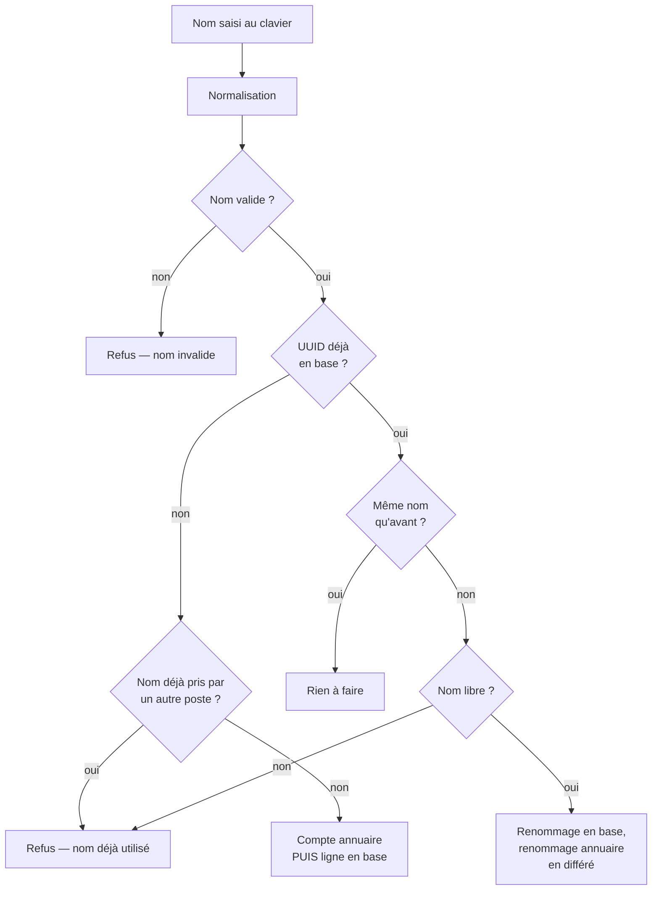

# Enrôlement — nommer et rattacher un poste

> **Ce que couvre cette fiche.** Les cinq gestes accessibles depuis le menu
> d'administration d'un poste en train de démarrer : lui donner un nom, le
> rattacher à une salle, l'ajouter ou le retirer d'un parc, et le cas des
> appareils personnels.
>
> Ce qu'elle ne couvre pas : la reconnaissance du poste au démarrage
> ([premier contact](premier-contact.md)), et l'administration des groupes de
> postes depuis l'interface web ([`domains/parc.md`](../domains/parc.md)).

---

## En une phrase

Un poste neuf n'a pas de nom. L'opérateur le nomme **depuis le poste
lui-même**, au démarrage, sans passer par l'interface web — c'est le seul moment
où la machine et son opérateur sont physiquement au même endroit.

## Les cinq gestes

| Point d'entrée | Geste | Écrit dans |
| --- | --- | --- |
| `/ipxe/enrollment/name` | Nommer ou renommer le poste | PostgreSQL **et** annuaire |
| `/ipxe/enrollment/room` | Affecter à une salle physique | PostgreSQL |
| `/ipxe/enrollment/parc-add` | Ajouter à un parc logique | PostgreSQL |
| `/ipxe/enrollment/parc-remove` | Retirer d'un parc logique | PostgreSQL |
| `/ipxe/enrollment/byod` | Déclarer un appareil personnel | Journal seulement |

Tous exigent l'authentification décrite dans [premier
contact](premier-contact.md) et sont désactivables d'un bloc
(`config/ipxe.php`, clé `enrollment.enabled`).

## Nommer un poste

C'est le seul geste qui touche l'annuaire, et le seul qui peut créer quelque
chose. Quatre situations, résolues par `WorkstationEnrollmentService::enrollName()` :

### La normalisation du nom

Le nom arrive **au clavier, en clair, depuis un firmware**. Trois passes le
transforment avant toute écriture :

1. **Mise en minuscules** et suppression des espaces de bord.
2. **Suffixe d'établissement** : si un suffixe est configuré, le nom est tronqué
   à 9 caractères puis suffixé ; sinon il est tronqué à 15. Un nom déjà suffixé
   est laissé tel quel. Les noms des serveurs de l'infrastructure — `se4fs*` et
   `se4ad-<UAI>` — sont exclus du suffixage : ce sont des noms canoniques.
3. **Validation stricte** : `[a-z0-9_\-.$]`, 32 caractères au plus. Tout le reste
   est refusé.

> **Cette troisième passe n'est pas cosmétique.** Le nom finit dans une commande
> `samba-tool` et dans un script iPXE. Un point-virgule, une esperluette ou un
> retour à la ligne y ouvriraient une exécution de commande. Le filtre est
> volontairement plus strict que celui de l'annuaire, qui accepte majuscules et
> 64 caractères.

### L'ordre : l'annuaire d'abord

À la création, **le compte machine est créé dans l'annuaire avant toute écriture
en base**. Si l'annuaire refuse, rien n'est écrit et l'opérateur voit une erreur.

C'est l'inverse du réflexe habituel, et c'est délibéré : l'ordre opposé produit
des **postes fantômes** — une ligne en base sans compte machine correspondant,
donc un poste qui ne rejoindra jamais le domaine et qu'aucun écran ne signale.
La création annuaire étant idempotente, une nouvelle tentative réutilise un
compte déjà présent.

Après création, l'identifiant global et le nom distingué du compte sont recopiés
en base au mieux ; un échec de cette relecture n'annule pas l'enrôlement.

### Le renommage : différé, et c'est voulu

Un renommage écrit le nouveau nom en base immédiatement, puis **laisse un
observateur déclencher le renommage annuaire en tâche de fond**. L'opération
annuaire est un `modrdn`, qui préserve l'identifiant global du compte et son
`netbootGUID` — le poste reste le même objet, il change juste de nom.

Conséquence à connaître : **le retour affiché au poste ne reflète pas le succès
réel côté annuaire**. La trace journalisée porte `ad_result = dispatched`, pas
`success`. Le résultat réel se lit dans les journaux de la file d'attente.

### Les appareils personnels

Le geste « appareil personnel » **ne crée rien** : ni ligne en base, ni compte
machine. Il écrit une trace dans `machine_boot_logs` avec un nom préfixé
`byod:`. Un appareil personnel n'appartient pas au parc ; le tracer permet de
savoir qu'il a démarré sur le réseau, pas de le gérer.

## Rattacher à une salle, à un parc

Ces trois gestes n'écrivent **que dans PostgreSQL**. L'appartenance d'une machine
à un parc logique n'est plus projetée dans l'annuaire : le pivot
`workstation_group_workstation` est la seule source de vérité.

Les listes proposées à l'écran sont filtrées — un groupe archivé ou inactif n'est
pas proposé — et le service revérifie le même filtre avant d'écrire : un
identifiant deviné n'ouvre pas un groupe invisible à l'écran.

Deux garde-fous supplémentaires :

- **une salle est un groupe physique**, un parc un groupe logique ; chaque geste
  n'accepte que le bon type ;
- **le retrait d'un parc vérifie l'appartenance** avant d'agir, plutôt que de
  réussir silencieusement sur un lien inexistant.

Le nombre d'entrées affichées est plafonné (50 salles, 50 parcs par défaut) :
au-delà, un menu iPXE devient inutilisable au clavier, et la gestion passe par
l'interface web.

## Ce qui peut échouer, et ce que voit l'opérateur

| Situation | Écran | Trace |
| --- | --- | --- |
| Caractère interdit dans le nom | `ERREUR nom invalide` | `ipxe.enrollment.name.rejected_invalid` |
| Nom déjà porté par un autre poste | Nom déjà utilisé | `ipxe.enrollment.name.name_taken` |
| Annuaire injoignable à la création | Erreur, rien créé | `ipxe.enrollment.name.ad_error` |
| Salle ou parc inconnu, archivé, inactif | Échec | `ipxe.enrollment.<room\|parc>.failure` |
| Retrait d'un parc dont le poste n'est pas membre | Échec | `…parc.failure`, motif `not_member` |

Deux motifs distincts existent pour le refus de nom — caractère interdit et nom
déjà pris. Ce n'est pas un détail de journalisation : le premier signale une
tentative d'injection, le second une simple collision entre opérateurs. Les
confondre rendrait le premier invisible.

**Toute méthode publique de ce service rattrape ses exceptions** et renvoie un
échec typé. Un firmware iPXE doit toujours recevoir un menu ; une erreur de base
de données ne doit pas laisser un poste sans écran.

## Carte du code

| Rôle | Fichier |
| --- | --- |
| Les cinq flux et leur rendu | `app/Ipxe/Services/IpxeEnrollmentOrchestrator.php` |
| Écritures base et annuaire | `app/Ipxe/Services/WorkstationEnrollmentService.php` |
| Normalisation et validation du nom | `app/Ipxe/Services/IpxeHostnameSanitizer.php` |
| Construction des menus de choix | `app/Ipxe/Services/IpxeEnrollmentMenuBuilder.php` |
| Résultat typé d'un nommage | `app/Ipxe/Support/EnrollNameResult.php` |
| Écritures annuaire | `app/Ldap/AdMachineManager.php` |
| Gabarits | `resources/views/ipxe/enrollment/*.blade.php` |

Tests : `tests/Feature/Ipxe/IpxeEnrollment*EndpointTest.php`,
`tests/Unit/Ipxe/Services/IpxeHostnameSanitizerTest.php`.

## Aller plus loin

- Comment le poste arrive jusqu'ici : [premier contact](premier-contact.md)
- Ce qu'on installe ensuite : [Windows](installation-windows.md) ·
  [Linux](installation-linux.md)
- Pourquoi l'annuaire passe avant la base : [décisions](metier.md)
