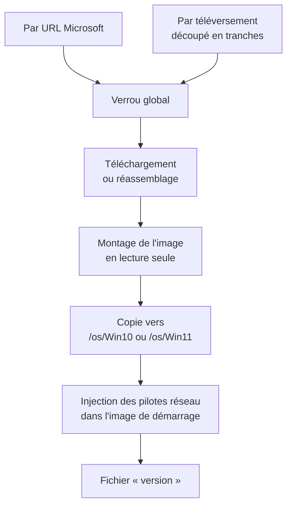

# Images Windows — de l'ISO aux fichiers servis aux postes

> **Ce que couvre cette fiche.** Comment une image Windows entre dans le
> serveur, où elle est extraite, et pourquoi des pilotes réseau y sont injectés
> à chaque déploiement.
>
> Ce qu'elle ne couvre pas : ce que le poste fait de ces fichiers
> ([installation Windows](installation-windows.md)).

---

## En une phrase

Un administrateur dépose une image Windows — par URL ou par téléversement — et
le serveur l'extrait dans l'arborescence servie aux postes, en **réinjectant à
chaque fois les pilotes réseau** que Microsoft ne fournit plus.

## Les deux chemins d'entrée

La page `/admin/ipxe/iso-windows` accepte deux gestes, avec le même
aboutissement.

### Par URL

L'URL saisie est confrontée à une **liste blanche d'hôtes** : trois domaines
Microsoft connus pour servir les images en direct, plus leurs sous-domaines.

> **Cette liste ne doit jamais être élargie à `microsoft.com` nu.** Une
> sous-page compromise du domaine suffirait alors à faire télécharger une image
> falsifiée par le serveur — qui l'installerait ensuite sur tout un parc.

### Par téléversement

Le navigateur découpe le fichier en tranches de 5 Mo, envoyées en corps brut.
Deux raisons :

- une image Windows pèse plusieurs gigaoctets ; passer par un envoi de
  formulaire classique imposerait de relever les limites PHP à des valeurs
  déraisonnables ;
- **une coupure ne fait pas tout recommencer.**

Les tranches sont réassemblées dans un fichier partiel, puis renommées de façon
atomique — ce qui impose que le dossier temporaire soit **sur le même système de
fichiers** que la destination. Les téléversements abandonnés sont purgés au bout
de 24 heures.

### Le verrou

Une seule extraction peut vivre à la fois, protégée par un verrou global. Deux
détails opérationnels :

- il est **acquis à la soumission** et libéré dans le bloc final de la tâche de
  fond, quoi qu'il arrive ;
- il **ne peut pas vivre dans le cache par défaut**. Celui-ci est APCu, qui ne
  sait pas poser de verrou et n'est de toute façon pas partagé entre le serveur
  web et le processus de file d'attente. Un magasin partagé est donc forcé
  (`ipxe.iso_management.lock_store`, `file` par défaut).

## L'extraction

`WindowsIsoExtractor::extract()` monte l'image en lecture seule, copie son
contenu vers `/var/sambaedu/unattended/install/os/Win10` ou `…/Win11`, puis écrit
un fichier `version` qui garde le nom de l'image source.

Le montage exige les droits root — le processus de file d'attente tourne sous
`www-admin` et dispose d'une entrée `sudo` dédiée. Aucun outil d'extraction en
espace utilisateur n'est nécessaire : le noyau lit nativement le format UDF et
les fichiers de plus de 4 Go des images Windows.

Sur SE4, cette extraction était un script shell posé par un paquet, qui codait
son chemin source en dur. Le porter dans le code met le chemin sous configuration
et l'opération sous test.

## L'injection des pilotes réseau

**Le problème.** Depuis Windows 11 24H2, Microsoft a retiré de l'image de
démarrage des pilotes Intel LAN devenus anciens. Sur un poste dont la carte
réseau n'est pas reconnue d'origine, WinPE ne monte pas le réseau : le test de
connectivité du script d'amorçage échoue et **l'installation ne démarre jamais**.

**Pourquoi le seul levier est `boot.wim`.** Le fichier de réponses sait charger
des pilotes depuis un partage réseau — mais il faut le réseau pour l'atteindre.
Le pilote de carte réseau doit donc être dans l'image de démarrage elle-même.

**Pourquoi c'est rejoué à chaque extraction.** Chaque extraction **écrase**
`boot.wim` par la version d'origine de Microsoft. Une injection manuelle est
détruite au premier redéploiement — c'est exactement ce qui est arrivé en
laboratoire. L'injection est donc enchaînée à la copie, à l'intérieur de
l'extracteur.

Elle est **idempotente par construction** : le fichier fraîchement copié est
toujours vierge de toute injection antérieure, donc aucune logique de
comparaison n'est nécessaire.

> **Le piège de l'index.** Un `boot.wim` contient deux images : l'index 1 est
> « Windows Setup », l'index 2 est le WinPE **amorçable**. Injecter sur l'index 1
> ne charge rien au démarrage. La cible par défaut est donc l'index 2
> (`ipxe.iso_management.winpe_boot_wim_image_index`).

Pack absent, vide ou sans fichier `.inf` : l'injection est sautée avec une trace
d'information, et l'image d'origine reste intacte. Un parc dont les cartes sont
toutes reconnues d'origine ne subit aucune régression.

### D'où viennent les pilotes

Deux canaux, une seule implémentation (`WinpeDriverIngestor`) : une commande
artisan et un dépôt depuis l'interface web. Les archives sont dispatchées par
extension — `innoextract` pour les exécutables InnoSetup de Lenovo, `unzip` pour
les archives Intel — puis les fichiers `.inf`, `.sys`, `.cat` sont copiés **à
plat** dans un dossier par famille, côte à côte, ce qu'attend `drvload`.

Aucun pack partiel n'est laissé : le dossier n'est écrit que si au moins un
fichier `.inf` a été trouvé.

### Où vit le pack, et pourquoi là

Le pack est sous `storage/install/winpe-drivers`. **Il ne doit jamais vivre sous
l'arborescence servie aux postes** — l'extraction commence par supprimer sa cible,
et le pack disparaîtrait avec elle. Les postes ne le téléchargent d'ailleurs
jamais : ils reçoivent une image de démarrage dont les pilotes sont déjà à
l'intérieur.

## Ce que les postes voient

Les fichiers extraits ne sont **pas** servis par un alias Apache. Ils passent par
`GET /ipxe/os/{chemin}`, une route qui vérifie que le chemin demandé tombe dans
une racine explicitement autorisée
(`ipxe.actions.os_assets.roots`) — ce qui bloque la remontée d'arborescence.

Sur SE4, ajouter un emplacement voulait dire éditer une configuration Apache non
versionnée. Ici, c'est une entrée dans `config/ipxe.php`.

Les octets eux-mêmes sont servis par Apache via `X-Sendfile` quand le module est
présent, ce qui est le cas par défaut sur SE5. Le mode de repli — un flux depuis
PHP — se bloquait autour de 99 % sur une image mémoire de 355 Mo ; il reste
utilisable pour des essais, pas pour un démarrage de parc.

## Prérequis système

| Outil | Rôle | Sans lui |
| --- | --- | --- |
| `wimtools` (`wimlib-imagex`) | Injecter les pilotes | Postes à carte réseau non reconnue : installation impossible |
| `innoextract` | Ingérer les exécutables Lenovo | Ce canal d'ingestion échoue |
| `unzip` | Ingérer les archives Intel | Idem |
| `sudo` pour `www-admin` | Monter les images | Aucune extraction |
| `mod_xsendfile` | Servir les gros fichiers | Démarrages de masse impraticables |

## Ce qui manque

- **Rien ne garantit qu'une instance neuve dispose d'un pack de pilotes.** Il
  est alimenté à la main ou par commande ; son absence est silencieuse jusqu'au
  premier poste concerné.
- **Deux réglages seulement sont exposés** — Windows 10 et Windows 11. Ajouter
  une version demande d'étendre la liste blanche **et** de déposer les fichiers
  correspondants.

## Carte du code

| Rôle | Fichier |
| --- | --- |
| Soumission et verrou | `app/Ipxe/Iso/Services/WindowsIsoDownloadOrchestrator.php` |
| Validation d'URL | `app/Ipxe/Iso/Services/WindowsIsoUrlValidator.php` |
| Téléchargement et enchaînement | `app/Ipxe/Iso/Jobs/DownloadWindowsIsoJob.php` |
| Montage et copie | `app/Ipxe/Iso/Services/WindowsIsoExtractor.php` |
| Injection des pilotes | `app/Ipxe/Iso/Services/WinpeDriverInjector.php` |
| Ingestion des archives de pilotes | `app/Ipxe/Iso/Services/WinpeDriverIngestor.php` |
| Lecture de l'état déployé | `app/Ipxe/Iso/Services/WindowsIsoSourcesReader.php` |
| Téléversement par tranches | `app/Http/Controllers/Ipxe/WindowsIsoUploadController.php` |
| Service des fichiers aux postes | `app/Ipxe/Http/Controllers/IpxeOsAssetController.php` |
| Page d'administration | `resources/views/pages/admin/ipxe/iso-windows/index.blade.php` |
| Installation de `mod_xsendfile` | `scripts/setupXsendfile.sh` |

Tests : `tests/Unit/Ipxe/Iso/`, `tests/Feature/Ipxe/WindowsIso*Test.php`,
`tests/Feature/Ipxe/Iso/`.

## Aller plus loin

- Ce que le poste fait de ces fichiers :
  [installation Windows](installation-windows.md)
- Pourquoi ces fichiers ne sont plus livrés par un paquet :
  [décisions](metier.md)
