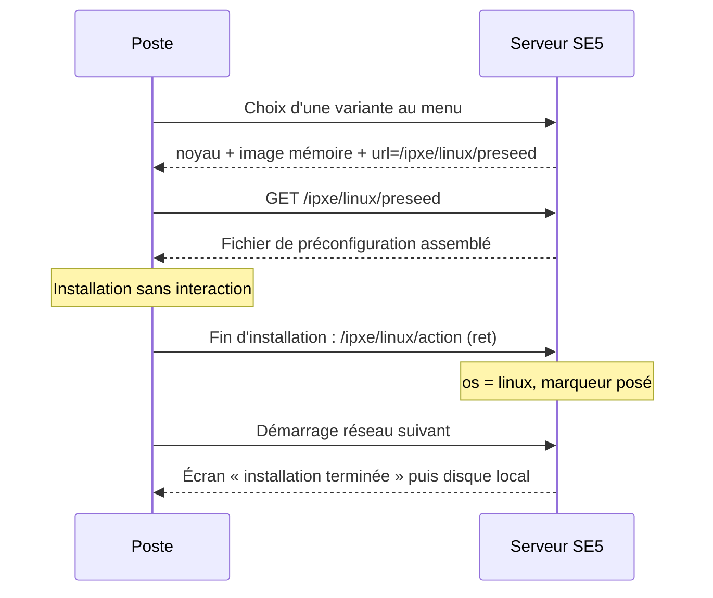

# Installation Linux

> **Ce que couvre cette fiche.** Comment le serveur fabrique le fichier de
> préconfiguration que l'installeur Debian ou Ubuntu consomme, et ce qui se passe
> quand l'installation se termine.
>
> Ce qu'elle ne couvre pas : le menu qui y mène
> ([premier contact](premier-contact.md)) et la configuration du poste une fois
> installé — qui relève de l'agent, pas du netboot.

---

## En une phrase

Le poste démarre l'installeur Debian avec une seule instruction : « va chercher
ta configuration à cette adresse ». Le serveur **assemble ce fichier à la
volée**, à partir de fragments versionnés et de ce qu'il sait du poste.

## Le déroulé

Neuf variantes sont proposées au menu — Debian sans bureau, Debian avec l'un des
six environnements de bureau, une dérivée Debian locale, et Ubuntu hors domaine.
Chacune est un cas d'une énumération PHP, qui porte la distribution et la
variante de bureau (`IpxeAdminAction::linuxMeta()`).

Le script de démarrage est minimal : un noyau, une image mémoire, et une ligne
d'arguments qui donne le nom du poste et l'adresse de sa préconfiguration.

## L'assemblage du fichier de préconfiguration

`LinuxPreseedService::generate()` **concatène des fragments**, dans un ordre qui
n'est pas décoratif.

| Distribution | Fragments, dans l'ordre |
| --- | --- |
| Debian | cache/proxy → `debian_<variante>` → `debian` → `sambaedu` → [commande de fin] → `simple_boot` |
| Ubuntu | cache/proxy → `ubuntu` → [commande de fin] → `simple_boot` |
| Dérivée locale | cache/proxy → `debian` → `debian_perso` → [commande de fin] → `simple_boot` |

**Pourquoi cet ordre :**

- le fragment de cache ou de mandataire vient **en premier** — il doit être connu
  avant que l'installeur ne résolve les miroirs ;
- le fragment de variante précède le fragment général, pour que la sélection de
  tâches reste celle de la variante ;
- `simple_boot` vient **en dernier** — il redéfinit le partitionnement
  automatique et doit avoir le dernier mot.

Le fragment de cache est choisi selon la configuration : cache local de paquets,
mandataire, ou aucun des deux.

Les fragments vivent dans `resources/ipxe/linux/`, sous gestion de version. Sur
SE4 ils étaient posés à l'installation du serveur, hors dépôt ; les rapatrier
permet de savoir ce qui a changé, et quand.

### L'interpolation

Le fichier assemblé est truffé de marqueurs `###_CLÉ_###`, remplacés en une passe
par un catalogue de valeurs : configuration du serveur, plus deux valeurs propres
au poste — son nom et son UUID.

**Ces deux valeurs sont filtrées avant interpolation**, comme tout ce qui sort
vers un poste. Le fichier n'est jamais écrit sur disque, et la trace ne porte
qu'une empreinte de son contenu : un fichier de préconfiguration contient des
mots de passe.

## Le retour de fin d'installation

À la toute fin, l'installeur exécute un appel vers `/ipxe/linux/action` avec un
code de retour. Ce hook s'exécute depuis l'installeur, **qui ne connaît pas la
MAC du poste** : il n'envoie que l'UUID.

> **C'est un contrat, pas un hasard.** `WorkstationLocator::locate()` doit rester
> capable de résoudre un poste sur le seul UUID. Un test le garantit
> (`IpxeLinuxActionEndpointTest::it_resolves_workstation_by_uuid_only_when_mac_is_empty`).

Ce que le serveur écrit alors :

- `os = 'linux'` et l'horodatage du dernier rapport ;
- un **marqueur à usage unique** dans `programmed_action` — réussite ou échec,
  avec le code de retour ;
- une ligne dans `machine_boot_logs`.

Il **n'écrit pas** `workstations.status` : cette colonne a un domaine fermé de 20
caractères, et y écrire une phrase d'issue produisait une erreur SQL, donc une
réponse 500, donc un poste jamais marqué. Effet de bord bienvenu : un poste
`protected` le reste après réinstallation.

Le marqueur est consommé au démarrage réseau suivant : le poste voit un écran
« installation terminée » avec un compte à rebours, puis démarre sur son disque.
Le marqueur est effacé au passage, sans quoi l'écran reviendrait indéfiniment.

> **Ce hook n'est pas signé.** Qui connaît un couple MAC/UUID valide sur le
> réseau peut le déclencher. L'impact se limite à `os` et au marqueur — pas de
> quoi prendre la main sur un poste, mais assez pour fausser un tableau de bord.
> Une trace est écrite à chaque appel.

## Ce qui manque

**La reprise de main après installation est un talon.** Sur SE4,
`/ipxe/linux/autorun` servait une boucle de scripts post-installation lus dans
l'annuaire. En SE5 la voie est l'affectation de scripts, mais le raccordement
n'est pas fait : le point d'entrée répond un script qui affiche un message et
sort. La boucle côté poste se termine donc sans rien faire
(`app/Ipxe/Http/Controllers/IpxeLinuxAutorunController.php:13-32`).

**Pas de déduplication des traces** : chaque appel du hook ajoute une ligne.

## Carte du code

| Rôle | Fichier |
| --- | --- |
| Menu d'installation | `app/Ipxe/Http/Controllers/IpxeInstallationLinuxController.php` |
| Assemblage de la préconfiguration | `app/Ipxe/Services/LinuxPreseedService.php` |
| Catalogue et interpolation des marqueurs | `app/Ipxe/Support/PreseedPlaceholders.php` |
| Retour de fin d'installation | `app/Ipxe/Http/Controllers/IpxeLinuxActionController.php` |
| Écriture de l'issue | `app/Ipxe/Services/LinuxPostInstallTracker.php` |
| Construction du menu | `app/Ipxe/Services/LinuxInstallMenuBuilder.php` |
| Listes blanches | `app/Ipxe/Enums/LinuxDistribution.php`, `LinuxDesktopVariant.php` |
| Fragments | `resources/ipxe/linux/*.cfg` |

Tests : `tests/Feature/Ipxe/IpxeLinuxPreseedEndpointTest.php`,
`IpxeLinuxActionEndpointTest.php`, `IpxeInstallationLinuxEndpointTest.php`.

## Aller plus loin

- Le menu qui y mène : [premier contact](premier-contact.md)
- L'équivalent Windows, sensiblement plus long :
  [installation Windows](installation-windows.md)
