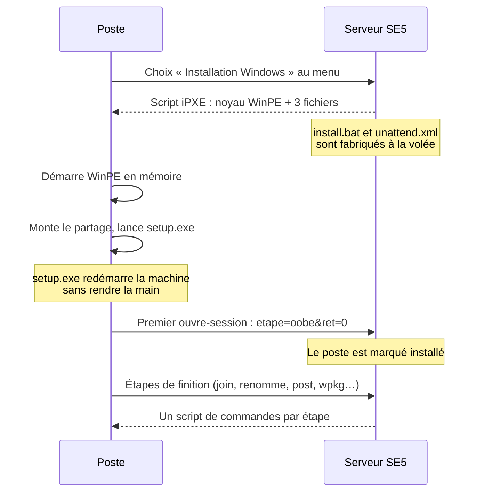

# Installation Windows

> **Ce que couvre cette fiche.** Le chemin complet d'une installation Windows :
> ce que le poste télécharge, les fichiers que le serveur fabrique pour lui, et
> les étapes de finition qui suivent le premier ouvre-session.
>
> Ce qu'elle ne couvre pas : d'où viennent les fichiers de l'image
> ([images Windows](images-windows.md)), et l'installation déclenchée depuis
> l'interface ([réinstallation pilotée](reinstallation-pilotee.md)).

---

## En une phrase

Le serveur ne pousse rien : il **répond**. Le poste démarre un environnement
WinPE en mémoire, monte un partage, lance l'installeur Microsoft avec un fichier
de réponses fabriqué pour lui, puis **rappelle le serveur à chaque étape** pour
savoir quoi faire ensuite.

## Le déroulé

### Ce que le poste télécharge

Le choix au menu chaîne vers `/ipxe/action/install_win11` (ou l'une des sept
variantes), qui rend un script réclamant six éléments :

| Élément | Origine | Nature |
| --- | --- | --- |
| `wimboot` | `/ipxe/os/winpe/wimboot` | Chargeur, commun à toutes les versions |
| `winpeshl.ini` | `/ipxe/os/winpe/winpeshl.ini` | Dit à WinPE de lancer `install.bat` |
| `install.bat` | `/ipxe/windows/install.bat` | **Fabriqué à la volée** |
| `unattend.xml` | `/ipxe/windows/unattend.xml` | **Fabriqué à la volée** |
| `BCD`, `boot.sdi`, `boot.wim` | `/ipxe/os/<version>/…` | Extraits de l'image Microsoft |

Les deux fichiers fabriqués sont **personnalisés pour ce poste** : nom, UUID,
adresse MAC, identifiants de service, unité d'organisation de destination.

Les sept variantes du menu se distinguent par trois attributs qui remontent
jusqu'au fichier de réponses : `debug` (met le script en pause à chaque étape),
`disk` (laisse choisir le partitionnement), `perso` (installation hors domaine).

### Le script d'amorçage

`WindowsInstallBatBuilder::build()` produit un script court : initialiser le
réseau, attendre qu'il réponde, monter `\\<serveur>\install`, lancer
`setup.exe /unattend:…`.

Deux contraintes non négociables :

- **fins de ligne CRLF strictes.** WinPE n'exécute pas un fichier `.bat` en LF
  seul, et il ne le signale pas : le script s'arrête sans message. Un test
  unitaire vérifie chaque ligne.
- **toute valeur interpolée est filtrée** avant d'entrer dans le script — les
  identifiants de service viennent de la configuration, mais un fichier
  d'environnement mal formé peut transporter un retour à la ligne.

> **`setup.exe` est la dernière commande utile.** Lancé depuis WinPE, il
> redémarre la machine lui-même et ne rend jamais la main — l'option `/noreboot`
> n'est honorée que depuis un système complet. Tout ce qui suivrait dans le
> script ne s'exécuterait pas. Le début d'installation est donc tracé
> **côté serveur, au moment de la génération** du script ; la fin est rapportée
> par le poste au premier ouvre-session.

### Le fichier de réponses

`WindowsUnattendBuilder::build()` part d'un gabarit versionné
(`resources/ipxe/windows/unattend.xml`) et le modifie par manipulation d'arbre
XML — pas par remplacement de texte. Ce qu'il injecte selon le contexte :

| Condition | Ce qui est injecté |
| --- | --- |
| Version Windows 11 | Le contournement des contrôles TPM, démarrage sécurisé, mémoire, processeur et stockage |
| Partitionnement automatique | Un schéma de disque UEFI ou hérité selon la plateforme annoncée |
| Installation dans le domaine | Le composant de jonction au domaine, avec ses identifiants et l'unité d'organisation cible |
| Installation hors domaine | Un compte local et une ouverture de session automatique, sans jonction |

Le nom du poste est écrit dans les trois passes où Windows le lit. Un compte
administrateur local est ajouté. Enfin, des marqueurs (`###_NAME_###`,
`###_UUID_###`, `###_MAC_###`, et le ticket d'enrôlement de l'agent) sont
interpolés dans les lignes de commande — c'est ce qui permet au poste, plus tard,
de se faire reconnaître par le serveur.

**Aucun secret n'est journalisé.** La trace de génération ne porte qu'une
empreinte du fichier produit.

## Les étapes de finition

Après le premier ouvre-session, le poste rappelle `/ipxe/windows/action` en
`multipart/form-data`, avec deux paramètres décisifs : `etape` et `ret`.

- **`etape`** dit où on en est. Huit valeurs seulement, portées par une
  énumération PHP ; tout le reste reçoit une réponse vide et une trace
  d'avertissement.
- **`ret`** dit **où en est cette étape**. C'est un compteur de tour : `-1` au
  premier appel, puis `0`, `1`, `2` à mesure que le script rappelle le serveur.

| Étape | Ce qu'elle fait |
| --- | --- |
| `winpe` | Signale le début de l'installation |
| `oobe` | Signale la fin : le poste est marqué installé sous Windows |
| `sysprep` | Prépare le poste au clonage, avec généralisation |
| `nosysprep` | Prépare au clonage rapide, sans généralisation |
| `join` | Joint le poste au domaine après clonage |
| `renomme` | Renomme le poste, y compris dans l'annuaire |
| `post` | Post-installation manuelle |
| `wpkg` | Lance le déploiement applicatif interactif |

### Pourquoi un compteur de tour

Une étape comme la jonction au domaine ne tient pas en un aller-retour : le poste
doit redémarrer, ouvrir une session avec un autre compte, agir, redémarrer
encore. À chaque reprise, il rappelle la même adresse avec la même `etape` et un
`ret` incrémenté ; **le serveur répond le script correspondant au tour en cours**.

C'est le serveur qui porte la progression, pas le poste. Conséquence pratique :
un poste qui redémarre au mauvais moment reprend là où le serveur l'attend, pas
là où il croyait en être.

> **Le poste ne renvoie pas tout à chaque tour.** Aux tours suivants, il ne
> repasse ni le nouveau nom ni l'unité d'organisation. Le serveur les a persistés
> au premier tour et les relit — sans quoi la jonction au domaine viserait le
> conteneur par défaut au lieu de l'unité choisie
> (`IpxeWindowsActionController::resolveJoinRoleOu()`).

### Les scripts de finition

Les six étapes autres que `winpe` et `oobe` renvoient un script de commandes,
produit par `WindowsActionCmdBuilder` depuis un gabarit
(`resources/views/ipxe/windows/cmd/`).

Ces scripts s'exécutent **en SYSTEM** sur le poste. Trois protections
s'appliquent, dans cet ordre :

1. la requête est validée (les valeurs de `ret` sont énumérées) ;
2. l'étape est résolue par une énumération PHP ;
3. **chaque valeur interpolée est filtrée** avant le rendu du gabarit. Une valeur
   portant un caractère d'injection lève une exception — le poste reçoit une
   réponse vide, et une trace d'avertissement est écrite.

L'unité d'organisation fait exception à la règle générale : elle a besoin de `,`
et `=` pour être un nom distingué valide. Son filtre est donc distinct, mais tout
aussi fermé (`WindowsActionCmdBuilder::sanitizeOu()`).

### Ce qui est écrit à chaque étape

`WindowsPostInstallTracker` écrit sous **transaction avec verrou sur la ligne du
poste** — deux appels simultanés sur la même machine ne peuvent pas se marcher
dessus.

Il n'écrit **jamais** `workstations.status`. Cette colonne a un domaine fermé
(`active`, `inactive`, `protected`) et 20 caractères ; y écrire une phrase
d'étape produisait une erreur SQL, donc une réponse 500, donc un poste bloqué.
L'avancement passe par `progress`, `programmed_action`, une ligne dans
`machine_boot_logs` et une trace sur le canal `ipxe`. Effet de bord bienvenu : un
poste marqué `protected` le reste pendant toute l'installation.

## Les interrupteurs

`config/ipxe.php`, section `windows.post_install` : un interrupteur global et un
par étape. Ils permettent de neutraliser une étape en cas de régression sans
livrer de code. `winpe` et `oobe` **ne sont pas neutralisables** — ce sont les
deux points qui bornent l'installation.

## Ce qui manque

- **Le modèle de préparation au clonage est un gabarit minimal.**
  `/ipxe/windows/sysprep.xml` répond une structure valide mais non personnalisée.
- **Pas de déduplication des traces.** Un poste qui reprend son installation
  écrit autant de lignes qu'il fait de tentatives.
- **La fin d'installation peut arriver sans début.** Rien n'impose qu'un
  `etape=oobe` soit précédé d'un `etape=winpe` ; un poste installé par un autre
  moyen puis démarré peut rapporter directement sa fin.

## Carte du code

| Rôle | Fichier |
| --- | --- |
| Menu d'installation | `app/Ipxe/Http/Controllers/IpxeInstallationWindowsController.php` |
| Script d'amorçage WinPE | `app/Ipxe/Services/WindowsInstallBatBuilder.php` |
| Fichier de réponses | `app/Ipxe/Services/WindowsUnattendBuilder.php` |
| Aiguillage des étapes | `app/Ipxe/Http/Controllers/IpxeWindowsActionController.php` |
| Scripts de finition | `app/Ipxe/Services/WindowsActionCmdBuilder.php` |
| Écriture de l'avancement | `app/Ipxe/Services/WindowsPostInstallTracker.php` |
| Liste blanche des étapes | `app/Ipxe/Enums/WindowsInstallStep.php` |
| Filtrage des valeurs interpolées | `app/Ipxe/Support/WindowsXmlPlaceholders.php` |
| Gabarits | `resources/ipxe/windows/unattend.xml`, `resources/views/ipxe/windows/cmd/` |

Tests : `tests/Feature/Ipxe/IpxeWindows*EndpointTest.php`,
`tests/Feature/Ipxe/IpxeWindowsActionEndpointPostOobeTest.php`.

## Aller plus loin

- D'où viennent `boot.wim` et les pilotes : [images Windows](images-windows.md)
- Comment l'installation peut être déclenchée à distance :
  [réinstallation pilotée](reinstallation-pilotee.md)
- L'équivalent Linux : [installation Linux](installation-linux.md)
