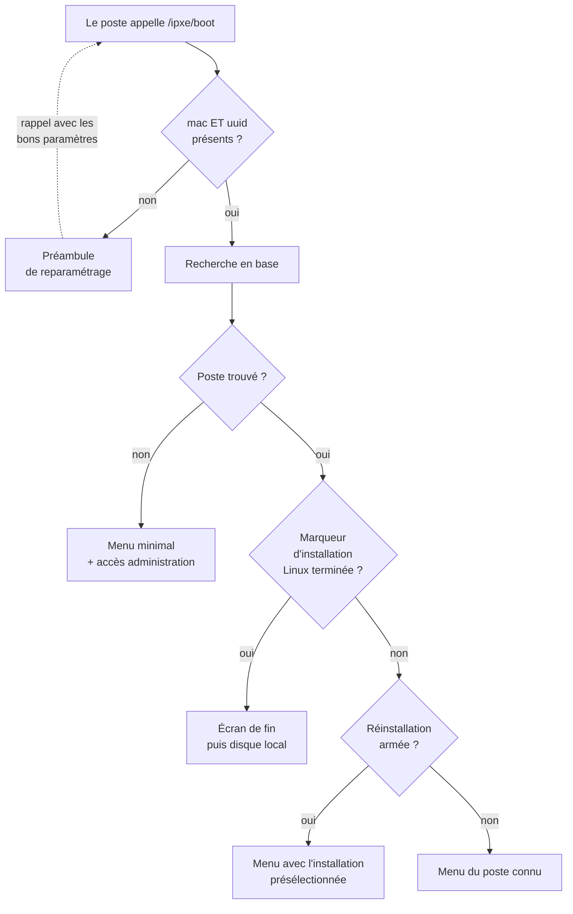

# Premier contact — du démarrage réseau au menu

> **Ce que couvre cette fiche.** Ce qu'un poste envoie en démarrant sur le
> réseau, comment le serveur le reconnaît, quel écran il reçoit, et comment
> l'accès aux menus qui installent ou effacent est gardé.
>
> Ce qu'elle ne couvre pas : donner un nom à un poste
> ([enrôlement](enrolement.md)), et le déroulé des installations
> ([Windows](installation-windows.md), [Linux](installation-linux.md)).

---

## Le protocole, vu du poste

Le firmware iPXE est chaîné par le serveur DHCP vers `/ipxe/boot`. Il envoie
quatre paramètres, tous lus depuis le firmware et le SMBIOS de la machine :

| Paramètre | Origine | Rôle |
| --- | --- | --- |
| `mac` | `${net0/mac}` | Adresse de la carte réseau |
| `uuid` | `${uuid}` | Identifiant matériel SMBIOS |
| `product` | `${product}` | Modèle de la machine |
| `platform` | `${platform}` | `efi` ou `pcbios` |

Le serveur répond du **texte brut** — un script iPXE que le firmware exécute
ligne par ligne. Pas de HTML, pas de JSON, pas de code d'erreur autre que 200 :
un firmware qui reçoit autre chose se fige, et le poste ne démarre plus.

> **Toujours les variables du firmware, jamais les valeurs rendues par le
> serveur.** Les gabarits de menu réinjectent `${uuid}` et `${net0/mac}` dans les
> chaînages suivants. Le firmware les fournit à chaque requête, même quand le
> poste n'est pas en base ; une valeur figée au rendu perdrait l'identification
> dès le second saut.

## La reconnaissance

### Pourquoi les deux identifiants sont exigés

`IpxeService::handleBoot()` bascule sur le préambule dès que **l'un** des deux
manque. Ce n'est pas une précaution rhétorique — c'est ce qui bloque trois
situations réelles :

- un firmware ancien qui ne pose pas `${uuid}` serait sinon reconnu sur sa seule
  MAC ;
- une MAC dupliquée en base (disque cloné, machine virtuelle recopiée) servirait
  le menu d'un autre poste ;
- une MAC usurpée suffirait à obtenir le menu d'un poste connu — avec l'UUID en
  plus, il faut connaître les deux.

### La recherche en base

`WorkstationLocator::locate()` cherche **par UUID d'abord**, puis retombe sur la
MAC. Deux détails comptent :

- **Quand `product` est vide**, l'UUID est recomposé selon la règle héritée de
  SE4 : les quatre premiers segments de l'UUID, plus un cinquième dérivé de la
  MAC. Des postes enregistrés du temps de SE4 portent en base cet UUID composite
  et ne se retrouveraient pas autrement.
- **Cette recomposition peut produire un UUID invalide** — la conversion
  hexadécimale perd les zéros de tête d'une MAC commençant par `00:`. La colonne
  `workstations.uuid` étant de type natif PostgreSQL, une valeur non canonique
  ferait échouer la requête, donc remonter une erreur serveur, donc rejeter le
  poste dans une boucle de redémarrage. Le format est vérifié avant la requête ;
  s'il ne tient pas, la recherche par UUID est simplement sautée
  (`WorkstationLocator.php:101`).

La recherche **ne crée rien et ne modifie rien**. Un poste inconnu reste inconnu ;
le nommer est un geste distinct, décrit dans [l'enrôlement](enrolement.md).

## Les écrans

| Écran | Quand | Ce qu'il propose |
| --- | --- | --- |
| Préambule | `mac` ou `uuid` manquant | Rappelle la même URL avec les paramètres du firmware |
| Menu inconnu | Poste absent de la base | Démarrage disque (par défaut) et accès à l'administration |
| Menu connu | Poste résolu | Administration, action programmée s'il y en a une, démarrage disque |
| Fin d'installation Linux | Marqueur posé en fin d'installation | Message et compte à rebours, puis disque local |
| Menu d'administration | Après authentification | Renommer, salle, parcs, installations, maintenance |
| Menu de maintenance | Après authentification | Image de secours, WinPE, remise en état, clonage, diagnostic |
| Échec d'authentification | Identifiants refusés | Message puis retour au menu de démarrage |

**Le menu d'administration est proposé même à un poste inconnu.** Sans cela, une
machine neuve ne pourrait jamais être enrôlée par le réseau : elle n'atteindrait
aucun écran permettant de la nommer. Le choix par défaut reste le démarrage
disque, pour qu'un poste non surveillé ne reste pas bloqué sur un menu.

**L'écran de fin d'installation Linux est à usage unique.** Le marqueur est
effacé au moment où l'écran est servi ; sans cela le poste le reverrait à chaque
démarrage réseau. L'effacement est au mieux : s'il échoue, l'écran réapparaît une
fois de plus, ce qui vaut mieux qu'un poste privé de menu.

## Le retour au disque local

Toutes les sorties de menu passent par le même fragment, produit par
`IpxeMenuRenderer::renderBootDiskFallback()` :

- en `${platform} efi`, la main est rendue au gestionnaire de démarrage UEFI, ce
  qui réinitialise la sortie graphique. Un démarrage direct du disque laisserait
  le tampon vidéo du menu iPXE en place et Windows démarrerait sur un écran
  corrompu ;
- sinon, le modèle de la machine est comparé à une **liste de modèles à forcer en
  UEFI** malgré la plateforme annoncée (`config/ipxe.php`, clé
  `boot_disk.force_uefi_products`). Cette liste est la seule valeur du fichier de
  configuration qui n'est **pas** surchargeable par variable d'environnement :
  pour ajouter un modèle, on édite le tableau.

## La garde d'accès

Un firmware iPXE n'a pas de session : il n'y a ni cookie, ni jeton porté. Chaque
appel à un point d'entrée sensible **re-poste l'identifiant et le mot de passe**,
saisis une fois par l'opérateur dans le menu (`login` iPXE) et propagés de
chaînage en chaînage.

`IpxeAuthService::authorize()` applique deux contrôles successifs :

1. **liaison sur l'annuaire** avec le couple reçu — le mot de passe arrive encodé
   en base64 par le firmware ;
2. **permission `computer.install`** sur le compte correspondant en base.

Un compte valide dans l'annuaire mais dépourvu de la permission est refusé, comme
un compte inexistant. Le refus rend l'écran d'échec puis renvoie au menu de
démarrage — jamais une page d'erreur.

Points d'entrée gardés : `/ipxe/admin`, `/ipxe/maintenance`, `/ipxe/action/*`,
`/ipxe/installation-linux`, `/ipxe/installation-windows`,
`/ipxe/clonezilla-menu`, et les cinq points d'entrée d'enrôlement.

> **La seule dérogation.** Une action `/ipxe/action/{action}` est servie **sans
> authentification** si — et seulement si — le poste porte une réinstallation
> armée dont la cible est exactement l'action demandée. L'armement s'est fait
> depuis l'interface, derrière la même permission : c'est lui qui porte
> l'autorisation. Sans cette dérogation, le chaînage automatique du menu, qui ne
> transporte aucun identifiant, tomberait systématiquement sur l'écran d'échec.
> Voir [réinstallation pilotée](reinstallation-pilotee.md).

### Ce que les journaux contiennent

Le canal `ipxe` (`config/logging.php`) reçoit un événement par étape, nommé
`ipxe.<domaine>.<fait>`. Les valeurs sensibles y sont **tronquées à un préfixe** :
trois caractères pour l'identifiant, six pour la MAC, huit pour l'UUID, six pour
le nom du poste. **Le mot de passe n'apparaît jamais**, sous aucune forme — ni en
clair, ni encodé, ni tronqué.

L'adresse IP, elle, est journalisée en clair : le réseau est celui de
l'établissement, et c'est la seule accroche exploitable quand un poste n'est pas
encore reconnu.

Deux événements méritent une alerte dédiée :

- `ipxe.action.factory_reset_dispatched` — remise en état d'usine, qui écrase la
  partition système sans confirmation côté firmware ;
- `ipxe.<contexte>.auth_failed` — utile pour repérer un balayage sur le réseau.

## Ce qui protège le domaine

| Protection | Où | Ce qu'elle empêche |
| --- | --- | --- |
| Filtre d'adresses privées | `auth.v1.lan-only` sur toutes les routes `/ipxe/*` | Un appel depuis l'extérieur |
| Limitation de débit (600/min/IP) | Déclaration des routes | Qu'un poste en boucle de redémarrage sature le serveur |
| Liste blanche d'actions | `IpxeAdminAction` | Qu'une valeur inventée atteigne un gabarit |
| Filtrage ASCII des valeurs rendues | `IpxeHostnameSanitizer::sanitizeForIpxeOutput()` | Qu'un retour à la ligne dans un nom injecte une commande de boot |
| Rattrapage de toute exception de rendu | `IpxeService::safeRender()` | Qu'une erreur de gabarit renvoie du HTML au firmware |
| Ordre de déclaration des routes | `tests/Architecture/IpxeNamespaceTest.php` | Qu'une route native passe derrière l'attrape-tout |

## Aller plus loin

- Nommer et rattacher un poste : [enrôlement](enrolement.md)
- Ce que le menu d'installation déclenche :
  [Windows](installation-windows.md) · [Linux](installation-linux.md)
- Pourquoi la reconnaissance est faite ainsi : [décisions](metier.md)
