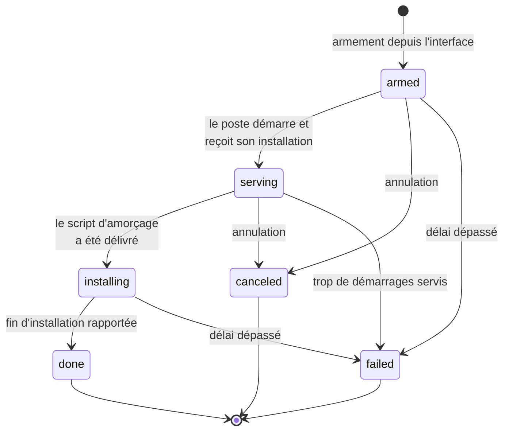
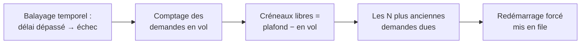

# Réinstallation pilotée depuis l'interface

> **Ce que couvre cette fiche.** Armer la réinstallation d'un poste ou d'une
> salle depuis l'interface web, la faire partir, et les garde-fous qui
> l'empêchent de tourner en boucle.
>
> Ce qu'elle ne couvre pas : le déroulé de l'installation elle-même
> ([Windows](installation-windows.md), [Linux](installation-linux.md)).

---

## En une phrase

Sur SE4, réinstaller un poste voulait dire s'y déplacer, le démarrer sur le
réseau et choisir dans le menu. SE5 permet de **l'armer depuis l'interface** :
au prochain démarrage réseau, le poste reçoit son installation
présélectionnée — sans opérateur devant l'écran.

## Le cycle

L'état vit dans `workstation_reinstall_requests`, une table dédiée —
**délibérément séparée** de `Workstation::programmed_action`, qui sert au
marqueur de fin d'installation. Confondre les deux ferait qu'un poste
fraîchement installé se réarmerait tout seul.

## Armer

L'armement accepte un poste, une salle, un groupe ou une sélection multiple. La
liste est **résolue au moment de l'armement** : un poste ajouté à la salle
ensuite n'est pas emporté.

Trois refus, dans cet ordre :

1. **l'action visée doit être une installation.** Le catalogue exposé est
   filtré sur les entrées `install_*` — remise en état d'usine, clonage,
   diagnostic et image de secours n'en font pas partie. Ce ne sont pas des
   réinstallations d'OS et elles n'ont rien à faire dans un déclenchement à
   distance ;
2. **un poste `protected` n'est jamais armé** ;
3. **un poste portant déjà une demande active** est sauté, pas dupliqué.

L'armement en masse compte séparément ce qui est armé, ce qui est sauté pour
doublon, et ce qui est sauté parce que protégé — l'opérateur voit ce qui n'est
pas parti.

L'écriture se fait par insertion en lots de 500 : armer une salle de 30 postes ne
doit pas produire 30 allers-retours Eloquent.

## Faire partir

Une demande armée ne redémarre rien toute seule. Une tâche planifiée,
`parc:reinstall-due`, s'en charge — **par vagues**.

Le plafond de concurrence (40 par défaut) borne deux choses à la fois : le
nombre de redémarrages simultanés, et le nombre de machines qui téléchargent une
image en même temps. C'est un réglage de capacité réseau, à ajuster par
établissement.

> **Le balayage temporel n'est pas cosmétique.** Une machine réellement morte,
> qui ne redémarre jamais après l'ordre, resterait indéfiniment « en vol » et
> occuperait son créneau pour toujours. Le dépassement du délai la fait basculer
> en échec **avant** le calcul des créneaux libres.

Le déclenchement passe par la file de tâches d'alimentation
(`MachinePowerActionTask`), pas par un appel réseau direct.

## Servir

Au démarrage réseau, `IpxeService::resolveProgrammedAction()` lit la demande
active. Il ne la sert pas systématiquement :

| Situation | Ce qui se passe |
| --- | --- |
| Poste devenu `protected` | La demande est annulée, rien n'est servi |
| Programmation dans le futur | Rien n'est servi, rien n'est marqué, le poste démarre sur son disque |
| Délai dépassé ou plafond de démarrages atteint | Demande en échec, retour au disque |
| Demande déjà en `installing` | **Rien n'est servi** |
| Sinon | Compteur incrémenté, demande en `serving`, installation présélectionnée au menu |

Le cas `installing` mérite une explication. `setup.exe`, lancé depuis WinPE,
redémarre la machine lui-même en fin de phase. Avec le démarrage réseau en tête
de l'ordre de démarrage, ce redémarrage retombe sur le serveur. Re-servir
l'installation relancerait WinPE depuis zéro et **l'installation n'atteindrait
jamais le premier ouvre-session** — une boucle parfaite. On laisse donc le poste
tomber sur son disque local pour qu'elle se poursuive.

### Pourquoi c'est servi sans authentification

Le chaînage automatique du menu ne transporte aucun identifiant : il n'y a
personne devant l'écran pour en saisir. Sans dérogation, la garde d'accès
renverrait l'écran d'échec et la fonction ne partirait jamais.

La dérogation est étroite. `IpxeService::isReinstallPreAuthorized()` n'autorise
l'appel que si **toutes** les conditions tiennent :

- le poste est résolu ;
- il n'est pas `protected` ;
- l'action demandée est une installation ;
- il porte une demande active **dont la cible est exactement cette action**.

Toute exception de base de données retombe sur la garde normale — fermé par
défaut. L'autorisation, elle, a été donnée au moment de l'armement, derrière la
même permission `computer.install`.

## Les trois garde-fous anti-boucle

| Garde-fou | Réglage | Ce qu'il empêche |
| --- | --- | --- |
| Durée de vie de la demande | 6 h | Une demande oubliée qui repart des semaines plus tard |
| Plafond de démarrages servis | 8 | Un poste qui échoue en boucle au chargement du noyau |
| Plafond de concurrence | 40 | Que tout le parc télécharge son image en même temps |

## La protection d'un poste, à trois niveaux

Un poste `protected` est refusé **trois fois** :

1. à l'armement — l'exception remonte à l'interface ;
2. au démarrage — toute demande active est annulée ;
3. à la pré-autorisation de l'action — jamais de dérogation.

Les trois sont redondants, et c'est voulu : le poste peut devenir protégé après
l'armement, et aucun des trois seul ne couvre cette fenêtre.

## Reprendre une installation qui n'aboutit pas

Une fois en `installing`, une demande n'est plus annulable — annuler
n'arrêterait pas la machine. Sans issue, le poste resterait bloqué jusqu'à
l'expiration du délai. `relaunchForWorkstation()` abandonne la tentative en cours
et en réarme une neuve sur le même OS.

La tentative abandonnée est marquée **`failed`, pas `canceled`** : l'historique
doit distinguer « l'administrateur a renoncé avant le départ » de « la tentative
a échoué, on rejoue ».

## Nettoyage

Les demandes terminales sont purgées au-delà de 30 jours
(`parc:prune-reinstall-requests`, planifiée).

## Carte du code

| Rôle | Fichier |
| --- | --- |
| Armement, transitions, déclenchement | `app/Services/Parc/WorkstationReinstallService.php` |
| Modèle et statuts | `app/Models/WorkstationReinstallRequest.php` |
| Résolution au démarrage | `app/Ipxe/Services/IpxeService.php` (`resolveProgrammedAction`, `isReinstallPreAuthorized`) |
| Consommation en fin d'installation | `app/Ipxe/Services/WindowsPostInstallTracker.php`, `LinuxPostInstallTracker.php` |
| Réglages | `config/ipxe.php`, section `reinstall` |
| Tâches planifiées | `parc:reinstall-due`, `parc:prune-reinstall-requests` |

Tests : `tests/Feature/Ipxe/IpxeReinstallActionAuthTest.php`.

## Aller plus loin

- Ce que le poste fait ensuite : [Windows](installation-windows.md) ·
  [Linux](installation-linux.md)
- Comment l'action est servie au menu : [premier contact](premier-contact.md)
