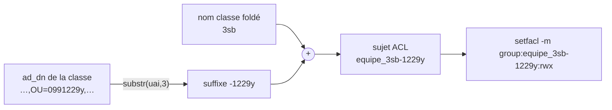

# Runbook — Nommage des groupes POSIX pour les ACL de partage (vérif. avant prod)

> **Procédure de vérification.** Le `ShareService` pose les ACL des dossiers de
> classe en ciblant des **groupes Unix/AD** (`equipe_<classe>`, `classe_<classe>`).
> Le nom de ces groupes dépend d'un **suffixe d'établissement** propre à l'AD
> fédéré. Ce document résume le problème rencontré en environnement de test et
> donne la **checklist à dérouler sur un serveur réel** avant de considérer le
> comportement comme acquis.
>
> À exécuter **sur le serveur cible** (accès SSH root). Lecture seule, aucune
> mutation ; les commandes ci-dessous ne modifient rien.

---

## 1. Le problème (constaté en test)

Lors de l'import `admin/sync-from-ad`, le sync pose les ACL profs sur chaque
dossier élève via :

```
sudo setfacl -R -P -m 'default:group:equipe_3sb:rwx' '/var/sambaedu/Classes/Classe_3SB/<eleve>'
```

Sur un établissement **fédéré**, cela échoue :

```
setfacl: Option -m: Invalid argument near character 15
```

…répété par dossier élève, jusqu'au **504 Gateway Time-out** du sync.

### Cause racine

Le **vrai** groupe Unix de l'équipe pédagogique n'est pas `equipe_3sb` mais
`equipe_3sb-1229y` : il porte un **suffixe d'établissement** (`-1229y`).
`setfacl` ne résout pas `equipe_3sb` (groupe inexistant) → erreur, le caractère
15 étant le début du nom de groupe.



### Pourquoi ce suffixe existe

Sur un **AD central** mutualisant N établissements, l'espace de noms des groupes
Unix est plat : deux classes `3sb` dans deux collèges différents entreraient en
collision. Le suffixe `-<rne>` (dérivé du code UAI de l'établissement) sépare les
groupes par établissement. En **standalone** (un seul établissement, DN sans OU
au format UAI), il n'y a pas de suffixe — et pas de collision possible.

C'est exactement la règle du legacy `etab_suffix()`
(`sambaedu/includes/config.inc.php`) : `"-" . substr($uai, 3)` en minuscules,
**uniquement** si le code matche le format UAI `[0-9]{7}[a-z]`.

### Le correctif

`ShareService` dérive désormais le suffixe depuis l'`ad_dn` de la classe
(`establishmentSuffix()` + `aclGroupLocalPart()`), au lieu de produire un nom nu.
On **ne se fie pas** à `config('suffix')` (non peuplé sur les établissements
migrés observés). Le **dossier** reste sans suffixe (`Classe_3SB`) ; seul le
**sujet d'ACL** est suffixé.

| Élément | Forme |
|---|---|
| Dossier classe (FS) | `Classe_3SB` (pas de suffixe) |
| Groupe élèves (Unix/AD) | `classe_3sb-1229y` |
| Groupe profs (Unix/AD) | `equipe_3sb-1229y` |
| OU établissement (DN) | `OU=0991229y` → suffixe `-1229y` |

---

## 2. Checklist de vérification sur un serveur réel

> Objectif : confirmer que les hypothèses validées en test sont **identiques** sur
> l'environnement cible. Toute divergence ci-dessous est bloquante pour le sync.

### V1 — Format réel des noms de groupes POSIX

```bash
getent group | grep -iE 'equipe_|classe_' | head -20
```

**Attendu (fédéré)** : noms suffixés, ex. `equipe_3sb-1229y`, `classe_3sb-1229y`.
**Attendu (standalone)** : noms nus, ex. `equipe_3sb`, `classe_3sb`.
**Divergence** : un autre schéma de suffixe (séparateur, casse, position) → le
correctif ne le reconstruira pas. STOP, ré-analyser.

### V2 — Le suffixe dérivé correspond-il au vrai groupe ?

Pour une classe donnée, récupérer son `ad_dn` puis vérifier le groupe :

```bash
cd /var/www/sambaedu-reload   # ou /var/sambaedu-reload selon l'install
php artisan tinker --execute='
$g = App\Models\UserGroup::where("type","classe")->whereNotNull("ad_dn")->first();
echo "name=".$g->name." | ad_dn=".$g->ad_dn.PHP_EOL;
echo "local_part=".app(App\Services\Filesystem\ShareService::class)->aclGroupLocalPart($g).PHP_EOL;
'
# Puis, avec le local_part affiché (ex. 3sb-1229y) :
getent group equipe_<local_part>   # doit exister
getent group classe_<local_part>   # doit exister
```

**Attendu** : les deux `getent` renvoient une ligne (gid résolu).
**Divergence** : `getent` vide → le nom dérivé ne matche pas le groupe réel.
STOP.

### V3 — Format de l'OU établissement dans le DN

```bash
php artisan tinker --execute='
foreach (App\Models\UserGroup::where("type","classe")->whereNotNull("ad_dn")->limit(10)->get() as $g) {
  preg_match_all("/OU=([^,]+)/i", $g->ad_dn, $m);
  echo $g->name." => OU=[".implode(",",$m[1])."]".PHP_EOL;
}
'
```

**Attendu** : une composante OU au format UAI `[0-9]{7}[a-z]` (ex. `0991229y`).
**Divergence** : l'OU établissement a un autre format (numérique seul, autre
casse, pas d'OU UAI alors que les groupes SONT suffixés) → `establishmentSuffix()`
renverra `''` à tort → régression. STOP, adapter la dérivation.

### V4 — Cohérence classe ↔ équipe (même suffixe)

```bash
getent group | grep -iE '^(equipe|classe)_3sb' # adapter la classe
```

**Attendu** : `classe_3sb-1229y` ET `equipe_3sb-1229y` portent le **même**
suffixe.
**Divergence** : suffixes différents entre les deux → l'hypothèse « un suffixe par
établissement » ne tient pas. STOP.

### V5 — `ad_dn` réellement peuplé

Le correctif lit `user_groups.ad_dn`. S'il est vide, le suffixe sera `''`.

```bash
php artisan tinker --execute='
echo "classes total=".App\Models\UserGroup::where("type","classe")->count().PHP_EOL;
echo "sans ad_dn  =".App\Models\UserGroup::where("type","classe")->whereNull("ad_dn")->count().PHP_EOL;
'
```

**Attendu (fédéré)** : `sans ad_dn = 0` (le sync AD remplit `ad_dn`).
**Divergence** : des classes sans `ad_dn` sur un AD suffixé → leurs ACL seront
mal nommées. Vérifier que `sync-from-ad` a bien tourné et peuplé `ad_dn` AVANT le
partage.

### V6 — Les groupes `equipe_*` sont-ils peuplés ?

Une ACL bien nommée reste inopérante si le groupe profs est vide (cf. note
`Equipe_<classe> jamais peuplé`). Vérifier qu'au moins un prof y est :

```bash
getent group equipe_3sb-1229y   # le champ après le dernier ':' liste les membres
# ou, via un prof connu :
id <login_prof> | tr ',' '\n' | grep -i equipe
```

**Attendu** : le groupe contient les profs de la classe.
**Divergence** : groupe vide → droits profs inopérants (problème distinct du
nommage, à traiter à part).

### V7 — Edge cases de noms de classe

`bareClassName()` **rejette** les espaces et caractères non `[A-Za-z0-9._-]`.
Or certains noms legacy contiennent des espaces (`equipe_5 c`, `equipe_paulo a
fortezap1-…`).

```bash
getent group | grep -iE 'equipe_.* ' | head   # groupes equipe_ AVEC espace
```

**Attendu** : aucune classe gérée par le partage n'a d'espace dans son nom.
**Divergence** : des classes à espace existent → `ShareService` les refuse
silencieusement (pas d'ACL posée). Décider du traitement (renommage,
normalisation, ou exclusion documentée).

### V8 — Reproduire l'erreur sur un nom nu (sanity)

```bash
setfacl -P -m 'default:group:equipe_3sb:rwx' /tmp 2>&1   # nom NU, sans suffixe
```

**Attendu** : `Invalid argument near character 15` (confirme que le nom nu est
bien non résolvable, donc que le suffixe est nécessaire sur cet AD).
**Divergence** : la commande passe → le nom nu existe aussi → cet AD n'est pas
suffixé comme en test ; revoir V1.

---

## 3. Critère de passage

Le comportement est **identique aux environnements de test** si :

- V1 = noms suffixés `-<rne>` (ou tous nus en standalone, cohérent V8) ;
- V2 = le `local_part` dérivé matche `getent` pour `equipe_` **et** `classe_` ;
- V3 = OU établissement au format UAI `[0-9]{7}[a-z]` ;
- V4 = même suffixe classe/équipe ;
- V5 = `ad_dn` peuplé sur toutes les classes gérées ;
- V7 = pas de classe à espace dans le périmètre (ou cas documenté).

Sinon : **ne pas déployer le partage en l'état**, remonter la divergence.

---

## Références

- Correctif : `app/Services/Filesystem/ShareService.php`
  (`establishmentSuffix()`, `aclGroupLocalPart()`).
- Pose des ACL : `app/Services/Filesystem/AclService.php` (`setAcls()`).
- Règle legacy : `sambaedu/includes/config.inc.php::etab_suffix()`,
  `sambaedu/includes/samba-tool.inc.php::groupadd()`.
- Tests : `tests/Unit/Services/Filesystem/ShareServiceTest.php`
  (section « Suffixe établissement (AD fédéré) »).
