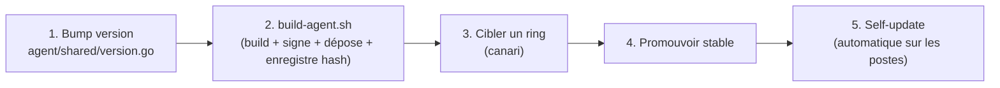

# Runbook — Publier une version de l'agent (build → publish → self-update)

> **Procédure d'exploitation.** Comment construire, signer, publier une version
> de l'agent et la faire monter sur le parc. La *référence* (tables, endpoints,
> règles de résolution) est `../agent/release-distribution.md` ; le *pourquoi*
> est `../agent/metier.md`. Ici : les gestes, dans l'ordre.
>
> À exécuter **sur le serveur** (cible `/vm` par défaut). Le PFX code-signing ne
> quitte jamais le serveur.

---

## Vue d'ensemble



Une version est un couple **(version, hash) immuable** : la signature
Authenticode n'étant pas déterministe, on ne republie **jamais** la même version
avec un binaire re-signé. Pour rediffuser, on **bumpe la version**.

## Prérequis (une fois)

- PFX code-signing présent : `storage/keys/pki/sambaedu-codesign.pfx`
  (émis par `scripts/emit-codesign-pfx.sh`, géré automatiquement par
  `scripts/update.sh`).
- Toolchain Go + `osslsigncode` : amorcés automatiquement par `build-agent.sh`
  au premier passage.

## Procédure

### 1. Bumper la version

Éditer la source unique de version : `agent/shared/version.go`
(`var Version = "X.Y.Z"`). C'est elle qui nomme le binaire
(`sambaedu-agent-X.Y.Z.exe`) et la release.

### 2. Build + publication

```bash
# Build, signe, dépose dans storage/agent/releases/ et enregistre le hash
# (un seul geste — le binaire déposé et le hash enregistré sont le même fichier).

# a) Publier SANS promouvoir stable (diffusion canari d'abord) :
sudo scripts/build-agent.sh --publish

# b) OU publier ET promouvoir stable directement :
sudo scripts/build-agent.sh --stable      # --stable implique --publish
```

`build-agent.sh` est **idempotent** : re-lancé sur un binaire à jour, il ne
rebuild pas mais atteint quand même la publication. Toute incohérence (PFX
absent, version déjà publiée avec un hash différent) = **refus, exit ≠ 0**.

### 3. Cibler un ring (canari)

Un *ring* = un `WorkstationGroup` existant (salle ou parc), désigné par son nom.
Les postes du ring reçoivent cette version ; les autres restent sur la stable.

```bash
php artisan agent:release:target X.Y.Z <nom-du-workstation-group>
```

### 4. Promouvoir stable

Une fois le canari validé, la version devient le défaut de tous les postes sans
ring. (C'est aussi le point de rollback : promouvoir une version antérieure.)

```bash
php artisan agent:release:promote X.Y.Z
```

### 5. Self-update côté poste (automatique)

Rien à faire manuellement. À chaque cycle, l'agent résout son manifest
(`GET /api/v1/agent/release` : ring → stable), et si la version cible diffère de
la sienne, il télécharge le binaire, **vérifie hash + signature Authenticode**,
fait un **swap atomique** puis se relance. Un poste neuf (sans token) s'amorce
sur la stable via `GET /api/v1/agent/stable`. Détail : `../agent/release-distribution.md`.

## Vérifier

```bash
# Releases enregistrées + laquelle est stable :
php artisan tinker --execute "App\Models\AgentRelease::get(['version','hash','is_stable'])->each(fn(\$r)=>print_r(\$r->toArray()));"

# Binaire déposé :
ls -l storage/agent/releases/

# Manifest d'amorce (doit renvoyer la stable, pas no_release) — depuis le LAN :
curl -sS https://se4fs/api/v1/agent/stable | jq .
```

La **preuve** qu'un poste a bien migré est la **version qu'il rapporte** au
check-in suivant (`agent_reported_version`), pas le fait qu'on lui ait servi le
binaire.

## Pièges

| Symptôme | Cause | Remède |
|---|---|---|
| `agent_releases` vide après une réinstall serveur ; `/api/v1/agent/stable` → `no_release` | `scripts/update.sh` **ne publie jamais** (un update serveur ne pousse pas de release au parc) | Relancer explicitement `sudo scripts/build-agent.sh --stable` |
| `ERREUR : version déjà publiée avec un hash différent` | Tentative de republier la même version avec un binaire re-signé (hash non déterministe) | **Bumper** `version.go` puis republier — jamais réutiliser un numéro |
| Le poste ne migre pas | Il n'est dans aucun ring et la version visée n'est pas stable | Cibler son ring (étape 3) ou promouvoir stable (étape 4) |
| Build refusé : PFX absent | Code-signing non initialisé | `scripts/emit-codesign-pfx.sh` (ou `scripts/update.sh`) |
