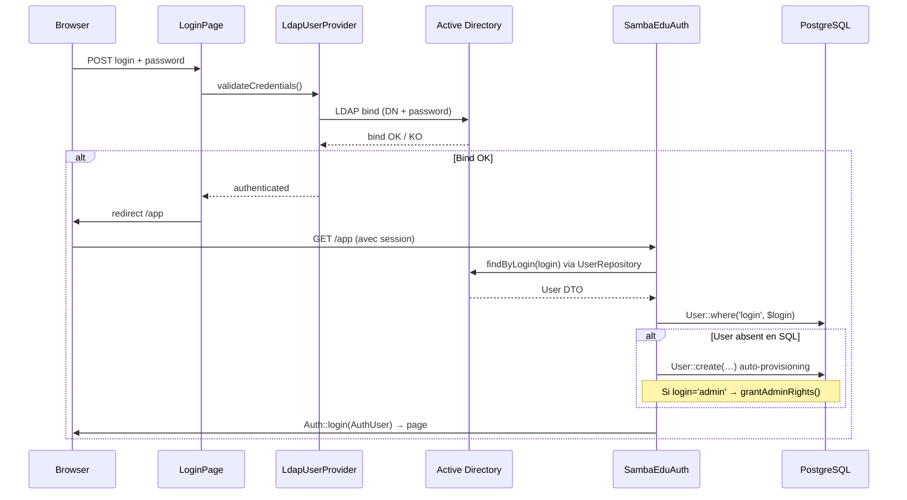
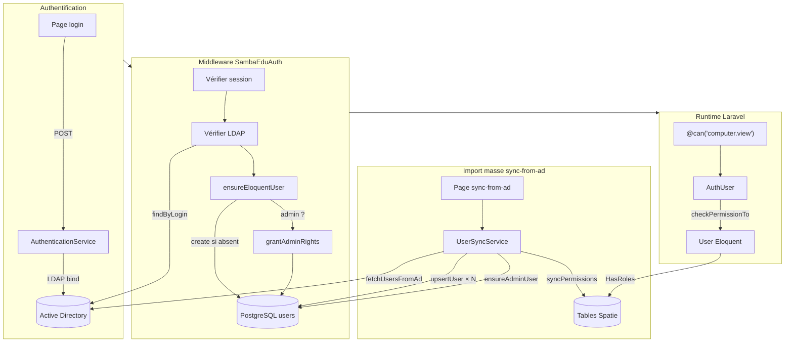

# Gestion des utilisateurs — Architecture et migration

## Périmètre

Ce document décrit l'architecture actuelle de la gestion des utilisateurs dans la partie Laravel de SE4FS, les interactions entre LDAP/AD et SQL, et la stratégie de migration progressive vers **SQL comme source de vérité**.

---

## Vision : migration progressive AD → SQL

### Constat

Historiquement, l'Active Directory est la **seule source de vérité** pour les utilisateurs SambaEdu. La base SQL n'intervient que pour des caches ou des métadonnées (WPKG, logs, etc.). Cette approche pose plusieurs problèmes :

- **Couplage fort à l'AD** : chaque lecture utilisateur nécessite une requête LDAP (lente, non-indexable côté applicatif).
- **Pas de gestion fine des permissions côté applicatif** : les droits legacy sont un bitmask stocké dans des groupes AD, difficile à étendre.
- **Problème œuf/poule** : impossible de se connecter à l'interface web sans que l'utilisateur existe en SQL, mais l'import SQL nécessite l'interface web.
- **Pas de requêtes complexes** : impossible de faire des recherches croisées, des paginations performantes, ou des jointures avec d'autres entités Laravel.

### Plan de migration en 3 phases

```
Phase A (actuelle) : AD = source de vérité, SQL = cache
  └─ Les utilisateurs sont importés depuis l'AD vers la table `users`
  └─ L'authentification passe toujours par LDAP bind
  └─ Les permissions Spatie sont synchronisées depuis les groupes AD

Phase B (future) : Double-écriture
  └─ Les modifications utilisateur sont écrites en SQL ET en AD
  └─ SQL commence à faire autorité pour les permissions et métadonnées
  └─ L'AD reste nécessaire pour l'authentification Windows (Kerberos)

Phase C (cible) : SQL = source de vérité, AD = proxy Windows
  └─ SQL est la référence pour toutes les données utilisateur
  └─ L'AD est alimenté depuis SQL (write-back) uniquement pour :
     - Authentification Kerberos des postes Windows
     - GPO et politiques de groupe
  └─ Les permissions sont gérées exclusivement via Spatie
```

> **L'objectif final** : pouvoir gérer les utilisateurs, leurs droits et leurs groupes entièrement depuis l'interface Laravel, sans dépendre de l'AD pour la logique métier applicative.

---

## Architecture actuelle (Phase A)

### Modèles

#### `AuthUser` — Wrapper LDAP pour l'authentification Laravel

- **Fichier** : `app/Models/AuthUser.php`
- **Rôle** : Implémente `Authenticatable` + `Authorizable` pour être compatible avec `Auth::user()`, `@can()`, `Gate`, etc.
- **Source de données** : LDAP (via `LdapUser`)
- **Ne persiste rien en SQL** — c'est un objet en mémoire construit à chaque requête

```
AuthUser
├── implements Authenticatable    → Auth::user(), session
├── implements Authorizable       → @can(), Gate::allows()
├── wraps LdapUser               → données LDAP (login, fullname, groups, dn…)
├── checkPermissionTo()           → pont vers User Eloquent pour Spatie
└── getRightsMask()               → bitmask legacy via RightsService
```

Le pont Spatie fonctionne ainsi :
1. Spatie enregistre un `Gate::before()` qui appelle `$user->checkPermissionTo()`
2. `AuthUser::checkPermissionTo()` résout le `User` Eloquent correspondant via `User::where('login', $this->login)`
3. Le `User` Eloquent porte le trait `HasRoles` et effectue la vérification Spatie réelle

#### `User` — Modèle Eloquent (cache SQL)

- **Fichier** : `app/Models/User.php`
- **Table** : `users` (PostgreSQL)
- **Rôle** : Cache SQL des utilisateurs AD + support Spatie Permission
- **Trait** : `HasRoles` (Spatie) pour les permissions et rôles

Colonnes principales :

| Colonne | Type | Description |
|---------|------|-------------|
| `login` | string, unique | Identifiant (= CN dans l'AD) |
| `fullname` | string | Nom complet (displayName AD) |
| `firstname` | string | Prénom (givenName AD) |
| `lastname` | string | Nom (sn AD) |
| `email` | string | Mail |
| `dn` | string | Distinguished Name AD |
| `role` | string | `eleve`, `prof`, `administratif`, `admin`, `autre` |
| `is_active` | bool | Compte actif |
| `ad_groups` | json | Noms des groupes AD (memberOf) |
| `ad_right_profiles` | json | Groupes de droits (OU=Rights) |
| `ad_rights_bitmask` | int | Bitmask legacy calculé |
| `ad_synced_at` | datetime | Dernière synchronisation AD |

#### `LdapUser` — Modèle LdapRecord

- **Fichier** : `app/LdapModels/LdapUser.php`
- **Rôle** : Accès direct aux objets utilisateur dans l'AD via LdapRecord
- **Base DN** : `OU=People,…` (via `LdapDnHelper::peopleDn()`)

---

### Flux d'authentification



### Composants clés du flux

1. **`LdapUserProvider`** (`app/Providers/LdapUserProvider.php`)
   - Implémente `UserProvider` de Laravel
   - `validateCredentials()` → LDAP bind via `AuthenticationService`
   - `retrieveById()` → `AuthUser::findByLogin()`

2. **`SambaEduAuth` middleware** (`app/Http/Middleware/SambaEduAuth.php`)
   - Vérifie la session existante
   - Vérifie que l'utilisateur existe toujours dans l'AD
   - **Auto-provisionne** le `User` Eloquent si absent en SQL
   - Si `login === 'admin'` → accorde automatiquement tous les droits super-admin
   - Connecte l'`AuthUser` à Laravel via `Auth::login()`

3. **`AuthenticationService`** (`app/Services/AuthenticationService.php`)
   - Gère le LDAP bind (authentification par mot de passe)
   - Gère les cas spéciaux : `pwdlastset == 0` (changement obligatoire)
   - Gère la session partagée avec le legacy

---

### Import en masse depuis l'AD

#### `UserSyncService`

- **Fichier** : `app/Services/UserSyncService.php`
- **Déclencheur** : Page web `sync-from-ad` (étape 1) ou futur Artisan command
- **Rôle** : Import complet de tous les utilisateurs AD vers SQL

Flux de `importFromAd()` :

```
1. ensurePermissionsExist()
   └─ Crée les 16 permissions Spatie (SambaPermission) si absentes
   └─ Crée les 9 rôles Spatie (SambaRole) avec leurs permissions

2. fetchUsersFromAd()
   └─ Parcourt les 3 groupes principaux AD :
      - Eleves → rôle 'eleve'
      - Profs → rôle 'prof'
      - Administratifs → rôle 'administratif'
   └─ Exclut les comptes système (MainGroups::isSystemAccount)
   └─ Extrait : login, fullname, email, dn, groupes, profils de droits

3. upsertUser() pour chaque utilisateur
   └─ User::create() ou User::update() (upsert sur login)
   └─ Calcule le bitmask legacy via RightsService
   └─ Convertit en permissions Spatie via SambaPermission::fromBitmask()
   └─ Assigne le rôle Spatie via SambaRole::fromBitmask()

4. ensureAdminUser()
   └─ Crée le User 'admin' si absent (même s'il n'est pas dans l'AD)
   └─ grantAdminRights() : bitmask 0xFFFF + toutes permissions + rôle super-admin
```

---

### Auto-provisioning (résolution du problème œuf/poule)

Le middleware `SambaEduAuth::ensureEloquentUser()` résout le problème suivant :

> L'admin doit se connecter à l'interface web pour lancer le sync AD → SQL.
> Mais sans sync, l'admin n'a pas de `User` Eloquent en SQL.
> Donc `@can()` échoue et l'interface est inutilisable.

**Solution** : à chaque connexion LDAP réussie, si le `User` Eloquent n'existe pas encore en SQL, le middleware le crée à la volée avec les données LDAP. Si c'est le compte `admin`, il reçoit en plus tous les droits super-admin.

Cela signifie :
- **Avant le premier sync** : seuls les utilisateurs qui se connectent sont créés en SQL (provisioning à la demande)
- **Après le sync** : tous les utilisateurs AD sont en SQL avec leurs permissions synchronisées

---

### Système de permissions

#### Double système (transition)

Le système de droits fonctionne actuellement en **double** :

| Système | Source | Stockage | Utilisé par |
|---------|--------|----------|-------------|
| **Legacy bitmask** | Groupes AD (OU=Rights) | `ad_rights_bitmask` (int) | Code legacy, `AuthUser::hasRight()` |
| **Spatie Permission** | Calculé depuis le bitmask | Tables Spatie (`permissions`, `roles`, `model_has_permissions`) | `@can()`, `Gate`, policies Laravel |

Les deux sont synchronisés : le bitmask legacy est calculé depuis les groupes AD, puis converti en permissions Spatie via `SambaPermission::fromBitmask()`.

#### Permissions Spatie (16 permissions)

Définies dans `app/Enums/SambaPermission.php` :

| Catégorie | Permissions |
|-----------|-------------|
| **Utilisateurs** | `user.password.init`, `user.read`, `user.modify`, `user.create.temp`, `user.assign.right`, `user.delegate` |
| **Partages** | `share.view`, `share.refresh` |
| **Machines** | `computer.view`, `computer.control`, `computer.elevate`, `computer.install` |
| **WPKG** | `wpkg.assign`, `wpkg.add`, `wpkg.create` |
| **Serveur** | `server.admin` |

#### Rôles Spatie (9 rôles)

Définis dans `app/Enums/SambaRole.php` :

| Rôle | Permissions incluses |
|------|---------------------|
| `eleve` | aucune |
| `prof` | `user.read` |
| `eleve-admin` | `user.password.init`, `user.read`, `user.modify` |
| `share-admin` | `share.view`, `share.refresh` |
| `user-admin` | 8 permissions utilisateurs + partages |
| `technicien` | `computer.view`, `computer.control`, `wpkg.assign` |
| `referent-numerique` | `computer.view`, `wpkg.assign`, `wpkg.add` |
| `computer-admin` | 7 permissions machines + wpkg |
| `super-admin` | toutes les 16 permissions |

---

### Fichiers impliqués

```
app/
├── Models/
│   ├── AuthUser.php              # Wrapper LDAP → Authenticatable + Authorizable
│   └── User.php                  # Eloquent (table users) + HasRoles Spatie
├── LdapModels/
│   └── LdapUser.php              # Modèle LdapRecord (accès AD direct)
├── Services/
│   ├── AuthenticationService.php # LDAP bind, session, validation mot de passe
│   ├── UserSyncService.php       # Import masse AD → SQL + admin bootstrap
│   ├── PermissionService.php     # Sync permissions d'un utilisateur individuel
│   └── RightsService.php         # Calcul bitmask legacy depuis groupes AD
├── Enums/
│   ├── SambaPermission.php       # 16 permissions Spatie (mapping ↔ bitmask)
│   ├── SambaRole.php             # 9 rôles Spatie (mapping ↔ bitmask)
│   └── LegacyRight.php           # Bitmask legacy (constantes)
├── Providers/
│   ├── LdapUserProvider.php      # UserProvider Laravel pour auth LDAP
│   └── AuthServiceProvider.php   # Enregistre le provider + gates
├── Repositories/
│   └── UserRepository.php        # Accès LDAP avec cache (findByLogin, search)
├── Http/Middleware/
│   └── SambaEduAuth.php          # Auth middleware + auto-provisioning SQL
├── Constants/Ldap/
│   └── MainGroups.php            # Groupes AD principaux (Eleves, Profs, Administratifs)
└── Config/
    └── LdapDnHelper.php          # Construction des DN LDAP
```

---

## Diagramme de synthèse



---

## Prochaines étapes (Phase B)

Pour avancer vers SQL comme source de vérité :

1. **CRUD utilisateurs en SQL** : créer des endpoints/pages pour modifier les utilisateurs directement en SQL (sans passer par l'AD)
2. **Write-back AD** : quand un utilisateur est modifié en SQL, propager les changements vers l'AD (pour Kerberos/GPO)
3. **Authentification hybride** : permettre l'authentification depuis SQL (hash bcrypt) en fallback si l'AD est indisponible
4. **Suppression progressive de `AuthUser`** : remplacer par le `User` Eloquent comme `Authenticatable` principal
5. **Suppression du bitmask legacy** : utiliser exclusivement Spatie Permission pour les droits
